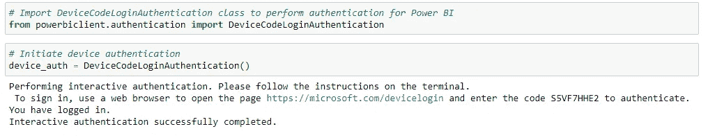
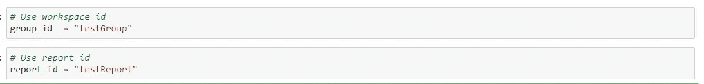

# Jupyter 笔记本电脑中的 Power BI

> 原文：<https://medium.com/nerd-for-tech/power-bi-in-jupyter-notebook-f5d1b1b3fb45?source=collection_archive---------22----------------------->

最近，微软宣布了与 Jupyter 的 Power BI 集成，现在我们可以使用 Jupyter 笔记本电脑讲述数据故事。

随着微软推出新的 powerbiclient 软件包，我们可以轻松地在 Jupyter 笔记本电脑中导出和嵌入 Power BI 报告、仪表板、仪表板磁贴、报告视觉效果或问答。

Power BI 是一组软件服务、应用程序和连接器，它们协同工作，将来自不同数据源的数据转换为逻辑的、视觉上身临其境的交互式见解。

我们的数据可以是 Excel 电子表格的形式，也可以是基于云和本地的混合数据仓库的集合。

Power BI 使连接到给定的数据源变得简单，看到什么是必要的，发现什么是重要的，我们可以进一步与不同的人分享它。

Power BI 有几个选项作为 Power BI 桌面，可用于数据分析和可视化。Power BI 还为 Android/ios/Windows 设备提供 Power BI 在线服务和 Power BI 移动应用程序。

在这里，我们将通过一个小例子来说明如何将 Power BI 与 Jupyter 连接起来并开始使用。

第一步:

使用 pip 在您的系统中安装 power bi client:**pip 安装 powerbiclient**

第二步:

软件包安装完成后，打开 Jupyter 笔记本。
从 powerbiclient 导入报告和模型。

第三步:

使用 Azure id 验证您的 power bi，我们将为每个会话生成该 id，并且可以使用浏览器进行验证。

第四步:

我们现在可以设置工作区 id 和报告 id，我们希望将它们嵌入到 jupyter 中，以便进一步工作。

如果我们想验证报告，我们也可以使用微软 api，如下所示:

## 我们可以使用[https://docs . Microsoft . com/en-us/rest/api/power-bi/reports/getreportingroup](https://docs.microsoft.com/en-us/rest/api/power-bi/reports/getreportingroup)通过 API 调用来获取报告。

第五步:

现在，让我们创建报告实例，并传递上述细节，以便在 Jupyter 中加载报告。

软件包文档可以在 [GitHub 知识库 wiki 中找到。](https://github.com/microsoft/powerbi-jupyter/wiki)