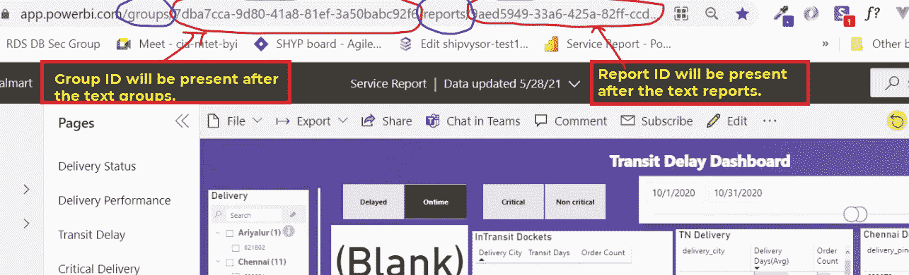
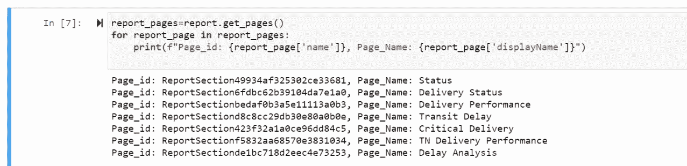
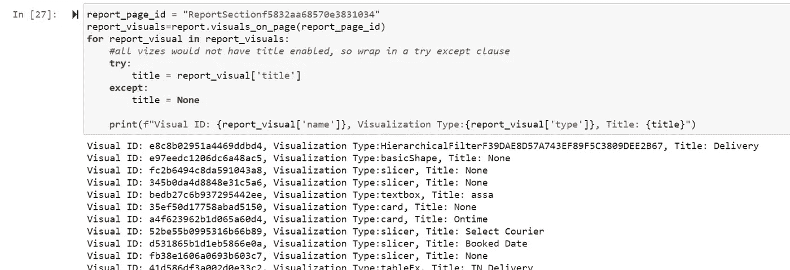
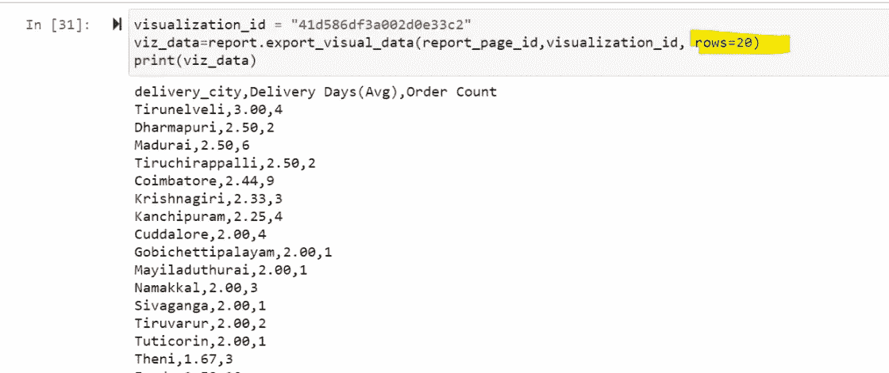

# Python Jupyter 笔记本中的 PowerBI

> 原文：<https://medium.com/nerd-for-tech/powerbi-in-python-jupyter-notebooks-500ee152f083?source=collection_archive---------12----------------------->

最近，PowerBI 发布了 PowerBI client Python 包，以便在 Jupyter 笔记本中进行 Power BI 分析。新的软件包可以让你轻松地在 Jupyter 笔记本中嵌入 Power BI 报告、仪表盘或 Q & A。由于这是一个最近发布的特性，关于通过这个 python 库访问报告的步骤，互联网上没有太多有用的资源，所以我将通过本文分享我的学习

通过 pip 安装程序安装很简单

```
pip install jupyter
pip install powerbiclient
#open jupyter notebook
jupyter notebook
```

您可以通过三种模式连接到 PowerBI 并获取令牌:

1.  提供用户名和密码的基本身份验证
2.  使用嵌入令牌的身份验证。
3.  DeviceCodeLoginAuthentication。这是默认的身份验证模式

作为本博客的一部分，将重点介绍基本的身份验证。使用您的 Power BI 登录凭据进行身份验证，并获取令牌。

```
from powerbiclient.authentication import MasterUserAuthentication
from powerbiclient import Report
auth_token = MasterUserAuthentication(username=YOUR_POWERBI_USER, password=YOUR_PASSWORD)
```

进一步访问需要组和报告 id。要了解 group_id 和 report_id，请在浏览器中打开 powerbi 报告。检查 URL 中的特定文本“组”和“报告”,并提取组和报告 id。



用于查找组和报告 id 的 PowerBI URL

```
#to access a powerbi report
report = Report(group_id="7dba7cca-9d80-41a8-81ef-3a50bab1c9f6", report_id="9aed5949-33a6-415a-82ff-ccd6888a5528", auth=auth_token)
report # you need to embed the report by calling this. Critical step
```

## 注意:您需要将报告嵌入到 jupyter 笔记本中，以便执行后续步骤。我错过了上述代码的最后一行，并得到了错误。花了一些时间才发现

一旦报表嵌入到 jupyter notebook 中，您可以通过调用 get_pages 函数找到报表中可用的报表页面列表。

```
report_pages=report.get_pages()
for report_page in report_pages:
    print(f"Page_id: {report_page['name']}, Page_Name: {report_page['displayName']}")
```



通过将 page_id 传递给 get_visuals 函数，查找特定报表页面中可用的视觉效果列表

```
report_page_id = "ReportSectionf5832aa68570e3831034"
report_visuals=report.visuals_on_page(report_page_id)
for report_visual in report_visuals:
    #all vizzes would not have title enabled, so wrap in a try except clause
    try:
        title = report_visual['title']
    except:
        title = None

    print(f"Visual ID: {report_visual['name']}, Visualization Type:{report_visual['type']}, Title: {title}")
```



现在通过调用 export_visual_data 导出可视化中的数据。导出的数据将是字符串类型，使用字符串操作将其转换为列表以便进一步转换

```
visualization_id = “41d586df3a002d0e33c2”
viz_data=report.export_visual_data(report_page_id,visualization_id, rows=20)
print(viz_data)
```



除此之外，我们可以获得过滤器和更新过滤器。我会在下一篇博文中讨论这个问题

一旦数据被导出到 Jupyter notebook 中，我们可以使用 pandas，numpy 进行进一步的转换。使用 matplotlib，我们可以基于转换后的数据生成图表。我觉得下面是缺失的部分，这可能会影响更广泛的受众的采用。

1.  虽然这绝对是强大的，但应该有一种机制来与 powerbi 应用程序用户共享创建的可视化。
2.  数据更新仍然局限在 Power BI 生态系统中。应该有一种机制来触发 jupyter 笔记本的数据刷新。
3.  能够访问报告中呈现的特定可视化内容。这将更有帮助

此处提供了示例代码文件:

[](https://github.com/balajigv/powerbi/blob/master/powerBiConnectivity.py) [## balajigv/powerbi

### 在 GitHub 上创建一个帐户，为 balajigv/powerbi 开发做贡献。

github.com](https://github.com/balajigv/powerbi/blob/master/powerBiConnectivity.py) 

[https://github . com/balajigv/power bi/blob/master/powerbi connectivity . py](https://github.com/balajigv/powerbi/blob/master/powerBiConnectivity.py)

#powerbi #jupyter #python