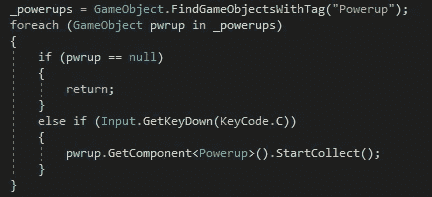
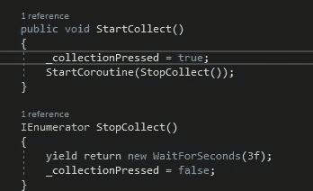
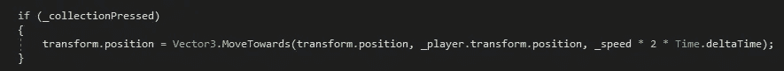
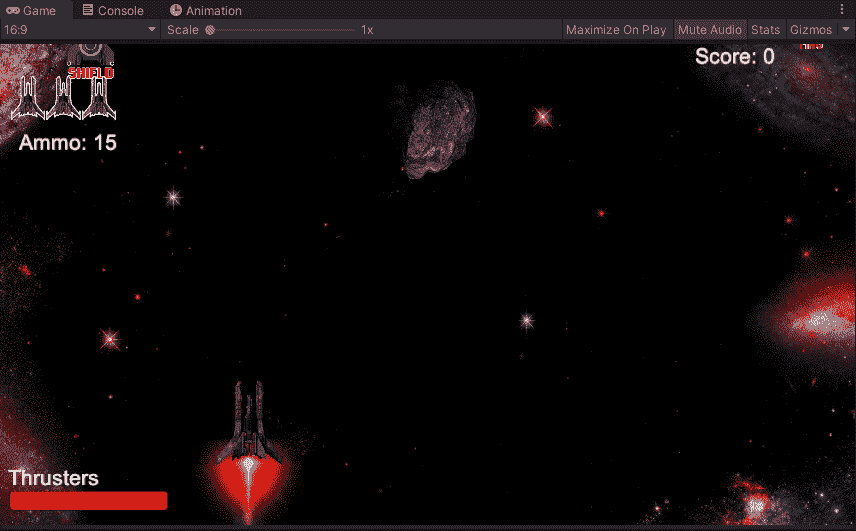

# 通电收集器

> 原文：<https://medium.com/nerd-for-tech/powerup-collector-e993365a8045?source=collection_archive---------23----------------------->

现在我们已经有了所有我们想要的能量，让我们创建一个快速的特性，允许玩家从任何地方收集它们。这将会让玩家玩得更安全，但是我们会在以后让敌人单位向能量炮射击的时候调整它的强度。首先，我们需要进入我们的玩家脚本，创建一个新的游戏对象，让玩家能够拖动电源:

从这里，我们可以进入我们的 void 更新，并创建一个新的方法来使用:

至于我们将如何使我们的电源向我们的球员移动，我们将进入我们的电源脚本，并创建一个代码，让它向我们的球员移动，我们将在未来再次使用新的敌人类型:

然而，在我们创建移动方法之前，我们首先需要创建一个集合方法，它将允许我们调用 powerups。我们还需要创建一个协程，它将在几秒钟后被调用来结束我们对玩家的加电动作。
最后，我们可以创建一种方法，当我们按下 C 键时，我们的加电就有了目的地:

用我们的移动方法，我们的力量会移动到我们的球员。所有这些完成后，我们现在可以看看它是如何出现在游戏中的。

好了，我们的玩家现在可以召唤能量了，但是我们必须小心讨厌的 Mag 能量，因为它会像其他的一样吸引我们。