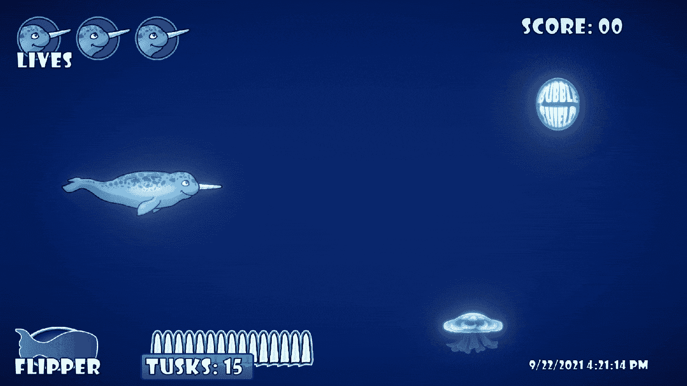

# 启动黑仔

> 原文：<https://medium.com/nerd-for-tech/powerup-killer-b979bbe39382?source=collection_archive---------8----------------------->

我这篇文章的目标和挑战，是制造一种敌人类型，当玩家在它面前时，它会向玩家开火。我所有的能量和绝大多数的敌人都从屏幕右边产生，然后在屏幕左边移动。当敌人以不同的速度向同一个方向行进时，很容易让他们在加速时向左射击，但是我想采取一种更动态的方法。我决定使用…