# 电源磁铁-游戏开发系列 49

> 原文：<https://medium.com/nerd-for-tech/powerups-magnet-game-dev-series-49-e2bc3a17716a?source=collection_archive---------26----------------------->

目标:通过按 C 键创建一个 powerups 收集功能。

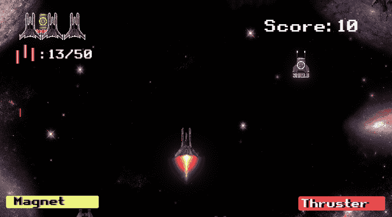

虽然我们的敌人越来越强大，但玩家仍然没有升级。这是为我们的球员加油的好时机！

在这篇文章中，我们将创建一个磁铁来收集所有的场景中按下 C 键的权力。它将包含这个功能的 3 个部分。

*   创建可视化幻灯片作为磁体冷却系统
*   当磁铁准备好时，按 C 键收集全部
*   改变电源的移动

## 想象磁铁

让我们在画布中创建一个滑块并调整值，这几乎与[推进器充电器](/nerd-for-tech/instant-thruster-recharger-game-dev-series-38-93c5e52ea837)的设置相同。

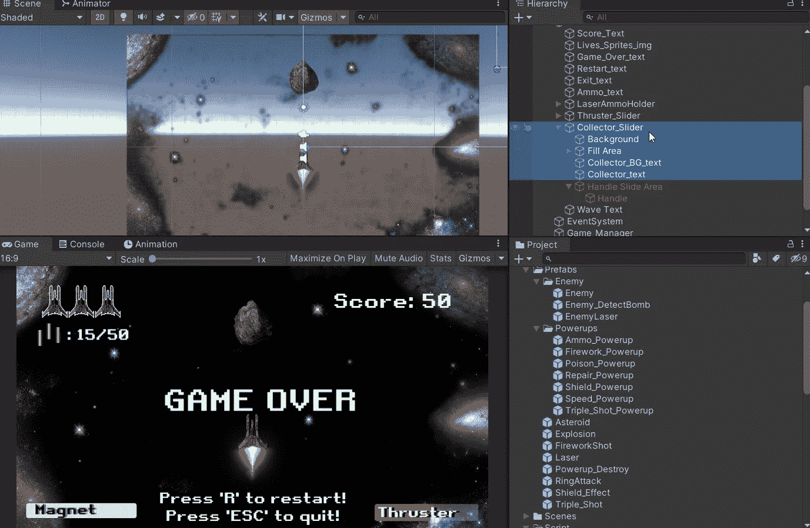

打开 **UIManager** ，用一个新变量创建添加滑块值的功能。

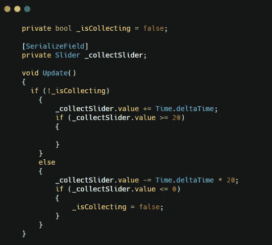

bool " **_isCollecting** "是我们将要控制的播放器的滑块值。因此，我们需要创建一个公共方法来控制它。

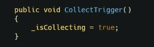

接下来，让我们在**播放器**中创建磁铁的功能。

## 玩家脚本中的磁铁功能

由于场景中可能会有不止一次的加电，我们应该创建一个数组变量来存储所有的加电。
然后我们可以在 **Update()** 中调用 powerups。

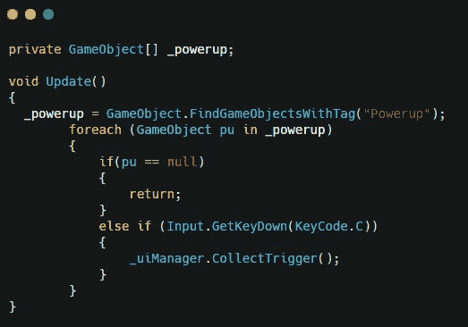

然后我们可以创建另一个 bool 来启用磁铁功能。

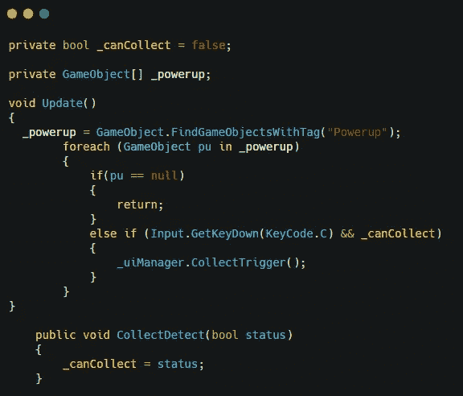

并且从 **UIManager** 中调用公共方法来启用它。

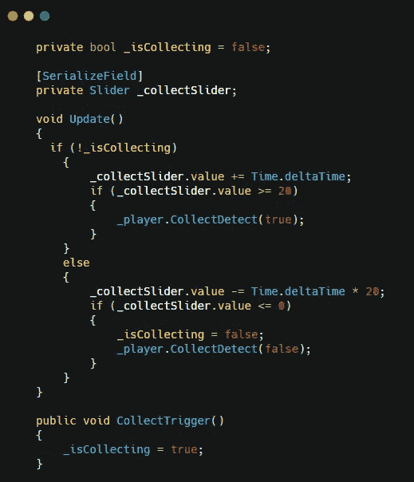

在 UIManager 脚本中添加行。

这都是用函数来完成的。然后，我们需要使电源向玩家移动。

## Powerups 运动

让我们也在**加电**脚本中创建一个 bool。然后创建一个公共函数，允许我们调整来自播放器的 bool。

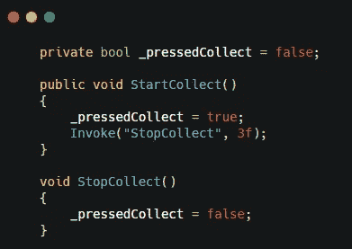

然后我们可以在 **Update()** 中添加一个 if 语句。

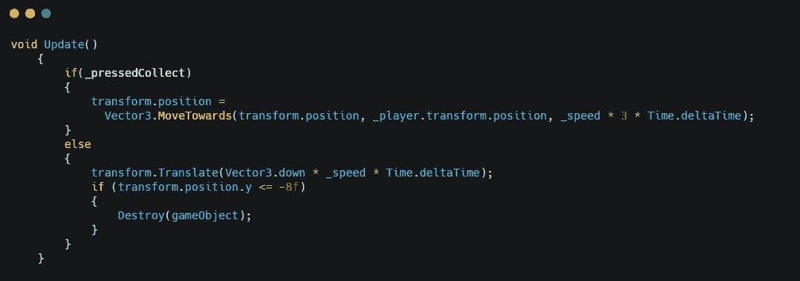

像我们在[之前的](https://sj-jason-liu.medium.com/the-fearless-enemies-game-dev-series-47-ef53d84df979) [文章](/nerd-for-tech/what-a-tricky-enemy-game-dev-series-44-502c7e361010)中所做的那样使用 move origing。

然后，我们需要在我们的播放器脚本中再添加一行来访问它。

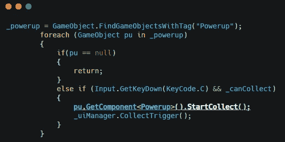

在玩家脚本的 **Update()** 中增加一行。

全部完成！我们现在可以用磁铁作为玩家的 buff 了！

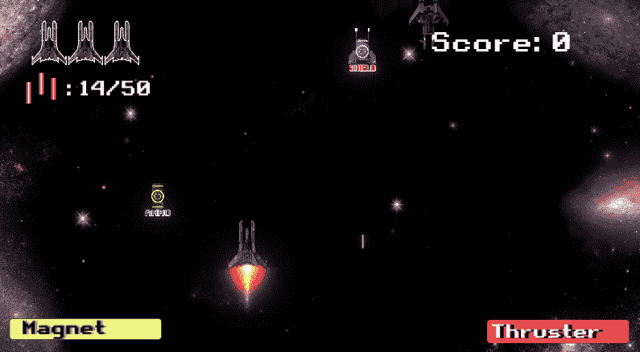

接下来:[闪躲时间！](https://sj-jason-liu.medium.com/dodging-time-game-dev-series-50-f639910bf98c)