# 后台服务的实际应用第二部分

> 原文：<https://medium.com/nerd-for-tech/practical-applications-of-background-services-part-2-c1082bb2c613?source=collection_archive---------17----------------------->


在我们之前名为[的博客中，实际实施:。NET Core BackgroundServices](https://www.partech.nl/nl/publicaties/2021/04/practical-implementation---net-core-background-services) ，我们已经看到了如何使用一个实际的实现来实现后台服务。让我们再深入一点，了解更多..

假设有一个服务器托管了一个 API。我们希望在 API 开始时就记录下这个服务器的内存使用情况。在 API 停止之前必须这样做，这样我们才能知道在一天的某个特定时刻使用数据消耗了多少内存。为了实现这一点，我们将每隔 15 秒监控服务器的内存使用情况并保存在一个文件中(可以根据需要进行配置)。

让我们看看如何在 API 中使用后台服务来实现这一点。

除此之外，要查看后台服务在。Net 核心，我们将学习如何在 Windows 服务器上的 Internet 信息服务(IIS)中托管 API。

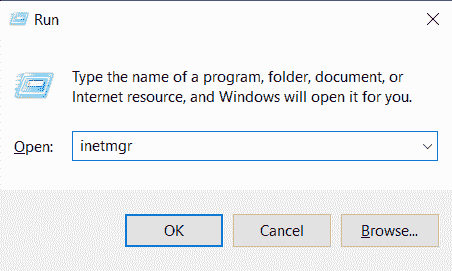

首先，打开运行窗口(Winkey + R)并键入' inetmgr '。如果您得到下面的错误，那么需要安装 IIS。

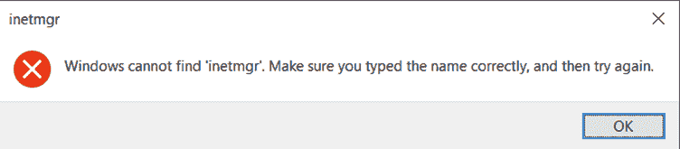

若要安装，请再次打开运行窗口并键入“appwiz.cpl”，这将打开安装在您机器上的程序和功能。

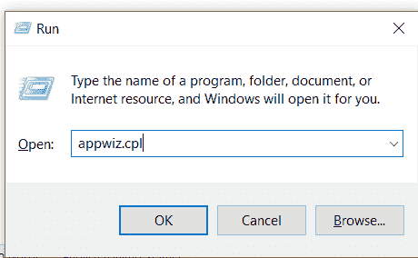

在屏幕的左侧，会有一个选项“打开或关闭 Windows 功能”。点击那个。

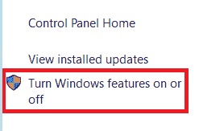

选择该选项后，会出现一个弹出窗口。选择下面突出显示的复选框，并在安装完成后重启机器。

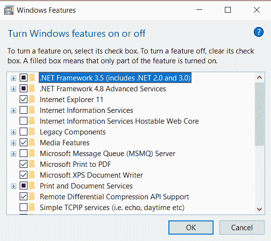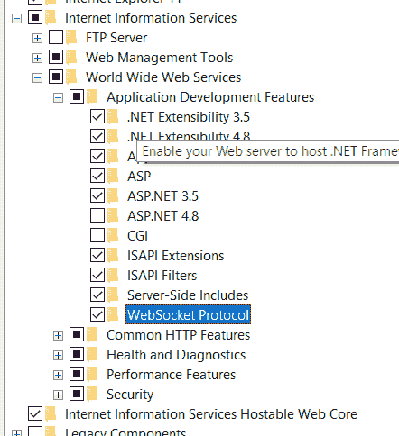

约束后，安装 URL 重写和。来自互联网的 Net Core 运行时和托管包。

【https://www.iis.net/downloads/microsoft/url-rewrite】链接网址改写[—](https://www.iis.net/downloads/microsoft/url-rewrite)

**。网芯托管捆绑**[—https://dotnet.microsoft.com/download/dotnet/3.1](https://dotnet.microsoft.com/download/dotnet/3.1)

一旦安装了上述所有工具，尝试从运行窗口打开 inetmgr。应该会出现如下所示的屏幕。

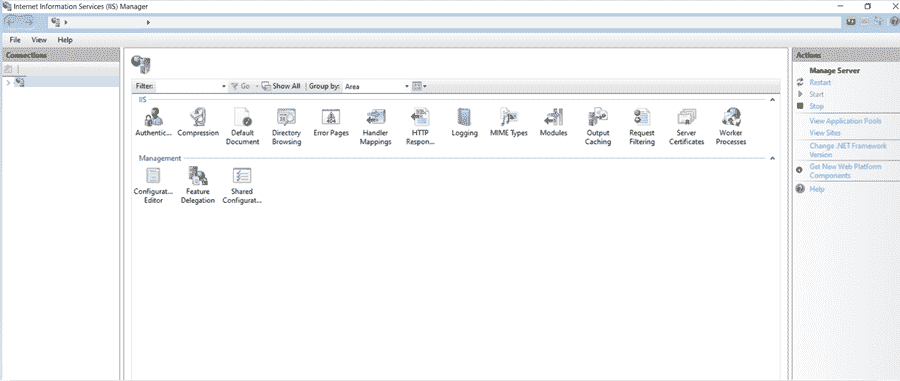

现在，让我们开始创建一个可以在 IIS 中托管的 API。

创建一个 ASP。Net Core Web 应用程序，并为解决方案提供一个有效的名称。

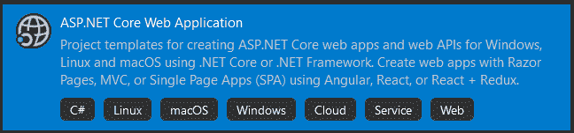

从可用模板中选择项目类型作为 API。

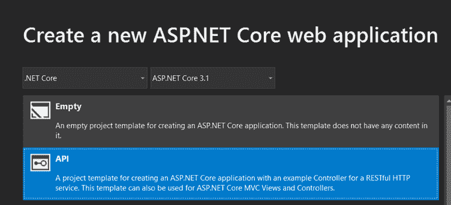

创建后，解决方案资源管理器将如下所示。

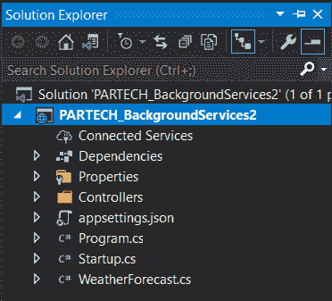

添加一个包含 HostedServices 逻辑的类文件。为该类提供一个有效的名称，并从 Microsoft.Extensions.Hosting 继承接口“IHostedService”

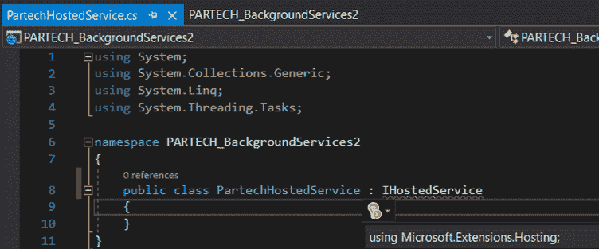

实现所需的方法(StartAsync、StopAsync)。与此同时，实现将内存利用率写入类文件中的一个文件的逻辑，如下所示。这将在每 15 秒后寻找所利用的内存，并将数据写入一个文件。文件名后面会附加日期时间。

```
using Microsoft.Extensions.Hosting; using System; using System.IO; using System.Collections.Generic; using System.Diagnostics; using System.Linq; using System.Threading; using System.Threading.Tasks; namespace PARTECH_BackgroundServices2 { public class PartechHostedService : IHostedService { ​ private Timer _timer; ​ public Task StartAsync(CancellationToken cancellationToken) ​ { ​ _timer = new Timer(WriteSystemData, null, 0, 15000); ​ return Task.CompletedTask; ​ } ​ void WriteSystemData(object state) ​ { ​ PerformanceCounter ramCounter; ​ ramCounter = new PerformanceCounter("Memory", "Available MBytes"); ​ var data = $"Available Memory - { ramCounter.next() } MB"; File.WriteAllText($"D:\\PARTECH\\SystemInfo_{DateTime.Now.ToString("MM_dd_yyyy_HH_mm_ss") }.txt", data); ​ } ​ public Task StopAsync(CancellationToken cancellationToken) ​ { ​ //New Timer does not have a stop. ​ _timer?.Change(Timeout.Infinite, 0); ​ return Task.CompletedTask; ​ } } }
```

在 Startup.cs 文件中的 configureServices 方法中插入托管服务类文件。现在，您可以运行解决方案并检查所需的数据是否在提供的路径中被接收。

```
services.AddHostedService<PartechHostedService>();
```


之后，将项目发布到创建网站的路径。要发布，请选择文件夹目标选项。

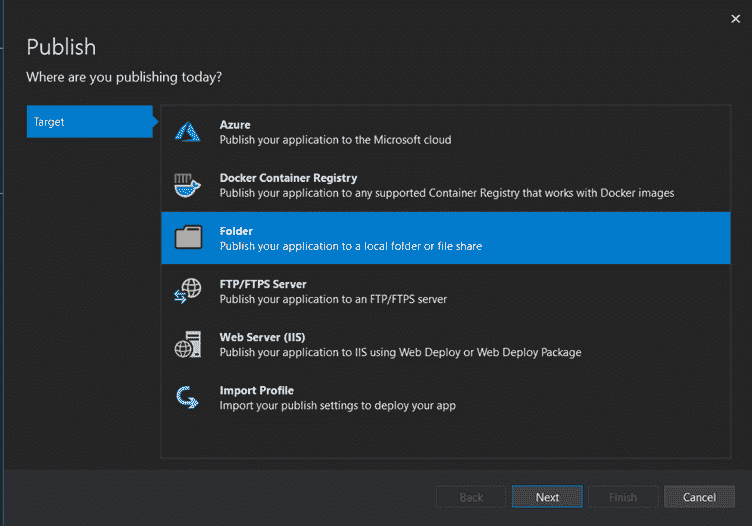

现在，转到 IIS，右键单击左窗格中的“站点”,选择“添加网站”,并提供如下图所示的选项。

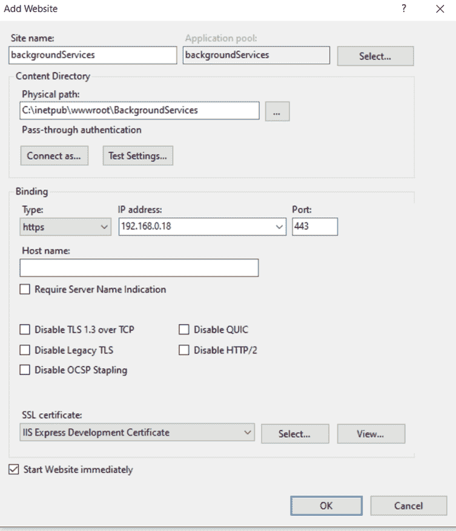

这里，Sitename 是存储在 IIS 中的网站的名称。下一个字段是应用程序池。顾名思义，它表示应用程序正在其中运行的应用程序池。我们可以在应用程序池级别单独配置元素。

接下来是发布后台服务的代码的路径。点击“测试设置”。如果您发现没有访问该路径的授权，请单击“连接身份”。提供登录服务器的凭据。

接下来提供绑定类型为 HTTPS。从下拉列表中，选择可用的 IP 并提供有效的端口号。在屏蔽 IP 的情况下，还可以提供主机名，通过该主机名可以从浏览器访问应用程序。

因为已经选择了 HTTPS 选项，所以选择一个有效的证书，最后单击确定按钮。这将创建一个网站的网站下提供的名称，它将通过提供的 IP 和屏蔽的网址访问。

现在，为站点启用目录浏览。并尝试从浏览器点击 API 来验证它是否工作。这里的网址是[https://192 . 168 . 0 . 18/weather forecast。](https://192.168.0.18/weatherforecast.)你看到浏览器页面上的结果了吗？

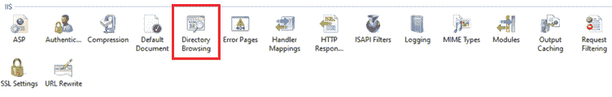

现在，打开文件资源管理器，导航到已配置为写入利用率数据的文件夹路径。你会看到每 15 秒钟就有一个文件被创建。

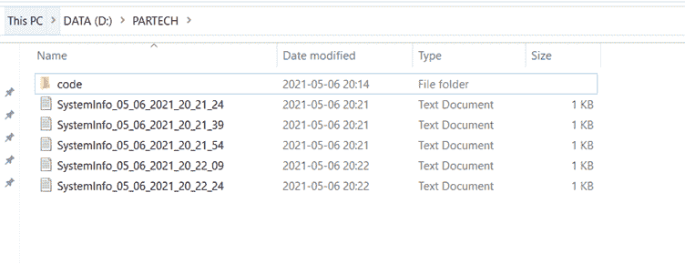

# 结论

这是另一个简单实用的例子，展示了如何使用后台服务并在 Windows 服务器上托管它们。像这样，许多其他后台计划可以通过该代码处理。

*原载于*[*https://www . partech . nl*](https://www.partech.nl/nl/publicaties/2021/05/practical-applications-of-background-services-part-2)*。*