# 实际执行--。NET 核心后台服务

> 原文：<https://medium.com/nerd-for-tech/practical-implementation-net-core-background-services-1a4c9bf3b1c9?source=collection_archive---------1----------------------->


电脑和自动化给我们的生活带来了很多好处。在没有人工干预和监控的情况下处理任务对大多数人来说绝对是一个福音。

这里有一个假设的场景。您有一个通过云提供服务的系统。该系统是付费的，但提供 30 天的免费试用期。为了验证试用用户并在 30 天后限制他们的访问，您需要持续监控。此外，如果手动完成，则有可能出现错误，如提前结束试用期或延长试用软件的使用时间。

这可能会给顾客留下关于你的产品的负面印象。为了避免这种情况，您可以利用计算的能力，在适当的时候完全取消访问。

为了实现这一点。Net core 提供后台服务选项。在这种情况下，逻辑写在。Net 代码，然后它可以在后台持续运行。它的优点是无需任何人工干预就能完成需求。我们来详细看看什么是后台服务，如何在点网核心实现

**目录**

1.  IHostedService 简介
2.  的实际实施。Net 托管\后台服务
3.  结论

# IHostedService 简介

。Net core 提供了通过使用 IHostedServices 实现后台作业的选项。这是……Net 核心库。HostedServices 是实现 IHostedService 接口的类。

托管服务与 Windows 服务略有不同，Windows 服务是单独托管的，不托管任何网站。但是，当涉及到后台服务时，它可以被绑定并与网站项目一起运行。

# 点网核心托管/后台服务的实际实现

在这一节中，让我们看看如何实现后台服务。这将通过两种方式完成；第一，使用 IHostedServices，第二，使用 BackgroundService。

## 第一步

创建一个新项目，并选择项目模板为“ASP。NET Core Web Application”并为项目提供有效的名称。

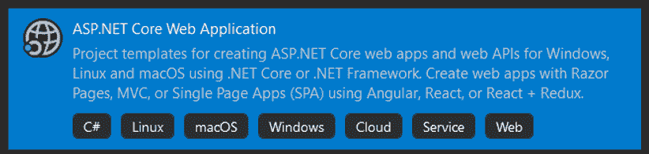

## 第二步

选择 web 应用程序的类型作为 API。

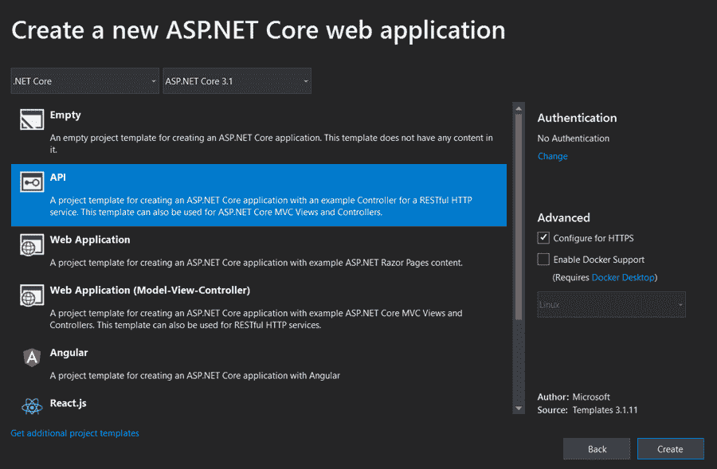

## 第三步

创建项目后，项目的文件夹结构如下所示

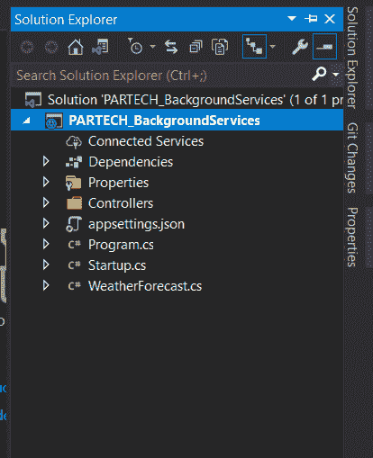

## 第四步

下一步是实现一个使用 IHostedService 接口的类。让我们创建一个新的类文件，并根据您的选择命名它。

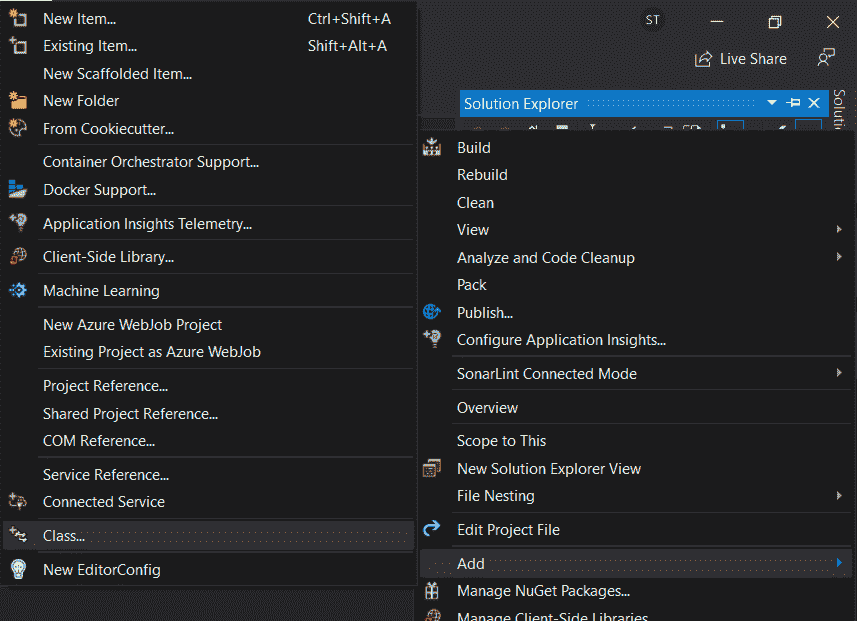

## 第五步

从 Microsoft.Extensions.Hosting 继承 IHostedService 接口。

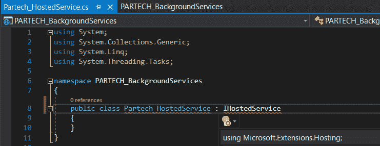

## 第六步

IHostedService 接口有两个方法，要求它由继承它的类实现。一个是启动异步，另一个是停止异步。

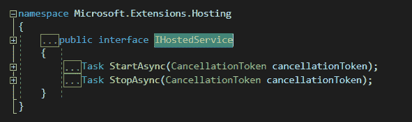

## 第七步

现在在实现 IHostedService 的类中，让我们创建一个全局计时器并初始化计时器。我们会提供-

*   我们需要执行的方法
*   必须执行该方法的频率或时间范围。

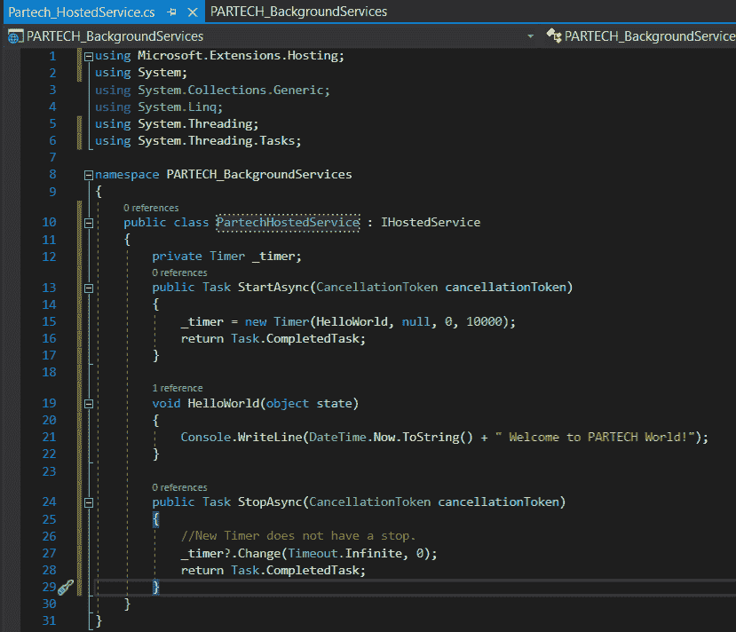

## 第八步

在方法名中，插入需要在后台运行的逻辑。在我们的例子中，我们实现了一个简单的控制台。WriteLine，一个带有时间和消息的语句，用于通知方法被触发的时间间隔。

## 第九步

在 startup.cs 文件中的 configure services 部分下，添加下面一行以将托管服务注入到应用程序中。

```
services.AddHostedService<PartechHostedService>();
```

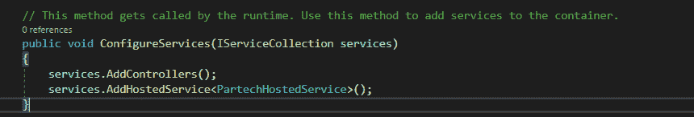

这里，“PartechHostedService”是使用了 IHostedService 的类名

## 第十步

页眉—使用 Microsoft。需要在 PartechHostedServices 和 Startup 类中添加 AspNetCore.Hosting 以使用 IHostedService

## 步骤 11

将项目运行设置更改为下拉列表中的项目名称，然后运行该项目。

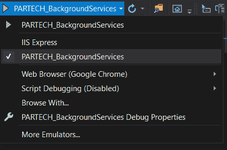

## 步骤 12

请注意控制台窗口中的结果。您将看到应用程序已经启动，并且端点数据在浏览器中可用。您还会注意到，打算并行运行的方法也在控制台窗口中提供数据。

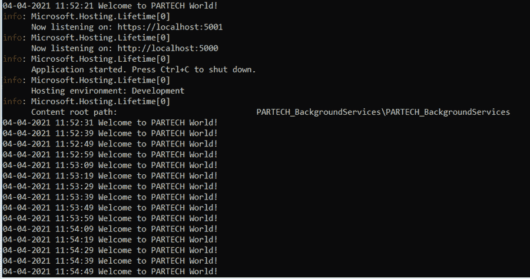

因此，使用 IHostedService 接口和方法实现来实现与 web 应用一起实现后台任务的过程。

这里，我们提供了一个定时器变量，并在 StartAsync 方法中初始化了它。这也适用于需要在特定时间间隔触发的方法。并且 StopAsync 方法在应用程序停止之前被触发。

让我们看看使用后台服务类而不是 IHostedService 来实现相同功能的另一种方法。在此方法中，正在创建的新类继承了 BackgroundService，并覆盖了 ExecuteAsync 方法。

后台服务相对于托管服务的优势在于，它是一个实现 IHostedService 接口的抽象类。默认情况下，它负责需要为 IHostedService 实现的启动和停止异步元素。

在接下来的步骤中，让我们看看如何在同一个项目中实现后台服务。

## 第十三步

让我们创建一个新的类，继承后台服务，并为它提供一个有效的头引用。

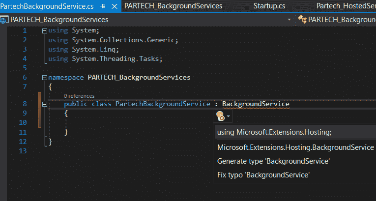

## 步骤 14

创建覆盖方法 ExecuteAsync 方法，以及需要实现的必要功能。在这里，我们将打印* **DateTime。现在. ToString() +"欢迎来到 PARTECH 世界！来自后台服务" ***

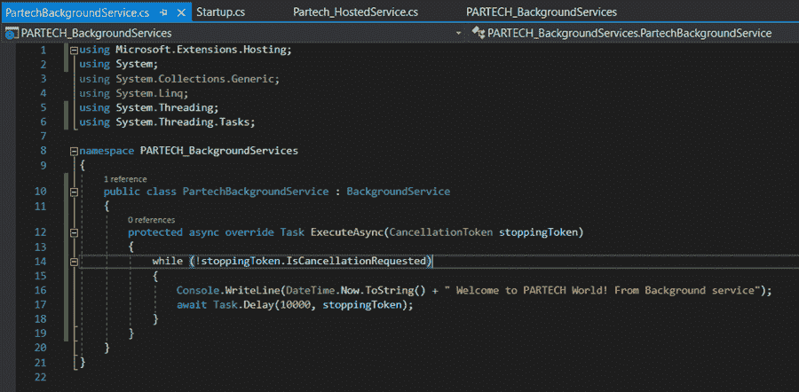

## 第十五步

在 startup.cs 文件中，注释正在为 IHostedService 实现的代码，并通过在启动的 Configureservices 方法中添加以下行来为新类创建新的依赖注入。

```
services.AddTransient<IHostedService, PartechBackgroundService>();
```

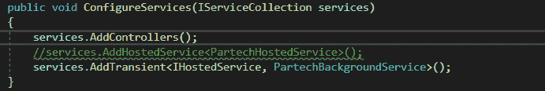

## 第十六步

现在运行解决方案并观察结果。有了新代码，新消息将打印在控制台窗口中，并按照提到的频率运行。

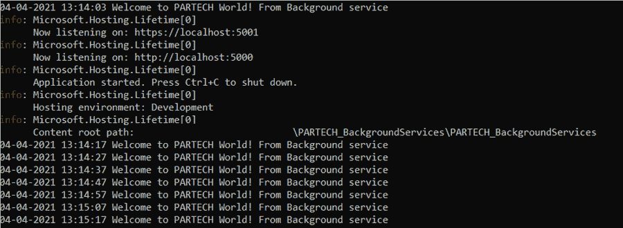

# 结论

借助 IHosted 和后台服务，您可以轻松运行后台任务。最棒的是，你不需要任何基础设施支持。这种方法对于需要定期执行的短期和简单任务来说非常方便。

*原载于*[*https://www . partech . nl*](https://www.partech.nl/nl/publicaties/2021/04/practical-implementation---net-core-background-services)*。*