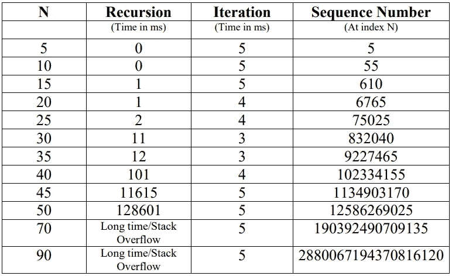

# 实际理解递归和迭代函数的时间复杂性

> 原文：<https://medium.com/nerd-for-tech/practically-understanding-time-complexities-of-recursive-and-iterative-functions-95238525c145?source=collection_archive---------5----------------------->

我们将考虑斐波纳契函数来比较递归和迭代函数的时间复杂度。


在 [Unsplash](https://unsplash.com?utm_source=medium&utm_medium=referral) 上由 [Aron 视觉](https://unsplash.com/@aronvisuals?utm_source=medium&utm_medium=referral)拍摄的照片

# **基本定义**

1.  递归:函数不断直接或间接调用自身的过程。
2.  迭代:某一组指令重复执行的过程。

# **递归和迭代斐波那契计算的算法**

1.  递归的

```
recursivefib(n):
   **if** n <2
       **return** n
   **return** recursivefib(n - 1) + recursivefib(n - 2)
```

2.重复的

```
iterativefib(n):
    x=0, y=1
    **if** n<2
        **return** n
    for (i=2; i<=n; i++)
   {
      z=x+y
      x=y
      y=z
   }
   **return** y
```

正如在算法中观察到的，递归函数一直调用自己，直到达到基本条件(*即 n < 2* )。而迭代函数使用 *for* 循环重复执行一组指令(本例中为*:z = x+y；x = y；y = z；*)。

在递归算法中， *if* 语句花费恒定的时间，但是递归语句(*recursivefib(n-1)+recursivefib(n-2))*花费的时间取决于输入。递归调用使用堆栈，因此输入越大，需要的堆栈数量就越多。

在迭代算法中， *if* 语句花费恒定时间，但是*用于*循环所花费的时间取决于输入。for 循环中的语句(在本例中)花费的时间是恒定的。所以那些语句会根据输入重复执行。

那么现在让我们看看迭代和递归函数在现实中需要多少时间。为此，我使用内置的 Java 函数来计算这两个函数所花费的时间。

计算递归和迭代函数所需时间的 Java 代码:

```
**import** **java.util.Scanner**;

**public** **class** **Fibonacci** {
    **public** **static** **void** **main**(String[] args) {

        Scanner sc = **new** Scanner(System.in);
        System.out.print("Enter N: ");
        **int** n = sc.nextInt();
        sc.close(); 

        **if**(n<**0**)
        {
        	System.out.println("No Negative Numbers allowed");
        	**return**;
        }

        **long** time;

        System.out.println("Iterative Function:");
        time = System.currentTimeMillis();
        System.out.printf("Sequence Number at index %d = %d \n", n, iterativefib(n));
        System.out.printf("Time using Iteration: %d ms\n", System.currentTimeMillis() - time);

        System.out.println("Recursive Function:");
        time = System.currentTimeMillis();
        System.out.printf("Sequence Number at index %d = %d \n", n, recursivefib(n));
        System.out.printf("Time using Recursion: %d ms\n", System.currentTimeMillis() - time);
    }

    **static** **long** **recursivefib**(**int**  n) {
        **if** (n<**2**) 
            **return** n;
        **return** **recursivefib**(n - **1**) + **recursivefib**(n - **2**);
    }

    **static** **long** **iterativefib**(**int** n) {
        **long** f1 = **0**, f2 = **1**, f3;
        **if**(n<**2**)
        	**return** n;
        **for** (**int** i = **2**; i <=n; i++) {
            f3 = f1 + f2;
            f1 = f2;
            f2 = f3;
        }
        **return** f2;
    }
}
```

现在让我们看看随着输入大小的增加，我们会得到什么样的输出:



> 注意:我们在输出中得到的时间取决于许多因素，比如系统中运行的进程数量，而不仅仅是函数本身。所以当你在你的终端运行代码时，输出可能有点不同，但是函数的行为是一样的。同样，在上面的代码中，包含了打印输出的时间，所以如果您想排除打印时间，可以相应地修改代码。

现在我们有了递归和迭代函数的时间需求的真实场景。因此，让我们简单讨论一下时间复杂性和递归 v/s 迭代函数的行为。

*   求递归的时间复杂度比迭代的时间复杂度更复杂。
*   如上所述，递归一次又一次地调用同一个函数，这导致了很大的开销，因为每次递归调用都需要它自己的堆栈。
*   而迭代只是相同代码块的重复，这使得代码更大，但与递归相比没有大的开销。
*   在递归的情况下，我们可以通过使用递归调用生成的递归树来计算时间复杂度。递归树的递归方程给出为 *T(n) = T(n-1) + T(n-2) + c*
*   通过求解上述递推方程，我们得到时间复杂度为 O(2^n).
*   上述时间复杂度是指数的，这从对应于输入 N 的输出中显示的值可以明显看出。随着 N 值的增加，使用递归计算第 N 个斐波那契数所需的时间也是指数增加的。
*   在迭代的情况下，首先观察到对于较小的 N 值，所需的时间比递归 Fibonacci 函数多，但是随着 N 值的增加，并且在 N 的某个值之后，迭代 Fibonacci 函数所需的时间总是小于递归 Fibonacci 函数所需的时间。
*   递归中的指数行为是由嵌套调用及其相应的堆栈开销造成的。

对于任何技术或其他错误，随时与我联系，以便进一步的读者受益。

感谢您的阅读。知识就是力量，所以不断获取！😈

在 [GitHub](https://github.com/gandhidevansh) 上关注我吧！