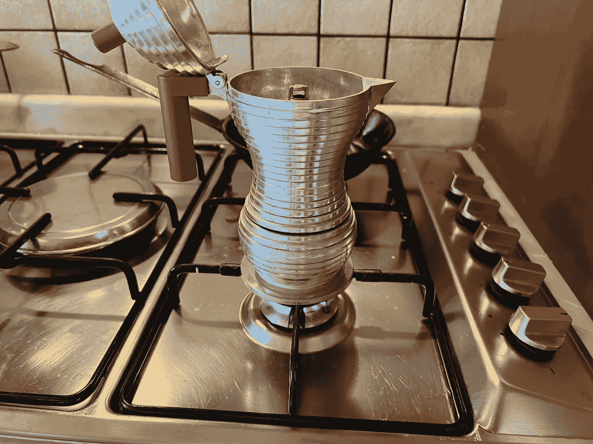
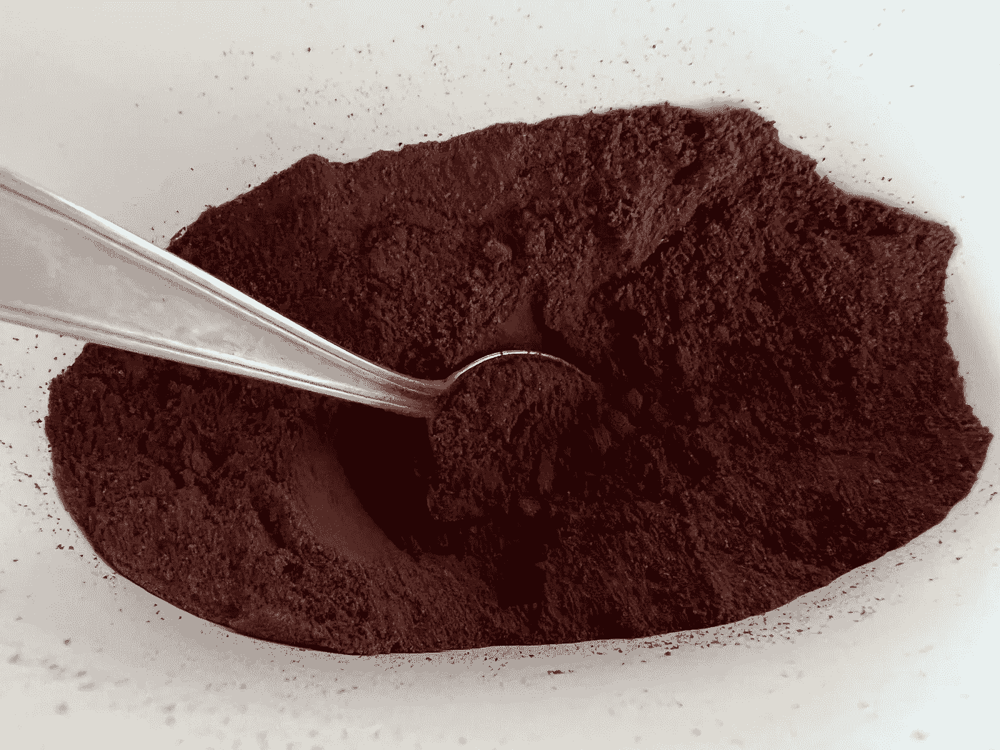
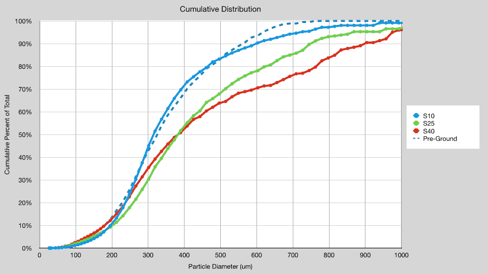
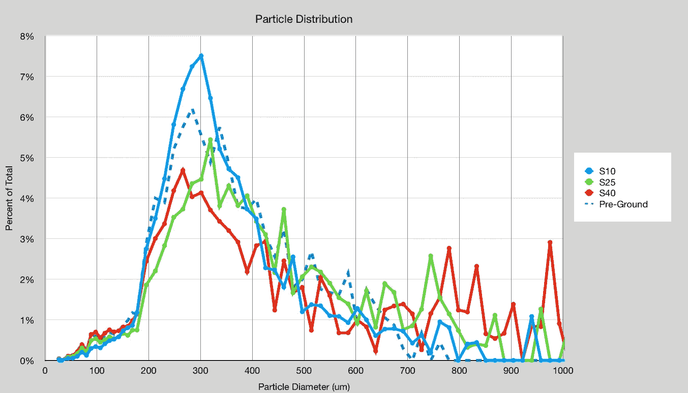

# 预研磨咖啡颗粒分布

> 原文：<https://medium.com/nerd-for-tech/pre-ground-coffee-particle-distribution-11f9cf17c4dc?source=collection_archive---------1----------------------->

## 咖啡数据科学

## 检验预研磨咖啡

在意大利旅行时，我很好奇预研磨咖啡是什么样子的。研磨在视觉上似乎相当不错，所以我收集了一个样品在家测量。我特别好奇，因为在工业规模上，他们可能会使用辊磨机，而不是毛刺设置。

这是我妻子的姨婆在陆丹蓝每天用的咖啡。并不可怕，但肯定不是特色咖啡。这是意大利的日常家用咖啡。

使用[成像处理](/nerd-for-tech/measuring-coffee-grind-distribution-d37a39ffc215)来测量颗粒分布，我将该分布与我的 SPK-38G 研磨机的一些研磨设置进行了比较。在这个例子中，S10 是最好的，S20 是最高的。

研磨前的趋势非常接近 S10，但是大多数颗粒的尺寸小于 700um。

这种研磨的紧密性可能是由于大型商业设备中的辊磨机。我原以为罚款可能会更少，事情会变得更棘手。它适用于陆丹蓝，并且可以脱气到 CO2 释放不干扰提取的程度。

如果你愿意，可以在[推特](https://mobile.twitter.com/espressofun?source=post_page---------------------------)、 [YouTube](https://m.youtube.com/channel/UClgcmAtBMTmVVGANjtntXTw?source=post_page---------------------------) 和 [Instagram](https://www.instagram.com/espressofun/) 上关注我，我会在那里发布不同机器上的浓缩咖啡照片和浓缩咖啡相关的视频。你也可以在 [LinkedIn](https://www.linkedin.com/in/dr-robert-mckeon-aloe-01581595) 上找到我。也可以在[中](https://towardsdatascience.com/@rmckeon/follow)关注我，在[订阅](https://rmckeon.medium.com/subscribe)。

# [我的进一步阅读](https://rmckeon.medium.com/story-collection-splash-page-e15025710347):

[我未来的书](https://www.kickstarter.com/projects/espressofun/engineering-better-espresso-data-driven-coffee)

[我的链接](https://rmckeon.medium.com/my-links-5de9eb69c26b?source=your_stories_page----------------------------------------)

[浓缩咖啡系列文章](https://rmckeon.medium.com/a-collection-of-espresso-articles-de8a3abf9917?postPublishedType=repub)

[工作和学校故事集](https://rmckeon.medium.com/a-collection-of-work-and-school-stories-6b7ca5a58318?source=your_stories_page-------------------------------------)