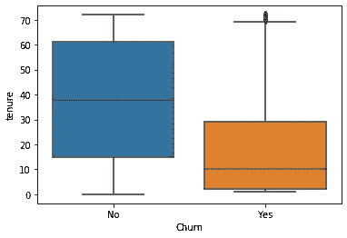
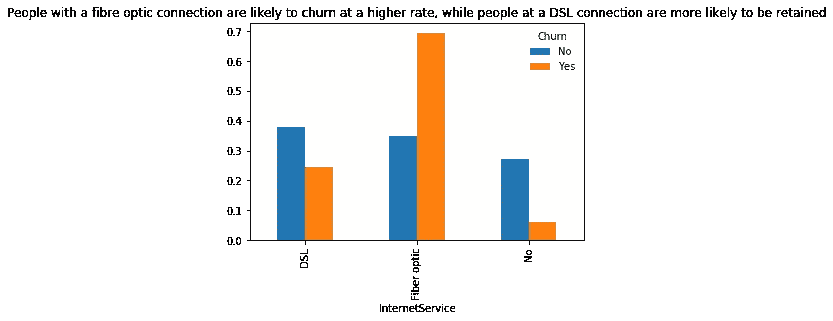
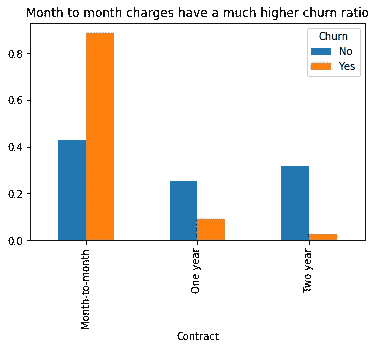
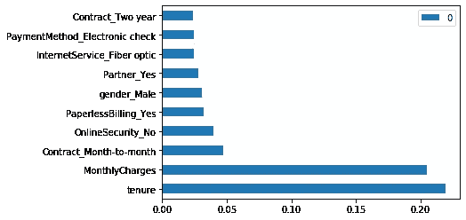

# 预测电信公司的客户流失

> 原文：<https://medium.com/nerd-for-tech/predicting-customer-churn-for-a-telco-70a821a84ce8?source=collection_archive---------1----------------------->

客户流失是一个与购买后流失的客户相关的术语。获得一个客户的成本是巨大的，足以让公司分析和理解客户流失背后的原因。

在本练习中，我们将使用一家电信公司的数据集，该数据可在以下链接中找到。[https://www.kaggle.com/blastchar/telco-customer-churn](https://www.kaggle.com/blastchar/telco-customer-churn)。

该数据集有近 21 列，包含 18 个自变量、一个客户 id 变量和一个客户流失形式的因变量。代码的第一部分是分析数据并查看列的数据类型

```
df=pd.read_csv('Customer Churn.csv')
df.head(5)
```

除了总费用和每月费用，数据集中几乎所有的变量都是分类变量。我们可以首先检查是否有任何丢失的值

```
df.isnull().sum()
```

在确认没有缺失值后，我们将执行 EDA 来识别数据中的任何关系或模式。让我们首先尝试找出电信客户的任期分布。

```
sns.boxplot(y=df["tenure"],x=df["Churn"]
```



任期与流失

让我们进一步分析电信客户可以利用的服务类型，以及它与客户流失率的关系。让我们先来看看互联网服务的类型和他们的流失率之间的关系。

```
internet=pd.crosstab(df["InternetService"],df["Churn"],normalize="columns").plot(kind="bar")
```



互联网连接与流失率

从标题中可以看出，使用光纤连接的人比使用 DSL 连接的人更容易流失。更重要的是，我们还可以推断出，互联网服务的类型对客户流失率有着重要的影响。让我们看看接触的持续时间如何影响客户流失

```
internet=pd.crosstab(df["Contract"],df["Churn"],normalize="columns").plot(kind="bar")
```



合同期限与流失

与签订月合同的人相比，接触时间长的人流失率更低。

# **特色工程**

在本节中，我们将不得不为 f 形虚拟变量中的分类变量生成额外的列。

```
df['TotalCharges']=pd.to_numeric(df["TotalCharges"],downcast='float',errors='coerce')
df=pd.get_dummies(df,columns=['gender','Partner','Dependents','PhoneService','MultipleLines','InternetService','OnlineSecurity','OnlineBackup','DeviceProtection','TechSupport','StreamingTV','StreamingMovies','Contract','PaperlessBilling','PaymentMethod','Churn'])
df.drop([ 'Churn_No', 'gender_Female', 'Partner_No',
        'Dependents_No', 'PhoneService_No', 'PaperlessBilling_No'],axis=1,inplace=**True**)
```

我们的数据集中现在总共有 41 列。有多种方法可以处理如此多维度的数据。一种方法是通过主成分分析来降低数据集的维数。能否在分类数据集上进行主成分分析是另一个问题。Stack Exchannge 上的这个链接提供了一个不同的替代方法，称为多重对应分析(MCA)。[https://stats . stack exchange . com/questions/5774/can-principal-component-analysis-be-applied-to-datasets-cont-cont-mix](https://stats.stackexchange.com/questions/5774/can-principal-component-analysis-be-applied-to-datasets-containing-a-mix-of-cont)

然而，对于这个项目的范围，我们将跳过这个过程，并着手建立我们的机器学习算法。该过程的第一部分是将数据分为测试集和训练集

```
X=df.iloc[:,:-1].values
y=df['Churn_Yes'].values

X_train, X_test, y_train, y_test = train_test_split(X,y,test_size=0.2)
```

一旦数据被分离，我们就可以对我们的数据进行逻辑回归。

```
lr=LogisticRegression()
lr.fit(X_train,y_train)
y_pred=lr.predict(X_test)
print(classification_report(y_pred,y_test))
```

逻辑回归的结果如下所示

```
precision    recall  f1-score   support

           0       0.91      0.84      0.87      1107
           1       0.54      0.70      0.61       302

    accuracy                           0.81      1409
   macro avg       0.72      0.77      0.74      1409
weighted avg       0.83      0.81      0.81      1409
```

该模型的准确率为 81%，精确度为 54%，对正客户流失值的召回率为 70%。让我们尝试使用决策树分类器，看看是否可以进一步改善结果

```
dc=DecisionTreeClassifier()
dc.fit(X_train,y_train)
y_pred=dc.predict(X_test)
Tree',accuracy_score(y_pred,y_test),'**\n**'
        'Confusion Matrix with Decision Tree', confusion_matrix(y_pred,y_test))
```

结果如下所示

```
Accuracy Score with Decision Tree 0.7381121362668559 
Confusion Matrix with Decision Tree [[843 194]
 [175 197]]
```

准确率从 81%下降到 73%。我们现在将在随机森林分类器上使用 GridSearchCV，看看模型的得分是否可以改进。

```
**from** **sklearn.model_selection** **import** RandomizedSearchCVestimators=range(50,100)
max_features = ['auto', 'sqrt']
max_depth = range(4,12)
min_samples_split = range(2,8)
min_samples_leaf = range(1,8)
bootstrap = [**True**, **False**]
criterion=['gini','entropy']random_grid = {'n_estimators':estimators,
              'max_features':max_features,
              'max_depth':max_depth,
              'min_samples_split':min_samples_split,
              'min_samples_leaf':min_samples_leaf,
              'bootstrap':bootstrap,
              'criterion':criterion}rf=RandomForestClassifier()
rf=RandomizedSearchCV(estimator=rf,param_distributions=random_grid,cv=5,verbose=1)rf.fit(X_train,y_train)
best_estimate=rf.best_params_
rf2=RandomForestClassifier(**best_estimate)
rf2.fit(X_train,y_train)
y_pred=rf2.predict(X_test)
print(classification_report(y_pred,y_test))
```

我们使用随机搜索 CV 来确定随机森林分类器的最佳估计，然后使用这些估计来构建随机森林分类器。让我们看看下面的结果

```
precision    recall  f1-score   support

           0       0.92      0.83      0.87      1122
           1       0.51      0.70      0.59       287

    accuracy                           0.80      1409
   macro avg       0.71      0.77      0.73      1409
weighted avg       0.83      0.80      0.81      1409
```

分数还是和 logistic 回归一样好。我们还可以使用特征重要性方法来找出影响客户流失的关键因素



三个最重要的特性是

1.  每月费用
2.  合同类型(按月、一年、两年)
3.  网络安全

战略家可以更好地关注这些因素，以减少客户流失，提高客户满意度。