# 预测音乐流媒体服务的客户流失

> 原文：<https://medium.com/nerd-for-tech/predicting-customer-churn-for-music-streaming-service-sparkify-3e281a93273?source=collection_archive---------4----------------------->

## 数据科学矿

## 对于企业来说，客户流失可能很棘手——机器学习可以有所帮助！


📷— [西达尔特·博格拉](https://unsplash.com/@thefakebhogra?utm_source=unsplash&utm_medium=referral&utm_content=creditCopyText)

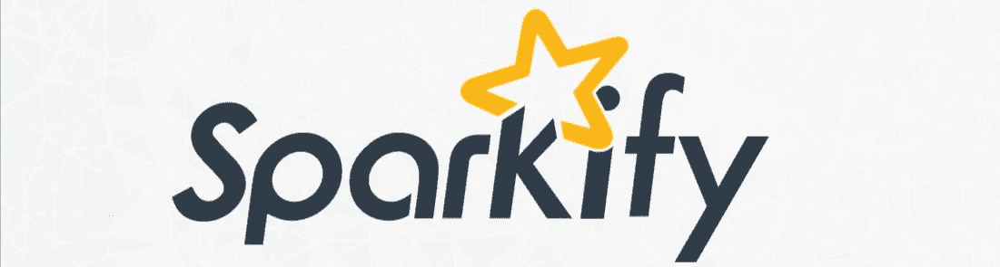

# 项目概述

这个项目涉及一个虚构的、以用户为中心的音乐流媒体服务“Sparkify”(类似于 Spotify)。目的是利用机器学习来预测**客户流失**，甚至在它实际发生之前，以便 Sparkify 可以采取措施来检查它。

> **什么是客户流失？—** 流失率(也称为“损耗率”)是客户停止与某个实体做生意的比率。

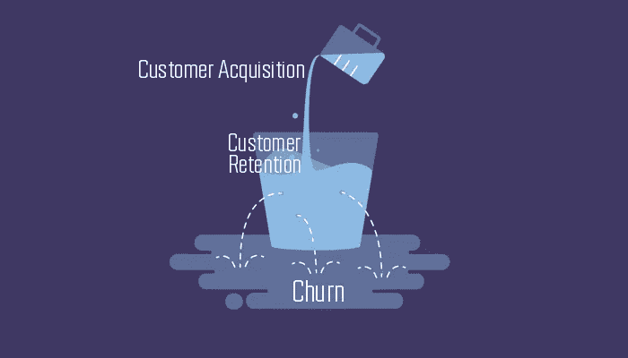

这里记录了方法、手段和结论。要了解项目代码本身，请点击这里的。

# 问题陈述

企业需要留住他们的客户才能兴旺发达。因此，流失(失去客户的过程)是一个重要的商业问题。

我们得到了 Sparkify 用户的数据集，以及一些属性。我们的目标是预测用户是否会流失。为此，我们将首先找到属性之间的相关性，以确定哪些因素会导致用户流失。接下来，我们将以一定的置信度对给定用户进行预测。

# 韵律学

*spark ify-Churn-prediction . ipynb*是包含所有代码的主要 ipython 笔记本。它从 *pyspark* 和 *time* 库中导入多个模块。随机种子被选为 42。对于我们的业务问题，客户流失被定义为拥有“取消确认”页面的用户。

在特征工程中，**多重共线性**(强相关特征)，特别是**相关性> = 0.8** 被去除，这样我们就剩下 43 个特征。然后对特征进行变换，使其更接近正态分布。整个特征工程代码已经过编译，以便以后用于处理更大的数据集。

**F1 分数**用作评估指标。基于朴素预测器、逻辑回归和随机森林分类器构建、训练和评估机器学习管道。记录模型在训练和测试数据集上的性能，并相应地调整超参数。

# 数据探索和可视化

这个项目的数据集由 Udacity 提供。有 3 个数据集可用:

*   亚马逊 EMR 集群上提供完整的数据集(~12GB)，
*   **中型**数据集在 IBM Watson 集群上可用，并且
*   **本地可用的迷你**数据集(~128MB)。

该项目使用迷你数据集来适应数据，并执行所有必要的准备工作。稍后，我们将针对整个数据集对其进行扩展，并将其部署在 **Amazon EMR** 集群上。

我们使用 **Apache Spark** 分析引擎来处理大型数据集。我们做了一些探索性的分析，并使用了两个机器学习模型，除了朴素预测:逻辑回归和随机森林。

# 步骤 1:探索性数据分析

## 1.1 数据集概述

数据集包含用户人口统计信息(例如用户名、性别、位置)和活动(例如听的歌曲、事件类型、使用的设备)。

数据集中有 286000 行具有以下属性:

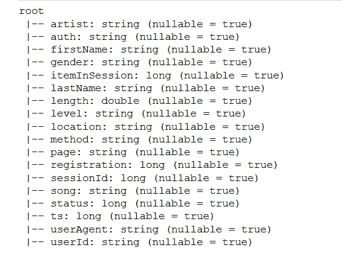

## 1.2 定义客户流失

对于我们的项目，我们将流失定义为拥有**【取消确认】**页面的用户。

```
flag_churn_event = udf(lambda x: 1 if x == **"Cancellation Confirmation"** else 0, IntegerType())
```

我们发现 **23.1%** 的用户有过不愉快的经历。

## 1.3 比较非流失用户和流失用户的行为

**1.3.1 按用户级别:**有两个用户级别:*免费*和*付费*。探索性分析发现，免费用户比付费用户多，而且免费用户的流失率略高于付费用户。

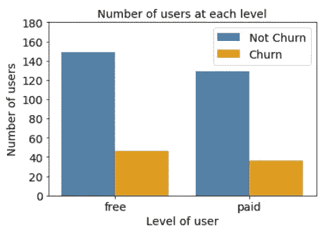

虽然免费用户有更多的人口，但他们贡献的页面访问量比付费用户少得多，这意味着付费用户更热衷于这项服务。

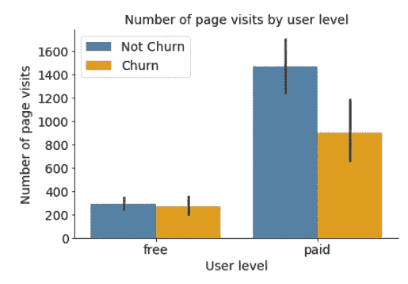

**1.3.2 按星期几:**与周末相比，大多数用户在工作日登录。

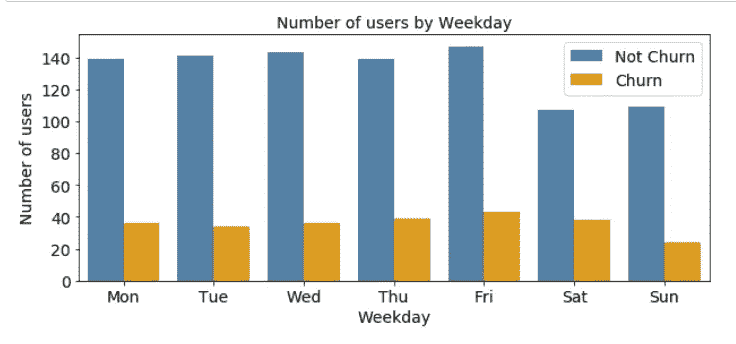

**1.3.3 按页面事件:** *NextSong* 、*竖起大拇指*和*添加到播放列表*是三个最经常出现的页面事件，这表明 Sparkify 是一个很受欢迎的服务，具有很大程度上的积极互动。

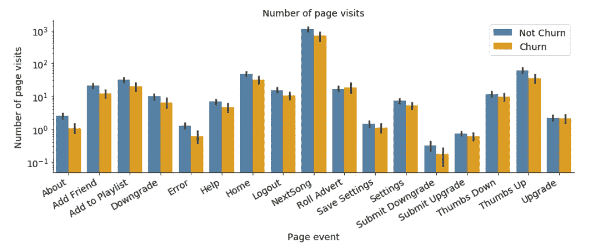

**1.3.4 按拇指向上/拇指向下:**拇指向下多的用户比同行更有流失倾向，扩展了不满意的用户更容易流失的逻辑。

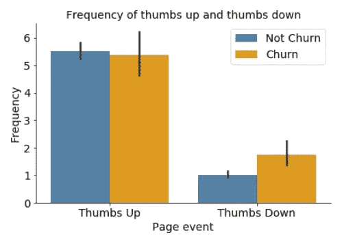

# 步骤 2:特征工程

## 步骤 2.1 创建用于训练模型的特征

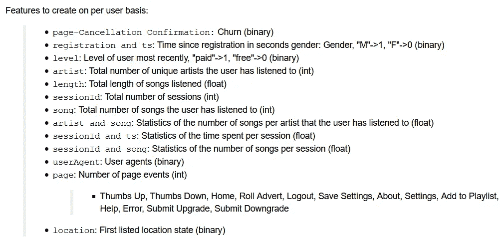

*   用户的最新级别(免费/付费)

```
func_levels = udf(lambda x: 1 if x=="paid" else 0, IntegerType())
levels = df_sub2.select(['userId', 'level', 'ts'])\
    .orderBy(desc('ts'))\
    .dropDuplicates(['userId'])\
    .select(['userId', 'level'])\
    .withColumn('level', func_levels('level').cast(IntegerType()))
```

*   用户参与的时间量、艺术家数量、歌曲数量和会话数量

```
engagement = df.groupBy('userId')\
    .agg(
         countDistinct('artist').alias('num_artists_dist'), 
         countDistinct('sessionId').alias('num_sessions'),
         countDistinct('song').alias('num_songs_dist'),
         count('song').alias('num_songs'),
         count('page').alias('num_events'),
         Fsum('length').alias('tot_length'))
```

*   每位艺术家所听歌曲数量的平均值和标准偏差

```
per_artist = df.filter(~df['artist'].isNull())\
    .groupBy(['userId', 'artist'])\
    .agg(count('song').alias('num_songs'))\
    .groupBy('userId')\
    .agg(avg(col('num_songs')).alias('avg_songs_per_artist'),
         stddev(col('num_songs')).alias('std_songs_per_artist')
    ).fillna(0)
```

*   每次听的歌曲数量的平均值和标准偏差，以及每次听的时间

```
per_session = df.groupBy(['userId', 'sessionId'])\
    .agg(
         max('ts'), 
         min('ts'), 
         count('song').alias('num_songs')
    )\
    .withColumn('time', (col('max(ts)')-col('min(ts)'))/lit(1000))\
    .groupBy('userId')\
    .agg(
         stddev(col('time')).alias('std_time_per_session'), 
         avg(col('time')).alias('avg_time_per_session'),
         stddev(col('num_songs')).alias('std_songs_per_session'),
         avg(col('num_songs')).alias('avg_songs_per_session')
    ).fillna(0)
```

**将工程特征结合在一起:**

```
dataset = churn.join(levels, ['userId'])\
    .join(time_gender, ['userId'])\
    .join(engagement, ['userId'])\
    .join(per_artist, ['userId'])\
    .join(per_session, ['userId'])\
    .join(agents, ['userId'])\
    .join(pages, ['userId'])\
    .join(locations, ['userId'])
```

## 步骤 2.2 检查多重共线性

我们评估每对特征之间的相关性，并移除与任何其他特征的相关性大于 0.8 的任何特征。

```
corr = dataset_pd[correlated_cols].corr()
cols_to_remove = []
counter = 0
for coln in corr.columns:
    counter += 1
    **if corr[coln].iloc[counter:].max() >= 0.8:**
        cols_to_remove.append(coln)
print(f"Highly correlated features that should be removed:\n\n{cols_to_remove}\n\n")
cols_to_keep = dataset_pd.columns.drop(cols_to_remove).tolist()
print(f"Features to keep:\n\n{cols_to_keep}")
```

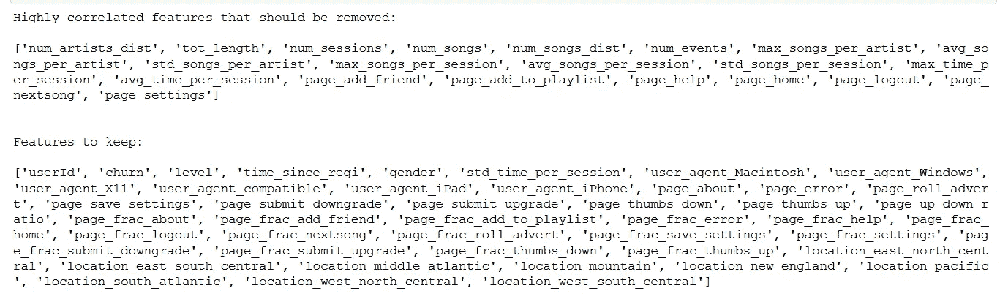

## 步骤 2.3 特征转换

我们对倾斜特征应用对数变换，以使它们的分布更接近正态分布。

```
for col_name in col_names:
    if col_name in columns_to_transform:
        dataset = dataset.withColumn(
            col_name, log(dataset[col_name]+1)
        )
```

这是我们得到的结果:

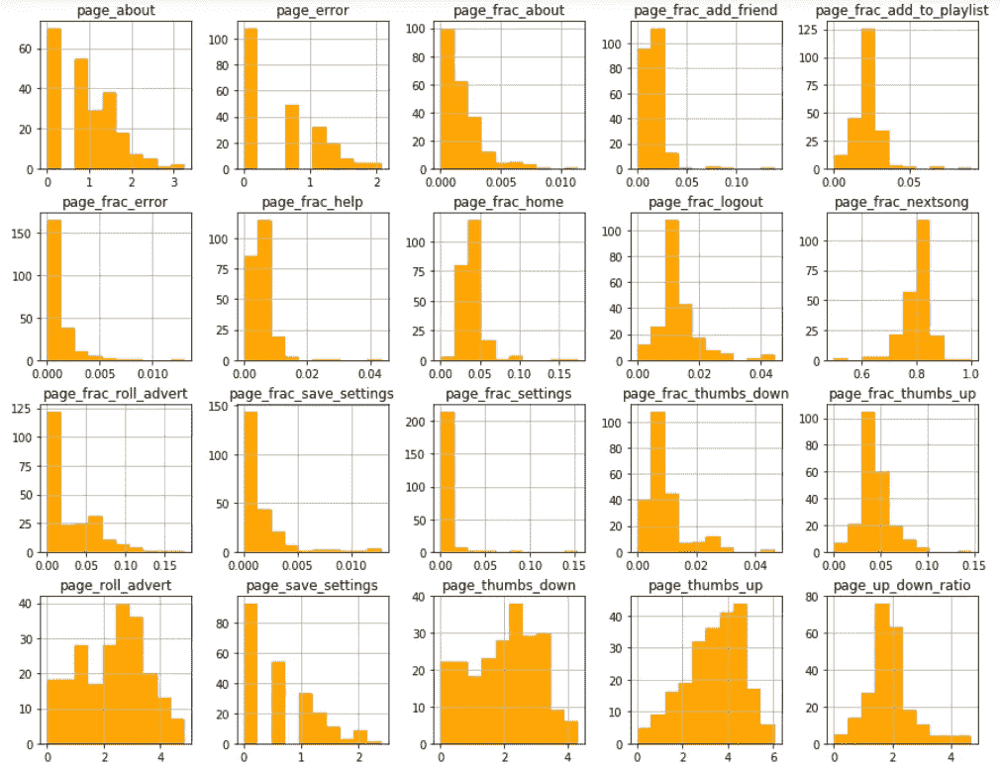

# 第三步:机器学习

我们的机器学习模型的目标是根据之前再造的特征来预测流失( *label=1* )对非流失( *label=0* )。

## 3.1 列车测试分割

我们将数据集按 80-20 的比例分割，用于训练和测试。

```
train, test = dataset.drop('userId').randomSplit([0.8, 0.2], seed=42)
```

## 3.2 评估指标

被搅动的用户是一个很小的子集(23%)。如果我们试图建立一个简单预测“无流失”的模型，它将具有相当好的准确性(77%)，但性能非常差。

因此，我们使用 F1 分数作为评估标准，而不是准确性。

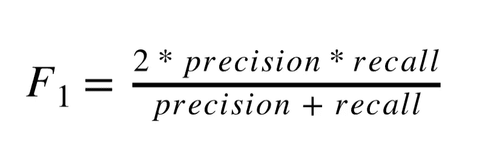

在预测客户流失时， *precision* 旨在确保它确实是一个客户流失，而 *recall* 旨在不遗漏任何真正的客户流失。F1 在*精度*和*召回*之间取平均值，因此给出了一个平衡的前景。

## 3.3 火花管道和功能

在训练-测试分离之后，我们创建一个 PySpark 机器学习管道，包括:

*   VectorAssembler，用于对输入要素进行矢量化
*   MaxAbsScaler，它将每个要素重新缩放到范围[-1，1]
*   选择的分类器，在这种情况下是多分类评估器

```
def buildCV(classifier, paramGrid):
    # Configure an ML pipeline
    assembler = **VectorAssembler**(inputCols=feature_cols, outputCol="rawFeatures")
    scaler = **MaxAbsScaler**(inputCol="rawFeatures", outputCol="scaledFeatures")

    # Cross validation
    crossval = CrossValidator(
        estimator=pipeline,
        estimatorParamMaps=paramGrid,
       evaluator=**MulticlassClassificationEvaluator**(metricName='f1'),
        numFolds=3) return crossval
```

## 3.4 模型评估和验证

我们使用以下分类器的默认超参数来比较它们的模型性能。

*   朴素预测器，它总是预测无流失
*   逻辑回归，以及
*   随机森林分类器。

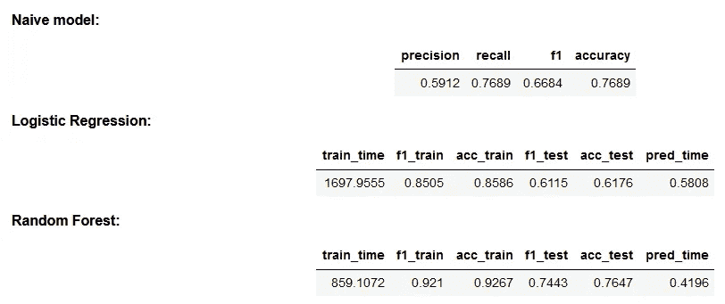

朴素模型设置了模型性能的基线，F1 = 0.67，精度= 0.77。不出所料，这两个机器学习分类器的性能优于朴素模型。**随机森林**在训练集(F1 = 0.92，准确率= 0.93)和测试集(F1 = 0.74，准确率= 0.76)上取得了最好的性能。

## 超参数调整和优化

我们在随机森林分类器上使用**网格搜索**来调整超参数。

```
classifier = RandomForestClassifier(labelCol='label',\
             featuresCol='scaledFeatures')paramGrid = ParamGridBuilder()\
            .addGrid(classifier.numTrees,[20,75])\
            .addGrid(classifier.maxDepth,[10,20])\
            .build()
```

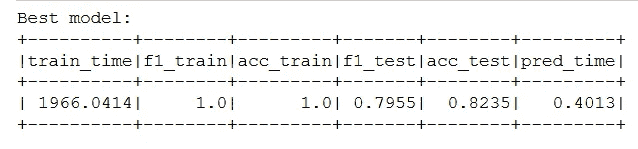

在网格搜索之后，我们获得了改进的 F1 分数，对于训练数据集从 0.921 到 1.0，对于测试数据集从 0.744 到 0.796。准确度也有所提高，训练数据集的准确度从 0.927 提高到 1.0，测试数据集的准确度从 0.765 提高到 0.824。

最佳参数:

```
maxDepth:10
numTrees:75
```

## **识别最重要的特征**

客户流失预测中最重要的特征是自用户注册以来的时间，用户遇到的广告数量，以及用户给出的赞成/反对的次数。

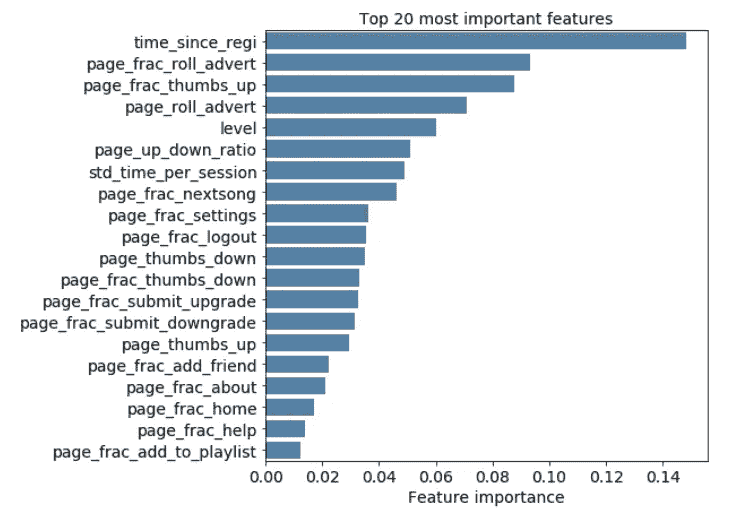

# 结论

*   我们的机器学习模型能够相当好地预测客户流失(f1 得分为 0.74)。通过调整超参数或引入附加特征，可以进一步提高模型性能。
*   流失预测中最重要的特征是自用户注册以来的时间、用户遇到的广告数量以及用户给出的竖起大拇指/竖起大拇指的次数。
*   Sparkify 可以利用这些信息来制定一个关于要采取什么行动的计划。减少广告数量可能是其中之一。另一个可能是弄清楚为什么相对较新的客户会有更多的搅动。
*   Sparkify 也可以看看它的竞争对手——新客户被他们吸引了吗？他们觉得那里有什么吸引人的地方？是直观的界面，还是更好的音乐推荐，还是完全不同的东西？这些发现可以整合到现有的 Sparkify 服务中。将需要 A/B 测试来统计评估每个行动的成本效益分析。

## 丰富

*   我们在数据集上使用了逻辑回归和随机森林分类器模型。为了进一步改进， **XGBoost** 和 **LightGBM** 模型在我们的场景中可能是一些很好的监督学习方法。
*   在将所有功能聚合到用户级别上时，我们还认识到一个关键问题——一些用户可能会冲动，如果他们在上次操作中有一点点不满意的体验，他们就会转到取消页面进行流失。
*   在这种情况下，我们需要知道每个用户操作的时间顺序，以便更好地理解 Sparkify 的用户体验。因此，将数据视为一个**时间序列**可以提供更接近现实的结果。如果我们决定将数据视为时间序列，**递归神经网络**可能是一个很好的建模选择。

仅此而已！我鼓励你深入研究完整的数据集，并从中得出更多的分析。你也可以在这里看看我的 GitHub [里的代码。放心叉吧，踏上自己的数据探索之旅！](https://github.com/nazianafis/Sparkify-Churn-Prediction)

我希望这篇文章对你有用。可以在 LinkedIn *上联系我* [*，或者关注我的著作*](http://linkedin.com/in/nazianafis) [*这里*](https://nazianafis.medium.com/) *。*

*下次见！*(∫･‿･)ﾉ゛