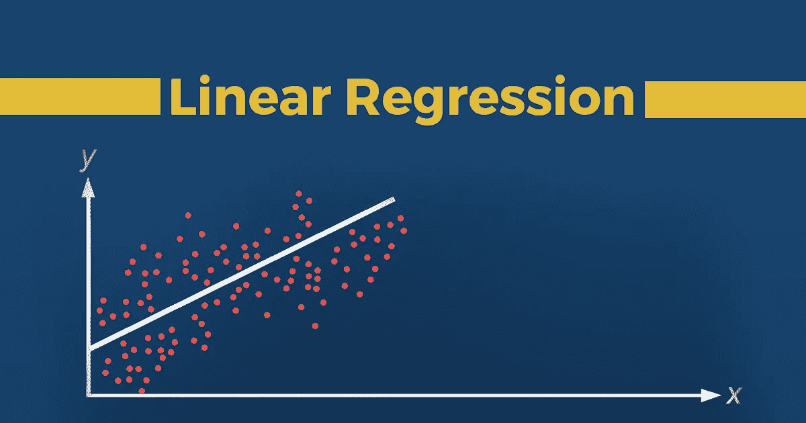
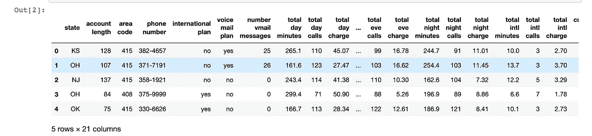
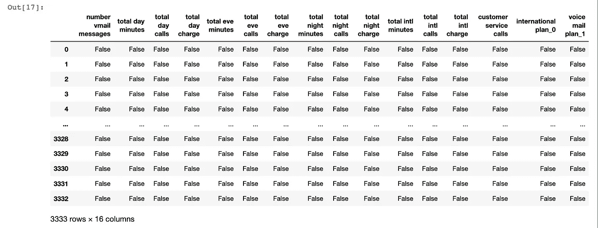
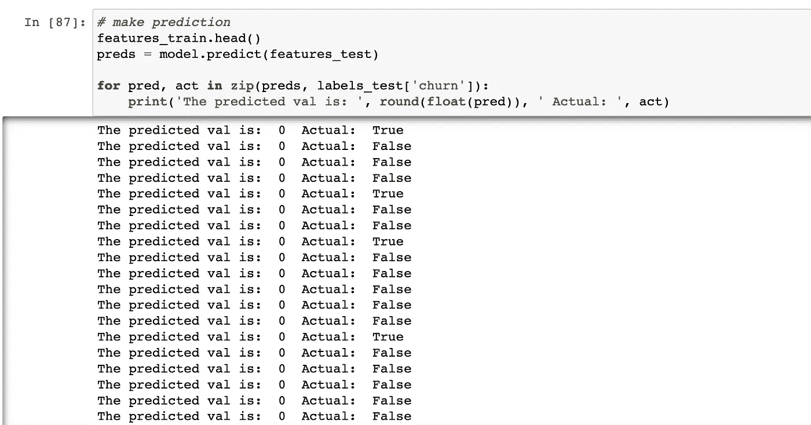

# 用机器学习预测客户流失

> 原文：<https://medium.com/nerd-for-tech/predicting-customer-churn-with-machine-learning-65a7ccac2f5d?source=collection_archive---------9----------------------->

随着如此多的公司和企业采用技术工具来帮助运营他们的服务，重要的是他们能够判断哪个客户正处于被另一个竞争对手夺走的边缘。客户流失率是在一定时间内停止使用公司产品或服务的客户的百分比。



这篇短文旨在介绍如何使用影响客户流失的参数的先前数据来训练机器学习模型，并从模型做出的预测中获得信息，然后采取措施来留住可能有较低机会留下的客户。所以让我们开始吧！

# **可用数据集**

将使用的[数据集](https://github.com/IBM/watson-studio-learning-path-assets/blob/master/data/customer-churn-kaggle.csv)来自 Kaggle，有几个参数(特征)可能会影响客户流失。该 CSV 文件中包含的总共 21 列包括:

*   状态
*   账户长度
*   电话地区号
*   电话号码
*   国际计划
*   语音邮件计划
*   VMail 消息数量
*   总日分钟数
*   全天通话总数
*   全天费用
*   总前夜分钟数
*   Eve 呼叫总数
*   总 Eve 费用
*   夜间总分钟数
*   夜间通话总数
*   总夜间费用
*   总 Int 分钟数
*   Int 调用总数
*   总利息费用
*   客户服务电话
*   搅拌

从上面的列中，我们感兴趣进行预测的确切列是“客户流失”，因此这将被视为我们的标签数据。下面是数据集的预览



给出数据集的概要后，接下来是为训练我们的模型制定一个行动计划。

# 行动（或活动、袭击）计划

*   选择最佳列
*   将要素列与标注列分开
*   用编码器预处理数据
*   检查空值
*   将数据分为训练数据和测试数据
*   将数据输入线性回归模型
*   做预测

## 选择最佳列

有了这么多可用的栏目，我们需要决定哪些栏目最能影响客户流失。对客户流失影响最大的列如下。这种情况可能并不总是如此，但与此同时，这些因素最能影响客户流失:

*   vmail 消息数量
*   总日分钟数
*   全天通话总数
*   全天费用
*   总前夜分钟数
*   eve 呼叫总数
*   总 eve 费用
*   夜间总分钟数
*   夜间通话总数
*   总夜间费用
*   总国际分钟数
*   国际电话总数
*   总国际费用
*   客户服务电话
*   国际计划
*   语音邮件计划

导入要使用的模块

```
import numpy as np
import pandas as pd
from sklearn.linear_model import LinearRegression
from category_encoders import BinaryEncoder
from sklearn.model_selection import train_test_split
from sklearn.metrics import accuracy_score
```

读入数据集:

```
data = pd.read_csv('customer-churn-kaggle.csv')
```

## 将要素列与标注列分开

将感兴趣的列分为功能和标签，然后删除不相关的列

```
features = data.drop(columns = ['churn', 'phone number', 'area code', 'state', 'account length'], axis=0)
labels = data[['churn']]
```

## 用编码器预处理数据

感兴趣但具有非数字值的列必须编码成数字格式，这可以使用编码器来实现。“国际计划”和“语音邮件计划”列中有“是”或“否”。由于这些不是数字，我们将使用二进制编码器将它们编码成数字格式:

```
# create binary encoder object
encoder = BinaryEncoder()# convert international plan to binary
newData = encoder.fit_transform(features['international plan'])
international_plan_encoded = newData.drop(['international plan_1'], axis=1)# add encoded column back to features dataframe
features = pd.concat([features, international_plan_encoded], axis=1)# drop international plan column since it has been encoded
features = features.drop(columns=['international plan'], axis=1)
```

对“内部计划”列进行编码后，我们通过串联将编码后的表单添加回特征数据帧，并删除未编码的列。接下来，我们对“语音邮件计划”列进行编码

```
# create binary encoder object
voicemail_encoder = BinaryEncoder()# convert international plan to binary
voice_mail_encoded = voicemail_encoder.fit_transform(features['voice mail plan'])
voice_mail_encoded = voice_mail_encoded.drop(columns=['voice mail plan_0'])# add encoded column back to features dataframe
features = pd.concat([features, voice_mail_encoded], axis=1)# drop voice mail plan column since it gas been encoded
features = features.drop(columns=['voice mail plan'], axis=1)
```

## 检查空值

在机器学习的预处理步骤中，非常关键的是确保您的数据没有空值或空字段。我们可以检查是否有任何列包含任何空字段:

```
features.isnull()
```

运行上述代码的结果是:



```
features.isnull().values.any()
>>Falselabels.isnull().values.any()
>>False
```

## 将数据分为训练数据和测试数据

预处理数据后，下一步是将要素和标注拆分为训练和测试数据，以输入线性回归模型:

```
# split data into train and test
features_train, features_test, labels_train, labels_test = train_test_split(features, labels, test_size=0.33)
```

## 将数据输入线性回归模型

现在是创建线性回归模型的时候了，该模型将输入将要素和标注分割成训练和测试后获得的数据:

```
# create model
model = LinearRegression()
```

接下来是将训练特征和标签拟合到线性回归模型中:

```
# fit data into the model
model.fit(features_train, labels_train)
```

给模型打分让我们清楚地看到我们的模型做得有多好。我们运行模型 100 次迭代，因此我们可以改进模型的性能

```
for e in range(100):
    features_train, features_test, labels_train, labels_test = train_test_split(features, labels, test_size=0.33)
    score = model.score(features_test, labels_test)
    print(score)
```

## 做预测

最后，在模型从提供给它的数据中学习之后，是时候使用我们最初通过拆分数据获得的测试数据进行预测了:

```
# make prediction
features_train.head()
preds = model.predict(features_test)for pred, act in zip(preds, labels_test['churn']):
    print('The predicted val is: ', round(float(pred)), ' Actual: ', act)
```

上述代码输出以下内容:



## 结论

从上面的输出可以看出，这个模型做得相当好。0 代表假，1 代表真。

然后，该模型可以被导出，托管在服务器上，并可以在 web 应用程序或移动应用程序中用于检查客户流失。

谢谢你坚持到最后:)