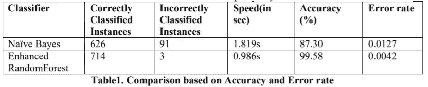
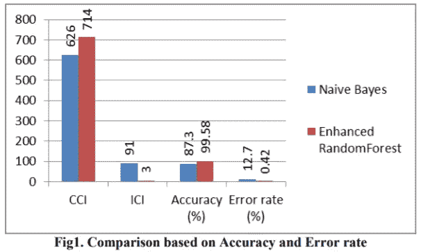
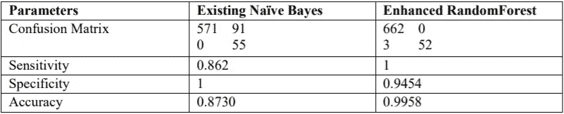
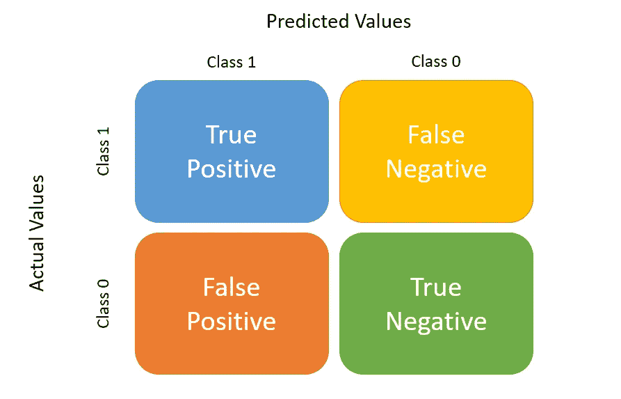

# 预测网络犯罪模式和混淆矩阵的作用-案例研究

> 原文：<https://medium.com/nerd-for-tech/predicting-cyber-crime-patterns-and-the-role-of-confusion-matrix-case-study-41fb371ad85e?source=collection_archive---------15----------------------->

# 什么是网络犯罪？

网络犯罪是针对或使用计算机、计算机网络或联网设备的犯罪活动。

大多数(但不是全部)网络犯罪是由想要赚钱的网络罪犯或黑客实施的。网络犯罪是由个人或组织实施的。

一些网络犯罪分子有组织，使用先进的技术，技术高超。其他都是黑客新手。

很少，网络犯罪的目的是破坏计算机的原因，而不是利润。这些可能是政治的，也可能是个人的。

# 不同类型的网络犯罪示例:

*   电子邮件和互联网欺诈。
*   身份欺诈。
*   窃取金融或卡支付数据。
*   窃取和出售公司数据。
*   网络勒索(索要金钱以阻止威胁攻击)。
*   勒索软件攻击(一种网络勒索)。
*   加密劫持(黑客利用他们不拥有的资源挖掘加密货币)。
*   网络间谍(黑客获取政府或公司数据)。

## 大多数网络犯罪分为两大类:

*   ***针对*** 的犯罪活动
*   ***利用*** 电脑实施其他犯罪的犯罪活动

> 现在让我们来看一个预测网络犯罪的案例研究

# ase 研究:

> ***g . Michael 博士利用数据挖掘技术预测网络犯罪模式的知识系统***

在这项研究中，一种包括数据挖掘技术和可视化技术的新方法被实施，用于预测网络犯罪在印度主要地区的分布。最初，对网络犯罪数据集进行预处理，并利用数据挖掘算法从中提取事实，然后探索数据之间隐藏的交互，并将其提交给报告。然后，探讨了网络犯罪的原型，这些原型有助于网络犯罪分析人员通过可视化的手段分析这些网络，以预测网络犯罪，从而同情地预防网络犯罪。这项工作描述了一个智能网络犯罪模式识别系统处理信息技术法案(IT 法案)案件的知识库的设计。

## 网络犯罪分析的建议模型——基于知识的系统

提议模型的目的是通过利用数据挖掘技术更有效地预测印度选定地区的网络犯罪模式，并提出一个基于知识的网络犯罪数据分析系统。为此，印度 11 个邦收集了长达 11 年的网络犯罪数据集，并储存在网络犯罪数据库中。拟定模型的开发分以下两个阶段进行:

**第一阶段:**开发增强型随机森林分类器组件

1:属性贪婪逐步选择法预处理。

2:采用双对数均值聚类算法进行聚类。

3:为了提高分类器的效率，在增强型随机森林分类器中执行聚类的网络犯罪数据集。

第二阶段:开发基于知识的系统组件

1:收集并向 IT 和 IPC 部门提供印度现有网络犯罪案件的网络犯罪类型。

2:附上每一种网络犯罪的处罚细节。

3:嵌入此类网络犯罪的预防建议(事前&事后)。

> 在本案例研究的帮助下，我们将更多地关注阶段 1，以理解混淆矩阵的作用

## 增强型随机森林

有了这些树，随机森林就创建了一个可用于分类、回归和其他数据挖掘任务的森林。在训练阶段，随机森林分类器制作多个决策树。通过利用随机森林，可以基于变量的优先级对变量进行排序。决策树复制在数据挖掘中的声誉开始于它们的易开发性、在管理不同数据元素类型方面的灵活性以及可解释性。相反，单一的决策树模型是不稳定的，并且非常容易受到特定训练数据的影响。随机森林中的集成技术试图通过精心制作一组模型来解决这个问题，并通过欺骗数据点的类别标签来总结它们的预言。当个体元素是矛盾的时，集成执行得很好，并且随机森林通过利用随机性的两个基础来获得个体树之间的偏差:最初，每棵树都是在训练数据的单独的自举模型上构建的；那么在构建个体树的每个节点处，只测量任意选择的数据方面的子集。

集合中的每棵树都是为由 B 个属性描述的 N 个案例的给定训练网络犯罪数据集制作的，

—获取 N 个案例的 bootstrap 模型

—在每个节点上，任意决定 b 属性的子集

—无需修剪即可生成完整的树，因为每棵树都是独立于其他树自动生成的，所以随机森林在计算方面非常精通。

> 让我们一步一步地研究上面的过程

**第一步:**

进程增强随机森林 **-**

输入:聚类网络犯罪数据集

输出:基于知识的系统的决策规则

**第二步:**

加载所选网络犯罪数据集的属性，并将数据分配给双对数平均聚类算法中的聚类数据集

**第三步:**

解释数据文件并将验证分配给空值步骤 4:执行十次分割交叉验证

**第四步:**

执行十次交叉验证

**第五步:**

将中的实例总数分成训练和测试阵列

**第六步:**

在分类器中执行聚类的网络犯罪数据集

**第七步:**

对于每个训练-测试分裂对，训练和测试分类器

**第八步:**

计算分类器对所有分割的整体准确度

**第九步:**

显示分类器名称、准确度、混淆矩阵并生成 ROC 曲线

**第十步:**

停止进程

> 让我们评价一下上面的模型

## 基于现有分类器的增强型随机森林的性能分析；

对于增强随机森林与现有分类器的比较分析，已经考虑了不同的评估度量。收集的网络犯罪数据集样本数量为 717 个。

从表 1 中可以清楚地看出，增强型随机森林比现有的朴素贝叶斯分类器(87.30%)更准确(99.58%)，并且花费的时间相对较少。

表 2。现有朴素贝叶斯分类器与增强随机森林的性能评估

在表 2 中，现有的朴素贝叶斯与增强随机森林分类器的性能评估已被制成表格。从增强随机森林的 Kappa 统计值(0.9697)来看，证明了它是理想的分类器。

## 但是什么是混淆矩阵，为什么它很重要？

混淆矩阵是显示实际值和模型预测值并进行比较的表格。在机器学习的上下文中，混淆矩阵被用作分析机器学习分类器如何在数据集上执行的度量。混淆矩阵生成精确度、准确度、特异性和召回率等指标的可视化。

混淆矩阵特别有用的原因是因为混淆矩阵生成了一个模型如何执行的更完整的图像。仅使用像准确性这样的度量标准会导致这样的情况，即模型完全且持续地错误识别一个类，但它未被注意到，因为平均而言性能是好的。同时，混淆矩阵给出了不同值的比较，如假阴性、真阴性、假阳性和真阳性。

混淆矩阵

正/负标签指的是实验的*预测*结果，而真/假指的是*实际*结果。

现在让我们来理解每个术语:

*   **真阳性** —当数据点的实际类别为 1，模型预测为 1 时。(模特说得很正面，你可以信任)
*   **假阴性** —当数据点的实际类别为 1 而模型预测为 0 时。(模型错误地说负面，不可靠)
*   **假阳性** —当数据点的实际类别为 0 而模型预测为 1 时。(模型错误地显示为阳性，不可靠)
*   **真阴性** —当数据点的实际类别为 0 而模型预测为 0 时。(模型是真实地说负面的，值得信赖的)

## 下面给出了通常从二元分类器的混淆矩阵计算的比率列表:

*   **准确性:**总体而言，分类器正确的频率如何？

> (总磷+总氮)/总计

*   **误分类率:**总体来说，出错的频率有多高？

> (FP+FN)/总计
> 
> 它相当于 1 减去准确度，也称为“错误率”

*   **真阳性率:**当它实际上是肯定的时候，它预测肯定的几率有多大？

> TP/实际是，也称为“敏感度”或“回忆”

*   **假阳性率:**当实际上是否定的时候，它多长时间预测一次是？

> FP/实际数量

*   **真否定率:**当它实际上是否定的时候，它预测否定的频率是多少？

> TN/实际数量
> 
> -它相当于 1 减去假阳性率，也称为“特异性”

*   **精度:**当它预测是的时候，它的正确率是多少？

> TP/预测是

*   **患病率:**在我们的样本中，yes 情况实际上发生的频率有多高？

> 实际是/总计

> 让我们回到我们的模型，再次看看它的混淆矩阵，并理解

表 2。现有朴素贝叶斯分类器与增强随机森林的性能评估

在表 2 中，现有的朴素贝叶斯与增强随机森林分类器的性能评估已被制成表格。

因此，比较混淆矩阵中获得的值:

*   **真阳性** —增强型随机森林越高，这意味着预测正确的案例数量越高。
*   **假阴性** —增强型随机森林为零，这非常好，意味着预测错误的案例数量很低。

毫无疑问，随后增强的随机森林的准确率非常高，为 99.58%。

# 结论:

机器学习技术已被证明对整个安全行业有益。然而，机器学习的应用往往受到缺乏标准化数据集、过拟合问题、架构成本等因素的限制。因此，重要的是应用和设计新的方法来保持机器学习算法的优势，同时解决实践中的限制。为了帮助执法官员拯救人类和设想网络犯罪，使用了数据挖掘算法和可视化技术。

开发的网络犯罪分析工具提供了一个框架，用于可视化印度各种网络犯罪类型和网络犯罪易发区，并通过使用谷歌地图的数据挖掘算法对其进行调查。这项任务有助于执法官员通过交互式可视化来审查网络犯罪网络。互动和视觉方面的相关性将有助于暴露和识别网络犯罪原型。从现有分类器和提出的分类器的性能评估来看，增强随机森林获得了 99.58%的准确率，并且计算时间少于朴素贝叶斯。

## 参考资料:

[使用数据挖掘技术预测网络犯罪模式的知识系统 G. Michael 博士](http://www.jcreview.com/fulltext/197-1595776338.pdf)