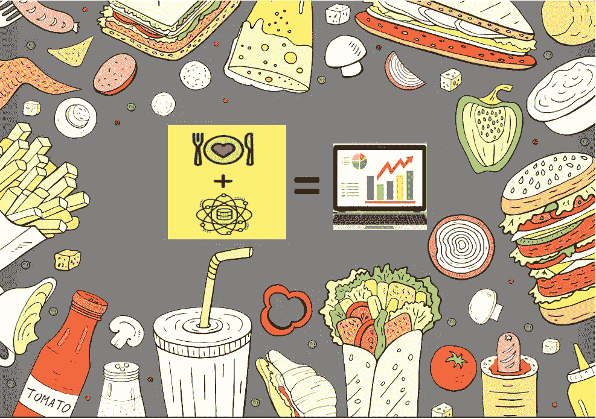
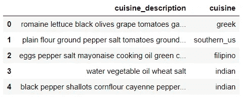
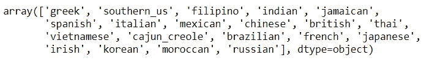
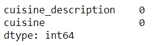
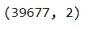
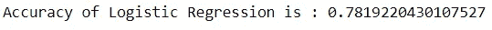
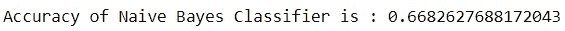
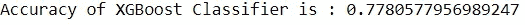

# 使用 Python 中的自然语言处理和机器学习预测食物烹饪

> 原文：<https://medium.com/nerd-for-tech/predicting-food-cuisine-using-natural-language-processing-and-machine-learning-in-python-a00c859a8ac7?source=collection_archive---------3----------------------->

> 数据科学能否根据菜谱中的食材预测美味佳肴？



当我过去从事机器学习分类项目时，我总是想知道如果我的独立专栏是文本而不是数字会怎么样，所以我遇到了一个我非常喜欢的数据集，它由美食和食谱组成。你可以从[这里](https://github.com/sahasourav1522/Cuisine-Data.git)下载数据集和代码。除了对数据科学感兴趣之外，我还是一名美食家，所以我很高兴能参与这个项目。

从这篇文章中得到的关键是，当你有文本中的数据并且你需要做机器学习分类问题时，对这个场景有一个基本的理解。

让我们首先导入所有必需的库

```
from nltk.corpus import stopwords 
import re
from sklearn.feature_extraction.text import CountVectorizer, TfidfVectorizer
from sklearn.model_selection import train_test_split
from sklearn.metrics import accuracy_score
import pandas as pd
```

# **了解数据集**

让我们看看下面的数据集:

```
data = pd.read_csv(“cuisine_data.csv”)
data.head()
```



数据的前 5 行

在上面的数据集快照中，**美食 _ 描述**是独立特征，**美食**是我们需要预测的目标。它由 39，774 行组成。

所以在这个问题陈述中，我们将使用烹饪描述来预测食物的烹饪。由于我们在这个数据中有一个标签/目标，我们将做监督学习模型。

让我们检查一下目标变量中有多少个类？

```
len(data.cuisine.value_counts())#20
```

从上面的输出中，我们可以看到目标变量(Cuisine)中有 20 个类。现在，我们将在下面看到这 20 种美食中有哪些出现在目标栏中

```
data.cuisine.unique()
```



# 检查缺少的值

```
data.isnull().sum()
```



从上面的输出中，我们可以看到数据集中没有丢失的值。

# 删除重复项

```
data.drop_duplicates(inplace = True)
data.shape
```



最初，数据集由 39774 行组成，现在它有 39677 行，因此 **97 个重复行**已从数据集中删除。

# 预处理文本

检查“菜肴描述”一栏中有多少单词

```
print(data[‘cuisine_description’].apply(lambda x: len(x.split(‘ ‘))).sum())
#806112
```

因此，我们在“美食描述”一栏中共有 8，06112 个单词

现在，在 8，06，112 个单词中，我们将删除无意义的单词，如“the”、“is”、“of”等。

我们还将删除由于不同的数据源和编码问题而通常出现在数据集中的特殊字符和不需要的符号。

```
special_character_remover = re.compile(‘[/(){}\[\]\|@,:]’) 
extra_symbol_remover = re.compile(‘[^-9a-z #+_]’)
STOPWORDS = set(stopwords.words(‘english’))def clean_text(text):
 text = text.lower()
 text = special_character_remover.sub(‘ ‘, text) # Replacing these characters with spaces
 text = extra_symbol_remover.sub(‘’, text)
 text = ‘ ‘.join(word for word in text.split() if word not in STOPWORDS)
 return textdata[‘cuisine_description’] = data[‘cuisine_description’].apply(clean_text)print(data[‘cuisine_description’].apply(lambda x: len(x.split(‘ ‘))).sum())
```

因此，经过预处理后，大约 2775 个单词被删除。所以现在我们将在这些干净的文本上建立一个模型。

# 列车测试分离

```
x = data.cuisine_description
y = data.cuisine
x_train, x_test, y_train, y_test = train_test_split(x, y, test_size=0.3, random_state = 42)
```

# 为模型构建准备数据

在构建任何模型之前，我们将使用 CountVectorizer 和 TfidfTransformer。然而，这篇文章的目的不是学习 NLP 教程，而是用外行的术语解释这些概念。

在 CountVectorizer 和 TfidfTransformer 的帮助下，由于模型理解数字，因此在建立模型之前，将根据整个文本中出现的每个单词的频率(计数)将整个文本转换为数字形式。因此，根据我们将从 CountVectorizer 和 TfidfTransformer 获得的数字输出，我们将在下面建立机器学习模型。

# 应用逻辑回归算法

```
from sklearn.linear_model import LogisticRegression
from sklearn.pipeline import Pipeline
from sklearn.feature_extraction.text import TfidfTransformerlr = Pipeline([(‘vect’, CountVectorizer()),
 (‘tfidf’, TfidfTransformer()),
 (‘clf’, LogisticRegression())
 ])lr.fit(x_train, y_train) # Training the model
y_pred1 = lr.predict(x_test) # Predicting on test data# Calculating Accuracy
print(f”Accuracy is : {accuracy_score(y_pred1,y_test)}”)
```



# 应用朴素贝叶斯分类算法

```
from sklearn.naive_bayes import MultinomialNBnaivebayes = Pipeline([(‘vect’, CountVectorizer()),
 (‘tfidf’, TfidfTransformer()),
 (‘clf’, MultinomialNB())
 ])
naivebayes.fit(x_train, y_train)
y_pred = naivebayes.predict(x_test)print(f”Accuracy of Naive Bayes Classifier is: {accuracy_score(y_pred,y_test)}”)
```



# 应用 XGBoost 分类器算法

```
from xgboost import XGBClassifierxgboost = Pipeline([(‘vect’, CountVectorizer()),
 (‘tfidf’, TfidfTransformer()),
 (‘clf’, XGBClassifier())
 ])
xgboost.fit(x_train, y_train)y_pred = xgboost.predict(x_test)print(f”Accuracy of XGBoost Classifier is : {accuracy_score(y_pred,y_test)}”)
```



从以上结果可以看出，Logistic 回归的准确性更好。

# **结束注释**

使用更高级的 NLP 技术和 ML/DL 模型可以提高精确度，但我的目的是让初学者对做这个项目有一个基本的了解，这样你就可以开始处理文本数据并建立分类模型。