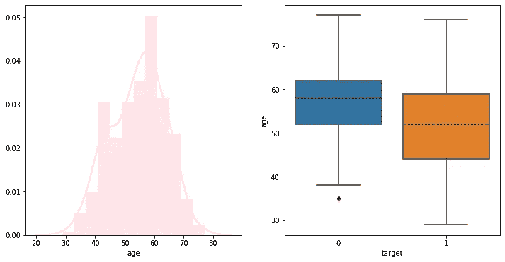
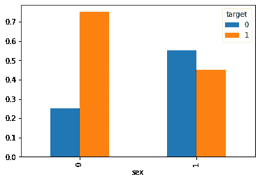
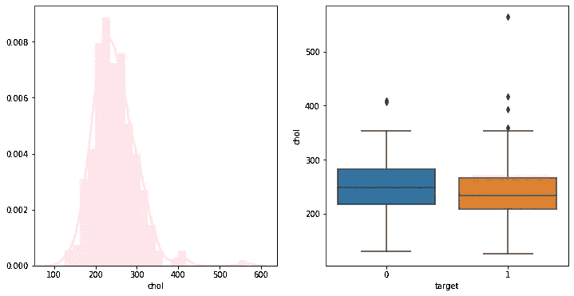
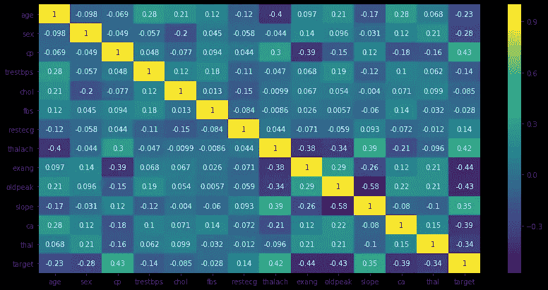
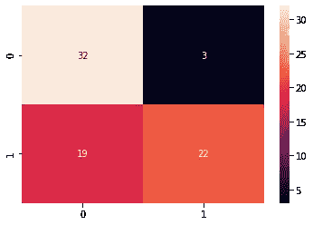
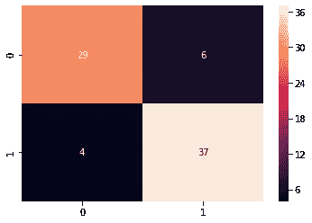

# 通过机器学习预测心脏病

> 原文：<https://medium.com/nerd-for-tech/predicting-heart-diseases-through-machine-learning-6f867a674078?source=collection_archive---------12----------------------->

分类问题是最常见的领域之一，机器学习算法在其中得到了很好的应用。回归问题和分类问题的最大区别在于，在分类问题中，目标变量是分类变量/二元变量。

在本文中，我们将查看由 UCI 机器学习知识库发布的心率疾病数据集，其中目标变量是心脏病。我们将讨论多种算法，还将了解增强如何改善模型结果。

该数据集具有多个分类和连续的独立变量，可用于预测患者的心脏病。在完成识别缺失值(如果有)的过程后，我们将继续进行 EDA 以识别数据中的任何模式。



左:年龄分布右:年龄与目标

从上图可以看出，年轻人比老年人更容易患心脏病，这很令人惊讶。让我们看看性别是否对心脏病有影响



男性:0 女性:1

从上图可以看出，男性比女性更容易患心脏病。我们还可以看到胆固醇是如何影响心脏病发病率的



胆固醇对心脏病的影响

从上面的图表可以看出，胆固醇本身并不会对心脏病产生巨大的影响。EDA 是数据科学的重要组成部分，它的重要性经常被低估。对于本文，我们将继续构建实际的模型。然而，在我们移动之前，我们也可以通过关联矩阵来更好地了解整体数据。



相关矩阵

# 特征工程

在建立模型之前，一定要确保独立变量的设计能够提高模型的性能。对于分类特征，我们需要将它们转换成虚拟变量，代码如下所示。

```
df=pd.get_dummies(df,columns=['cp','restecg','slope','ca','thal'],drop_first=**True**)
y=df.target
X=df.drop("target",axis=1)
```

此外，对于连续变量，重要的是将它们标准化以提高模型性能。在这种转换中需要注意的一件重要事情是在标准化之前分离训练集和测试集。对于训练集，我们将使用 scikit 库中的 StandardScaler，然后在测试集中对其进行转换，

```
**from** **sklearn.preprocessing** **import** StandardScaler
scaler=StandardScaler()
num_columns=['age','trestbps','chol','thalach','oldpeak']
X_train['age']=scaler.fit_transform(X_train['age'].values.reshape(-1,1))
X_train['trestbps']=scaler.fit_transform(X_train['trestbps'].values.reshape(-1,1))
X_train['chol']=scaler.fit_transform(X_train['chol'].values.reshape(-1,1))  
X_train['thalach']=scaler.fit_transform(X_train['thalach'].values.reshape(-1,1))   
X_train['oldpeak']=scaler.fit_transform(X_train['oldpeak'].values.reshape(-1,1))X_test['age']=scaler.transform(X_test['age'].values.reshape(-1,1))
X_test['trestbps']=scaler.transform(X_test['trestbps'].values.reshape(-1,1))
X_test['chol']=scaler.transform(X_test['chol'].values.reshape(-1,1))  
X_test['thalach']=scaler.transform(X_test['thalach'].values.reshape(-1,1))   
X_test['oldpeak']=scaler.transform(X_test['oldpeak'].values.reshape(-1,1))
```

转换完成后，我们可以进入下一步:使用机器学习算法

# 算法

我们将从逻辑回归算法开始，看看它在数据集上的表现。

```
**from** **sklearn.linear_model** **import** LogisticRegression
**from** **sklearn.model_selection** **import** cross_val_score
**from** **sklearn.metrics** **import** accuracy_score,confusion_matrix,classification_report
lr=LogisticRegression(C=1.0,penalty='l2')
lr.fit(X_train,y_train)
print("The cross validation score mean is ",cross_val_score(lr,X_train,y_train,cv=3).mean())
pred=lr.predict(X_test)
print(classification_report(y_test,pred))
sns.heatmap(confusion_matrix(y_test,pred),annot=**True**)
```

Ths 给我们的模型准确率为 56%，召回率为 90%。这是一个不错的结果，但让我们看看决策树如何在数据集上执行。

```
**from** **sklearn.tree** **import** DecisionTreeClassifier
dc=DecisionTreeClassifier()
dc.fit(X_train,y_train)
print("The cross validation score is ",cross_val_score(dc,X_train,y_train).mean())
pred=dc.predict(X_test)
print(classification_report(y_test,pred))
sns.heatmap(confusion_matrix(y_test,pred),annot=**True**
```

决策树的表现稍好，准确率为 57%。决策树只是略微提高了模型的性能，但使用随机森林分类器可能会提高准确性。

```
**from** **sklearn.ensemble** **import** RandomForestClassifier
rf=RandomForestClassifier()
rf.fit(X_train,y_train)
print("The cross validation score is ",cross_val_score(rf,X_train,y_train).mean())
pred=rf.predict(X_test)
print(classification_report(y_test,pred))
sns.heatmap(confusion_matrix(y_test,pred),annot=**True**)
```



混淆矩阵

随机森林分类器提高了模型性能，现在准确率为 71%。热图是数据集的混淆矩阵，显示有 19 个假阴性和 3 个假阳性。在心脏病病例中，假阴性的代价非常高。让我们看看 boosting 算法能否改善这一点。我们将使用一种非常流行的助推算法，称为 XG Boost，它实际上已经被用来赢得 Kaggle 比赛。算法的代码写在下面

# 助推

```
**import** **xgboost** **as** **xgb**
data_dmatrix = xgb.DMatrix(data=X,label=y)
xg_reg = xgb.XGBClassifier(objective ='reg:logistic', colsample_bytree = 0.3, learning_rate = 0.1,
                max_depth = 5, alpha = 10, n_estimators = 10
xg_reg.fit(X_train,y_train)
pred = xg_reg.predict(X_test)
sns.heatmap(confusion_matrix(y_test,pred),annot=**True**)
```



混淆矩阵

上图显示了混淆矩阵。可以看出，模型的性能有了显著的提高，假阴性减少了。XGBoost 模型的准确率超过 80%。

在这个例子中，我们看到了机器学习如何应用于数据集来预测心脏病。我们从探索性数据分析开始，然后转向特征工程，并构建了机器学习算法。最后，我们用 XGBoost 模型展示了 boosting 如何提高模型性能。