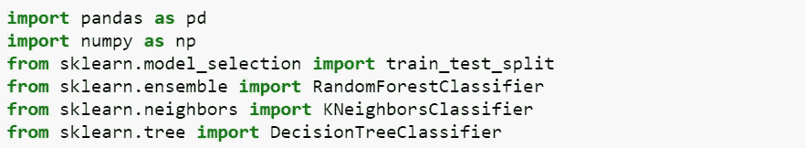
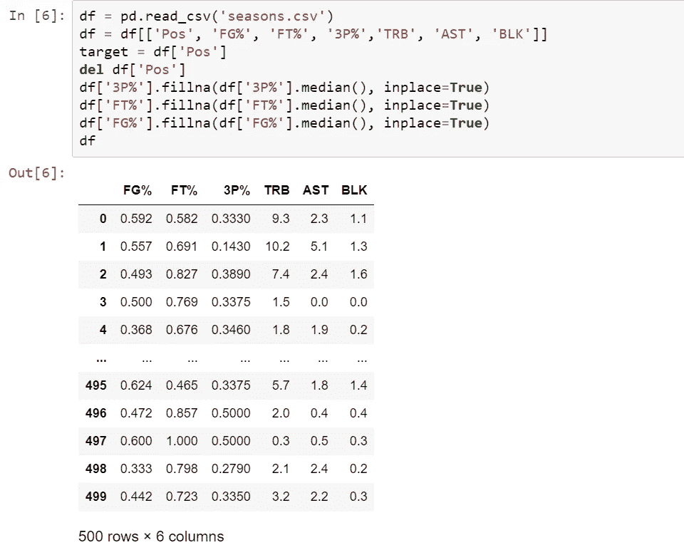
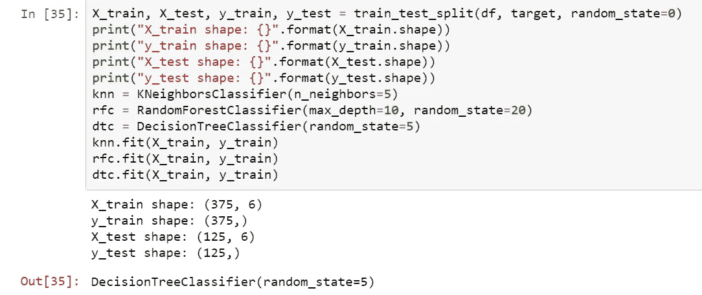
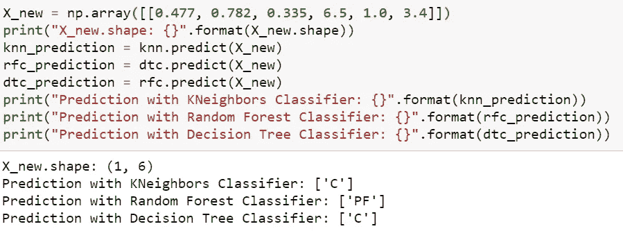
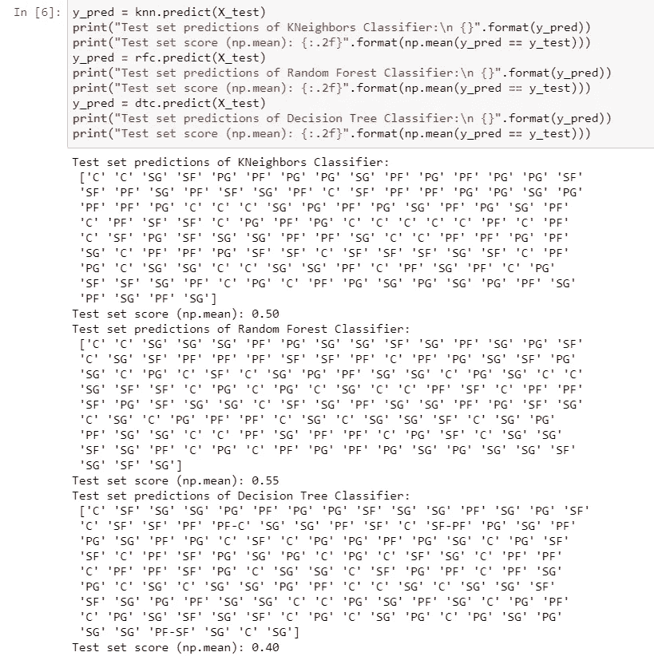

# 使用机器学习算法预测 NBA 位置

> 原文：<https://medium.com/nerd-for-tech/predicting-nba-positions-using-machine-learning-algorithms-30c662fc9472?source=collection_archive---------15----------------------->

篮球中的五个基本位置相当简单:控球后卫、得分后卫、小前锋、大前锋和中锋。在这篇文章中，我们将探索数据，并使用各种机器学习模型来预测 NBA 球员的位置。

所有代码都可以在 Github 上的以下链接中找到:

 [## claire M10/NBA-机器学习

### 使用机器学习算法预测 NBA 位置

github.com](https://github.com/clairem10/nba-machinelearning) 

# **目录**

1.  查找数据
2.  进口
3.  数据处理
4.  培养
5.  测试
6.  摘要

# 查找数据

我决定使用来自 Basketball-Reference.com[的 2019-2020 年 NBA 球员统计数据:每场比赛。你可以在“季节”标签下找到数据，然后在“每克”部分找到。然后，我将数据导出为. csv 文件。](https://www.basketball-reference.com/)

# 进口

首先，让我们导入以下内容:

*   pandas:一个开源库，专门用于 Python 的数据分析和操作。如果你不熟悉熊猫，请参考 https://pandas.pydata.org/[了解更多关于安装熊猫和熟悉它的信息。](https://pandas.pydata.org/)
*   NumPy:一个 Python 库，通常用于处理数组和矩阵。更多信息参见[https://numpy.org/](https://numpy.org/)
*   train_test_split:用于将数据集拆分成训练和测试数据
*   KNeighborsClassifier:使用 K-最近邻进行聚类的方法
*   RandomForestClassifier:使用各种决策树(因此是一个森林)的分类方法
*   决策树分类器:根据某个参数分割数据的分类方法

# 数据处理

首先，读取。csv 文件使用熊猫。对于这个模型，我决定使用 FG%、FT%、3P%、TRB、AST 和 BLK 的特征来预测位置，因为我认为它们可以最准确地表示五个位置之间的差异。

然而，在这个玩家列表中，对于不同的特性有几个 NaN 值。这可能是由于玩家没有尝试(3P%，FG%，FT%)。我决定用该特定列的中值替换 NaN 值，以避免严重影响模型的结果或不准确的预测。

现在，我们已经准备好拆分训练集和测试集中的数据，并训练我们的模型！

# 培养

我们导入的函数 train_test_split 用于将我们的数据分成两部分——训练数据和测试数据。训练数据(X_train，y_train)通常是数据行的 75%，在这种情况下是 375 行，而测试数据(X_test，y_test)是另外的 25%，在这种情况下是 125 行。

最后，我们能够用 KNeighbors 分类器、随机森林分类器和决策树分类器实际训练数据。我们称之为。拟合方法，以便用训练数据建立和训练我们的模型。

# 测试

让我们测试我们的模型！假设我们有一个 NBA 球员(2020-2021 年的印第安纳步行者队中锋迈尔斯·特纳)，他的数据如下:

*   女性百分比:47.7%
*   英尺百分比:78.2%
*   3P%: 33.5%
*   TRB: 6.5
*   AST: 1.0
*   BLK: 3.4

KNeighbors 分类器和决策树分类器正确地识别出迈尔斯·特纳是一个中锋，不幸的是，随机森林分类器预测他是一个大前锋。

我们还可以通过比较测试数据的预测和实际数据，使用 NumPy“mean”函数来衡量我们三个模型的准确性:

以下是测试集的精确度:

*   近邻:0.50%或 50%
*   随机森林:0.55%或 55%
*   决策树:0.40%还是 40%

# 摘要

总的来说，随机森林分类器是我们使用的三个模型中最准确的，对测试数据的预测准确率为 55%。