# 根据技术规格预测智能手机价格:随机森林和逻辑回归

> 原文：<https://medium.com/nerd-for-tech/predicting-price-of-smart-phones-by-technical-specs-random-forest-logistic-regression-48ddc0cdeb0c?source=collection_archive---------6----------------------->

理解数据、逻辑回归、随机森林、混淆矩阵和网格搜索 cv。

# 介绍

这个月，我学到了很多关于不同模型和超参数的知识。今天，我们将在一个数据框架上研究线性模型和分类模型之间的差异，以预测手机的价格范围。我们将看到正在构建的模型、它们的性能，以及如何通过对它们使用超参数来改进模型。今天你将看到的一切将主要在 python、NumPy 和 sklearn 上。

# 数据准备和信息

我正在使用一个在 Kaggle 上找到的数据集，根据手机的功能来预测手机的价格范围。我做的第一件事是加载数据框，检查 NaN 值，并检查数据框中价格范围之间的相关性。

这是数据字典，所以我们可以看到和理解每一列到底代表什么。

*   **battery_power** =电池一次可以存储的总能量，以 mAh 为单位。
*   **蓝色** =有无蓝牙。| 1:有，0:没有
*   **clock_speed** =微处理器执行指令的速度。
*   **dual_sim** =是否支持双卡| 1:支持，0:不支持
*   **fc** =前置摄像头百万像素。
*   **四 _g** =有无 4G。| 1:有，0:没有
*   **int_memory** =以千兆字节为单位的内部存储器。
*   **m_dep** =移动深度，单位为厘米。
*   **mobile_wt** =手机重量。
*   **n_cores** =处理器的内核数量。
*   **pc** =主摄像头百万像素。
*   **px_height** =像素分辨率高度。
*   **px_width** =像素分辨率宽度。
*   ram =以兆字节为单位的随机存取存储器。
*   **sc_h** =手机屏幕高度，单位为厘米。
*   **sc_w** =手机屏幕宽度，单位为厘米。
*   **talk_time** =单次电池充电持续的最长时间。
*   **三 _g** =有没有 3G。| 1:有，0:没有
*   **触摸屏** =有无触摸屏。| 1:有，0:没有
*   **wifi** =有无 wifi。| 1:有，0:没有
*   **price_range** =这是目标变量。| 3:非常高的成本，2:高成本，1:中等成本，0:低成本

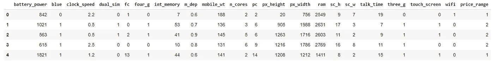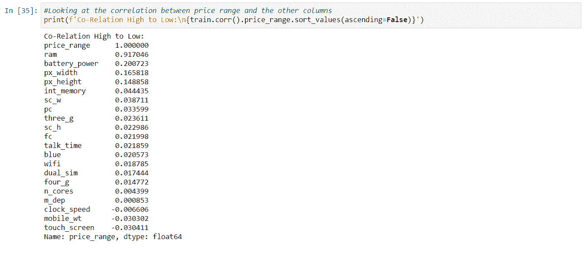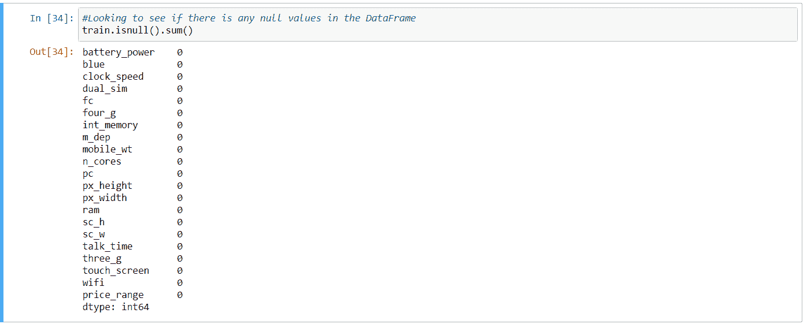

# 数据可视化

然后我做了一个箱线图，展示了价格区间和电池电量之间的比较。从下图中可以看出，价格区间和电池电量之间有一些比较。

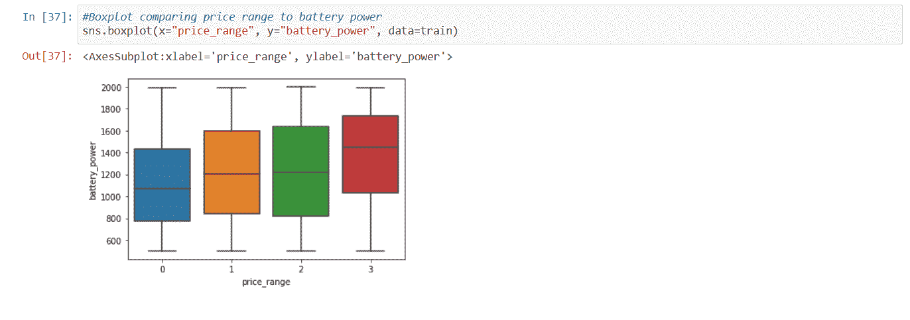

箱形图

由于我们看到 ram 和价格区间之间的巨大相关性，我们决定让自己成为一个联合地块。我们用我的 X 作为 ram，用我的 Y 作为电池电源。然后，我们把我的色调作为价格范围，看看这两者是否会对手机价格产生重大影响。从下图可以看出 ram 对价格范围的巨大影响。

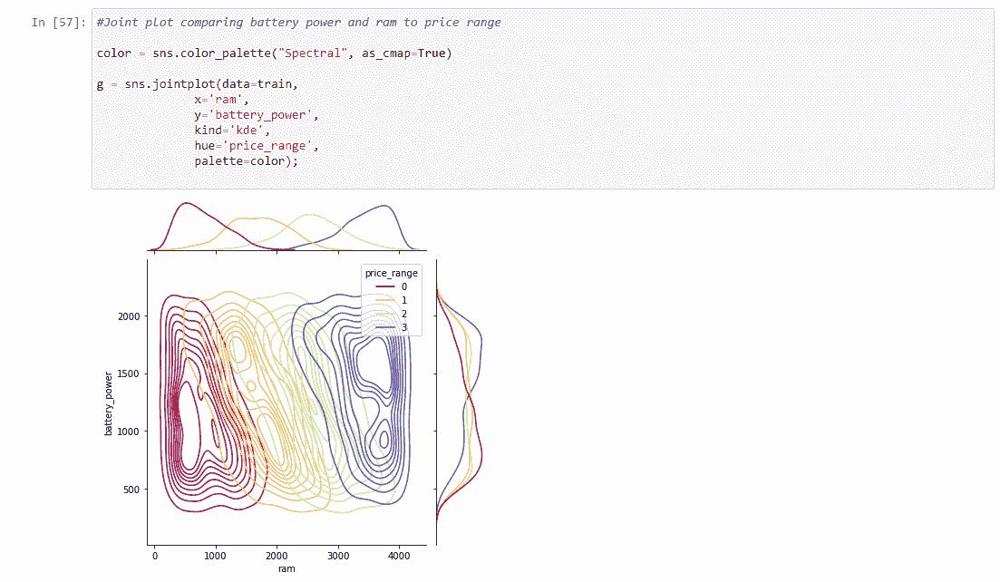

# 将数据分成测试集和验证集

在确保我的数据框看起来正确后，我开始分割数据。由于已经有一个测试 CSV 文件，我们决定将训练数据帧分成训练集和验证集。我用 30%进行验证，因为这是一个小的数据帧。最终，训练集有 1400 行，验证集有 600 行。

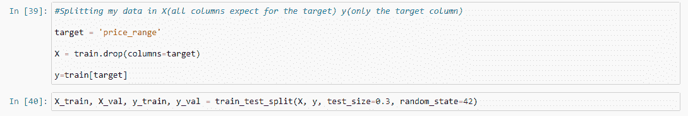

# 线性回归

对于第一个模型，我使用了一个标准的缩放器来缩放数据方差和逻辑回归。然后，我们将 X_train 和 Y_train 拟合到第一个模型。当您查看模型中训练和验证的准确度分数时，我们可以看到许多过度拟合。这可能是由于数据帧中的数据泄漏。我还查看了一份分类报告，并绘制了一个混淆矩阵。

由于我们已经从混淆矩阵中获得了低成本的所有必要指标，现在我们可以计算低成本的性能度量。例如，低成本类具有:

*   **0.96** 是低成本的**精度分数**。 **144/(144 + 7)** 是我们如何得到精度分数的
*   **0.97** 是低成本的**召回分数**。 **144/(144 + 4)** 就是我们如何得到召回分数的。
*   **0.48** 是低成本的**F1-分数**。 **(.96 * .97)/(.96 + .97)** 就是我们低成本得到 F1 分数的方法。

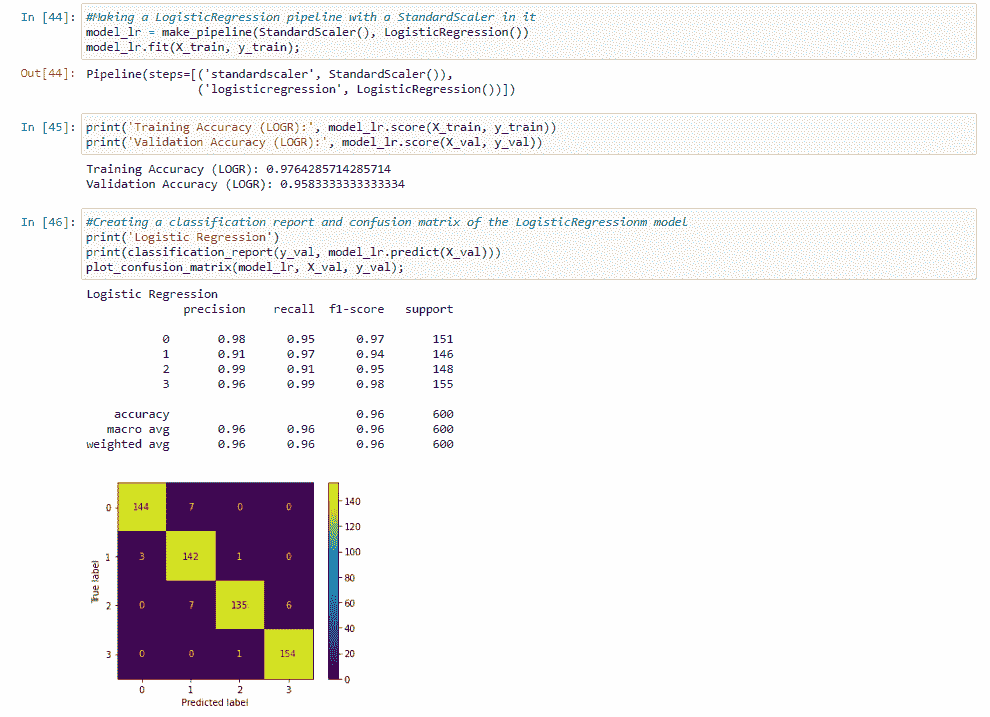

# 随机森林分类器

在第二个模型中，我使用了标准的缩放器和随机森林分类器。我们将随机状态设为 42，n 个作业设为-1。当我们查看精确度分数时，我们可以发现训练集的精确度分数为 1，精确度分数为 0.86。

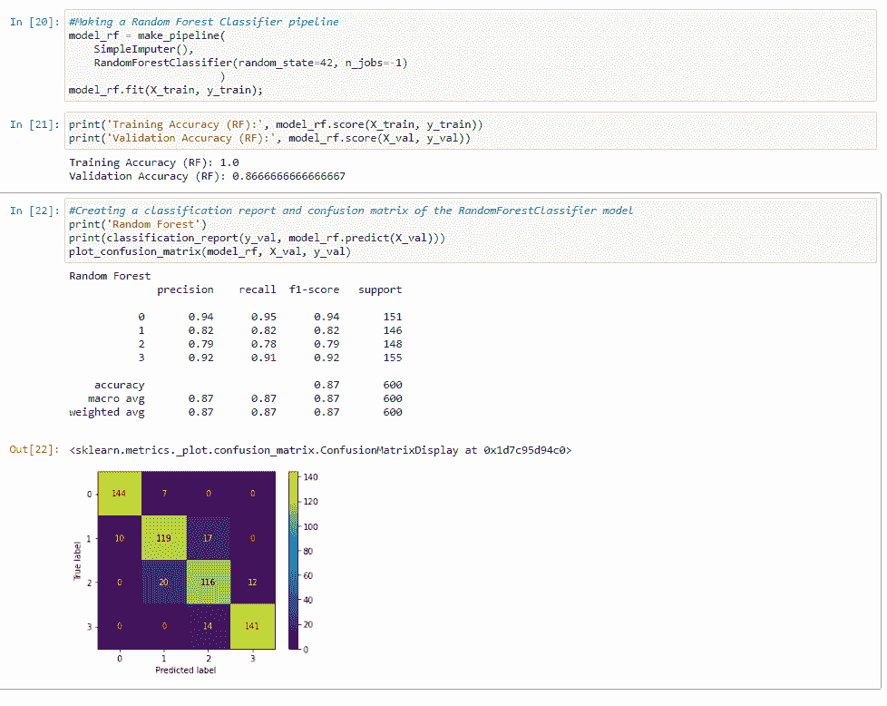

# 提高线性回归的性能

我们现在开始调整我们的逻辑回归模型，因为它有最好的结果。我将使用网格搜索简历，并将我们的模型放入 bagging 回归方程中。我们正在使用装袋回归器，希望有助于过度拟合。对于参数，我们选择简单一些。我们正在计算模型的最佳 n 估计量和最大特征，以帮助改进它。

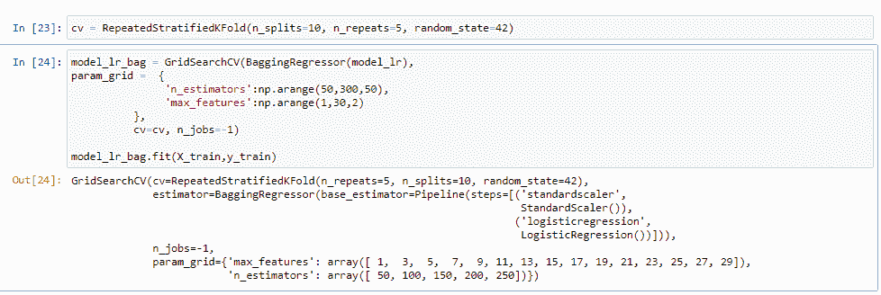

我们发现 19 是最大特征的最佳值，150 是 n 估计值的最佳值。

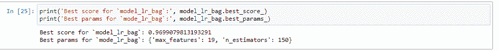

训练准确度的结果比分数低一点，但是我们确实将验证准确度提高了 0.16。

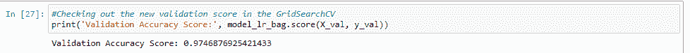

# 结论。

比较两个模型的准确性，我们可以看到逻辑回归今天更好。尽管取决于您使用的数据框，但每种模型都有利弊。