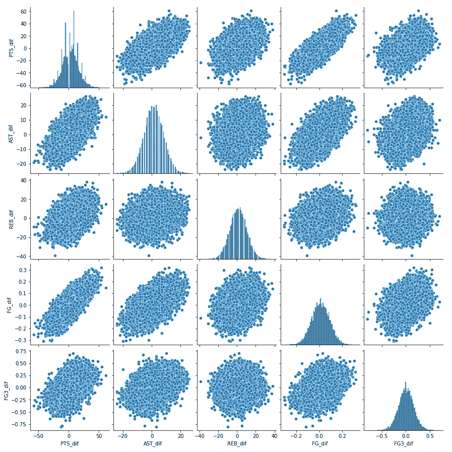
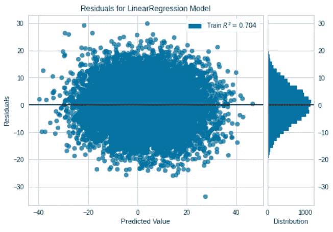
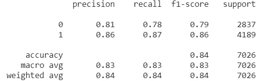
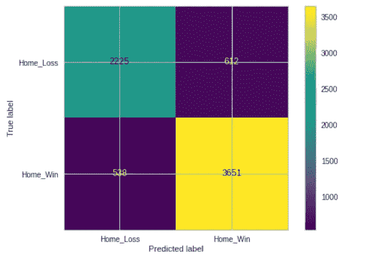
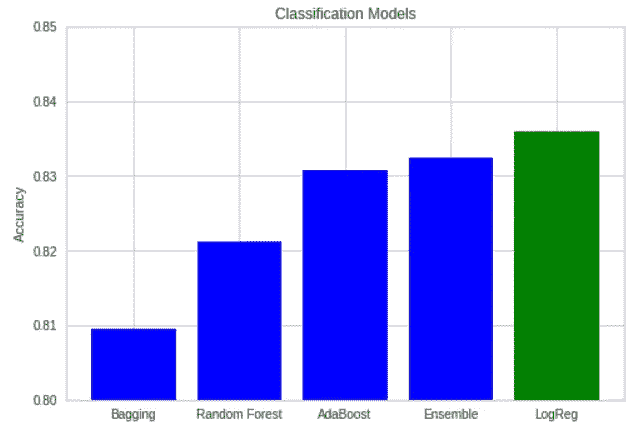
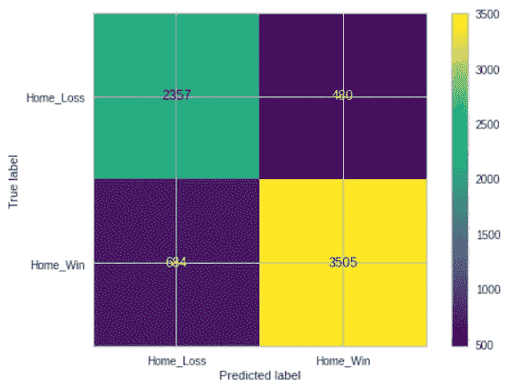
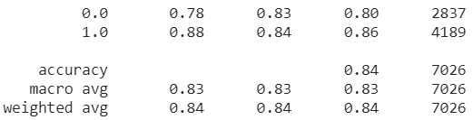
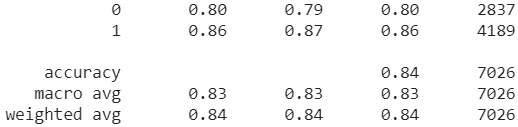

# 利用机器学习预测 NBA 比赛结果

> 原文：<https://medium.com/nerd-for-tech/predicting-the-outcome-of-nba-games-using-machine-learning-676a62549040?source=collection_archive---------7----------------------->

主题:本博客是“2004-2020 年 NBA 主场优势探索性数据分析”的延伸，可以在这里找到。在 EDA 中，发现助攻、三分球命中率和投篮命中率对为什么 NBA 主场球队在近 60%的时间里获胜具有最大的影响。使用这些结论作为进一步分析的基础，我们将尝试使用比赛统计数据通过各种模型来预测 NBA 比赛的结果。

数据集:我使用了与 EDA 相同的数据集，其中包含了 2004 年至 2020 年 NBA 比赛的统计数据。这些统计数据包括得分(PTS)、助攻(AST)、篮板(REB)、投篮命中率(FG)、三分球投篮命中率(FG3)，并按主客场球队分列。空数据和异常值被移除，留给我们超过 23，000 场比赛的数据。附加了主队和客场队之间的 PTS 差异(PTS_dif)、AST 差异(AST_dif)、REB 差异(REB_dif)、FG 差异(FG_dif)和 FG3 差异(FG3_dif)的附加列。链接到数据集可以在[这里](https://www.kaggle.com/nathanlauga/nba-games/notebooks)或者[这里](https://drive.google.com/file/d/1JKrgiC6-JVwVSodYbIDdB9Ah4jYp0W_D/view?usp=sharing)找到。有关数据处理的更多细节，请参考 [EDA](https://jyduan-8715.medium.com/exploratory-data-analysis-of-home-team-advantage-in-the-nba-2004-2020-58c9922a8744) 。代码链接可以在我的 [GitHub](https://github.com/jduannn/MachineLearningModel) 上找到。

**检查变量之间的关系**

在做任何建模之前，我首先检查了我的自变量和因变量之间的关系。所有的预测变量似乎至少与 PTS_dif 有适度的正相关。FG_dif 与 PTS_dif 的相关性最强，相关系数(r)为 0.769。另一个好的迹象是，除了 PTS_dif 稍微有点零星之外，每个变量都近似正态分布。另一点需要注意的是，AST_dif 和 FG_dif 之间似乎存在某种共线性。

**模型 1:多元回归**

基于我们拥有的变量和数据，我将首先使用多元回归创建一个模型，以预测给定 AST、REB、FG 和 FG3 差异的 NBA 比赛的 PTS_dif。因为我在 EDA 中的结论是，REB_dif 并没有对获胜产生巨大的影响，所以我将首先使用 AST_dif、FG_dif 和 FG3_dif 构建一个回归模型。数据分为 70%的训练和 30%的测试，以测量模型的准确性。该模型的 R 平方得分为 0.65，平均绝对误差(MAE)为 6.21(请注意，我们使用平均绝对误差而不是均方根误差作为准确性的衡量标准，因为它对较大的数据集更一致，对异常值更不敏感)。对于这个模型，预测变量的方差只能解释 PTS_dif 方差的 65%。平均而言，该模型的预测误差为 6.21 个百分点。添加 REB_dif 作为另一个独立变量会将 R 平方增加到 0.71，并将 MAE 降低到 5.65。似乎通过多元回归模型，REB_dif 实际上提高了预测 PTS_dif 的准确性。包括所有预测器的模型解释了 PTS_dif 的大约 71%的方差，同时平均错过了 5.65 个 PTS 的预测。这个模型的残差图看起来很好，没有异方差的迹象。此外，误差的分布似乎是近似正态的。

总的来说，多元回归模型在预测 NBA 比赛的得分差异方面做得相当一般。基于 R 平方，看起来我是不合适的，并且缺少一些其他变量来解释 PTS_dif 的变化。这可能是失误或犯规之类的统计数据。然而，由于 NBA 没有以一种容易理解的方式提供这些统计数据，所以很难尝试将它们纳入我的模型。

**模型 1B:多元回归续**

因为我不能添加更多的预测变量，我试图通过只考虑不接近的比赛(PTS_dif 大于 4)来改进模型。这样做可以将 R 平方提高到 0.75，但会将 MAE 提高到 5.83。这是有意义的，因为预测具有较大 PTS 差异的游戏也将导致较高的误差。当我使用这个模型预测接近的游戏的 PTS _ dif(PTS _ dif 在 4 以内)时，结果极差。R 平方为 0.09，MAE 为 2.35(MAE 较小，因为对于 4 分以内的游戏，PTS_dif 范围要小得多)。基于这些观察，似乎这个多元回归模型对于预测接近的 NBA 比赛中的 PTS 差异不是很好，并且在预测不接近的比赛中仅略微好一点。展望未来，预测一场比赛的结果(赢/输)可能比试图预测 PTS_dif 更合理。

**模型 2:预测结果的逻辑回归**

对于回归模型，我首先通过简单地猜测最频繁的结果(主场获胜)来建立 0.596 的基线准确度。使用数据集，我使用 HOME_TEAM_WINS 作为我的目标变量，它的值为 1 表示主场获胜，为 0 表示主场失败。由于所有四个预测因子似乎对多元回归都很重要，我将使用 AST_dif、REB_dif、FG_dif 和 FG3_dif 作为回归模型中的独立变量。就像模型 1 一样，数据被分为 70%的训练和 30%的测试，以测量模型的准确性。将逻辑回归模型应用到测试数据中，我得到了 0.836 的准确度分数，与基线准确度 0.596 相比，这是非常好的。分类报告上的回忆和 f1 分数显示，该模型在预测主场获胜方面比主场失败方面更加准确。这种趋势得到了混淆矩阵的支持，混淆矩阵的假阳性分类比例上多于假阴性。这意味着这个模型偏向于主场获胜，这是有道理的，因为我们的 EDA 透露，主队赢得了近 60%的比赛。

总的来说，尽管有偏差，逻辑回归模型在预测 NBA 比赛结果方面做得非常好。但是，在进一步探索这个模型之前，我想考虑一些其他的分类器，看看是否有另一个模型值得使用。

**模型 3:分类器**

在使用其他分类器来尝试和预测比赛结果之前，我对数据进行了标准化，以确保模型之间的一致性。然后，这个标准化数据被分成 70%的训练数据和 30%的测试数据。我使用的模型包括一个通用的 bagging 分类器，一个随机森林分类器，一个自适应 boosting 分类器，最后是一个投票集成分类器。模型的准确度得分如下所示。

使用相同的变量，测试的其他分类器没有一个超过逻辑回归的准确度。值得注意的是，AdaBoost 模型给予 REB_dif 比随机森林更大的权重，而随机森林给予 AST_dif 更大的重要性。两者都将 FG_dif 指定为最重要的特性，FG3_dif 次之。AdaBoost 比随机森林更准确，它给 FG_dif 和 AST_dif 分配较小的权重，给 FG3_dif 和 REB_dif 分配较大的权重。这一发现引起了人们的注意，因为它有可能改进逻辑回归模型。

**最终模型:逻辑回归续**

因为其他分类器都无法达到模型 2 的精度，所以我决定进一步探索逻辑回归模型的潜力(有时最简单的模型可以获得最好的结果)。以前用逻辑回归模型发现的一个问题是假阳性的比例很大。为了解决这个问题，并希望提高模型的准确性，我将对数据进行标准化和重新采样。最初的训练数据中，主场输球和主场赢球的比例约为 4:6。这是假阳性和模型固有偏差的主要原因。为了解决这个问题，我使用了随机过采样和欠采样(即随机去除主场胜利，随机复制主场失败)，直到我得到主场失败与主场胜利的比率为 9:10。这应该会减少模型的偏差和误报，同时仍然保留我在 EDA 中讨论过的固有的“主场优势”。与原始模型相比，混淆矩阵显示假阳性显著减少。然而，除了以 Home_Win 为代价提高了 Home_Loss 的回忆分数之外，模型的整体准确性没有显著变化。

我还尝试使用网格搜索进行超参数优化。我对 C、penalty、不同的求解器和 max 迭代使用了网格搜索，交叉验证了 3 次，总共测试了 2700 次拟合。令人惊讶的是,“最优”模型的性能并没有真正的区别。精确度与基础模型的 0.836 相同，正如分类报告所揭示的，两个模型之间几乎没有任何差异。主要的区别是在重新取样的数据模型中，房屋损失的回忆分数要高得多。

**基本型号**

**归一化&重采样模型**

**网格搜索 CV 模型**

**结论**

很难断定哪个逻辑回归模型是最好的，因为准确性始终非常一致。尽管尝试了不同的模型，对数据进行了归一化和重采样，并对参数进行了微调，但我无法真正提高模型的准确性(就预测 NBA 比赛的结果而言)。这向我表明，我的模型的主要限制是缺乏额外的预测变量。包括另一个变量，如失误差、犯规差或抢断差，可以显著提高分类模型的性能。同样，由于我的数据集的限制，这很难做到。在未来的模型中，我会尝试收集更多的变量，并进一步探索投票集成分类器作为另一种选择，因为它显示出很好的潜力。总的来说，这个模型在这个时间点上是怎样的，我不习惯用它来准确预测 NBA 比赛。在考虑使用这个模型之前，我想得到至少 90%的准确率。其他[型号](https://library.ndsu.edu/ir/bitstream/handle/10365/28084/Predicting%20Outcomes%20of%20NBA%20Basketball%20Games.pdf)已经能够达到 88–94%之间的准确率，所以这是基准。

**重要提示**

这个模型不要与其他模型混淆，其他模型试图在不知道实际游戏统计数据的情况下预测游戏的结果。这些模型依赖于每个队的统计比率来预测比赛的结果，而不知道比赛本身的任何统计数据。我的模型更像是一种分类，我们只是试图根据给定的最终统计数据进行分类和输赢。这就是为什么我们的目标是更高的准确率。