# 使用逻辑回归和随机福里斯特预测新冠肺炎疫情期间个人在医学上或精神上是否脆弱

> 原文：<https://medium.com/nerd-for-tech/predicting-whether-an-individual-is-medically-or-mentally-vulnerable-during-the-covid-19-pandemic-c395e3161bd7?source=collection_archive---------21----------------------->

马丁·桑切斯在 [Unsplash](https://unsplash.com?utm_source=medium&utm_medium=referral) 上的照片

**摘要**

由就地安置避难所政策、失业、保险损失和对感染新冠肺炎病毒的恐惧引发的隔离有可能引发或加剧美国人口中的医疗和精神健康挑战。

这项研究利用*人口普查局家庭脉搏调查(HPS)数据*来探索建立一个模型的能力，该模型根据个人特征(如种族、性别、医疗保险、自我报告的焦虑或抑郁情绪等)来预测一个人是否是医学或精神上易受伤害的人。

调查结果表明**可以使用美国 HPS 数据建立一个模型，使用逻辑回归预测个人的易受攻击分类(1 类),准确率为 82%,召回率为 90%。**

就本研究而言，弱势群体的定义是**既需要医疗护理又需要心理健康护理，但两者都没有得到的人。**

**简介**

HPS 由美国人口普查局与其他五个联邦机构合作开发。这是每周一次的横断面调查。HPS 的目的是收集数据，并评估新冠肺炎对美国家庭就业状况、住房状况、心理健康状况和其他福祉方面的影响。

利用 HPS 的数据，我们试图调查以下研究问题:

> *我们能否使用新冠肺炎疫情期间收集的 HPS 数据建立一个预测模型，预测一个人在精神/医疗健康方面是否脆弱？*

如果一个人自我报告符合以下标准，我们将他定义为易受攻击:

1.  在过去的 4 周里，他们需要冠状病毒以外的其他疾病的医疗护理，但由于疫情而没有得到。
2.  在过去的 4 周内，他们需要心理健康专家的咨询或治疗，但没有得到任何理由。

我们认为这项研究对于了解可能导致与精神和医疗健康相关的挑战的个人属性非常重要，但没有获得应对这些挑战所需的支持。在一个情绪疲惫的时期，如新冠肺炎疫情使这项研究特别尖锐。预测某人是否可能没有得到他们需要的帮助的能力有可能使医疗和心理健康提供者能够主动解决这种情况。

**数据描述**

出于本次调查的目的，我们分析了以下数据集:

1.  焦虑和抑郁的 NCHS COVID 指标
2.  NCHS COVID 健康保险范围
3.  NCHS COVID 精神健康护理

这些数据集是来自原始 HPS 数据(图 1)的变量的聚合，不包括样本大小，并且所有数据都是分类数据。

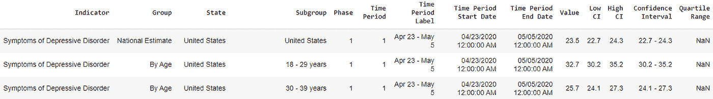

(图 1)焦虑和抑郁的 NCHS COVID 指标，以及其他两个 NCHS 数据集，缺乏粒度数据和样本量。“值”是指符合“指标”一栏中的标准且属于“子组”一栏中的识别组的个体比例。

我们研究了缺失的数据，并得出结论，将其从我们的模型中删除是合适的，因为:

1.  我们观察到，在我们的 EDA 过程中，缺失数据没有内在趋势。缺失数据最明显的特点是白人群体的受访者人数很多。然而，这可能是由于该种族群体在数据集中的比例较高。(图 2、图 3 和图 4 显示了缺失数据的趋势缺失。)
2.  缺失数据的比例占整个数据集的 22%，我们确定丢弃缺失数据是合适的。

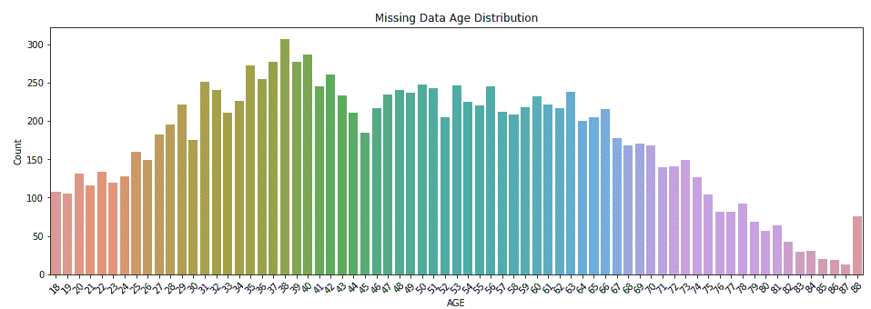

图二。缺失数据行的年龄分布。

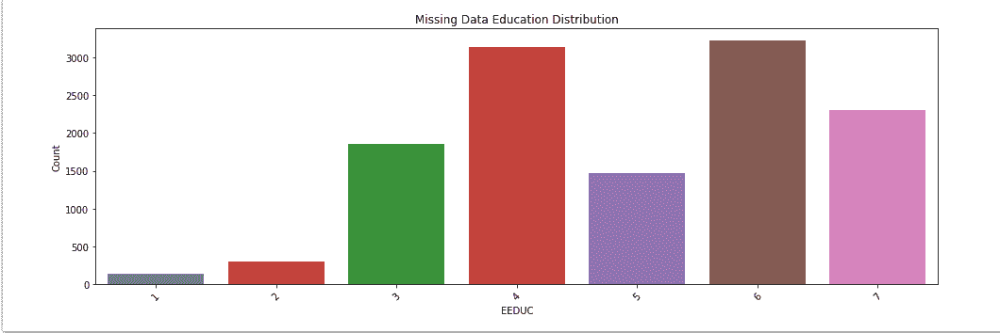

图 3。缺失数据行的教育分布。#1)不到高中#2)一些高中#3)高中毕业或同等学历#4)一些大学#5)副学士学位#6)学士学位#7)研究生学位

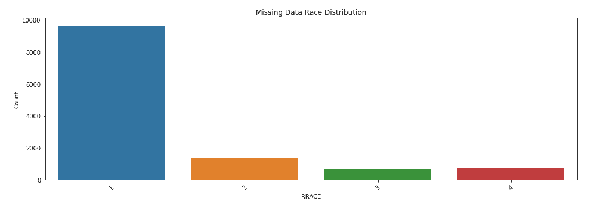

图 4。缺失数据行的竞争分布。# 1)白人，孤独# 2)黑人，孤独# 3)亚洲人，孤独# 4)任何其他种族

**方法描述**

我们对三个 NCHS 数据集进行了 EDA，包括:

1.  探索变量、列和行以理解数据
2.  可视化以下趋势:

> 按年龄组、教育组和种族/西班牙裔族群划分的抑郁和焦虑症状个体比例的每周变化趋势(图 7)。

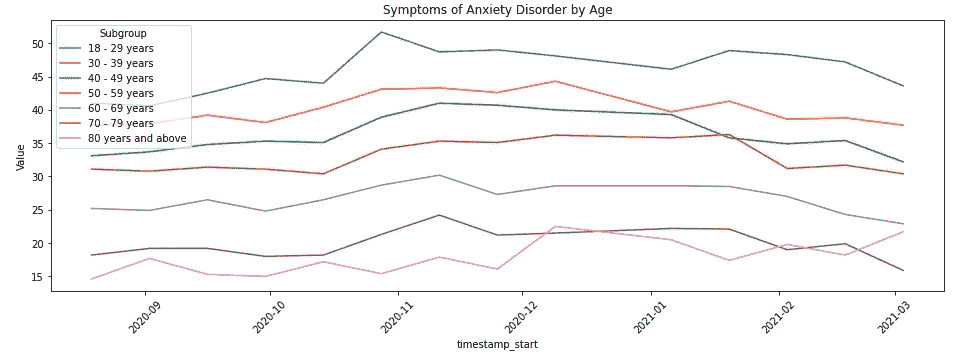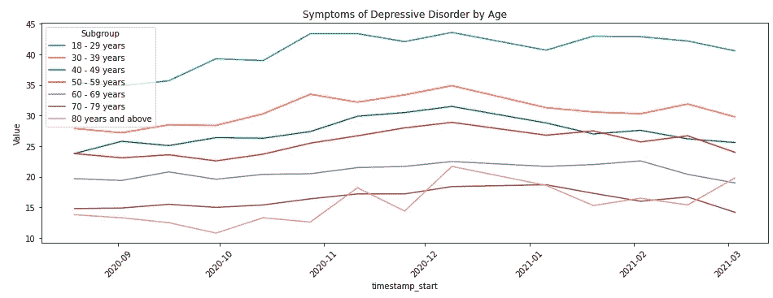

图 7。按年龄组、教育组和种族/西班牙裔族群划分的焦虑症和抑郁症症状。

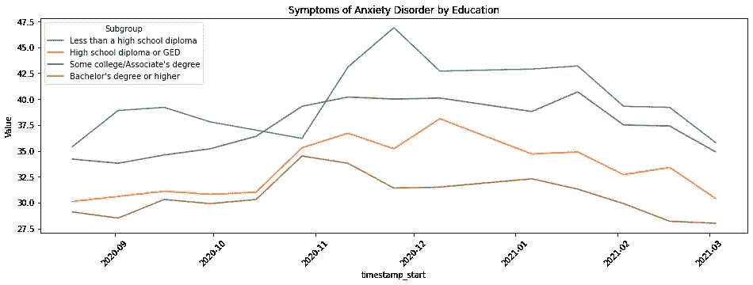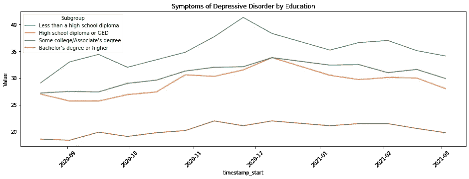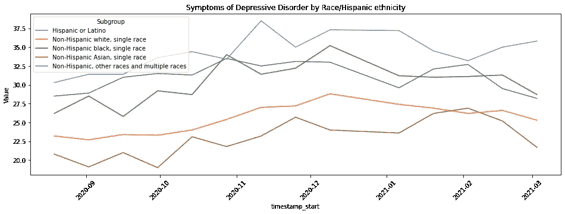

> 按年龄组(图 8)和焦虑/抑郁症状(图 9)划分的需要咨询或治疗但未获得咨询或治疗的个体比例每周变化趋势。

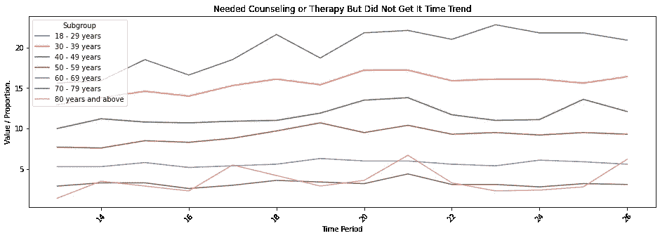

图 8:需要咨询或治疗，但没有得到，按年龄分。

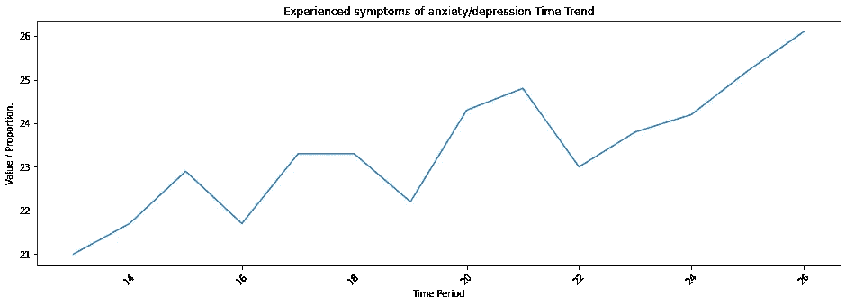

图 9。随着时间的推移，NCHS COVID 在过去 4 周内有焦虑/抑郁症状的需要咨询或治疗但未获得咨询或治疗的个人比例数据。

> 按教育群体和种族/西班牙族裔群体划分的需要医疗保健但未获得医疗保健的个人比例每周变化趋势(图 10)。

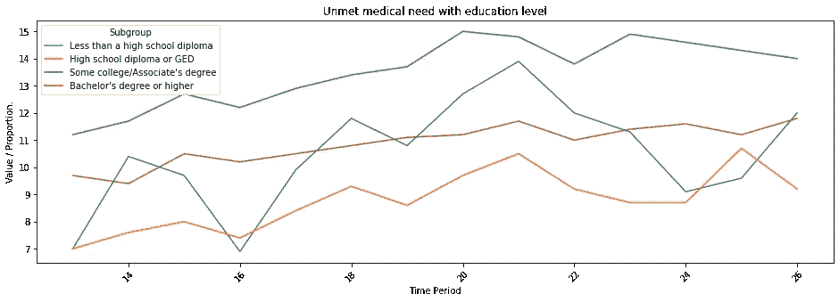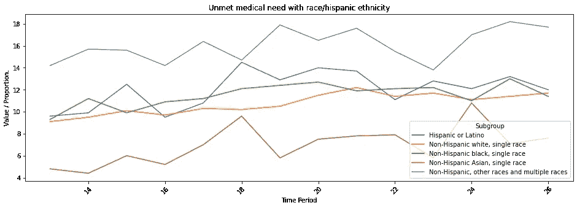

图 10。未满足的医疗需求与教育水平和种族/西班牙裔种族有关。

> 按年龄组划分的没有健康保险的个人比例每周变化趋势(图 11)。

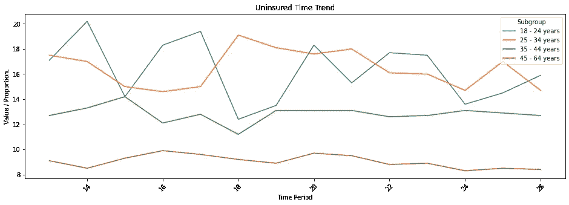

图 11。按年龄划分的没有健康保险的个人。

> 然后，我们从每周 HPS 数据中分析了 2020 年 11 月 25 日至 12 月 7 日的数据(图 12)。

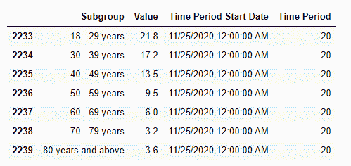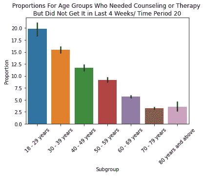

图 12。需要咨询或治疗但没有得到咨询或治疗年龄组比例，在第 20 个时间段进行调查

我们特别确定了这一周，因为我们能够从 NCHS 探索性数据分析中观察到有趣的趋势，这表明在突然下降之前，这是一个焦虑和抑郁加剧的时期(图 9)。

我们没有在分析中包括更多的周，因为考虑到在整个调查期间偶尔发生的动荡的外部因素，如政治不稳定、警察枪击和抗议等因素，每增加一周就会增加混淆变量的风险。

## 特征工程

1.  计算调查对象的年龄。

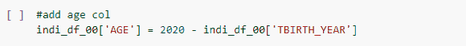

年龄是通过使用自我报告的出生年份和本次调查进行的年份计算的，如图所示。

2.创建一个新的要素，用于捕获个人既未获得医疗保健，也未获得精神卫生保健，但需要两者的时间(1 =真，0 =假)。我们称这个新特性为未满足需求组。

3.我们的预测变量包括:

1.  “年龄”
2.  EEDUC(教育程度)
3.  RRACE
4.  “西班牙语”(西班牙血统)
5.  “焦虑”(过去 7 天的焦虑频率)
6.  “担忧”(过去 7 天的担忧频率)
7.  “兴趣”(过去 7 天对事物不感兴趣的频率)
8.  “情绪低落”(过去 7 天内感到抑郁的频率)
9.  “延误”(由于疫情事件，延误了过去 4 周的医疗服务)
10.  收入(税前家庭总收入。)
11.  WRKLOSS(该家庭自 2020 年 3 月 13 日以来经历了就业收入的损失)
12.  支出损失(由于冠状病毒疫情，家庭将在未来 4 周内失去就业收入)
13.  我们的响应变量是我们创建的未满足需求组。

我们将 70%的数据集用于训练，30%用于测试。我们发现只有 6%的数据符合*未满足需求组(得分 1)* ，因此需要解决我们不平衡的数据。

我们通过对多数群体*(未满足需求组== 0)* 进行上采样来实现这一点，这允许我们通过对少数群体*(未满足需求组==1)* 进行重采样来以系统的方式平衡数据。最终的数据帧如下所示(图 13)

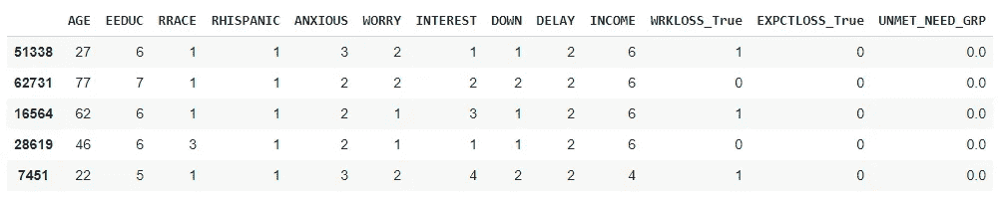

图 13:数据帧的前 10 行

## 建模

有了平衡的数据，我们然后实施逻辑回归，使用 *GridSearchCV* 微调超参数，最佳 C 为 0.1，liblinear 解算器，L1 正则化，和交叉熵损失函数。交叉验证也被用于防止过度拟合。

我们的最终模型给出了预测 1 类评估的精度分数为 0.24，召回分数为 0.90，准确度为 0.82(图 14)。

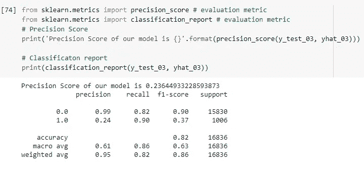

图 14。Logistic 回归模型的精度评分和分类报告。

> 我们希望最大化回忆，因为在这种情况下，错误地将个人识别为需求未得到满足的风险比错误地不识别需求未得到满足的人要小。

最后，我们想要比较逻辑回归模型和随机森林模型的有效性，因为随机森林对于不平衡数据应该更有效。因此，我们使用训练数据再次训练原始模型，并使用随机森林预测响应变量。(图 15。)

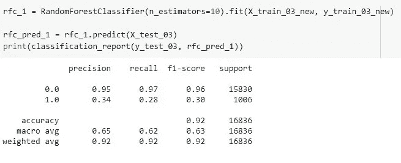

图 15。随机福里斯特模型的精度评分和分类报告。

这评估了 0.34 的精确度和 0.28 的召回，随机森林确实导致 0.92 的更高精确度。然而，在这种特定的情况下，这并不理想，因为我们希望最大化召回分数。因此，我们认为逻辑回归是本次评估更有效的建模方法。

**结果汇总**

我们发现**以下人群有更高的焦虑和抑郁症状**:

1.  18-29 岁的人
2.  高中文凭以下的人
3.  被确定为非西班牙裔、其他种族和多个种族的人。

我们还发现:

1.  在整个疫情，18-29 岁的人表示需要咨询或治疗的比例较高，而且没有医疗保险的比例也较高。
2.  在整个疫情，非西班牙裔、其他种族和多种族的人的医疗需求未得到满足的比率最高。

## 我们遇到的一个有趣的发现是:

> 拥有一些大学/专科学位的人是医疗需求未得到满足程度最高的人。

这似乎与直觉相反，因为我们假设教育水平较低，如高中文凭或高中文凭或 GED 以下的人会有较高的比率，因为假设的可能性是工作不太稳定。

> 最后，我们发现我们能够使用美国 HPS 数据建立一个模型来预测个体的易受攻击分类(1 级。使用逻辑回归(将易受伤害的人定义为既需要医疗护理又需要精神健康护理，但没有得到其中任何一种的个体)具有 82%的准确度和 90%的召回率。

**讨论**

这项工作对旨在帮助那些没有得到他们所需要的帮助的卫生保健专业人员有意义。

基于我们的预测模型，我们认为医疗机构和政府可以通过更多地关注这些人而受益，因此:

1.  机构不需要通过大量的数据点来找出哪一组人需要医疗帮助。
2.  通过合理的准确性和回忆分数(大约 90%)，表现出某些特征(种族背景、教育水平、收入等级、年龄组、焦虑水平)的人将被归类为弱势个体。

进一步的研究可能涉及调查可能有助于确定影响弱势人群的政策的其他特征，如调查住房如何影响个人在健康方面的脆弱性水平，或进一步扩大我们对脆弱性的操作定义。

[肯德尔](https://unsplash.com/@hikendal?utm_source=medium&utm_medium=referral)在 [Unsplash](https://unsplash.com?utm_source=medium&utm_medium=referral) 上的照片

## 限制

这项研究在收集过程中受到限制，因为它偏向于能够访问互联网的个人，此外，偏向于能够访问台式机或笔记本电脑的个人，因为个人不太可能通过他们的手机设备填写冗长的问卷，即使他们被邀请这样做。

它也是有限的，因为没有评估受访者的现有条件，如他们是否经历过焦虑，抑郁，有未满足的医疗或精神健康需求，或缺乏健康保险之前，疫情。这使得评估任何与新冠肺炎疫情本身的联系具有挑战性。

**作者:**杰姬·胡，阿曼达·科查克

**参考文献**

雷切尔·唐纳利，马特奥·p·法里纳，*在新冠肺炎疫情期间，国家政策如何塑造家庭收入冲击和心理健康的体验？*、社会科学&医学、

第 269 卷，2021，113557，ISSN 0277–9536

[https://doi.org/10.1016/j.socscimed.2020.113557](https://doi.org/10.1016/j.socscimed.2020.113557)

([https://www . science direct . com/science/article/pii/s 0277953620307760](https://www.sciencedirect.com/science/article/pii/S0277953620307760))

美国人口普查局家庭脉搏调查公共使用文件(PUF)

[https://www . census . gov/programs-surveys/household-pulse-survey/datasets . html](https://www.census.gov/programs-surveys/household-pulse-survey/datasets.html#phase2)

焦虑或抑郁的指标，基于过去 7 天报告的症状频率，国家健康统计中心

[https://data . CDC . gov/NCHS/Indicators-of-Anxiety-or-Depression-Based-on-Repor/8pt 5-q6wp](https://data.cdc.gov/NCHS/Indicators-of-Anxiety-or-Depression-Based-on-Repor/8pt5-q6wp)

过去 4 周的精神健康护理，国家健康统计中心

[https://data . CDC . gov/NCHS/最近 4 周的精神健康护理/yni7-er2q](https://data.cdc.gov/NCHS/Mental-Health-Care-in-the-Last-4-Weeks/yni7-er2q)

采访时的健康保险覆盖指标，国家健康统计中心

[https://data . CDC . gov/NCHS/Indicators-of-Health-Insurance-Coverage-at-the-Tim/jb9g-gnvr](https://data.cdc.gov/NCHS/Indicators-of-Health-Insurance-Coverage-at-the-Tim/jb9g-gnvr)