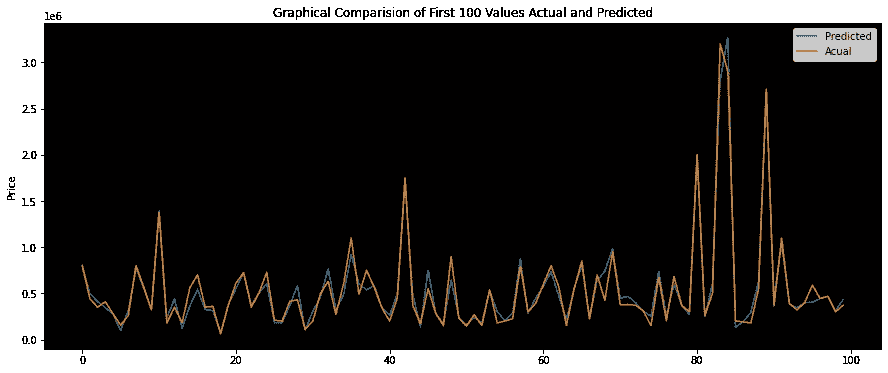

# 汽车转售价格的预测

> 原文：<https://medium.com/nerd-for-tech/prediction-of-resale-price-of-automobile-f30a3c339715?source=collection_archive---------2----------------------->

本文将建立一个有监督的机器学习模型来预测二手车的转售价格。这里使用的数据可以在 Kaggle 网站上公开获得。该数据集具有适当定义的要素和标注。为了设置环境，我们将使用 Jupyter notebook 和 python 来完成这个机器学习项目。下一步是安装/导入基本库/包——这些是 pandas、numpy、matplotlib，用于操纵数据帧、进行数学运算和绘制图形。要执行的代码。这将通过执行下面给出的代码来实现

> **import pandas as PD
> import numpy as NP
> import matplotlib . py plot as PLT
> % matplotlib inline**

下一步是加载数据集并使用该数据集创建数据框。加载数据集的方法不止一种。为了简单起见，我们将从 URL-[***https://www.kaggle.com/尼哈尔比拉/vehicle-dataset-from-cardekho 下载数据集。在本地机器中选择= Car+details+v3 . CSV***](https://www.kaggle.com/nehalbirla/vehicle-dataset-from-cardekho?select=Car+details+v3.csv)并通过创建数据框将其导入我们的 Jupyter 笔记本。请为此执行以下代码(将路径替换为数据集存储在本地计算机中的路径):-

> **car_data = pd.read_csv('下载数据集的本地驱动器路径\ \ Car details v3 . CSV ')
> Car _ data . head(2)
> #确保数据集正确导入。**

接下来，我们将分析数据集，并使用由此获得的洞察力来解决问题。这将通过可视化表中的数据集(***car _ data . head()***)来实现，也可以通过确定关于数据集的信息(***car _ data . info()***和***car _ data . shape***)来实现，这些信息将给出列索引名称作为列的属性以及数据集中存在多少空值。查看数据集，我们可以有把握地得出结论，要解决的问题是回归，其中'*'是标签(要预测的)，数据框的平衡列是特征。*

> ***汽车 _ 数据.头()
> 汽车 _ 数据.形状
> 汽车 _ 数据.信息()***

*在对数据帧进行适当的分析后，我们删除了“扭矩”列、“隐蔽” ***【里程】*** 【数据类型浮动和替换】 ***变速器*** 【自动】****手动*** 的列值 1 和 0。这将通过执行以下代码来实现**

> ****car _ data = car _ data . drop(' torque '，axis=1)
> car_data['变速器'] = car_data['变速器']。replace(['自动'，'手动']，[1，0])
> car_data['里程'] = car_data['里程'].str.replace(' kmpl| km/kg '，' ')。astype('float64')****

**接下来，我们将对' ***引擎*** '、 ***最大功率*** '和“年份”以及“名称”列进行特征工程，以便***one _ hot _ encoding***可以完美地应用于这些。我们将为“ ***发动机*** ”创建五个箱，为“ ***最大功率*** ”创建四个箱。在' ***年*** '的情况下，我们需要删除 2004 年以下的所有值，以保持数据的真实性(超过合理寿命的汽车价值可能可以忽略不计)，然后创建九个箱。在' ***name*** '列的具体情况下，我们将首先通过保留第一个字，并用' ***others*** '替换频率较低的值来清理数据值。现在，这些列已经准备好使用 pd.dummies 应用 one _ hot _ endoders 了**

> ****car_data['引擎'] = car_data['引擎'].str.replace(' CC '，' ')
> car_data['引擎'] = pd.to_numeric(car_data['引擎']，errors= '强制')
> 引擎标签= ['低'，'中'，'高'，'非常高']
> 引擎箱= [0，800，1200，2000，4000]
> car_data['引擎'] = car_data labels = max _ power _ labels)
> car _ data = car _ data[car _ data[' year ']>2004]#删除小于 2004 年的所有数据
> year _ labels =[' 2005–2010 '，' 2011 '，' 2012 '，' 2013 '，' 2014 '，' 2015 '，' 2016 '，' 2017 '，' 2018']
> year_bins = [2005，2010 astype(str).str.split(' ')。str[0]
> 汽车数据['名称']=汽车数据['名称']。更换(['Force '，' Land '，' Isuzu '，' Kia '，' Ambassador '，
> ，' Daewoo '，' MG '，' Ashok '，' Opel '，' Peugeot']，' Others')
> # Bal 在一次热编码期间处理****

**接下来，在我们将 ***pd.get_dummies*** 应用于 one_hot_encoding 的数据帧之前，我们现在需要将数据帧中的“ ***”空值*** ”也称为“ ***na*** ”值。一旦这一步完成，我们将把***PD . get _ dummies***应用到 ***car_data*** 数据帧。我们将通过执行以下代码来实现这一点**

> ****car_data = car_data.replace('？'，NP . nan)
> car _ data = car _ data . dropna()
> car _ data _ encoded = PD . get _ dummies(car _ data)****

**我们现在将 car_data 数据框分为标注和要素(这在之前的文章中已经讨论过)。此后，我们将从***sk learn . model _ selection***中导入***train _ test _ split***函数，并使用它将数据集拆分为测试和训练数据集( ***train_X(特征)、test_X(标签)、train_y(特征)、test_y(标签)*** ):-**

> ****#拆分标签和功能
> X = car _ data _ encoded . drop(' selling _ price '，axis = 1)
> y = car _ data _ encoded[' selling _ price ']
> #拆分测试和训练数据集
> 从 sklearn.model_selection 导入 train_test_split
> train_X，test_X，train_y，test_y= train_test_split(X，y，test_size= 0.2，random_state=4)****

**现在数据集准备好应用于从***sk learn . linear _ model***包导入的***linear regression***模型。为了简单起见，我们不再深入讨论线性回归函数的参数。线性回归模型用于拟合训练数据( ***train_X*** 和 ***train_y*** )。该模型将从训练数据集中学习。这将通过执行下面提到的代码来实现**

> ****#执行支持向量回归
> 从 sklearn.linear_model 导入线性回归
> lr = linear Regression()
> lr _ scaler = linear Regression()
> lr . fit(train _ X，train_y)****

**为了检查模型如何最好地适合训练和测试数据集，我们可以使用 ***r2 得分*** 。 ***r2 得分*** 是决定系数，是从自变量(*)中可预测的因变量( ***标号*** )的变化比例。 ***r2_score*** 越接近 1.0，模型就越适合数据集。在当前情况下，可以执行下述代码来检查 ***r2_score******

> ****# lr 模型如何最佳拟合训练和测试数据集
> R2 _ 分数 _ 训练=lr.score(train_X，train _ y)
> R2 _ 分数 _ 测试= lr.score(test_X，test_y)
> 打印(f 'R2 _ 分数 _ 训练:{ R2 _ 分数 _ 训练}，R2 _ 分数 _ 测试:{ R2 _ 分数 _ 测试} ')
> # R2 _ 分数 _ 训练:0.7719270591986664，R2****

**接下来，我们将把测试数据(test_X)传递给训练好的模型，以获得预测值(lr_predict_y)。为了检验我们模型的有效性，我们将计算 RMSE。该模型的 RMSE 是 267222，这看起来很大，但是在检查最低和最高实际售价时，可以有把握地得出结论，RMSE 可能不是检查该模型有效性的最佳指标。但是，我们将尝试通过缩放数据集来最小化 RMSE，同时继续应用集合模型(随机森林回归)。所有这些步骤都是通过执行下面提到的代码来实现的**

> ****从 sklearn.metrics 导入均方误差
> 导入数学
> lr _ predict _ y = lr . predict(test _ X)
> MSE =均方误差(test_y，lr _ predict _ y)
> RMSE = math . sqrt(MSE)
> print(f ' RMSE:{ RMSE } ')
> min(test _ y)# 45000
> max(test _ y)# 6000000【t****

**在当前情况下，通过采用特征工程技术或通过应用不同的模型同时降低 RMSE 来提高测试数据集的 R2 分数使其更接近一似乎是最佳选择。我们将根据通过数据集槽标准缩放器 as 也改变 ML 模型为随机森林回归器以实现*测试数据集的【R2 _ 分数】更接近于*0.92***RMSE***到 ***167868*** 。这些活动可以通过执行下面提到的代码来完成****

> **f **从 sklearn.ensemble 导入 StandardScaler
> 从 sk learn . ensemble 导入 RandomForestRegressor
> scaler = standard scaler()
> train _ X1 = scaler . fit _ transform(train _ X)
> test _ X1 = scaler . transform(test _ X)
> RF = RandomForestRegressor(max _ depth = 190，random _ state = 4)
> RF . fit(train _ X1，train _ y)
> R2 _ Score _ train = RF . Score(train _ Score****

**检查模型有效性的最佳方法之一是以图形方式显示预测值，并将其与测试数据集的实际值进行比较，该测试数据集是模型在训练和拟合时未见过的。通过执行下面提到的代码，我们将使用这些预测值和实际值的基本比较来生成一个图表。此外，我们还将创建一个测试数据集的 CSV 文件，该文件将添加一个列，其中包含“***Predicted _ Selling _ Price***”——该文件可用于比较整个测试数据集的实际值和预测值。所有这些都将通过执行下面提到的代码来实现**

> ****#前 100 个值测试和预测的图形比较
> 导入 matplotlib.pyplot 作为 plt
> plt.figure(figsize = (15，6))
> plt.axes()。set _ face color(' black ')
> PLT . plot(predict _ y _ RF[:100]，label = ' Predicted ')
> PLT . plot(test _ y . Values[:100]，label ='Actual')
> plt.title('实际和预测的前 100 个值的图形比较')
> PLT . ylabel(' Price ')
> PLT . legend()
> PLT . show()；****

****

> *****test _ x . index
> submission = car _ data . loc[test _ x . index，:]
> submission[' Predicted _ Selling _ Price ']= predict _ y _ RF . round(0)。tolist()
> submission.to_csv('本地驱动器\submission.csv 中您要下载文件的位置的路径')*****

*****参考文献*** :-**

**该项目的数据集已从 url 获得:-[**【https://www.kaggle.com/ nehalbirla/vehicle-dataset-from-cardek ho？select =汽车+详情+v3.csv**](https://www.kaggle.com/nehalbirla/vehicle-dataset-from-cardekho?select=Car+details+v3.csv)**

****