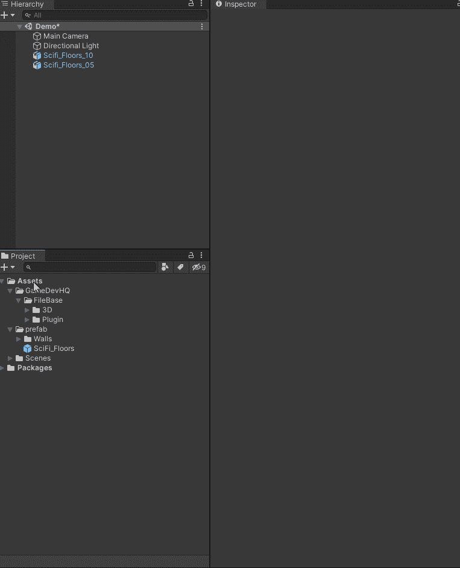
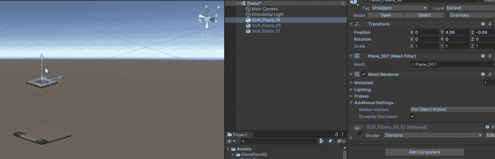
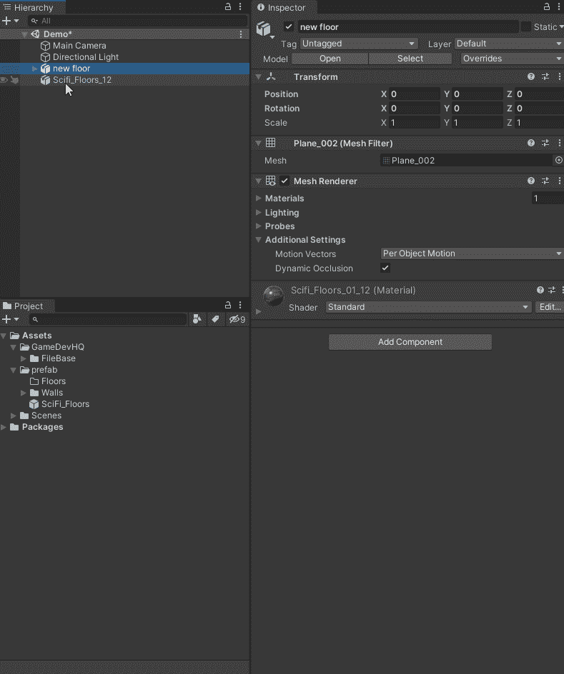
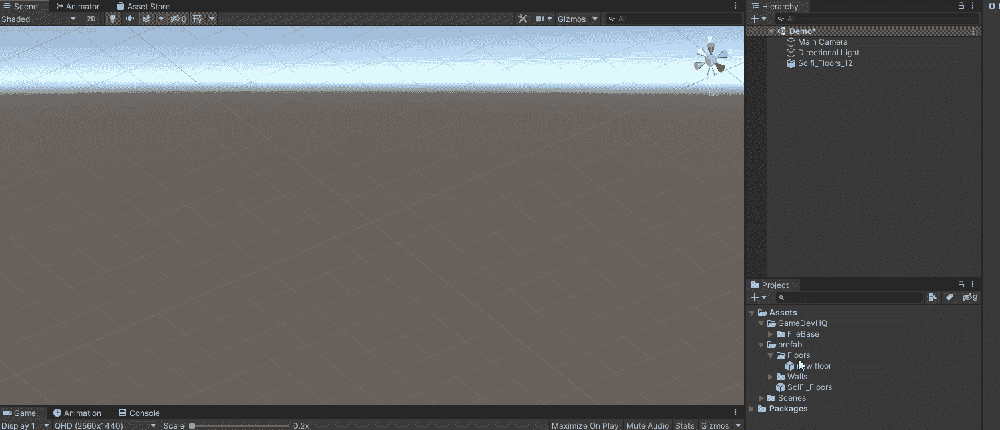
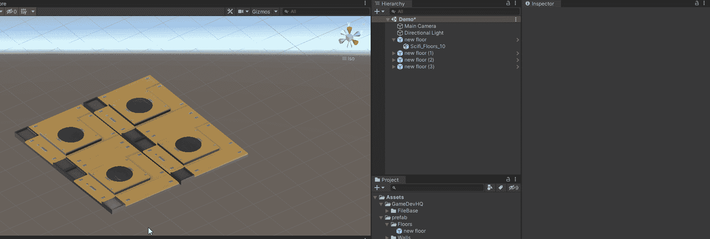

# 关卡设计中的预设

> 原文：<https://medium.com/nerd-for-tech/prefabs-in-level-design-52d4bd43d355?source=collection_archive---------3----------------------->

**目标:**使用 Unity 的预置系统创建独特的对象，可以在你的场景中反复使用。

预设资产就像一个蓝图，可用于一次又一次地创建同一对象的实例。一个预置也允许你通过改变预置对象来改变所有的对象。

我将使用一个预制品通过组合两个不同的物体来创造一些独特的地砖。我已经下载了一些楼层资产，并选择了我想要使用的两个。

首先，我将在资产下创建一个名为 Prefab 的文件夹和一个名为 Floor 的子文件夹。这是我将储存预置物体的地方。

创建文件夹来存储预置

接下来，我将合并两个楼层对象，并将其重命名为“新楼层”

创建新对象

现在要把它变成一个预置，我需要做的就是把它拖到预置文件夹中，并在弹出的消息中选择原始预置。

创建一个预置

现在我已经有了一个预设的瓷砖设置，我可以把它拖到场景中，也可以复制它来创建一个更大的地板区域。

使用预制品

使用预置的一个好处是你可以只改变一个对象，并把改变更新到所有其他对象。我将在下面演示如何改变物体中凸起元素的位置，并且应用这些改变将会影响场景中所有的预设物体。

改变预设

编码快乐！！！