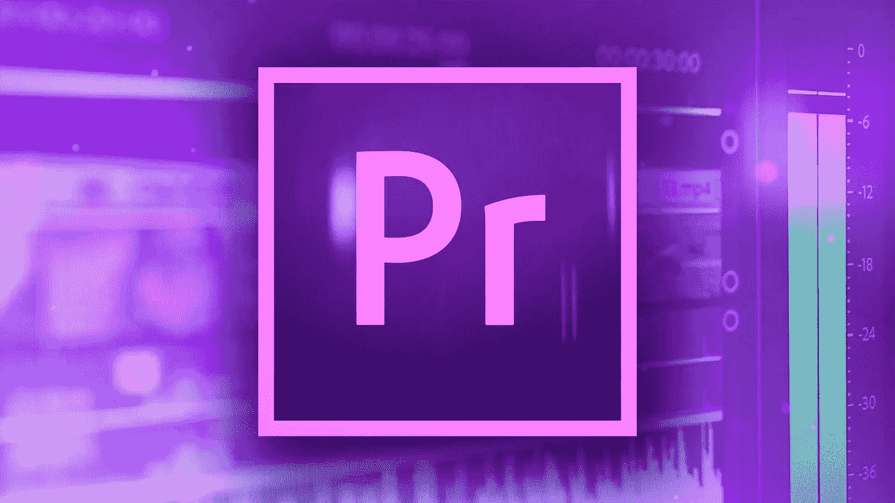

# 初学者的 Premiere Pro

> 原文：<https://medium.com/nerd-for-tech/premiere-pro-for-beginners-b2a16ab6686b?source=collection_archive---------9----------------------->

在这篇文章中，我将介绍 Adobe Premiere Pro 的基础知识

## 1.安装

设置一切是编辑最重要的部分之一。你必须把所有的东西都组织到文件夹里，管这些文件叫什么名字，这样你就能很容易地找到它们，例如*videowithjohn1.mp4。*组织非常重要，因为以后它会让你轻松找到所有东西，而不必…