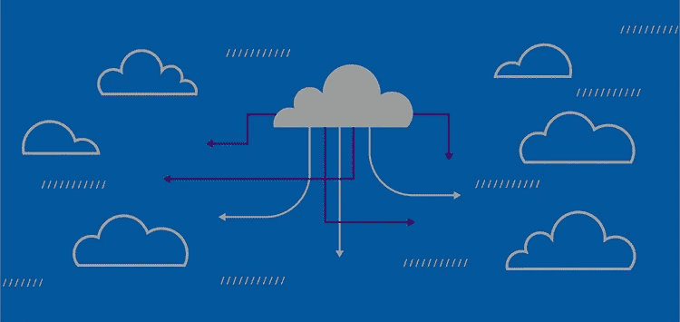

# 高级云 ELT 和反向 ETL 功能现已在 RudderStack Cloud Free 中提供

> 原文：<https://medium.com/nerd-for-tech/premium-cloud-elt-and-reverse-etl-features-are-now-available-in-rudderstack-cloud-free-54f87e7c8f1a?source=collection_archive---------18----------------------->

随着数据量和用例在公司间激增，数据堆栈变得越来越复杂。这是我们认为工程部门应该拥有客户数据堆栈的一个重要原因。

这也是我们专注于构建统一管道的原因，这是数据工程师和开发人员管理其所有关键客户数据管道的一个地方。要完成我们的使命，还有大量的工作要做，但在过去的六个月里，我们已经取得了一些重大进展。

回到 11 月，我们[推出了我们的免费层](https://rudderstack.com/blog/start-building-a-better-cdp-for-free-with-rudderstack-cloud-free)，RudderStack Cloud Free，它使用户能够通过我们的事件流管道每月免费发送多达 500，000 个事件。很多人喜欢它:超过 1000 人注册并使用该产品。

我们[在一月份引入了两个额外的管道](https://rudderstack.com/blog/introducing-rudderstack-cloud-extract-and-warehouse-actions):我们的反向 ETL 和云 ELT 管道特性(仓库操作和云提取)。

这些功能在统一方面迈出了一大步，使数据工程师能够通过 RudderStack 管理客户数据堆栈中的所有三个主要管道。

但是，直到现在，只有事件流管道可以通过自由层使用。现在，我们的许多客户已经激活了 Warehouse Actions 和 Cloud Extract，我们很高兴让所有自由层用户也可以使用它们。

下面是新功能的快速概述:

# 反向 ETL 的仓库操作

方向舵堆栈仓库操作是我们的[反向 ETL](https://rudderstack.com/blog/reverse-etl-is-just-another-data-pipeline) 特性。它将您的仓库转变为数据源，将行转换为可配置的 JSON 负载，这些负载可以发送到您的堆栈中的数百个工具，从 Salesforce 到 Zendesk 到 Kafka 甚至 webhooks。

我们的客户将仓库操作用于各种用例，从用产品数据丰富销售线索到发送清理后的内部事件(如事务数据)。最重要的是，因为我们将每一行转换成一个事件，所以您可以使用我们的转换特性来配置每个下游目的地的有效负载。

# 云 ELT 管道的云提取

RudderStack 云提取是我们的云 ELT 功能。它为您提供了与流行的云资源(如 Salesforce、Customer.io、Google AdWords 甚至 Google Sheets)的现成集成，使您可以轻松构建云到仓库的管道。

# 免费注册并开始发送数据

测试我们的事件流、ELT 和反向 ETL 管道。使用我们的 HTTP 源在不到 5 分钟的时间内发送数据，或者在您的网站或应用程序中安装我们 12 个 SDK 中的一个。[入门](https://app.rudderlabs.com/signup?type=freetrial)。

本博客最初发布于:
[https://rudder stack . com/blog/premium-cloud-ELT-and-reverse-ETL-features-is-now-available-in-rudder stack-cloud-free](https://rudderstack.com/blog/premium-cloud-elt-and-reverse-etl-features-are-now-available-in-rudderstack-cloud-free)