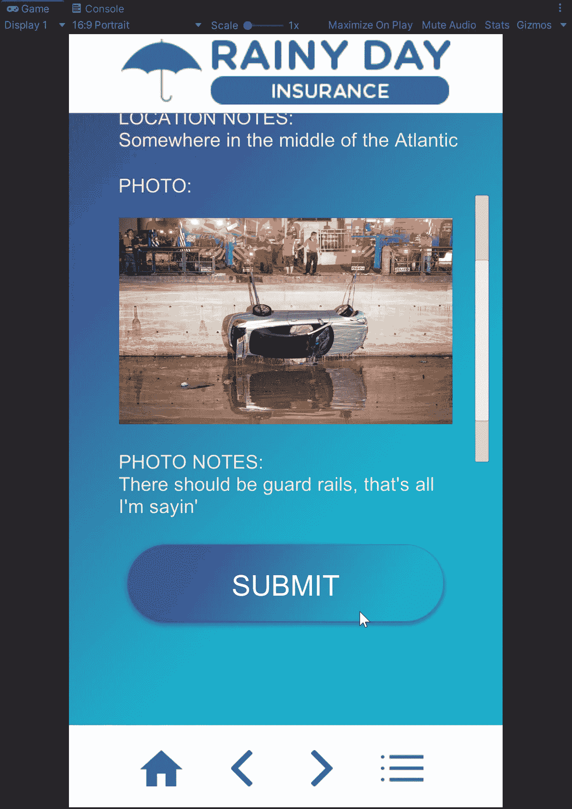
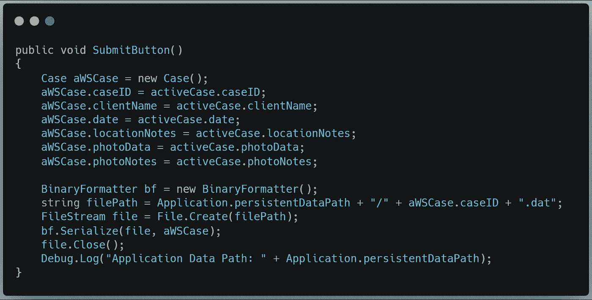
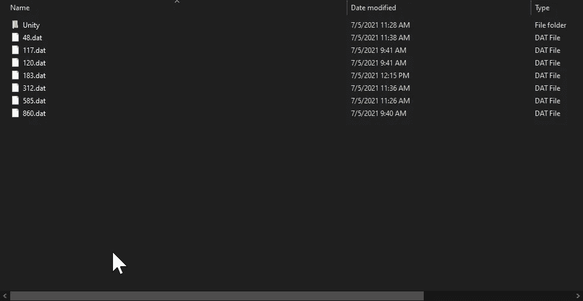
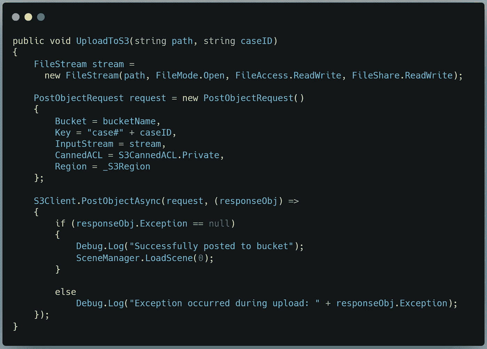
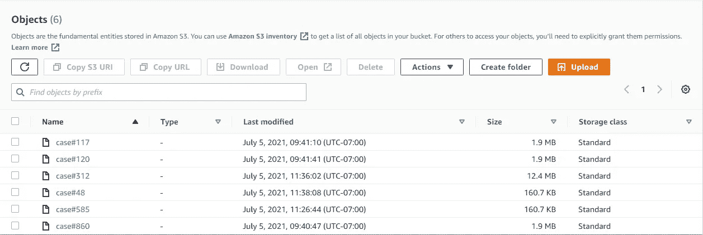

# 准备应用程序数据以上传到您的 AWS S3 存储桶

> 原文：<https://medium.com/nerd-for-tech/preparing-app-data-for-upload-to-your-aws-s3-bucket-5f6a2b0beada?source=collection_archive---------13----------------------->

## 在 Unity 中保存数据文件并将其发送到云端

这些通常也不是人类可读的

构建保险索赔移动应用原型的下一步是将人类可读的数据输入到应用的表单中，并将其编码为机器可读的。设备上的 dat 文件。从那里，我们可以将它发送到我们的 AWS 存储桶中进行存储。

让我们开始吧。

## 转换为二进制数据

当我们按提交时，我们需要发生以下情况:

> 创建一个新案例
> 将所有活动案例数据填充到新案例中
> 创建一个新的二进制格式化程序
> 打开一个文件流并在 Unity 的 persistentDataPath 创建一个文件
> 用新案例数据序列化文件流
> 关闭文件流

为了访问二进制格式化程序(它将我们人类可读的数据转换成机器可读的数据)，我们需要使用 System。runtime . serialization . formatters . binary；为了访问文件流，我们需要使用系统*。木卫一；*所以一定要在类声明之外包含那些语句。

我们的 SubmitButton()方法如下所示:

最后，我附上了一个调试日志，让我知道在哪里可以找到我的文件。果然…

很好。

现在我们需要把文件上传到 S3。同样，我们将密切关注亚马逊的[示例。这些步骤是:](https://docs.aws.amazon.com/mobile/sdkforunity/developerguide/s3.html)

> 打开指向文件路径的文件流，并设置读/写权限
> 为我们的 S3 存储桶创建一个具有适当参数的新 PostObjectRequest】发送将对象发布到 S3 客户端的请求
> 处理来自 S3 客户端的响应
> 如果响应没有错误，则重新加载场景
> 否则记录错误

对于这一步，我们需要*使用亚马逊。S3；*和*使用亚马逊。S3。模型；*除了我们已经在使用的其他亚马逊图书馆。

C#中的 UploadToS3()方法如下所示:

如果我们检查我们的存储桶数据，我们会看到…

完美。

这就是我们目前所需要的。明天我们将完成从 AWS S3 桶中检索和解码这些文件的过程。