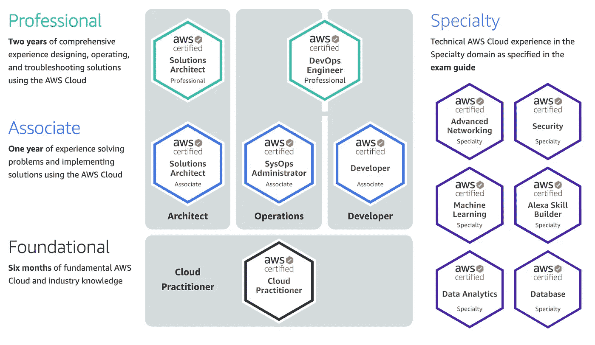
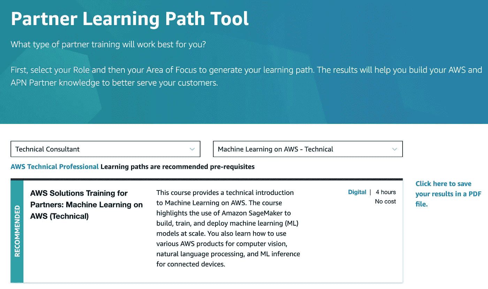
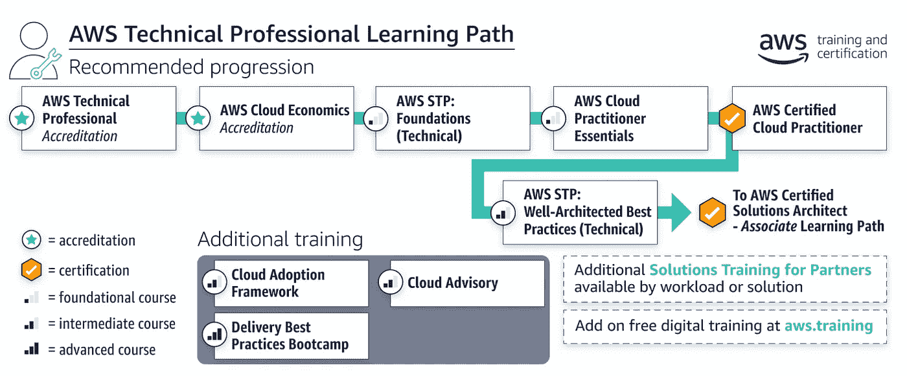
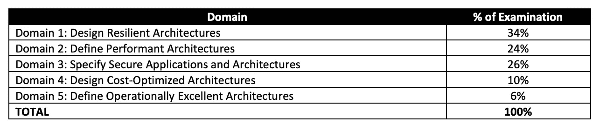
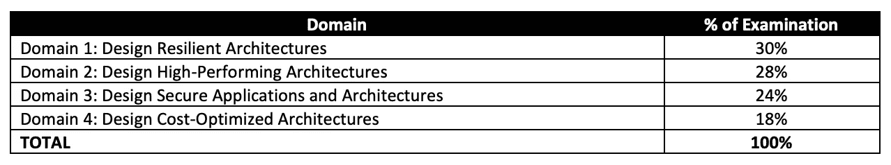

# 准备 AWS 认证解决方案架构师助理(SAA-C02)考试

> 原文：<https://medium.com/nerd-for-tech/preparing-for-the-aws-solutions-architect-associate-certification-saa-c02-exam-680128518bb2?source=collection_archive---------1----------------------->

## 规划您的 AWS 认证、学习技巧和材料

[绿色变色龙](https://unsplash.com/@craftedbygc?utm_source=unsplash&utm_medium=referral&utm_content=creditCopyText)在 [Unsplash](https://unsplash.com/s/photos/study-exam-it?utm_source=unsplash&utm_medium=referral&utm_content=creditCopyText) 上的照片

# 为什么要参加 AWS 认证？

AWS 证书通常应该有助于在寻找新工作或提高职业发展机会时脱颖而出，因为 AWS 考试是最受认可的云认证之一，如果不是最受欢迎的话。

认证也将有助于你所属的公司，因为这些突出了公司的云专业人员。如果该公司是或计划成为 AWS 合作伙伴网络的一部分，许多云认证将有助于满足合作伙伴身份标准。

其实我觉得只是在备考中对云计算有了更好的了解，这本身就是值得的。AWS 建议解决方案架构师助理考试有一年的实践经验，但这不是必需的。如果您还没有这方面的经验，复习资料包含动手实验活动和演示，可以帮助您弥补这一差距。大多数问题都与最佳实践和实践场景有关，因此仔细阅读动手练习肯定会有所帮助。无论你是 AWS 的新手还是老手，这个认证都保证你对你的专业领域有基本的了解。

另外……获得认证会给你带来好处，比如免费的实践考试和下一次认证的 50%折扣券(嘿，那里的营销也相当不错)。

# SAA-C02 考试适合你吗？

好的，你确信你想参加 AWS 考试，但是解决方案架构师助理认证(SAA-C02)考试适合你吗？

在撰写本文时，有 12 个认证和 3 个准水平课程。你将花费数小时准备证书，所以这绝对是一个很好的时间来确定你将选择哪一个。

核心认证的一些问题可能是:
-你应该参加基础，助理或专业？
-如果是助理级别，您应该选择解决方案架构师、系统管理员还是开发人员？

选择可能取决于你的 AWS 熟练程度、准备时间和你想走的学习道路。在当前的认证方案中，AWS 认证没有先决条件认证。如果你有信心，你可以参加专业级认证，而不需要通过助理级认证。请注意，正如所料，随着你从基础到助理再到专业，难度会增加。价格也会随着难度的增加而增加(从 100 美元到 150 美元到 300 美元)。高风险，高回报。

当前 AWS 认证

我发现*考试认证指南*对我选择认证途径非常有用。这里有一个 SAA-C02:
[https://D1 . AWS static . com/training-and-certificate/docs-sa-assoc/AWS-Certified-Solutions-Architect-Associate _ Exam-guide . pdf](https://d1.awsstatic.com/training-and-certification/docs-sa-assoc/AWS-Certified-Solutions-Architect-Associate_Exam-Guide.pdf)

另一个帮助我的是 *AWS 学习路径工具*。例如，如果我们将机器学习作为重点领域，查看技术顾问角色的合作伙伴学习路径工具，它会提供建议的课程，并建议将 AWS 技术专业人员作为先决条件。

面向技术顾问(角色)的学习路径工具—机器学习(重点)

就个人而言，至少对于技术专业人员-机器学习路径，我认为 AWS 云从业者考试认证可以跳过，特别是当你打算获得其他 AWS 认证时。这并不是说我不会浏览一些面向云从业者的内容。我确实从这些材料中学到了东西，甚至可能对我的助理考试有所帮助。然而，在进行模拟考试时，我会将注意力更多地放在其他认证上，如 SAA-C02。

AWS 技术专业学习路径

你可能有另外一两个原因来选择你的道路，但是希望指南和学习路径也能帮助你！

# 2 是怎么回事？

很好，您现在已经决定解决方案架构师助理适合您，但是 SAA 的 2-C02 是怎么回事呢？这是最新版本，与 SAA-C01 的一个显著区别是考试覆盖的领域数量。这并不意味着从第五域创建的内容已经过时。第五个领域可能已经整合到其他领域的考试。无论如何，它在 SAA C01 中没有太多的强调(6%)。

与其试图从你的复习材料中删除第五个领域，不如利用你的时间去了解更多，比如说，关于 Amazon FSx Lustre、Amazon FSx for Windows File Server、站点到站点 VPN 和 Direct Connect 等主题。

具有 5 个结构域的 SAA-C01

具有 4 个域的 SAA-C02

# 有学习资料吗？

## Udemy 课程

*   夏羽·马瑞克| [终极 AWS 认证解决方案架构师助理 2021](https://www.udemy.com/course/aws-certified-solutions-architect-associate-saa-c02) |甚至每个部分末尾的简单 Q & A 也有帮助。实验室和课程结束时的练习考试也很有帮助。如果你只有一个有限的，只能尝试一门课程，我会建议马瑞克的课程，并通过不同的实践考试。

 [## 终极 AWS 认证解决方案架构师助理(SAA)

### 2020 年 12 月更新]:为了适应 AWS 用户界面的变化，S3 部分已全部重新录制[2020 年 5 月更新]…

www.udemy.com](https://www.udemy.com/course/aws-certified-solutions-architect-associate-saa-c02) 

*   Ryan Kroonenberg(云专家)| [AWS 认证解决方案架构师 2020](https://www.udemy.com/course/aws-certified-solutions-architect-associate/) |内容有很多重复，例如在视频讲座的每个结尾都有一个回顾，然后是另一个总结。更有可能的是，视频将从上一个视频的回顾开始。是的，重复，但这些重复实际上是一件好事。它帮助你记住概念。

 [## AWS 认证解决方案架构师:助理认证考试

### 注意:我们的课程材料，如 AWS 认证考试，是不断发展的。本课程涵盖了您需要的所有内容…

www.udemy.com](https://www.udemy.com/course/aws-certified-solutions-architect-associate) 

*   Neal Davis(数字云培训)| [AWS 认证解决方案架构师&开发助理](https://www.udemy.com/course/aws-certified-solutions-architect-associate-hands-on-labs/) |学习一些实际概念(通过实验室和演示)，如 EBS 卷的加密，使这一概念得以延续。

 [## AWS 认证解决方案架构师助理- 2021 [SAA-C02]

### 这一面向 AWS 认证解决方案架构师助理的终极考试培训包含全面的视频…

www.udemy.com](https://www.udemy.com/course/aws-certified-solutions-architect-associate-hands-on-labs) 

我再怎么强调你也要参加这些课程提供的全程实践考试也不为过。您还可以参加其他实践考试，如 Jon Bonso 的实践考试(教程 Dojo) | [AWS 认证解决方案架构师助理实践考试](https://tutorialsdojo.com/courses/aws-certified-solutions-architect-associate-practice-exams)。

 [## AWS 认证解决方案架构师助理实践考试

### AWS 认证解决方案架构师助理实践考试…

tutorialsdojo.com](https://tutorialsdojo.com/courses/aws-certified-solutions-architect-associate-practice-exams) 

## 书

*   雷汉·海德尔| [SAA-C02 练习题(500+):2020 年 AWS 认证解决方案架构师助理](https://www.amazon.com.au/SAA-C02-Practice-Questions-500-explanations-ebook/dp/B08H3Z1CJD) |你可以到处尝试一些问题，并给出相当不错的解释。不是最难的问题，但主要是建立你的信心，你在正轨上。

 [## SAA-C02 练习题(500+): AWS 认证解决方案架构师助理 2020:保证…

### SAA-C02 练习题(500 分以上):2020 年 AWS 认证解决方案架构师助理:500 分以上的保证通过…

www.amazon.com.au](https://www.amazon.com.au/SAA-C02-Practice-Questions-500-explanations-ebook/dp/B08H3Z1CJD) 

*   AWS 官方指南| [AWS 认证解决方案架构师学习指南:助理 SAA-C02 考试(AWS 认证解决方案架构师官方:助理考试)](https://www.amazon.com.au/Certified-Solutions-Architect-Official-Study/dp/1119138558/ref=sr_1_2?dchild=1&keywords=aws+solution+architect+official&qid=1609987854&s=books&sr=1-2) |当然，你有官方考试学习指南。我不会说真的很重要，但如果你已经有权限，看看就好了。

 [## AWS 认证解决方案架构师官方学习指南:助理考试

### 涵盖考试目标，包括设计高度可用、经济高效、容错、可扩展的系统…

www.amazon.com.au](https://www.amazon.com.au/Certified-Solutions-Architect-Official-Study/dp/1119138558/ref=sr_1_2?dchild=1&keywords=aws+solution+architect+official&qid=1609987854&s=books&sr=1-2) 

## AWS 常见问题

AWS 白皮书可能会有所帮助，但我认为通过阅读 Amazon FAQs 可以轻松理解考试的重要内容。以下是我在考试中发现的一些有用的常见问题:

 [## 亚马逊 SQS 常见问题|消息队列服务| AWS

### 问:亚马逊 SQS 比自主开发或打包的消息队列系统有什么优势？亚马逊 SQS 提供了几种…

aws.amazon.com](https://aws.amazon.com/sqs/faqs)  [## 亚马逊简单存储服务(S3) -云存储- AWS

### 问:什么是 AWS 可用性区域(AZ)？AWS 可用性区域是 AWS 内一个物理隔离的位置…

aws.amazon.com](https://aws.amazon.com/s3/faqs)  [## 亚马逊 VPC 常见问题

### 问:什么是亚马逊虚拟私有云？亚马逊 VPC 让你提供一个逻辑上隔离的亚马逊网站…

aws.amazon.com](https://aws.amazon.com/vpc/faqs) 

## AWS 考试准备视频

AWS 还在其培训或在线会议中提供考试准备指南。例如，在线 [2020 AWS Re:Invent 会议](https://reinvent.awsevents.com/)有考试准备:AWS 认证解决方案架构师-助理视频。

 [## AWS 回复:发明

### 享受由 AWS 专家主持的数百场会议。聆听云领导者的观点，并率先了解…

reinvent.awsevents.com](https://reinvent.awsevents.com) 

# 考试最后提示？

*   利用问题(多项选择和多项回答)的编写方式。你可以使用排除法之类的策略。
*   即使你认为你从这些选项中知道了正确的答案，最好还是仔细检查其他选项，因为可能会有一个“更好”的答案。
*   利用标记为复习的功能，利用考试剩余的时间进行复习。特别是如果你现在的答案在 700 分左右(700 分是及格线)，你从复习中得到的那一两个问题可能会让你通过考试，也可能会让你失败。
*   非常经典，但一定要花些时间复习。如果一天时间紧迫，你可以只完成学习材料中不到 10 分钟的视频，或者一些练习题。从长远来看，花几分钟时间复习的习惯会有所帮助。