# 为 React/Angular 和 Node 开发准备 Mac，安装 NodeJS、npm、yarn、VS 代码，并配置 VS 代码

> 原文：<https://medium.com/nerd-for-tech/preparing-your-mac-for-react-and-node-development-install-nodejs-npm-vs-code-and-configure-vs-e4f0cf1e99a4?source=collection_archive---------1----------------------->

# 按照以下步骤/视频安装 Nodejs

1.  [https://nodejs.org/en/download](https://nodejs.org/en/download)
2.  向下滚动直到你看到你的操作系统并点击它(在我的例子中是 Mac)

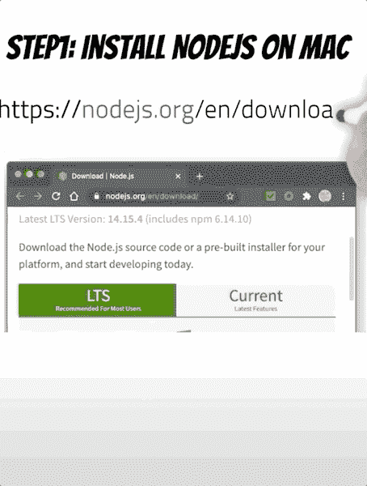

3.文件下载后，点击它并按照说明操作

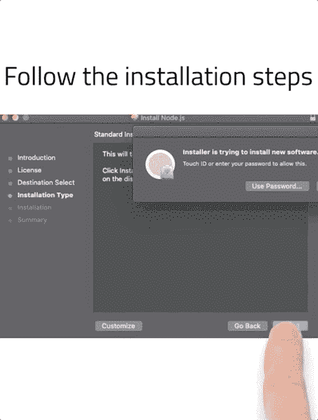

# 安装 Brew(纱线可选)

/bin/bash-c " $(curl-fsSL https://raw . githubusercontent . com/home brew/install/master/install . sh)"

# 安装纱线

brew 安装纱线

或者

```
npm install -g yarn
```

# 安装 VS 代码

1.  转到以下网址:[https://code.visualstudio.com/download](https://code.visualstudio.com/download)

[](https://code.visualstudio.com/download) [## 下载 Visual Studio 代码- Mac、Linux、Windows

### Visual Studio 代码是免费的，可以在您喜欢的平台上获得——Linux、macOS 和 Windows。下载 Visual Studio…

code.visualstudio.com](https://code.visualstudio.com/download) 

2.向下滚动直到你看到你的操作系统并点击它(在我的例子中是 Mac)

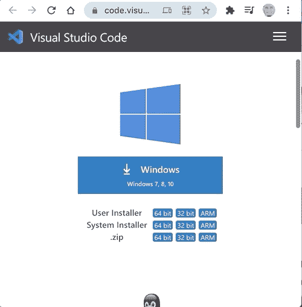

3.文件下载完成后，点击解压并打开

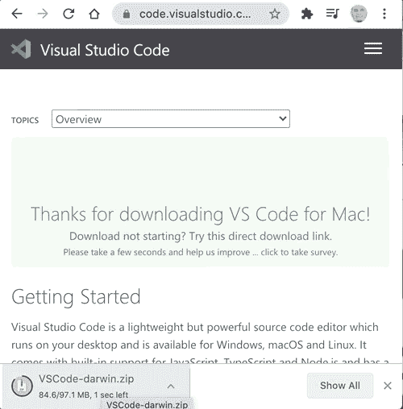

4.运行该文件并按照说明进行操作

文件解压缩后，将应用程序移到“应用程序”文件夹

5.当 IDE 启动时，打开命令面板(⇧⌘P)并键入“shell command”以找到 shell 命令:在路径命令中安装“code”命令。

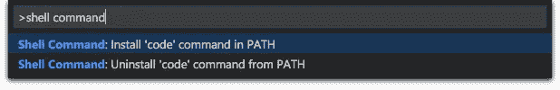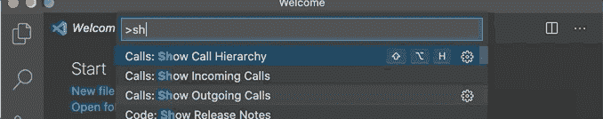

*   重启终端，使新的`$PATH`值生效。你可以输入“代码”开始编辑该文件夹中的文件。
*   导航到微前端 1 目录并编写代码。如下所示:

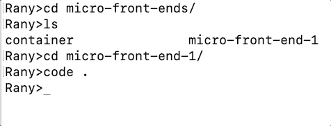

设置 git

```
git config --global user.email "email@example.com"
```

# HTML Emmet

这些东西可以帮助你用几个字母添加模板

示例:

如果你在 html 文件和类型！+ enter，它将创建如下的模板 html 文件

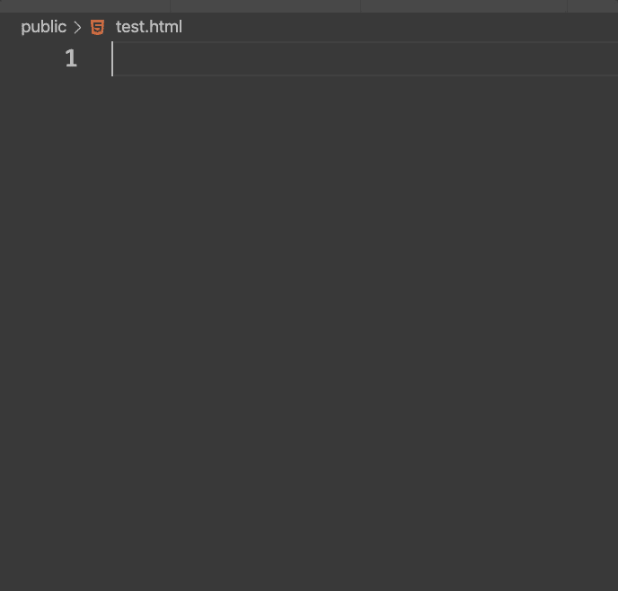

# 代码片段

您可以使用经常使用的样板文件创建自己的代码片段。

转到设置/用户片段

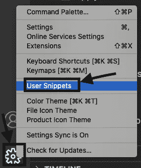

然后选择语言

写下你的片段

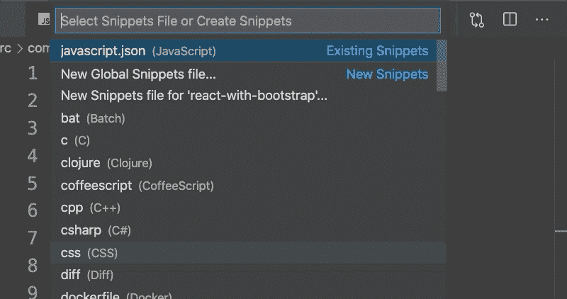

它会在您键入代码时出现，单击 enter/tab，它会自动完成，如下所示

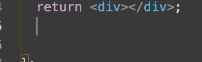

# 添加一些扩展:

## 较美丽

更漂亮是非常重要的组织你的代码和调整空间和制表符。

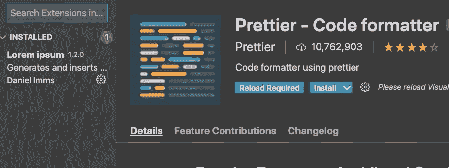

然后转到“设置”,按如下方式搜索“更漂亮”:

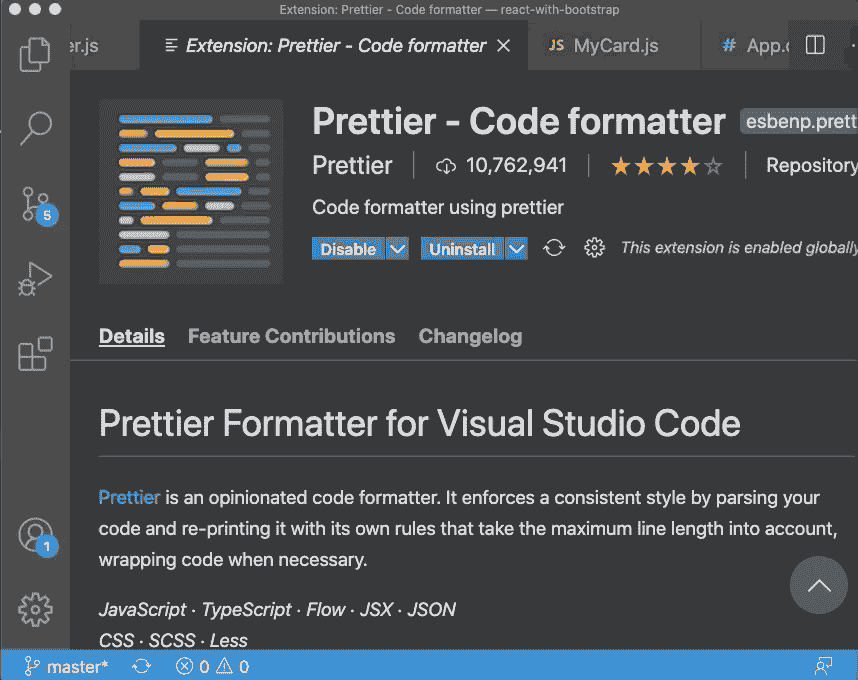

之后，您可以选择您的选项，它会在您保存时自动强制执行。

确保选中“保存时的格式”

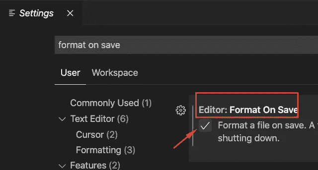

工作空间也是如此

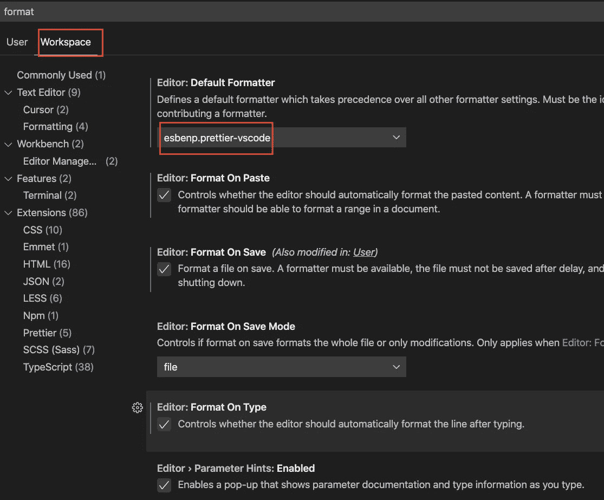

## 设置同步

[](https://marketplace.visualstudio.com/items?itemName=Shan.code-settings-sync) [## 设置同步- Visual Studio 市场

### 虽然是免费和开源的，但如果你觉得它有用，请考虑通过 PayPal 或 Open……

marketplace.visualstudio.com](https://marketplace.visualstudio.com/items?itemName=Shan.code-settings-sync) 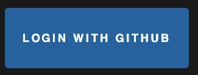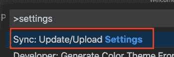

## 路径智能感知

[](https://marketplace.visualstudio.com/items?itemName=christian-kohler.path-intellisense) [## 路径智能感知- Visual Studio 市场

### 自动完成文件名的 Visual Studio 代码插件。消除上下文切换和昂贵的干扰。创建并…

marketplace.visualstudio.com](https://marketplace.visualstudio.com/items?itemName=christian-kohler.path-intellisense) 

这是进口的另一个重要扩展。

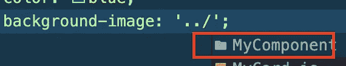

## 反应片段

[](https://marketplace.visualstudio.com/items?itemName=dsznajder.es7-react-js-snippets) [## ES7 React/Redux/graph QL/React-本机代码片段- Visual Studio 市场

### 这个扩展为你提供了 ES7 中的 JavaScript 和 React/Redux 代码片段，以及 VS 代码启动的 Babel 插件特性…

marketplace.visualstudio.com](https://marketplace.visualstudio.com/items?itemName=dsznajder.es7-react-js-snippets) 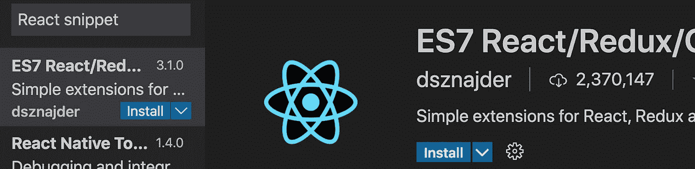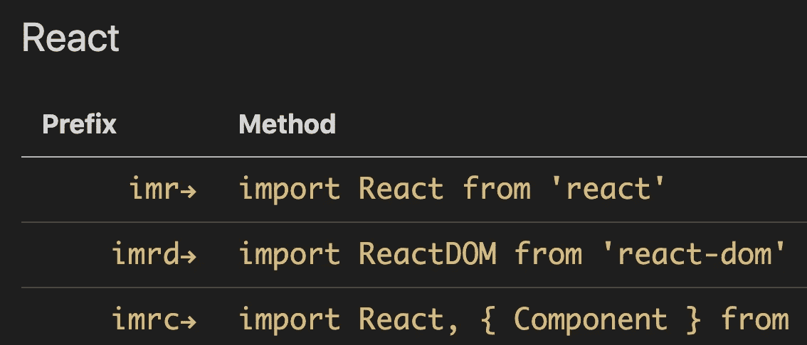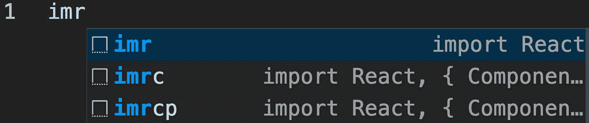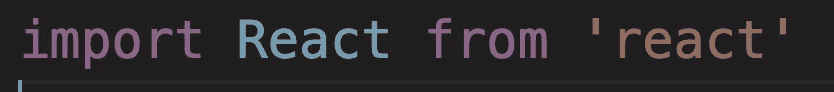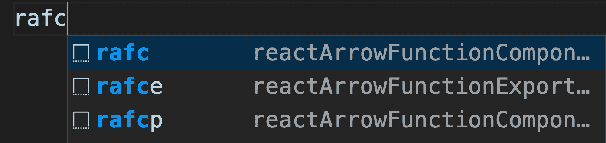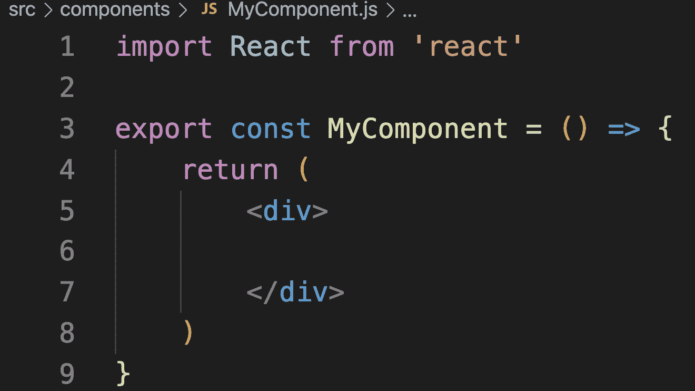

我使用 rafce 为 react 函数组件编写模板代码

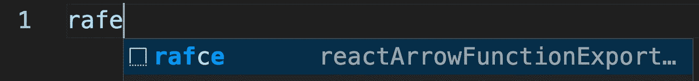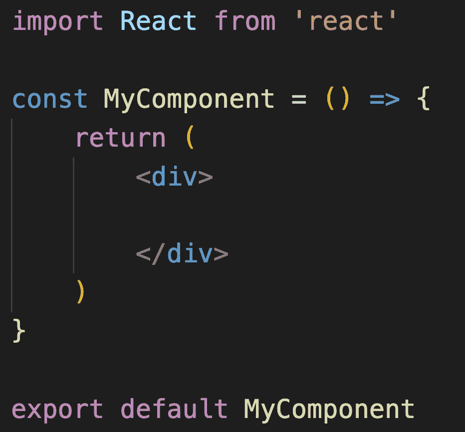

## 自动重命名标签

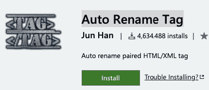

当你试图重命名一个标签时，这是非常重要的，它会自动重命名结束标签

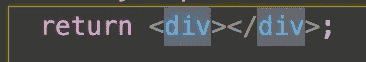

## Polacode(给你的代码拍个快照)

如果你正在写文章或者想要分享你的代码的快照，这是很好的

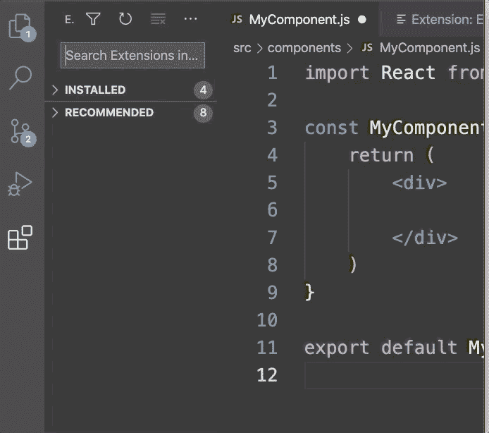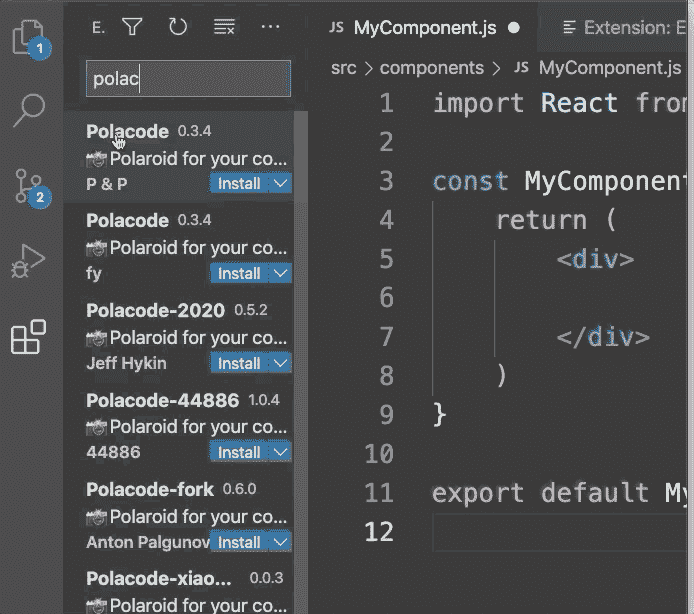

下图是使用 Polacode 的截图:

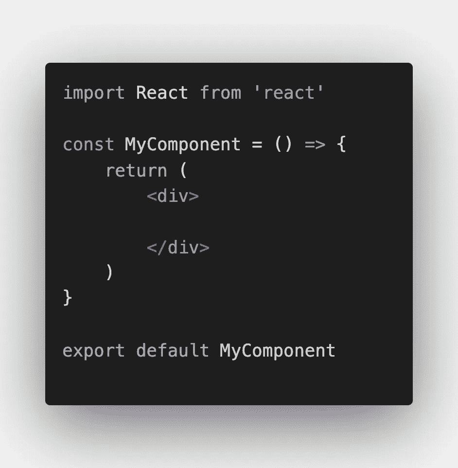

## 括号对上色器

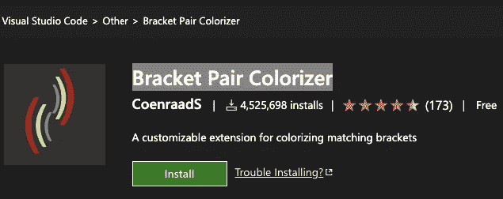

## HTML 中 CSS 类名的智能感知

[](https://marketplace.visualstudio.com/items?itemName=Zignd.html-css-class-completion) [## HTML 中 CSS 类名的 IntelliSense-Visual Studio 市场

### Visual Studio 代码的扩展-基于定义的 HTML 类属性的 CSS 类名完成…

marketplace.visualstudio.com](https://marketplace.visualstudio.com/items?itemName=Zignd.html-css-class-completion) 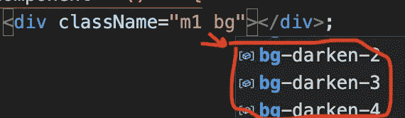

这有助于您使用 CSS 和引导选项

## 颜色选择器

[](https://marketplace.visualstudio.com/items?itemName=anseki.vscode-color) [## 颜色选择器- Visual Studio 市场

### 帮助 GUI 生成颜色代码，如 CSS 颜色符号。还有，一个命令转换颜色来改变颜色…

marketplace.visualstudio.com](https://marketplace.visualstudio.com/items?itemName=anseki.vscode-color) 

## 材料图标主题

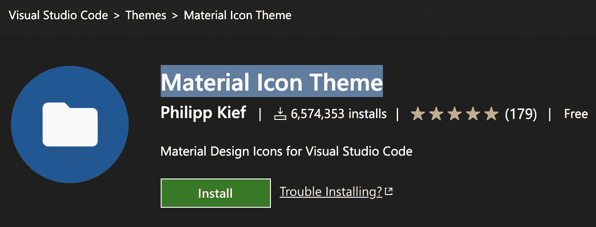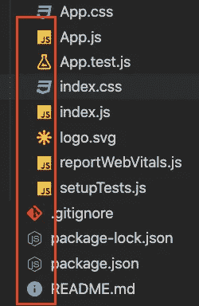

## 彩虹括号

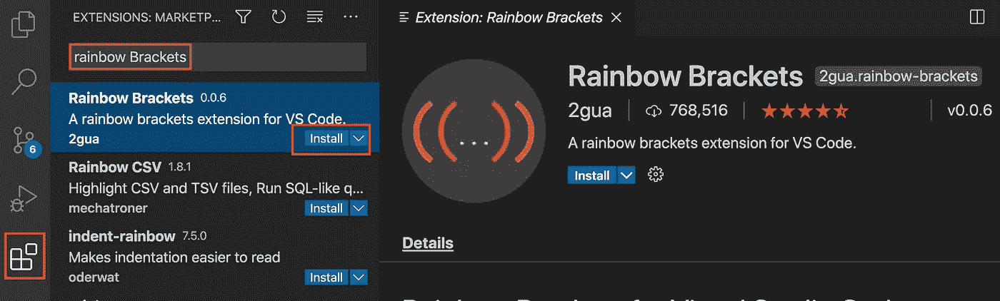

这个扩展通过给它们不同的颜色来帮助你识别嵌套的括号。

## Lorem impsum

Lorem impsum 将帮助您为演示和教程编写随机段落

[](https://marketplace.visualstudio.com/items?itemName=Tyriar.lorem-ipsum) [## Lorem ipsum - Visual Studio 市场

### 生成 lorem ipsum 文本并将其插入 Visual Studio 代码中。打开 VS 代码按 F1 键输入“安装”选择…

marketplace.visualstudio.com](https://marketplace.visualstudio.com/items?itemName=Tyriar.lorem-ipsum) 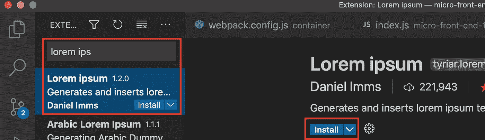

# 定制您的 zsh 终端

1.  打开终端
2.  键入`touch ~/.zshrc`创建文件。
3.  打开`~/.zshrc (open ~/.zshrc)`
4.  添加以下内容

PROMPT='Rany > '

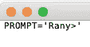

5.重启你的终端

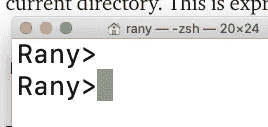