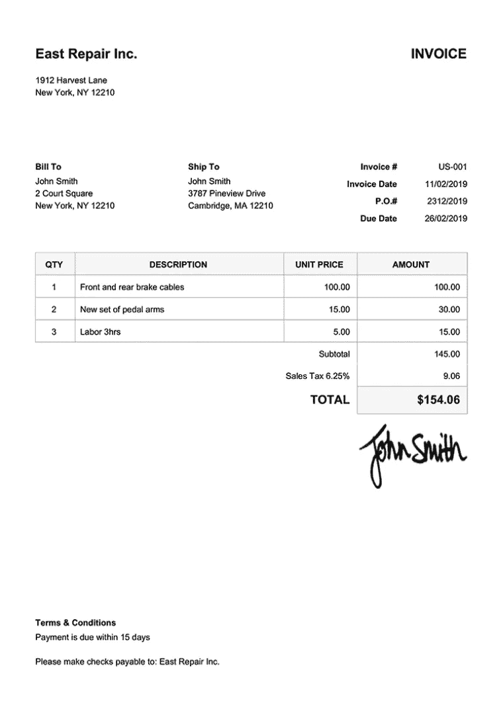
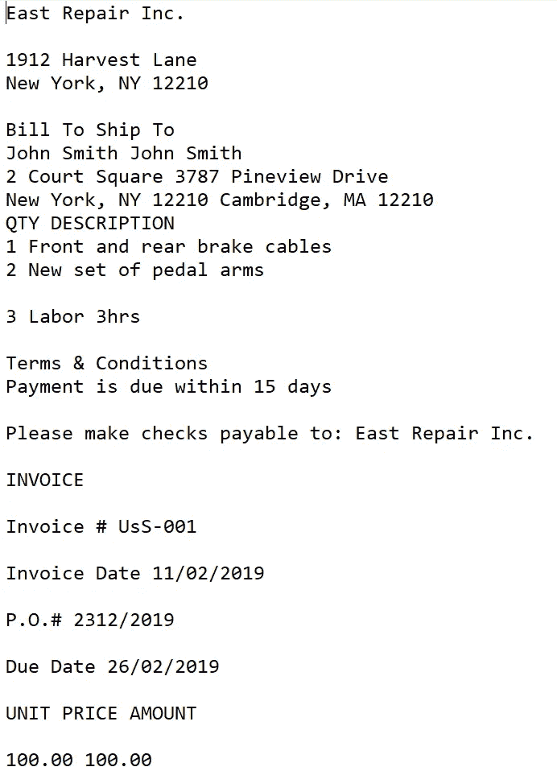
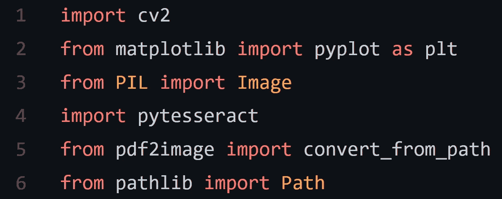
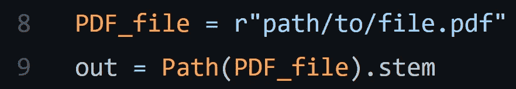
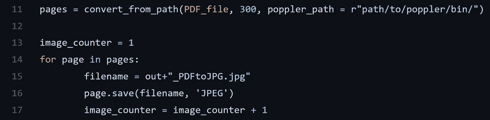
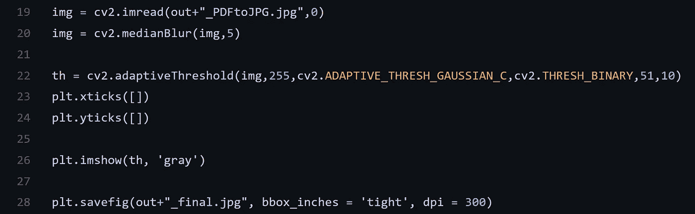
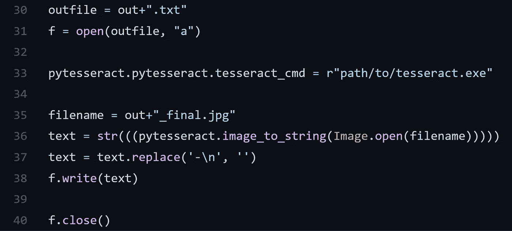

# 预处理发票 PDF

> 原文：<https://medium.com/nerd-for-tech/preprocessing-invoice-pdf-93b5ecf6716?source=collection_archive---------7----------------------->

在本文中，我们将通过代码接受、处理和输出 PDF 发票文件的内容到一个文本文件中。

基于图像的 PDF 发票和文本输出

让我们从导入这个项目所需的包开始:

所需的库

1.  Cv2 来处理发票的图像文件。
2.  Matplotlib 检索已处理发票文件的输出。
3.  使用 pytesseract 时的图像包。
4.  Pytesseract 将用于执行 OCR。
5.  Convert_from_path 和 path 将用于处理文件目录。

现在，我们检索输入 PDF 文件的文件路径和文件名:

文件路径和文件名

接下来，我们导入分辨率为 300dpi 的 PDF 文件，并将其转换为 PIL 图像对象。为此，必须提供 poppler 的 bin 路径。然后，我们浏览 PDF 文件中的页面，并将页面保存为 JPEG 格式的图像文件:

将 PDF 转换为 JPEG

我们将使用 OpenCV 处理 JPEG 发票文件。我试验了一些自适应阈值算法，最后选择了高斯算法。通过将最后两个值调整为 51 和 10，我得到了这个项目的最佳输出图像。然后，我们将其绘制成图形，但不是在控制台上显示，而是将其保存为最终的 JPEG 文件:

保存处理过的图像

在这个过程的最后阶段，我们将创建一个与输入的 PDF 文件同名的文本文件。我们将使用 pytesseract 包打开最终的 JPEG 文件，并对其执行 OCR。提取的文本将被写入输出文本文件并保存在本地目录中:

输出文本文件

这就结束了从本地以及基于图像的发票 PDF 文件中预处理和提取文本的过程。我将留下我的 GitHub 存储库的链接，您可以从那里克隆 Python 脚本，以及下载最新发布的 poppler-windows 和 tesseract 文件的链接。

GitHub:[https://github.com/rajeev-koushik/pdf-preprocessing](https://github.com/rajeev-koushik/pdf-preprocessing)T2【波普勒:[https://github.com/oschwartz10612/poppler-windows/releases/](https://github.com/oschwartz10612/poppler-windows/releases/)宇宙魔方:[https://digi.bib.uni-mannheim.de/tesseract/](https://digi.bib.uni-mannheim.de/tesseract/)