# 预处理数据

> 原文：<https://medium.com/nerd-for-tech/preprocessing-the-data-536d4a5ed358?source=collection_archive---------10----------------------->

在这篇博客中，让我们讨论所有的预处理方法。这个博客可能看起来很大，但它非常有效。

数据的质量决定了机器学习算法的性能。质量是指预处理后的数据。因此，预处理对于建立模型是非常必要的。

下面是预处理的方法，

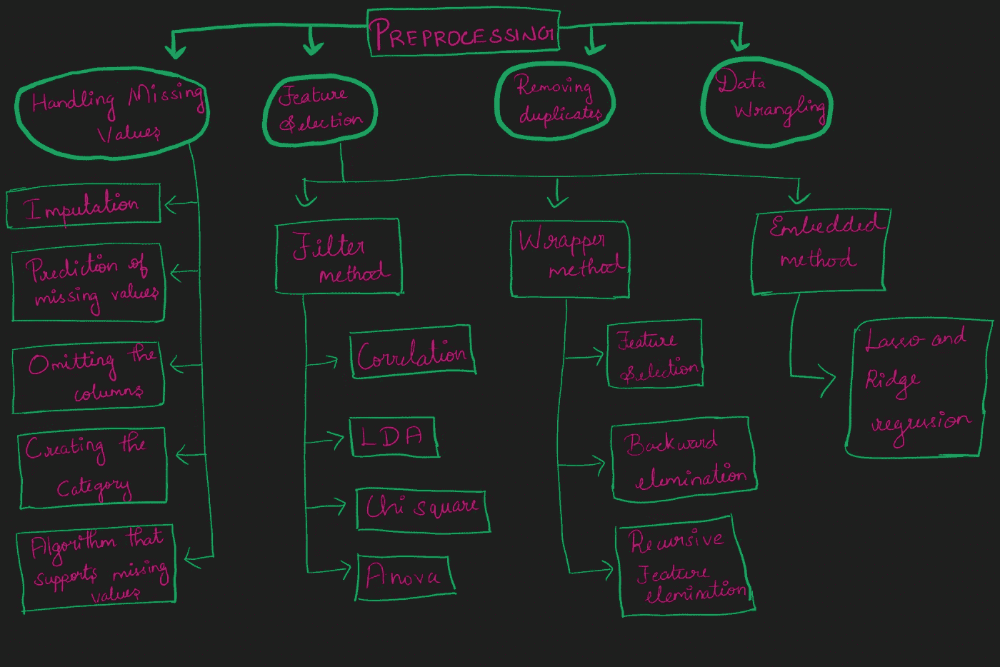

各种预处理方法

# 1.处理缺失值:

大多数机器学习算法不支持空值数据。所以需要处理空值

## 1.1-插补

插补是用替代值替换缺失数据的过程。

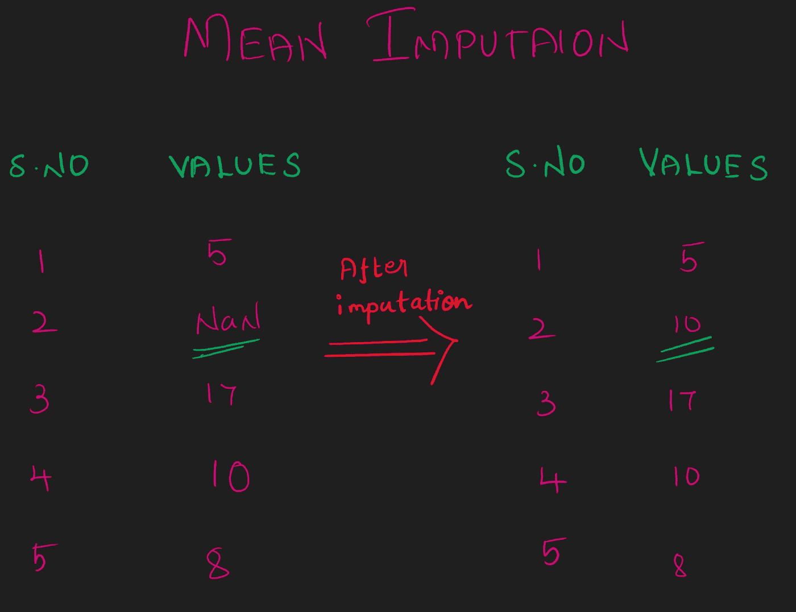

平均插补

被替代的值是均值，它的**均值插补**

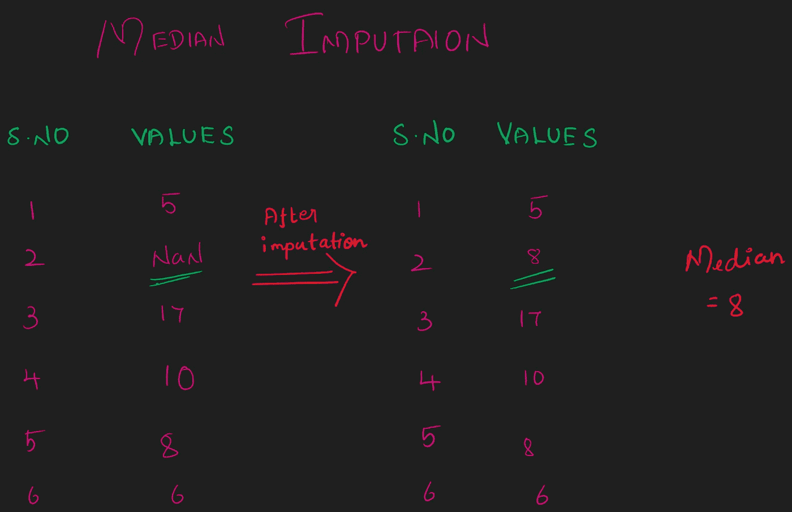

中位数插补

如果替代值是中位数，则其**中位数插补**

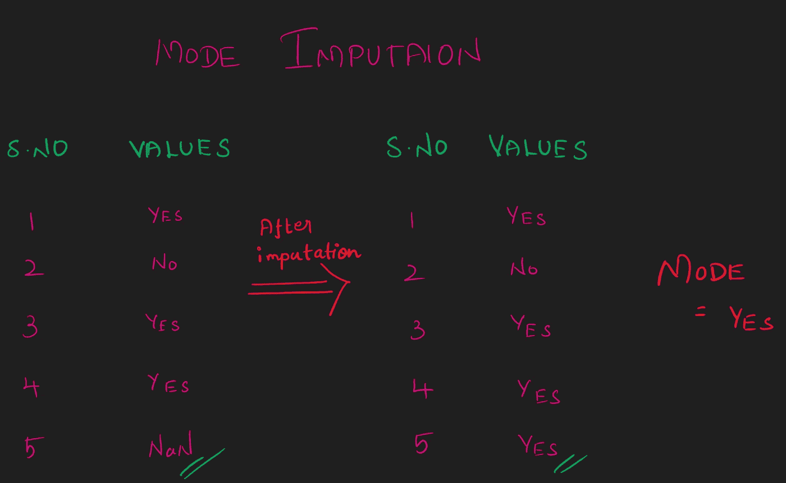

模式插补

如果替代值为众数，则为众数插补。

## 1.2-以缺失值为目标的列预测:

将具有缺失值的属性视为目标，其余属性视为要素，然后预测该目标并替换缺失值。

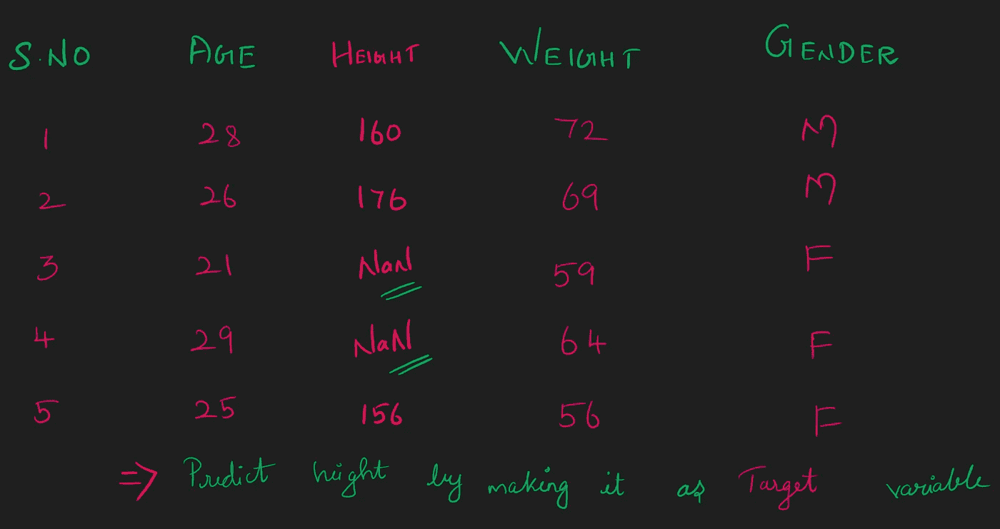

这里，我们可以通过将身高作为目标属性来预测身高。

## 1.3-省略列:

当一个特定的列有超过 50%的缺失值时，我们可以忽略它。

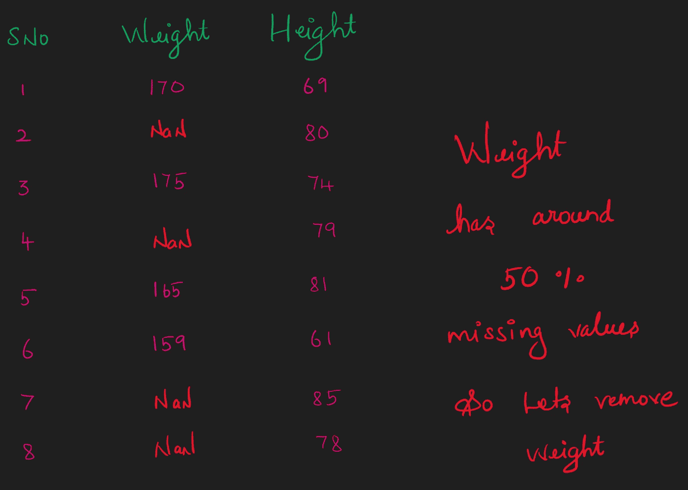

## 1.4-创建类别:

最常见和最流行的方法是将分类列中缺失的值建模为一个新的类别，称为**“未知”**

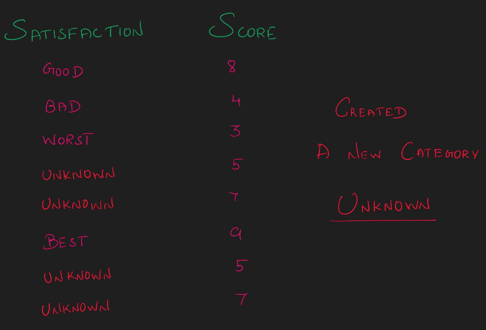

创建类别

在这里，您可以看到缺失值被归类为未知。

## 1.5-继续使用支持缺失值的算法:

我们可以使用某些支持数据中缺失值的机器学习算法。

# 2.功能选择:

要素选择是选择对您感兴趣的预测变量或输出贡献最大的要素的过程。

数据中包含不相关的要素会降低模型的准确性，并使模型基于不相关的要素进行学习。

如果数据集包含 100 个要素，我们无法全部处理。会消耗更多的时间。因此，需要选择一个对预测变量或输出贡献最大的重要特征。

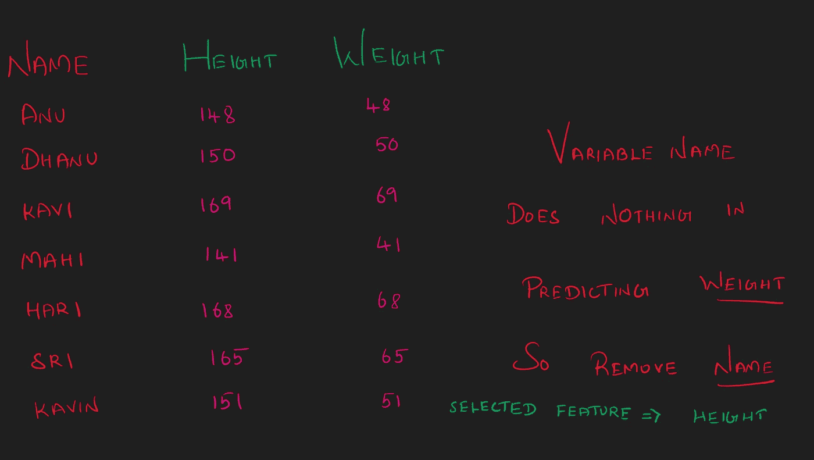

## **2.1-过滤方法:**

它测量特征(独立变量)的相关性，并且比包装器方法更快，因为它们不涉及训练模型。

**2 . 1 . 1-相关性:**

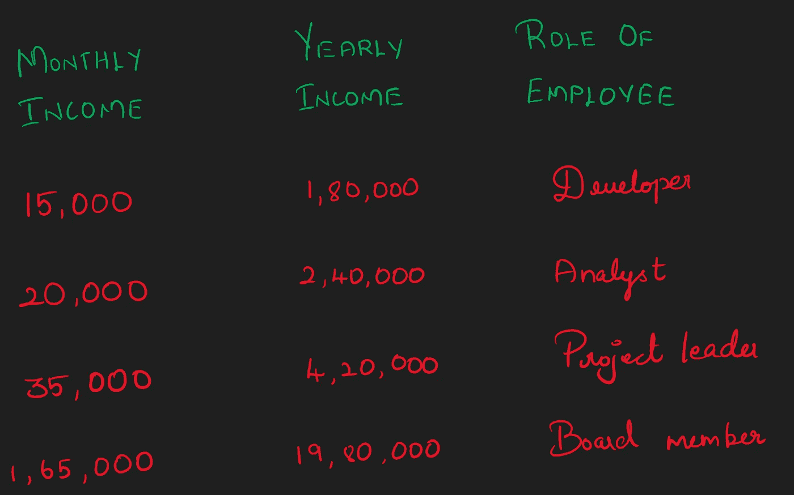

这里，随着指定的增加，年收入和月收入增加。

我在单独的博客中讨论了相关性

 [## 相关性和类型

### 相关性是定量/定性变量之间的关系

medium.com](/nerd-for-tech/correlation-and-types-1812c058159d) 

**2.1.2 卡方检验:**

相关性是关于两个连续变量之间的线性关系。卡方通常是关于两个分类变量的独立性。

了解博客下面可变访问的类型

 [## 变量的类型

### 每当我们构建一个 Ml 模型时，我们需要了解数据集中的变量，以决定使用哪个 ML 模型…

medium.com](/nerd-for-tech/types-of-variables-cc44a85507c1) 

它表明一个分类变量的值是否依赖于另一个分类变量的值。卡方有助于衡量关系。

**2.1.3-LDA:**

LDA 是一种降维技术。它减少了数据集中的维度(即变量)数量，同时尽可能多地保留信息。

对于分类问题更有利。

**2 . 1 . 4-方差分析:**

ANOVA——方差分析

特征变量的方差决定了它对响应方差的影响程度。

如果方差较低，则意味着该特性对响应没有影响，反之亦然。

## 2.2-包装方法:

**2 . 2 . 1-正向选择:**

这是从没有特征开始的迭代方法。在每次迭代中，不断添加最能改进我们模型的特性。如果添加一个新的变量不能提高模型的性能，则删除该变量。

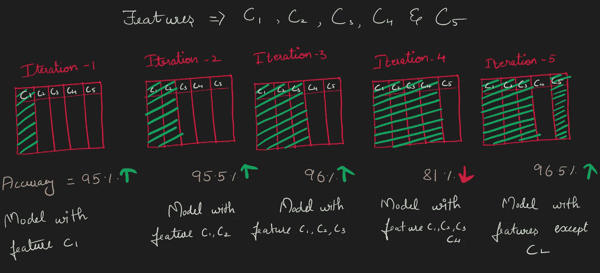

预选

在这里，我们在每次迭代时都将每个变量添加到模型中，在第 4 次迭代时，当我们添加 c4 时，模型的性能会降低，因此我们不应该使用该变量，所以我们跳过了。

**2 . 2 . 2-反向淘汰:**

正向选择的逆向过程就是逆向淘汰。是从所有特征开始的迭代方法。

这个过程删除了在每次迭代中降低模型性能的最不重要的变量。

重复该过程，直到在去除特征时没有观察到改进。

**2 . 2 . 3-递归特征消除:**

这是一个贪婪的优化算法，旨在找到最佳性能的特征子集。

这个过程重复地创建模型，并在每次迭代中保留性能最好或最差的特性。它用剩下的特征构造下一个模型，直到所有的特征都用完。

这种方法根据要素被消除的顺序对其进行排序。

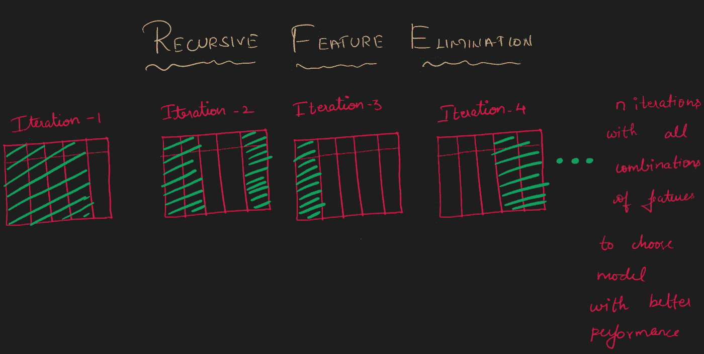

反向特征消除

## 2.2-嵌入式方法:

**套索和岭回归:**

这是降低模型复杂性和防止过度拟合的简单技术。

以免在单独的博客中讨论山脊和套索。

# 3-删除重复项:

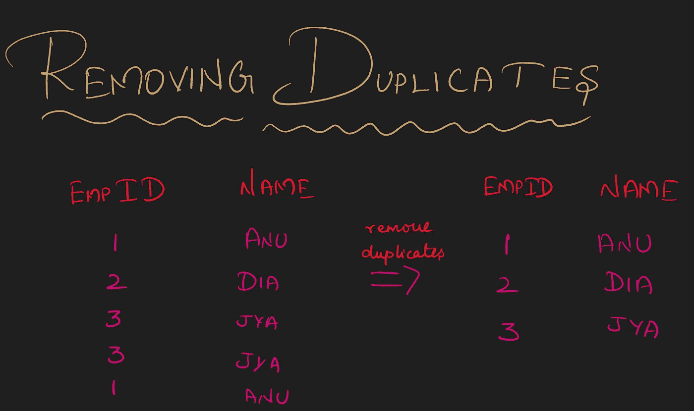

在训练监督算法时，通常的假设是，

1.  数据点是独立且同分布的。
2.  训练和测试数据是从同一个分布中抽取的。

根据这些假设，您不应该丢弃相同的数据点。

# 4.数据争论:

数据争论或管理是将原始数据清理、结构化并丰富为所需格式的过程，以便在更短的时间内做出更好的决策。

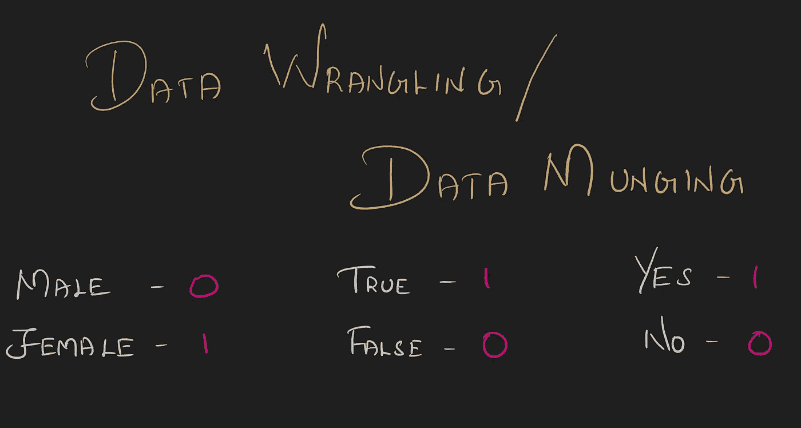

希望这个博客能给数据预处理提供一个好主意。我会试着解释新博客中的每一个话题。

谢谢你！:-)