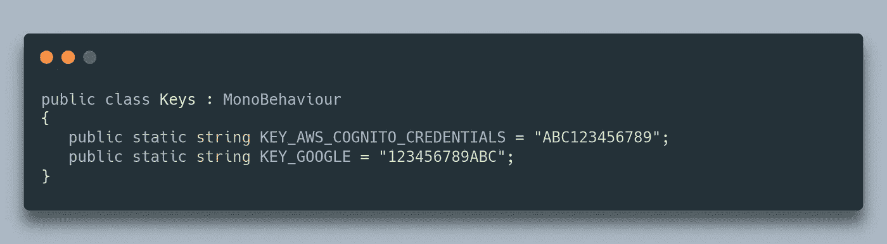
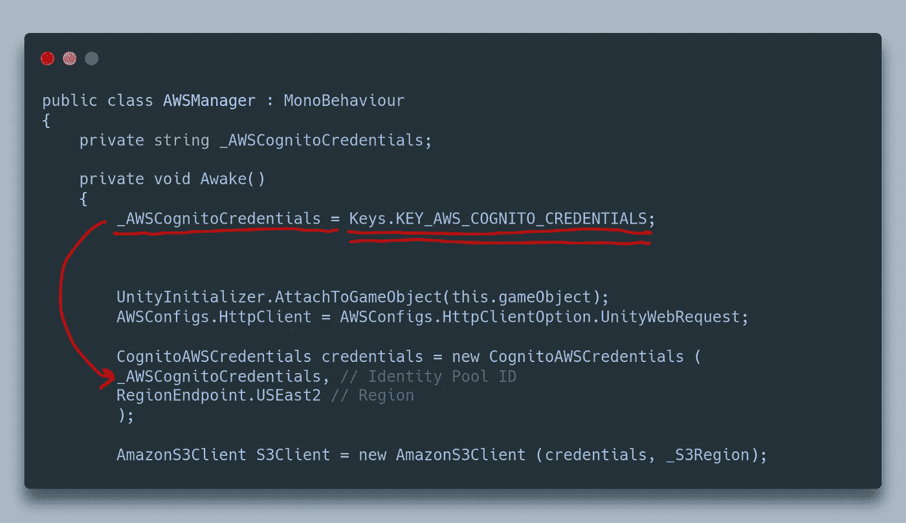
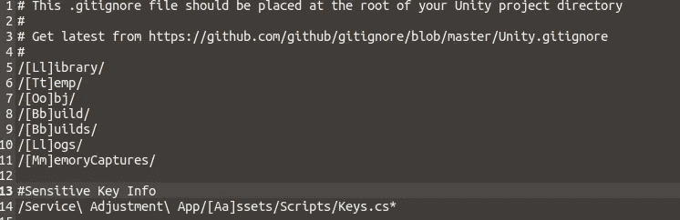
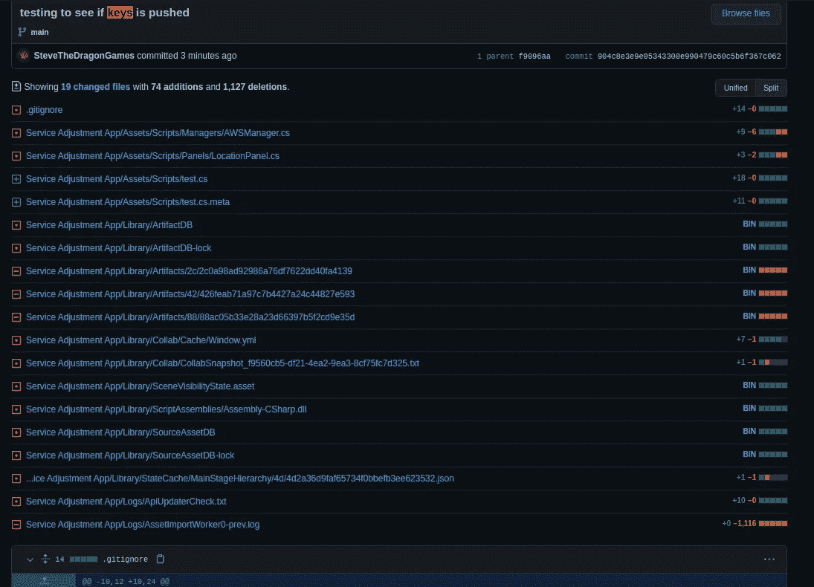

# 防止骗子窃取 Github 上的个人关键信息。

> 原文：<https://medium.com/nerd-for-tech/preventing-scammers-from-stealing-personal-key-information-on-github-570e433b2682?source=collection_archive---------11----------------------->

在我目前的 Unity 编程冒险中，我正在经历一个企业应用程序课程，需要使用非常敏感的帐户信息。我还被要求将我的编程进度发布到 github 以供审查，我已经开始阅读一些关于骗子如何运行搜索 google 和 amazon API 密钥的机器人的恐怖故事，人们将这些密钥硬编码到他们的项目中，并推送到 GitHub，然后发现他们的帐户很快就会被收取数百甚至数千美元的费用！

那怎么办呢？创建一个特殊的类来保存一些静态常量，这些常量可以在任何地方访问，然后可以包含在。gitIgnore 文件。稍后，作为额外的安全措施，您可以在晚上下班后将密钥文件移动到外部目录，并在再次工作时将它放回原处。你的钥匙将是安全的，远离窥探机器人！

例如，在我的项目中，我将创建一个名为 Keys.cs 的类

在需要键的 AWSManager 类中，我转换了我的公共 AWSCredentials 变量，在那里我曾经手动地复制并粘贴我的键，并给它分配了常量。你可以直接输入键，避免多余的变量，但是我这样做是为了接近前面的代码，保持一点可读性。

最后，我们只需将密钥文件添加到 git.ignore 文件中

在添加、提交和推送之后，我的 keys 文件在任何地方都找不到了！

为了安全起见，当你第一次尝试这个的时候，很明显要使用假的密钥信息，以防出错，并且不允许密钥文件被发布。就像我之前说的，一旦你成功了。gitIgnore 文件，您可以在推送之前将您的密钥移动到一个外部目录，以获得额外的安全性。当谈到这类问题时，你永远不会太确定。希望有帮助！