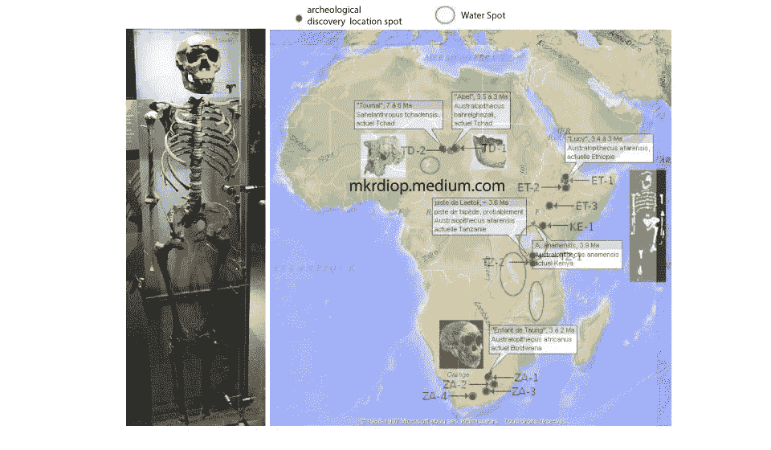

# 灵长类部落和水域

> 原文：<https://medium.com/nerd-for-tech/primate-tribes-and-water-spots-3af996f26598?source=collection_archive---------23----------------------->

## 我国有一句谚语说，到过去水停滞的地方去，你就会找到圣痕

水是生命之源也许是显而易见的事情，但记住它可能是有用的，因为我们的环境塑造了我们，因为我们也塑造了它。我们是两个不断交流的互联节点，因此了解环境有助于更好地了解我们和了解什么是重要的。这里不是关于它从哪里开始，如何开始，只是为了说明，坦率地说，红点和绿点的分布是开放的，任何类型的评论和理论，但我愿意在这里强调的模式是，所有这些考古发现都是在一个水点附近发现的，并对此进行概率解释。概率的解释很简单，因为我们人类总是在感情上和地理上把自己分组，我们的利益在哪里，我们的生活在哪里更有保障。对于现在的一些部落来说，水点过去是，现在仍然是最重要的共同利益，所以可以肯定的是，我们很多人都在水点附近，这就是为什么今天更有可能在这些水点附近找到我们的足迹。

概率思维是一个伟大的工具，可以给事物带来合理的解释。由于这一领域现在显然与强有力的数学理论联系在一起，它预示着非常有趣的发展，可以帮助我们更好地理解我们的世界，并采取更好的行动。

这里[数据](https://fr.wikipedia.org/wiki/Liste_de_fossiles_d%27hominid%C3%A9s)！发现你现在居住的大陆的发现，如果你能，告诉我。在我的例子中，我只是叠加了两个图像，就这样。