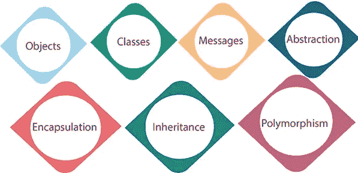
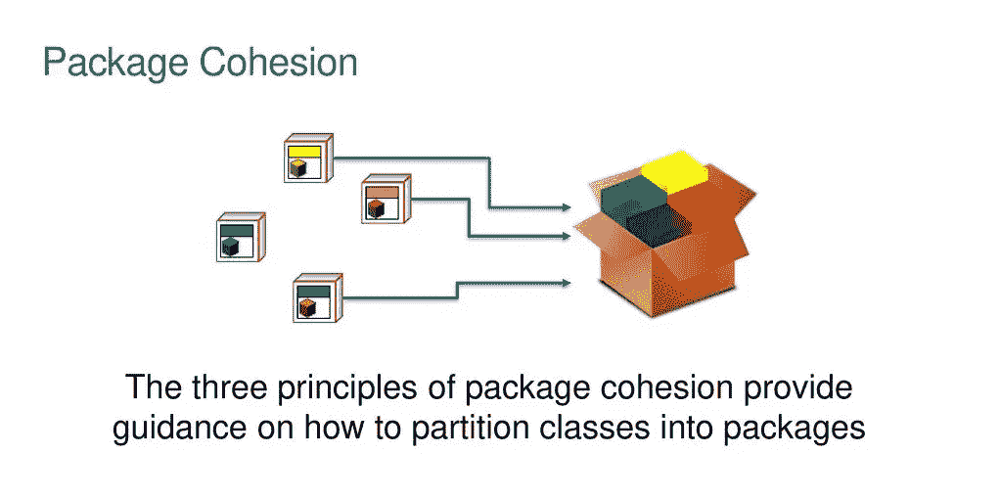
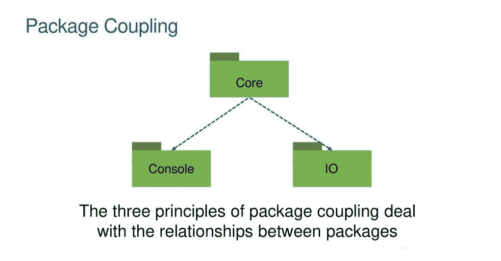

# 面向对象设计原理

> 原文：<https://medium.com/nerd-for-tech/principles-of-object-oriented-design-556edf6987be?source=collection_archive---------3----------------------->

除了抽象、多态、继承和封装，在编码中还有一些原则要遵循。这些概念是几十年软件工程经验的结果。它们是大量软件开发人员和研究人员合作和写作的结果，而不是单个智力的工作。尽管它们被称为面向对象的设计原则，但它们实际上是长期存在的软件工程概念的特殊例子。

标题概述

## 有五个类设计的原则(又名固体):

**1。**
*单一责任原则(SRP)一个类应该只有一个改变的理由。*

**2。【OCP】**
*软件实体(类、包、方法等)的开闭原则。)应该对扩展开放，但对修改关闭。*

**3。Liskov 替换原则(LSP)**
*子类型必须可以替换其基本类型。*

**4。接口隔离原则(ISP)**
*客户端不应该被迫依赖他们不使用的方法。接口属于客户端，而不属于层次结构。*

**5。**
*依赖倒置原则(DIP)抽象不应该依赖于细节。细节应该依赖于抽象。*

包装内聚性

## 包内聚有三个原则

**1。重用发布等价原理(REP)**
*重用的粒度就是发布的粒度。*

**2。通用闭包原则(CCP)**
*一个包中的类应该针对相同种类的变更一起关闭。影响一个已关闭的包的变更会影响该包中的所有类，而不会影响其他包。*

**3。通用重用原则(CRP)**
*一个包中的类一起被重用。如果您重用一个包中的一个类，那么您可以重用所有的类。*

包装耦合

## 包耦合有三个原则

**1。**
*非循环依赖原则(ADP)允许依赖图中没有循环。*

**2。**
*稳定依赖原则(SDP)依赖于稳定的方向。*

**3。稳定的抽象原则(SAP)**
*一个包应该像它是稳定的一样抽象。*

***参考:***[https://stackoverflow.com/a/399737/12100518](https://stackoverflow.com/a/399737/12100518)，[http://wiki.c2.com/?PrinciplesOfObjectOrientedDesign](http://wiki.c2.com/?PrinciplesOfObjectOrientedDesign)，[https://slideplayer.com/slide/13461533/](https://slideplayer.com/slide/13461533/)，[https://medium . com/nerd-for-tech/introduction-to-solid-design-principles-94a 9394 EB 84 e](/nerd-for-tech/introduction-to-solid-design-principles-94a9394eb84e)