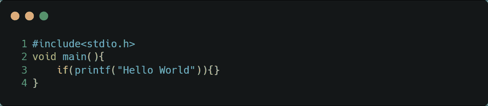
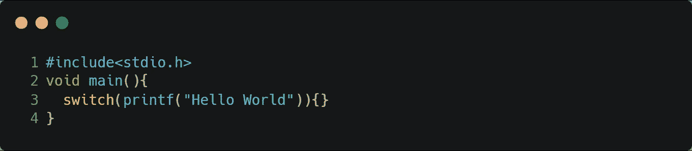
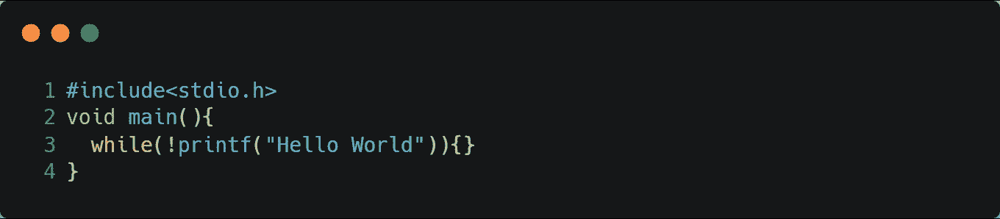
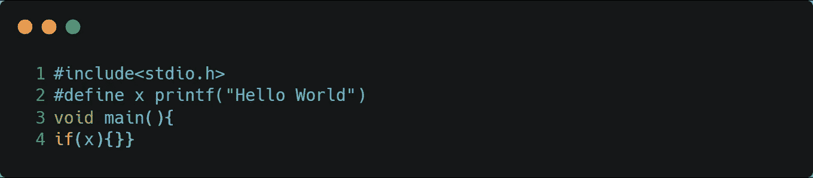

# 在 C/C++中打印不带分号的“Hello World”

> 原文：<https://medium.com/nerd-for-tech/printing-hello-world-without-a-semicolon-in-c-c-21f00d2a3da?source=collection_archive---------2----------------------->

打印“Hello World”是任何编程语言的第一个程序之一。成功运行这个程序增强了每个初学者的信心，让他们感觉像一个*程序员*！对吗？

在 C/C++中，每个语句都以分号结束。几乎所有的语句都可以被视为表达式。有几种方法可以不用分号打印语句。这些方法是:

1.  使用 if 语句
2.  使用 switch 语句
3.  使用 while 循环
4.  使用宏

以下是使用这些方法打印“Hello World”的示例。

**使用 *if* 语句:**

这是使用 *if 语句*而不是使用*分号*打印“Hello World”的代码片段。

**输出:** Hello World

**使用*开关*语句:**

这是使用 *switch 语句*而不是使用*分号*打印“Hello World”的代码片段。

**输出:**你好世界

**使用*同时*循环:**

这是使用 *while 循环*而不是使用*分号*打印“Hello World”的代码片段。

**输出:**你好世界

**使用宏:**

这是使用*宏*而不是使用*分号*打印“Hello World”的代码片段。

**输出:**你好世界

#Learntocode 快乐学习！😊