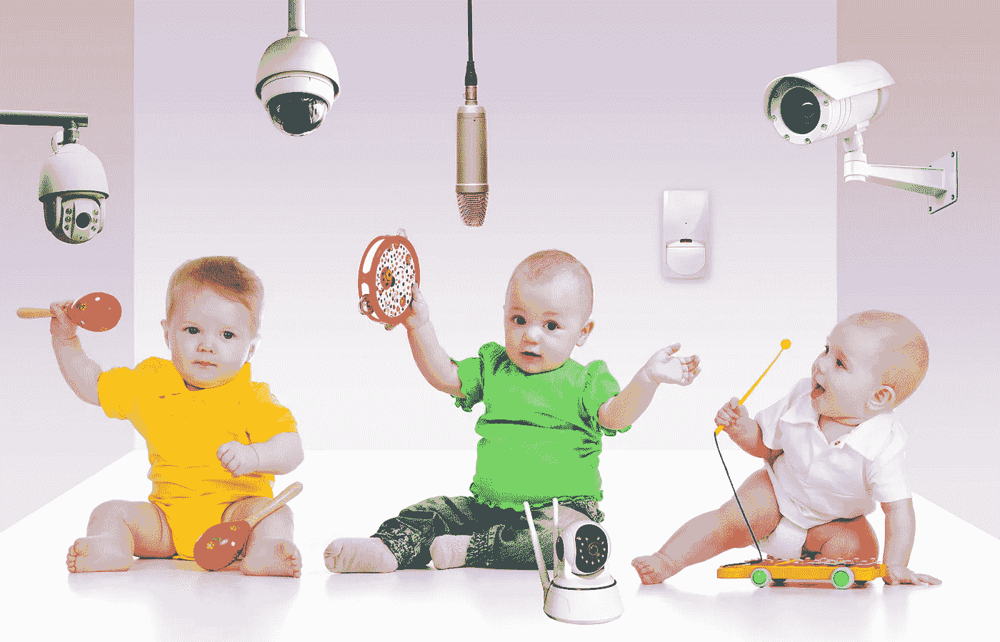

# 日托应用程序的隐私和安全缺陷让老大哥成为了偷窥狂

> 原文：<https://medium.com/nerd-for-tech/privacy-and-security-defects-in-daycare-apps-lets-big-brother-be-a-peeping-tom-900caf5b1c57?source=collection_archive---------0----------------------->

在一个几乎所有事情都存在严重分歧的时代，人们似乎一致同意的少数事情之一是，年幼的孩子应该得到安全保护。每个人都想这样，或者至少说他们想这样。

但像往常一样，先说后做。根据最近的几项调查，在保护上日托和学前班的孩子免受网络威胁方面做得还远远不够。

两个小组——电子前沿基金会(EFF)的几名幼儿家长，以及德国 AWARE7 机构、互联网安全研究所、马克斯·普朗克安全与隐私研究所和波鸿鲁尔大学的研究人员——最近都报告说，旨在让父母参与照顾孩子的应用程序在隐私和安全保护方面令人担忧地缺乏。

许多日托中心和幼儿园都要求家长使用这些应用程序，它们可以提供喂食、换尿布、图片、活动以及哪个监护人接送孩子的通知，所有这些应用程序都被 EFF 称为“克服新入学儿童及其焦虑父母的分离焦虑的潜在有用功能。”

但是，当亚历克西斯·汉考克 for Certbot 的工程总监，她自己也是一个年幼孩子的父母,[问这些应用程序是否安全时,“答案是响亮的不，”她报道说。通过进一步研究，她还发现大多数甚至不提供双因素身份认证(2FA)。](https://www.eff.org/deeplinks/2022/06/daycare-apps-are-dangerously-insecure)

她调查的最受欢迎的网站之一 Brightwheel 甚至没有一个供家长报告安全问题的电子邮件地址。她最终联系到了该公司，并注意到 Brightwheel 今年已经推出了 2FA，并于 6 月 28 日在 YouTube 上发布了关于它的[公告。](https://www.youtube.com/watch?v=vhp8s1PGXig)

**父母的担忧**

但他们是“早期教育行业第一个增加这一额外安全级别的合作伙伴”的声明虽然对汉考克来说是个好消息，但“也可能令人担忧。”

事实上，如果他们是第一个提供 2FA 的，那就意味着其他人都不会这么做。汉考克报告说，她发现其他流行的日托和早期教育应用程序缺乏超过 2FA。

“通过对几个应用程序的静态和动态分析，我们不仅发现了安全问题，还发现了危及隐私的功能，”她写道。这些包括“弱密码策略，脸书跟踪，明文流量启用，以及恶意应用程序查看敏感数据的媒介。”

更令人担忧的是，当她向应用程序供应商指出安全漏洞时，她没有得到感激的回应并发誓要修复它们，而是“几乎没有得到任何回应”

德国研究人员也是如此，他们报告说，他们使用静态和动态分析、配置扫描仪和各种应用程序的隐私政策来分析“42 个安卓儿童护理应用程序及其云后端的隐私和安全。”

他们的发现和 EFF 的一样令人担忧。“任何第三方(跟踪)服务都嵌入在应用程序中，对手可以通过滥用应用程序中的漏洞来访问个人数据，”研究人员说。

然而，只有六家供应商对他们的调查结果做出了回应。

显然，到目前为止，他们并不真的必须这样做，尽管至少在美国，这种收集和分享幼儿数据的行为似乎是非法的。

从 1998 年开始实施的[儿童在线隐私保护法案](https://www.ecfr.gov/current/title-16/chapter-I/subchapter-C/part-312) (COPPA)对“实际知道他们在网上收集 13 岁以下儿童个人信息的其他网站或在线服务的运营商”提出了隐私要求

**多重缺陷**

因此，即使孩子只有 3 或 4 岁，并不知道他们正在向应用程序提供数据，应用程序的运营商肯定知道这一点。正如德国研究人员所说，虽然孩子们不直接使用它们，但这些应用程序“存储和处理了他们的大部分数据。”

那些研究人员还发现，“儿童保育管理应用程序一般会请求几个危险的权限，当使用第三方(跟踪)库时，这一比例甚至更高。分析的应用程序与第三方服务共享用户数据、用户交互、设备数据和应用程序数据……此外，我们发现应用程序的开发者甚至没有在他们的隐私政策中提到使用此类第三方跟踪服务。”

执行该法案的机构美国联邦贸易委员会(FTC)在其网站上发布了 COPPA 的文本。它表示，该法案中的隐私和数据收集要求适用于“任何实际知道正在收集或维护儿童(13 岁以下)个人信息的运营商。”

这些要求包括在其网站上公布其收集的数据以及如何使用、存储和分享这些数据；就数据的收集和使用获得可核实的父母同意；和保护数据的机密性。

联邦贸易委员会公共事务办公室的朱莉安娜·格伦沃尔德说，该机构“不能对具体公司或做法发表评论”，但联邦贸易委员会“提起了 30 多起与 COPPA 有关的执法行动。”

根据联邦贸易委员会 2022 年[提交给国会的报告](https://www.ftc.gov/system/files/ftc_gov/pdf/p155401_coppa_general_project_report_2022.pdf)，在过去五年中提起的 11 起诉讼中，似乎没有一起涉及 EFF 和德国研究小组分析的应用程序供应商。

大多数涉及与为儿童制作游戏或玩具相关应用程序的公司达成的同意协议，尽管最大的两笔罚款是针对 YouTube 和谷歌(1.7 亿美元)以及抖音(570 万美元)的数据收集违规。

**影响易受攻击的漏洞**

这并没有让育儿应用在隐私和安全方面的缺陷比市场上的大多数其他应用更糟糕。软件从来没有，也永远不会是完美的。Synopsys 软件完整性小组的首席科学家萨米·米格斯(Sammy Migues)引用了已故的内布拉斯加大学计算机科学家杰拉尔德·温伯格(Gerald Weinberg)1975 年的一句讽刺性的话，这就是现在众所周知的温伯格定律:“如果建筑商按照程序员编写程序的方式建造建筑物，第一只啄木鸟就会毁灭文明。”

尽管如此，年幼儿童参与其中的事实意味着这些缺陷影响了这个国家最脆弱的人群之一。仅仅因为软件不完美并不意味着它不能变得更完美。应用程序供应商可以实施多种基本的安全和隐私措施，以使自己远离安全专家称之为网络攻击者“唾手可得的果实”的类别。

EFF 建议

*   让所有管理员和员工都可以使用 2FA
*   修复移动应用程序中已知的安全漏洞
*   披露并列出任何追踪器和分析，以及它们是如何使用的
*   使用[强化的](https://www.cisecurity.org/cis-hardened-images)云服务器映像，并建立一个流程来持续更新这些服务器上的过时技术
*   锁定托管儿童视频和照片的任何公共云存储桶。这些不应该公开
*   在学校和家长之间使用端到端加密消息传递
*   创建报告漏洞的安全渠道

Synopsys 软件完整性小组的高级产品经理 Debrup Ghosh 称 2FA 是“最低限度的安全措施”。这应该是您今天的必备功能。”

他说，这应该包括使用一次性代码链接的无密码认证，既方便又安全得多。

他还建议日托和早教中心做一些安全众包。“我建议他们深入社区，寻求志愿者来帮助评估这些应用，”他说。

对于使用这些应用的父母和其他成年人，“确保你理解并行使你在 COPPA 或[在加州]加州消费者隐私法中的权利。他们提供了大量的数据保护，防止你的数据被出售，”他说。

对于这一建议，德国研究人员补充说，供应商和他们的客户/用户之间显然需要更好的透明度。

他们写道:“我们的结果表明，(分析应用的)隐私政策对数据收集做法不清楚，没有说明公司如何保护儿童的数据，并且少报了与第三方服务共享的数据范围。”

“令人担忧的是，一些测试应用依赖于错误配置的云存储，允许任何人访问和下载数据，从所有儿童的活动、消息到个人照片。”

**应该有法律**

父母意识的增强导致实质性变化的可能性有多大？新思软件完整性小组的应用工程师迈克尔·怀特说，这可能来自更多的政府参与。

乔·拜登总统 2021 年 5 月[关于网络安全的行政命令](https://www.federalregister.gov/documents/2021/05/17/2021-10460/improving-the-nations-cybersecurity)中关于产品标签的一节以及英国一项关于产品安全的拟议法律将要求“零售商、批发商、进口商和制造商对其产品的成分和来源保持透明。特别是在拟议的英国法规的情况下，对不遵守规则的零售商和进口商也有经济处罚，”他说。

很难想象会有多少人反对这些。正如今年早些时候成为联邦贸易委员会委员的阿尔瓦罗·马丁·贝多亚在关于 COPPA 政策的一份声明中所说，“孩子们有权在隐私中学习。”