# 概率。排列，变化，组合。

> 原文：<https://medium.com/nerd-for-tech/probabilities-permutations-variations-combinations-9a9ce06eea0b?source=collection_archive---------0----------------------->

完全披露:我自己也在学习这个，所以这些是我写给自己的笔记。我会仔细检查我写的东西，但是如果有任何奇怪的地方，请告诉我。

# 概括起来

在开始时做总结，因为一旦理解了概念，它可以作为参考(在总结之后解释)。

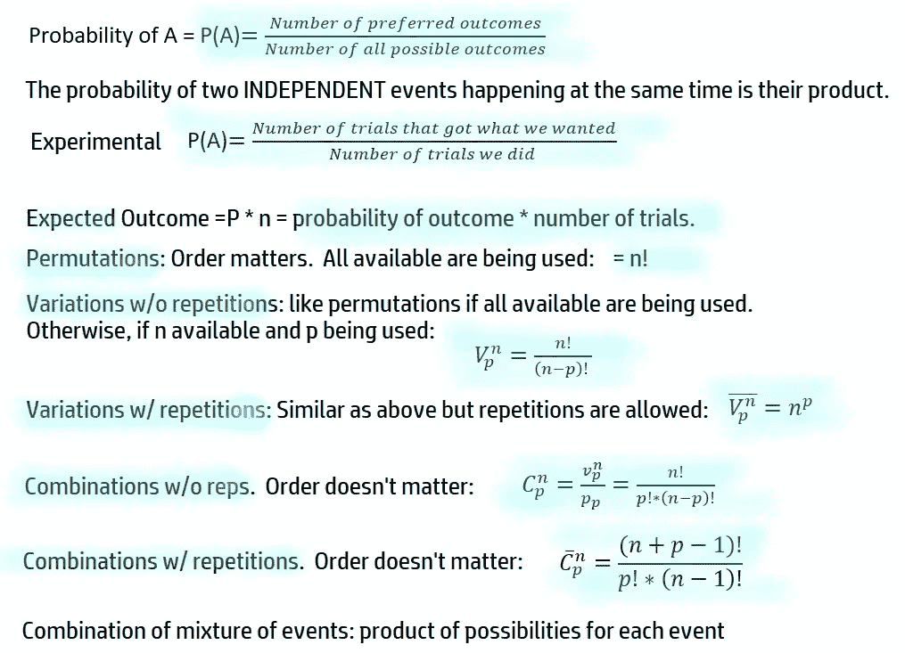

# 可能性

某件事发生的概率通常用 0 到 1 之间的数字来表示。(0≤ x ≤ 1)。

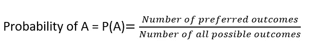

如果我们有可能性 A，B，C，D，得到 A 的概率是多少(我们只有一个 A，所以首选结果的数量是 1？

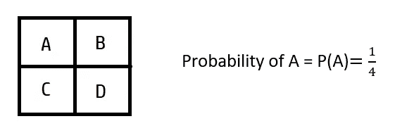

如果我们想要得到 A 或 B 的概率，那就是 2/4= 0.5。如果我们的选项是 A，A，C，D (2 个 A ),那么得到 A 的概率是一样的。

两个独立事件同时发生的概率是它们的乘积。

在下一个例子中，我们有 A，A，C，D 和 A，A，C，D 个可能性，我们想知道在其中一个中得到和 A，在另一个中得到 a C 的概率。

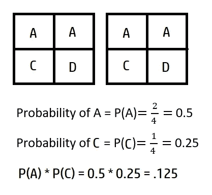

有时候我们并不知道所有可能的结果，也无法计算出理论概率，就像上面计算的那样。在这种情况下，我们可以计算**实验概率**(基于我们的实验)。我们试得越多，它就越准确。

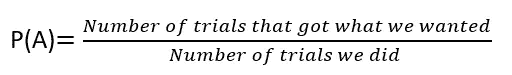

让我们仍然用 A，B，C，D 选项来试试。我们想得到 A，我们要做 50 次(我们也要做 100 次和 200 次试验)。(只是用 1 到 4 之间的 JavaScript 随机数和四个字母的数组来做这件事)

**50 场试炼:**

**A**B C B B B**A**C**A**B**A**B D C B C B C**A**B C D B C B D**A**C**A**C**A**B C**A**C**A**D**A**

有了 50 个，我们就有 15 个 a/50 个试验= **0.3** 。理论上应该是 1/4 = 0.25，所以没那么接近。又来了？

D B C B**A**B B B B D**A**B B D C C D C D C**A A A**C C C C D B**A**C B D B**A**C**A**D**A**B**A**B D C D C**A**D**A**C

现在我们又得到了 15 个 a！不过巧合的是:-)

**100 次试验:**

C**A A A A A A**B**A A A A A**B D**A**C C D D D**A**C B**A A A A A A**C B C B C D C B C D C B C**A**C B C C C D C D C D C**A**C**A**C**A**D D D D D B C D B C D B D B C B C B C B C B C B B B **C B D D B B B B B D C D D D B B B B**A**D C B C D C D C C B D C B**A**C D**A**C B**A**C**A****

所以现在，实验概率是 27/100 = .27。

再做一次:

C B C**A**B B C B C B C B C D D B D D C B**A**C C D C B**A**B**A**C B B B D**A**C D D D D**A**D**A**D**A**D C D C D CD**A**C**A**D D**A**C C C D D**A**D D B B B D**A**B**A**D**A**D D C D C D C**A**B**A**D

现在我们得到:23/100 = .23

**200 次试验(仅一次):**

C B**A**C D**A**D C**A**B D**A**D**A**D**A**B D C C D C D**A**B D D C C B**A**D C D C D C D C D C D C D B**A**B D D D D D C D C D C**A**D **B D**A**D C B**A**D B D D D D**A**D B**A**C D D D D D**A**C C D C D C**A**D C B C C D C D C D C D C D B D C D C D B D B D**A**B C D C D D D B D B D B D B D B D B D B D B D**A**B D B D C D C D C D C D B D D D D D D D D D D D B D B D C C D D D B B B C**A**B**A**D C B C C D D C B B B**A**D C B B B C C D**A**B B B B**A**C D C D C D B B B B**A**D**A**B B B**A**D D B**D B D**A**C B C B D B D B D B D**A**B D D B**A**

我们得到 43/200 = 0.215

只是为了好玩，让我们用 2000 做一个，但我不会自己去数，所以我不会粘贴或标记结果。让程序检查我们得到了多少，我们得到:519/2000 = 0.2595。同样:481 /2000 = 0.2405

所以试验越多，我们就越接近真实(理论)概率。

知道了概率，我们能期望得到什么？

# 期待结果

预期=P * n =结果概率*试验次数。

上面的公式在我们讨论 A，B，C，d 的时候有点傻，在我们讨论数字，对一个区间感兴趣的时候更有意义。

给定下面的方块:

p(蓝色)= 6/12 = 0.5

p(粉色)= 2/12 = 0.1666…

p(黄色)= 4/12 = 0.333…

如果我们只做一个镜头，上面的预期结果将是 P(蓝色)* 1 次+ P(粉红色)* 1 次+P(黄色)* 1 次。

当我们考虑到以下几点时:

20 * . 5+10 * 0.166+5 * 0.333 = 10+1.66+1.665 =**13.325**将是预期的结果。

如果我们随机得到一个正方形 50 次:P B B B B B B B B B B B B B B B B B B B B B B B B B B B B B B B B B B B B B B B B B B B B B B B B B B B B B B B B B B B B B B B B B B B B B B B B B B B B B B B B B B B B B B B B B B B B B B B B B

P =粉色= 9，B =蓝色= 26，Y =黄色= 15

只是来看看(次数*点数):9 * 10 + 26 * 20 + 15 * 5 = 90 + 520 + 75 = 685。除以 50 次试验:685 / 50 = **13.7**

如果我们做 200 次呢？：

Y Y Y Y Y Y Y Y Y Y Y Y Y Y Y Y Y B Y Y B Y Y B Y Y B Y B Y B Y B Y B Y B Y B Y B Y B Y B Y B Y B Y B Y B Y B Y B Y B Y B Y B Y B Y B Y B Y B Y B Y B Y B Y B Y B Y B Y B Y B Y B Y B Y B Y B Y B Y B Y B Y B Y B Y B Y B Y B Y B Y B Y B Y B Y B Y B Y B Y B Y B B Y B Y B Y B Y B Y B Y B Y B B Y B Y B B B Y B Y B B Y B Y B Y B Y B B B Y B Y B Y B Y B Y B Y B B B Y B Y B B B B B Y B Y B Y B Y B Y B Y Y Y Y Y B Y B Y B Y B Y B Y B Y B Y B Y B B B B B Y B Y B B B Y B B B B B B Y B B B B Y B B B B B Y B B B B B B B B Y B B B B Y B B Y B B B B B B B B B B B B B B B B B B B B B Y B Y B Y B B Y B B B Y B B B B B B B B B B B B B Y B Y B Y B Y B Y B Y B Y B Y B Y B Y B Y B Y B Y B Y B Y B Y B Y B Y B Y B Y B Y B Y B 粉红色:35，蓝色:95，黄色:70

还是那句话，就来看看:35 * 10+95 * 20+70 * 5 = 350+1900+350 = 2600

除以 200: 2600 / 200 = **13**

再来一个，3000(不过我这里就不全贴了，只贴结果)。粉红色:483，蓝色:1534，黄色:983。

483 * 10 + 1534 * 20 + 983 * 5 = 4830 + 30680 + 4915 = 40425.除以 3000 = **13.475**

# 频率和概率频率分布

频率是每个结果出现的次数，所以我们上面的粉红色、蓝色和黄色的数据就是这些的频率。

概率频率分布是表示每个事件发生的概率的图表。大概是这样的(注意它们加起来是 100%，可以用 0-1 来代替):

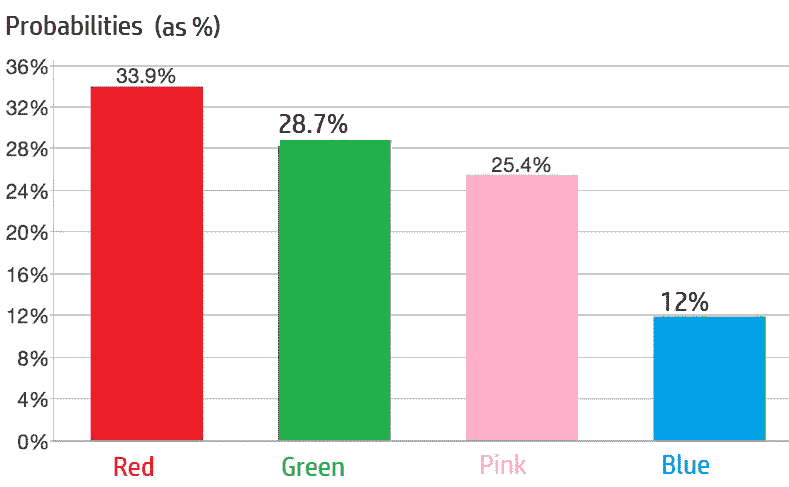

一个事件是一定的结果。它的**补充**是事件所没有的一切。

**P(A)= 1—P(A ')**= =>A 的 P 和它的补码 P 之和为 1。

# 排列

我们可以排列一组元素的方式的数量。这意味着，我们有一组元素，我们想看看有多少种不同的方式可以排列它们(有点像排序)。

例如，我们有 3 幅画 1，2，3，我们要把它们挂在墙上，排成一排。我们有多少种不同的方法可以做到这一点？(多少种排列)。记住，顺序很重要(位置)。

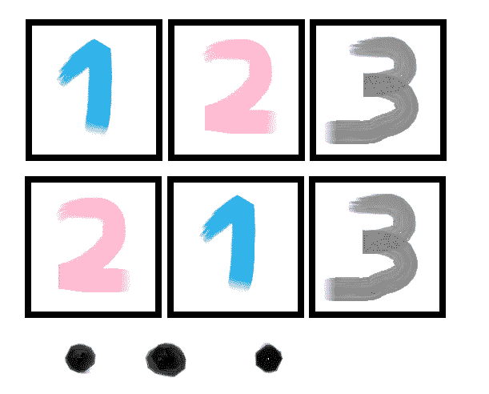

**排列= n！** = 3！= 3*2*1 = 6.6 种布置墙上画作的方法。

只是一些关于阶乘的信息:

**0！= 1**

**(n+1)！= (n+1) * n！**

**(n+k)！=(n+k)……(n+2)*(n+1)n！**

**(n-k)！= n！/ k！**

# 没有重复的变化

在上面的例子中，我们在墙上有 3 幅画和 3 个点。但是如果我们有 5 幅画，但墙上还有 3 个斑点呢？

我们仍然没有重复(相同的画在 2 个点)，仍然有 3 个点，但我们有 5 个候选人(必须从这 5 个中选择 3 个)。那么我们有多少种方法可以做到这一点呢？

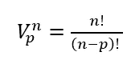

因此，对于我们的情况，我们将有变量= 5！/ (5–3)!= 5!/ 2!=(5 * 4 * 3 * 2 * 1)/(2 * 1)= 5 * 4 * 3 =**60。**

看看吧，我用这些数组来表示绘画并存储这些点:var**paints =[1，2，3，4，5]；**var spots =[]；我将有 3 个循环来遍历所有的画(从 0 到< 5)，并跳过重复的。以下是墙上挂 5 幅画中的 3 幅的可能方式:
、【1、2、3】、【1、2、4】、【1、2、5】、【1、3、4】、【1、3、5】、
、【1、4、3】、【1、4、5】、【1、5、2】、【1、5、3】、【1、5、4】、【2、1、 3 ]，[ 2，1，4 ]，
，[ 2，1，5 ]，[ 2，3，1 ]，[ 2，3，4 ]，[ 2，3，5 ]，[ 2，4，1 ]，[ 2，4，3 ]，
，[ 2，5，1 ]，[ 2，5，3 ]，[ 2，5，4 ]，[ 3，1，2 ]，[ 3，1，4]，[ 3，1，5，5]，[ 3，2，2]
[ 3，2，4 ]，[ 3，2，5 ]，[ 3，4，1 ]，[ 3，4，2 ]，[ 3，4，5 ]，[ 3，5，1 ]，
，[ 3，5，4 ]，[ 4，1，2 ]，[ 4，1，3 ]，[ 4，1，5 ]，[ 4，2，1 ]，[ 4，2，1 ]，[ 4，2，3 ]，[ 4，2，5 ]，[ 4，2，5]，
，[4，3] 2 ]，[ 4，3，5 ]，[ 4，5，1 ]，[ 4，5，2 ]，[ 4，5，3 ]，
，[ 5，1，3 ]，[ 5，1，4 ]，[ 5，2，1 ]，[ 5，2，3 ]，[ 5，2，4 ]，[ 5，3，1 ]，[ 5，3，2 ]，T10，[ 5，3，4 ]，[ 5，4，1 ]，[ 5，5，5]

# 重复的变化

仍然使用画的例子，仍然有 5 幅画和 3 个点，但是，现在我可以获得每幅画的额外副本，并且我可以在墙上的两个或更多点上画#1。现在我不在乎重复，所以我的可能性是:

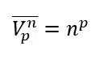

所以在我们的例子中，我们得到 5 的 3 次方= 125。

当我删除前面代码中的等式检查时，我们会得到以下选项:

[ 1，1，1 ]，[ 1，1，2 ]，[ 1，1，3 ]，[ 1，1，4 ]，[ 1，1，5 ]，[ 1，2，1 ]，
，[ 1，2，3 ]，[ 1，2，4 ]，[ 1，2，5 ]，[ 1，3，1 ]，[ 1，3，2 ]，[ 1，3，3 ]，[ 1，3，4 ]，
，[ 1，3，5 ]，[ 1，3，5] 1 ]，[ 1，4，2 ]，[ 1，4，3 ]，[ 1，4，4 ]，[ 1，4，5 ]，[ 1，5，1 ]，
，[ 1，5，2 ]，[ 1，5，4 ]，[ 1，5，5 ]，[ 2，1，1 ]，[ 2，1，2]，[ 2，1，3 ]，
，[ 2，1，4 ]，[ 2，1，5 ]，[ 2，2，2，2] 2，2 ]，[ 2，2，3 ]，[ 2，2，4 ]，[ 2，2，5 ]，
，[ 2，3，2 ]，[ 2，3，3 ]，[ 2，3，4 ]，[ 2，3，5 ]，[ 2，4，1 ]，[ 2，4，2 ]，
，[ 2，4，3 ]，[ 2，4，4]，[ 2，4，4]，5]，[ 2，5，1 ]，[ 2，5，1 ] [ 2，5，3 ]，[ 2，5，4 ]，
，[ 2，5，5 ]，[ 3，1，1 ]，[ 3，1，2 ]，[ 3，1，3 ]，[ 3，1，4 ]，[ 3，1，5 ]，
，[ 3，2，2 ]，[ 3，2，3 ]，[ 3，2，4 ]，[ 3，2，4]，[ 3，2，5 ]，[ 3，3，1 ]，[ 3，3，2 ] 3 ]，
，[ 3，3，4 ]，[ 3，3，5 ]，[ 3，4，1 ]，[ 3，4，2 ]，[ 3，4，3 ]，[ 3，4，4 ]，[9]，[ 3，5，1 ]，[ 3，5，2 ]，[ 3，5，3 ]，[ 3，5，4 ]，[ 4，1，1 ]，[ 4，1，2 ]，T10 [ 4，1，4 ]，[ 4，1，5 ]，[ 4，2，1 ]，[ 4，2，2 ]，[ 4，2，3 ]，[ 4，2，4 ]，T11，[ 4，2，5 ]，[ 4，3，1 ]，[ 4，3，2 ]，[ 4，3，4 ]，[ 4，3，4]，[ 4，3，5 ]，[ 4，4，1 ]，T12，[ 4，4，2 ]，[ 4，4，3，3 ] 4 ]，[ 4，4，5 ]，[ 4，5，1 ]，[ 4，5，2 ]，[ 4，5，3 ]，T13，[ 4，5，4 ]，[ 4，5，5 ]，
…25 多项

count = **125**

# 组合

在上面画的例子中，墙上的画是 1，2，3 和 3，2，1 是不一样的。但是如果我没有把画挂在墙上，而是把它们放在一个盒子里运输，在这种情况下，顺序并不重要。

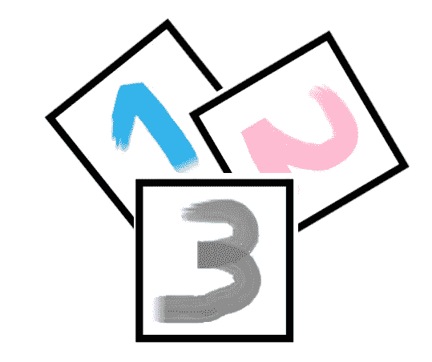

变化会重复计算，因为顺序很重要。所以，如果我有 5 幅画，但只想送 3 幅，我有多少种组合？

**我放在盒子上的 3 幅画的组合数与我放在盒子外面的 2 幅画的组合数相同。我们可以用这个来简化计算，使用更小的数字**。

那么五幅画中的三幅能给我们带来什么呢？

C = 5！/ (3!)(2!)=(5 * 4 * 3 * 2 * 1)/(3 * 2 * 1)(2 * 1)= 20/2 =**10。**

我们用数组试试:
【1，2，3】，【1，2，4】，【1，2，5】，【1，3，4】，【1，3，5】，
，【2，3，4】，【2，3，5】，【2，4，5】，【3，4，5】，
**10**

我们也可以允许组合上的**重复。顺序并不重要，但是我们可以重复。现在的公式是:**

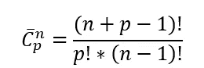

对于与上面相同的示例，将 5 幅画中的 3 幅放入装运箱中(但这次我们可能不止一次放入画 1):

(n+p-1)！/ (p！* (n-1)！) = (5+3–1)!/ (3!*4!) = 7!/ 3!*4!=

(7 * 6 * 5 * 4 * 3 * 2 * 1)/3 * 2 * 1 * 4 * 3 * 2 * 1 =(7 * 6 * 5)/3 * 2 * 1 = 210/6 =**35**

看看我用代码得到了什么(我们要跳过已经在“盒子”里的，不分先后顺序:
[ 1，1，1 ]，[ 1，1，2 ]，[ 1，1，3 ]，[ 1，1，4 ]，[ 1，1，5 ]，[ 1，2，2 ]，
，[ 1，2，3 ]，[ 1，2，4 ]，[ 1，2，5 ]，[ 1，3，3，4 ]， [ 1、3、5 ]，
，[ 1、4、4 ]，[ 1、4、5 ]，[ 1、5、5 ]，[ 2、2、2]，[ 2、2、3 ]，
，[ 2、2、5 ]，[ 2、3、3]，[ 2、3、4 ]，[ 2、3、5 ]，[ 2、4、4、4 ]，[ 2、4、4、5 ]，
，[ 2、5、5、5 ]，[ 3、3、5] 4 ]，[ 3，3，5 ]，[ 3，4，4 ]，[ 3，4，5 ]，
，[ 3，5，5 ]，[ 4，4，4 ]，[ 4，4，5 ]，[ 4，5，5]，[ 5，5，5 ]
**35**

组合可以是不同较小事件的**混合。例如:**

主菜(三明治、意大利面、鱼)

配菜(汤、沙拉)

饮料(汽水、葡萄酒)

我们可以有多少种组合？3 * 2 * 2 = 12 份午餐菜单。

好吧，这是很多，希望一切都是正确的，不要太混乱。