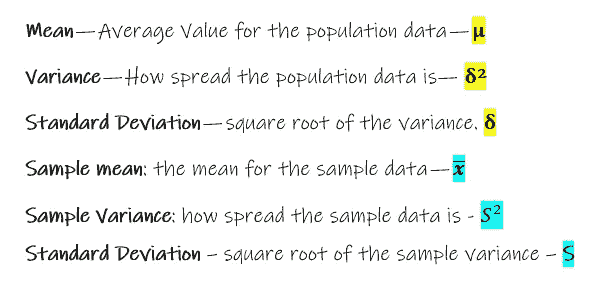
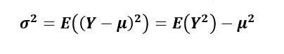
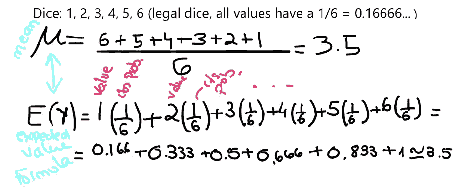
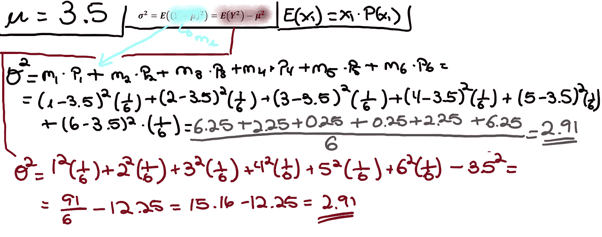
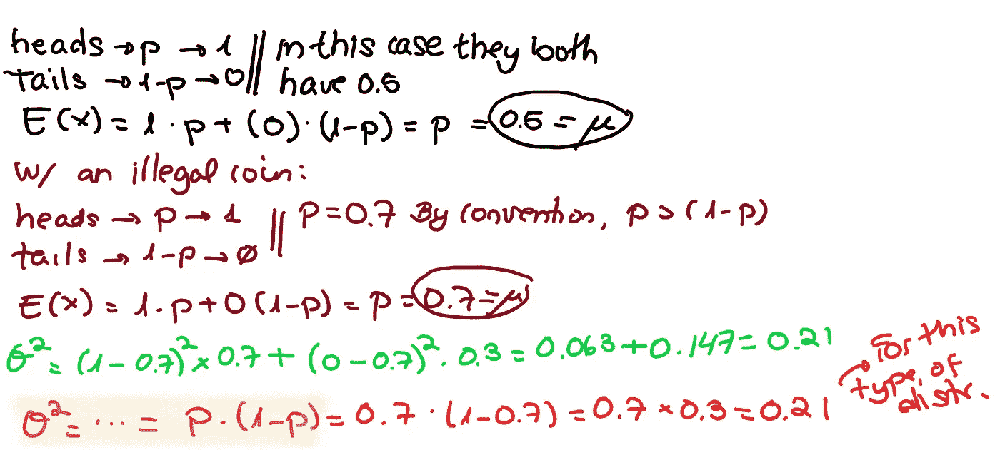
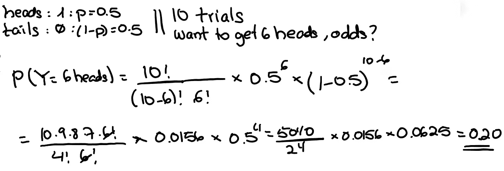
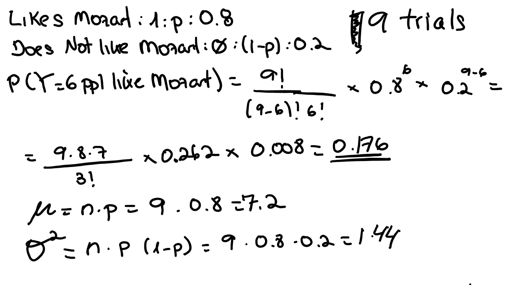
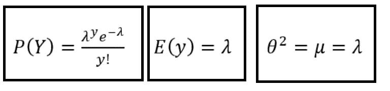
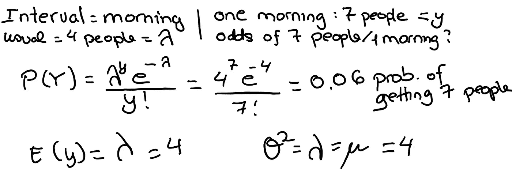

# 概率分布——离散分布的总结

> 原文：<https://medium.com/nerd-for-tech/probability-distributions-a-summary-of-discrete-ones-11f12f7aa0c5?source=collection_archive---------3----------------------->

我不是这方面的专家，这些是我的总结笔记，所以如果我误解了什么，请让我知道:-)开始吧！

注意:我有另一篇文章你可能想先[看看](/nerd-for-tech/probabilities-permutations-variations-combinations-9a9ce06eea0b)

# 只是一些一般概念

概率分布提供了不同可能发生的概率。**我们可以把一个事件的实际结果表示为 Y，其中一个可能的结果可以是 y** 。

`P(Y = y) can also be indicated with P(y)`

我们可以称 P(y)为概率函数。P(5)是得到 5 的概率。

**人口数据**:所有数据

**样本数据**:总体数据的子集

数据越接近中间值或均值(或期望值)，数据越不分散。

均值和方差之间有一个恒定的相关性。(后面的公式示例)。

# 离散和连续分布

当我们有有限数量的结果时，我们有一个**离散**分布。当我们有无限的结果时，我们有一个连续的分布。有时，我们认为数据**是离散的还是连续的**取决于我们如何测量。我们只是要用一些舍入吗？然后，我们可以假设数据是离散的(例如，我们只取整数)。如果不是，只要我们能有一个无限小数的值(例如)，我们就有一个连续分布。

**离散分布的特征:**

*   有限数量的结果
*   可以用表格或图表来表示
*   期望值可能无法达到(当我们只处理整数时，是 2.5)
*   我们通常用条形图来表示数值。
*   **P(y ≤ y) = P( y < y+1)**

**连续分布的特征:**

*   无限数量的值
*   不能只是将值相加就得到结果
*   用图形或连续函数表示(不是条而是曲线)

**离散分布类型:**

当所有结果的可能性相等时，我们有一个等概率均匀分布或均匀分布。

当我们只有 2 种可能的结果和 1 次试验时，我们有一个**伯努利分布。**如果我们取一个伯努利分布并重复多次(多于 1 次试验)，我们就得到一个**二项分布。**

如果我们想测试一个事件有多不寻常，我们需要一个**泊松分布。**

**连续分布的类型:**

我们用曲线来表示。最后的值被称为**异常值**。当我们只有一个原始数据的样本时，就不再是一个**正态分布**，而是一个**学生的-T 分布**。在这种情况下，可能存在正态分布中非常极端(概率非常低)但在样本分布中出现几次的值，因此被过度表示。

当值从零开始并且只有负值时，我们可以有一个**卡方分布**。不常见。当事件在早期快速变化时，我们有一个**指数分布。**当我们使用它们进行预测时，我们有一个**逻辑分布。**

在本文中，我将只讨论离散分布。

# 均匀分布(离散)

我们用 U 来表示这种分布。

`**X ~ U (3,7)**` : x 遵循 3 到 7 之间的值的均匀分布。

在均匀分布中，所有的结果都有相同的概率。在这种情况下，可以计算平均值和方差，但它们并不真正提供任何可预测性值。例如:

上面显示了如何计算离散分布的平均值(或期望值)，因为所有值都有相同的概率。 **由于分布均匀，上述两种计算方法产生的结果相同**。**如果所有结果的概率不同，平均值就不会与上面计算的算术平均值相同。**

我们有以下先前显示的公式:

以骰子为例:

如前所述，当所有结果具有相同的概率时，可以计算平均值和方差，但不能用于预测任何事情。

# 伯努利分布(离散)

我们把这个标为`**Bern**(p)`而不是`**U**(p).`

在这个分布中，我们只有两个可能的结果和一个试验。因为我们只有两种可能的结果，一种是概率 p，另一种是(1-p)。我们通常知道概率，或者可以从以前的数据中计算出来。

按照这种类型分布的惯例，我们将 0 分配给一个结果，1 分配给另一个结果。同样按照惯例，我们取 p> (1-p)。此外，p 将被分配 1，而(1-p)将被分配 0。

`E(X) = 1 * p + 0 * (1-p) = p.`

典型的例子是扔硬币，只扔一次。

# 二项式分布(离散)

类似于伯努利试验，但现在我们有多个试验，而不是一个。每次试验仍然只有两种可能的结果。

我们用`B(n,p)`来表示它，其中 n 是试验的次数，p 是每次试验成功的概率。

二项式分布的公式是:

在上面的例子中，n 是我们将要做的试验的次数，y 是我们想要得到的成功结果的次数(我们将 p 分配给我们认为成功的结果)。

例如，我们每次试验只需要 2 种可能的结果。让我们从著名的硬币开始，在这种情况下 p = 0.5 和(1-p) = 0.5(就像我们在伯努利部分看到的那样)。

我们将抛硬币 10 次，**，我们想知道得到 6 个头的概率。**由以上公式可知。

根据我们用来计算平均值的 E(x)公式，经过简化

`**E(y) = n * p**`

`**variance = n * p * (1-p)**`

再比如。一个人可以喜欢或不喜欢莫扎特(两种可能的结果)。我们知道 80%的人喜欢莫扎特(我们没有，我只是说说而已)。如果我们选择 9 个人，其中 6 个人喜欢莫扎特的几率有多大？

# 泊松分布(离散)

当我们想知道某个事件在给定的**时间间隔**或距离(间隔，不是试验次数)内发生的可能性。当我们得到与正常情况不同的东西时，我们用它来找出可能性有多大。

例如，你有一家商店，通常每天早上有 4 个人，但有一天早上有 7 个人。这种可能性有多大？

这些事件从零开始上升(没有负值)。

这种类型分布的方程式是:

根据上面的商店示例:

这太长了，所以我将把连续分布留给另一篇文章。我希望这是清楚和正确的:-)。