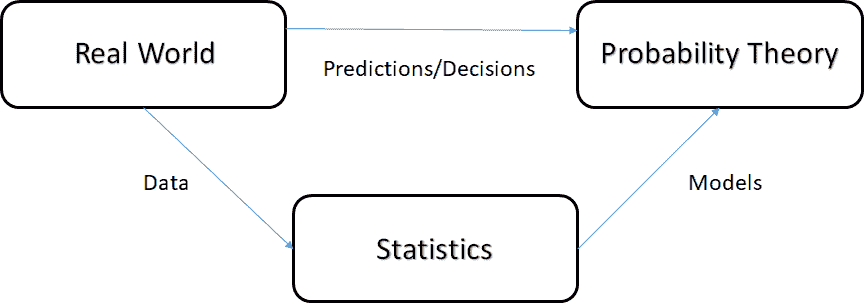
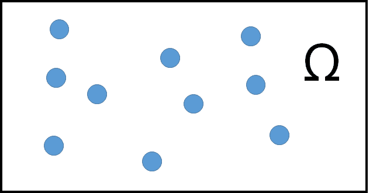
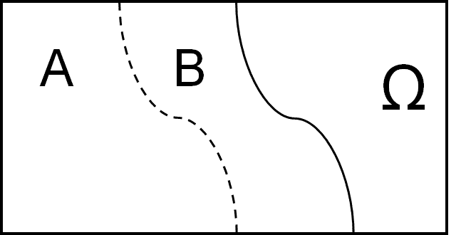
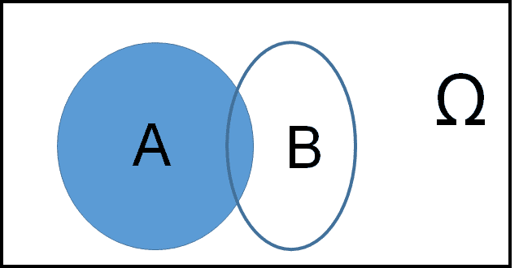
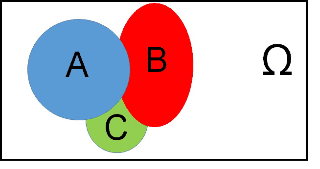
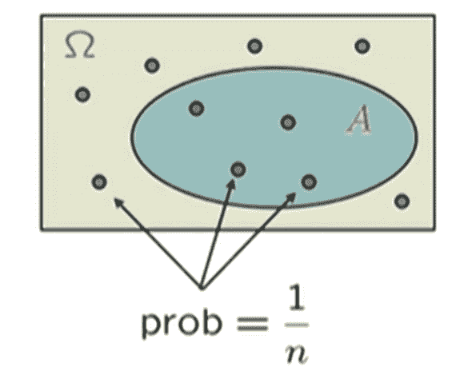
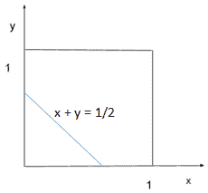

# 概率——不确定性的科学

> 原文：<https://medium.com/nerd-for-tech/probability-the-science-of-uncertainty-76876b1a8c9c?source=collection_archive---------10----------------------->

在很长一段时间里，我无法理解概率概念。特别是将概念与现实世界的场景联系起来。我最近在攻读麻省理工学院微观硕士学位时就同一主题所做的课程对我克服这一点帮助很大。我计划创建一系列文章，直观地理解概率的关键概念，并了解统计、概率和数据科学领域之间的相互作用。

人生无常。

现在，我们如何在这种不确定性中做出决策？

我们的大部分决策都是直接或间接地利用以前获得的信息做出的。同样的逻辑也适用于机器。它需要一些适当的方法来处理已经可用的信息，进行预测并结合新的信息，以迭代地提高这些预测的准确性。

从现实世界推断数据需要大量的统计学应用，概率是大多数统计学所需的基础和语言。在某种程度上，数据科学本质上是类固醇统计！要真正掌握机器学习并影响决策，必须从理解概率的关键概念开始。

人们根据统计数据从真实世界的数据中做出推断。然后根据这些推论建立模型。现在，基于这些模型，对所有可能事件的可能性进行分析和预测。然后根据各种事件的可能性在现实世界中做出决策。

遵循这个系列来发展对概率概念的直观理解。到本文结束时，你将能够使用概率模型对任何场景进行建模，并对各种结果的可能性进行评论。它也将作为本系列其他文章的基础。

*   **概率模型和公理**
*   **制约与独立**
*   **计数概念**
*   **离散随机变量**
*   **连续随机变量**
*   **关于随机变量的进一步主题**
*   **贝叶斯推理**
*   **极限定理和经典统计学**
*   **伯努利和泊松过程**
*   **马尔可夫链**

在这篇文章中，我将用连续和离散随机变量的例子来介绍**概率模型和公理**。有了离散变量，某些概念更容易理解，这是不变的事实。因此，我们将肩并肩地探索连续的对应物，以便真正理解所讨论的概念。

1.  **样本空间**
2.  **概率定律——公理和性质**
3.  **离散和连续例子**
4.  **可数可加性**
5.  **数学的微妙之处**
6.  **概率的解释**

**样本空间**

样本空间是所有可能结果的列表(集合)。这个列表必须是互斥的，集体详尽的，并且粒度正确。

最终定义样本空间有两个步骤

1.  描述可能的结果
2.  描述对结果可能性的信念

因此，抛硬币的可能样本空间ω可以是**{正面，反面}** 。

但是根据样本空间中包含的其他因素，可能会添加额外的事件，并且样本空间可以更改如下。

**{正面下雨，正面不下雨，反面下雨，反面不下雨}**

即使下雨和扔硬币没有因果关系。这是一个完全可以接受的样本空间，因为它包含了所有可能的场景，并且所有事件都是互斥的。虽然，人们可以试验粒度。

**{正面下雨，正面不下雨，反面}** 也是一个完全可以接受的样本空间。

**{头下雨，尾巴没下雨，尾巴}**

然而，这不是一个有效的样本空间，因为它排除了“正面无雨”事件，而且事件“反面无雨”和“反面”并不相互排斥。

现在，让我们来讨论一个连续的样本空间。

如果一个人在由 x-y 轴限定的单位正方形内投掷飞镖。x 和 y 被无限精确地记录下来。样本空间就是介于 0 和 1 之间的一组 x-y 对。

ω=(x，y)使得 0 <=x , y<=0

An event therefore is generally associated with a subset of sample space because probability of a single point is 0.

**概率公理**

有趣的是，只有三个概率公理可以用来推导概率的所有其他性质。

1.  非负 P(A)>=0:样本空间中任何事件发生的概率大于或等于 0。
2.  归一化 P(ω)= 1:样本空间所有事件的概率总和等于 1。
3.  有限可加性:如果事件 A 和 B 互斥，它们并的概率等于 A 和 B 各自概率的总和。

也就是说，如果 A ∩ B = ɸ，那么 P(A ∪ B) = P(A) + P(B)

概率的性质

*   **P(A) > =0 暗示 P(A) < =1**

由于 1 = p(ω)= p(a∪AC)因此，p(a)= 1—p(AC)<=1

*   **p(ω)= 1 暗示 P(ɸ)=0** 由于样本空间包含所有可能的事件，而ɸ不包含任何事件。ɸ的概率是 0。
*   对于不相交事件 P(A ∪ B) = P(A) + P(B)。该属性可以扩展到 k 个不相交的事件，如下所示:

**P(A∪B∪C)= P(A)+P(B)+P(C)**

由于 P(A∪B∪C)= P((A∪B)∪C)= P(A∪B)+P(C)= P(C)

类似地，对于 k 个不相交的事件

**P({s1，s2，..sk}) = P(s1) + P(s2)… + P(sk)**

**概率的更多性质**

现在让我们继续学习一些你小时候就已经记住的概率属性。是的，所有这些都可以从我们讨论过的公理中推导出来。

1.  如果 a 是 b 的子集， **A ⊆ B** ，那么 **P(A) < =P(B)**

因为，b 可以与 a 和 Ac 同时出现，所以 b = a ∨( b⋂AC)

P(B) = P(A) + P(B ⋂ Ac) >= P(A)

2.可以说，最常用的属性之一:

**P(A ∪ B) = P(A) + P(B) — P(A ⋂ B)**

设 a = P(A ⋂公元前)b=P(A ⋂ B) c=P(Ac ⋂ B)

P(A ∪ B) = a+b+c

p(a)+p(b)—p(a⋂b)=(a+b)+(b+c)—b = a+b+c

**3。P(A ∪ B) < = P(A) + P(B)** (联合约束)

不一定不相交的区域 A、B 和 C 的概率总和可以表示为蓝色、红色和绿色区域的总和，也就是说，

**p(a∪b∪c)= p(a)+p(AC⋂b)+p(AC⋂BC⋂c)**

**离散统一定律**

设ω是 n 个同等可能性事件的集合，每个事件的概率为 1/n。设事件 A 由 k 个同等可能性事件组成。在这种情况下，根据加法定律

P(A) = 1/n + 1/n… k 倍，意味着

**P(A) = k*1/n**

这个定律被称为离散概率定律。

**均匀概率定律**

在连续样本空间的情况下，不可能计算有利结果的数量。也就是 k 没有定义。但幸运的是，还有一种选择。连续样本空间的概率定义为有利结果曲线下覆盖的面积。如果应用**均匀概率定律**，则**概率=面积**

让我们考虑前面连续例子中使用的相同样本空间。

让我们来计算我们在实验中得到的两个数字之和小于或等于的概率。

P({(x，y) | x+y <= ½}) = ½*½*½ (½ * base * height) = ⅛

When working with a continuous sample space, visualizing the area of interest graphically becomes the primary task for calculating probability.

It is very important to understand that probability in this case can only be defined in terms of area. The probability of any single point will always be 0\. For example, P({(0.5,0.3)} = 0

**概率计算步骤**

现在，直截了当地说，你如何计算一个事件的概率？请记住上面给出的示例，并遵循以下步骤:

1.  定义样本空间:尝试在图形上真实地可视化样本空间。
2.  指定概率定律:确定哪个概率定律与你最感兴趣的场景最相关。在前面的例子中，我们遵循了均匀概率定律。
3.  识别感兴趣的事件:尝试直观地识别您感兴趣的样本空间子集。
4.  现在只是基础数学。算算。

**可数可加性**

当我们谈论可加性的性质时，非常重要的是要理解它仅在样本空间中的事件计数(k)被定义时才起作用。

想象一个离散但无限的样本空间。假设，我们继续投掷硬币，结果是投掷的次数，直到我们第一次看到正面。

现在假设在给定的投掷中正面朝上的概率是 P(n) = 1/(2^n) n= 1，2

为了使这成为一个合理的概率定律，n 的所有可能值的概率之和应该是 1。在做基本算术时，人们发现这确实是真的。

这个无穷级数的和是 1/(1-(1/2)) = 1。因此，是的，这是一种可能的情况。

现在，想一个一般的场景，假设结果是均匀的。

P(偶数结果)= P({2，4，6，8…})

= P(2) + P(4)+ P(6)..[1](因为集合是不相交的，所以我们使用可加性属性)

= 1/(2 ) + 1/(2⁴) + 1/(2⁶)..= *(1/(1-))[2](利用无穷级数和的性质)

= ⅓

但是[1]可以用于无限多的事件吗？答案是肯定的！多亏了可数可加性公理，

如果 A1，A2，A3..是一系列不相交的事件

P(A1 ∪ A2 ∪ A3..)= P(A1) + P(A2) + P(A3) + …

只要离散事件是可数的事件序列，可加性对于无限的离散事件集是成立的。那是可以按顺序安排的事件。

人们可以认为，即使是连续的样本集，本质上也是无限个离散事件的集合。加法属性在这里也应该有效吗？

答案是否定的。因为这个场景缺少关键字“序列”。人们不能以任何顺序排列样本空间内的无限离散事件。因此，可数可加性公理在这种情况下不成立。

**解读**

“概率”到底是什么意思？

*   如果我们从非常狭义的解释来看，它是数学的一个分支。在实验的无限次重复中，事件 A 的频率是 P(A)。
*   但是概率是频率吗？

也有不直接符合这一观点的情况，比如 P(抛硬币时的正面)= 1/2

p(总统在即将到来的选举中再次当选)

*   从上下文的角度来看，概率通常被解释为一种信念的描述，或者说是你的赌博偏好

我希望现在，在这篇庞大的文章结束时，你已经对概率有了自己的理解。我坚信，不管有多少理论和证据的推动，概率是不确定性的科学。