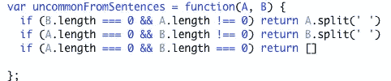
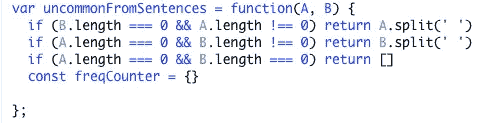
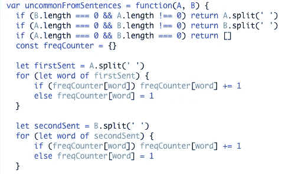
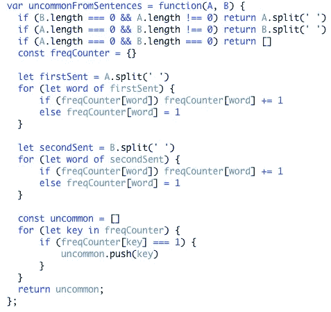

# 问题解决模式:频率计数器

> 原文：<https://medium.com/nerd-for-tech/problem-solving-patterns-frequency-counter-20205a1ecfb7?source=collection_archive---------8----------------------->

计算机科学中最有帮助的问题解决模式之一是众所周知的频率计数器模式。通常用于数组和字符串，它被命名为 frequency counter，因为当我们使用它时，我们创建一个对象或集合来存储字符串或数组中的元素，以及它们在该字符串或数组中出现的次数。更具体地说，元素通常是对象中的一个键，该键的值是该元素被找到的次数。

# 什么时候应该使用这种模式？

频率计数器最常用于(双关语)以某种方式比较数据。我在 Leetcode 上看到的一些可以使用频率计数器的常见问题是比较不同的数组或字符串，比如检查两个字符串是否是彼此的变位。

# 为什么使用这种模式？

通常，使用频率计数器将有助于避免使用嵌套循环，从而降低我们算法的时间复杂度。频率计数器可以很容易地将 O(N)运算降低到更容易接受的 O(N)运算。它可以应用于数组和字符串问题的原因是因为字符串在 JavaScript 中被认为是类似数组的对象，因此您可以使用与数组完全相同的语法来访问和执行字符串的索引操作。

# 让我们用频率计解决一个问题

我选择解决的问题是 Leetcode 问题 [884:“两句话中的生僻字。”](https://leetcode.com/problems/uncommon-words-from-two-sentences/)这个问题要求我们比较两个句子，并返回在其中一个句子中出现过一次，但在另一个句子中根本没有出现的单词列表(以任何顺序)。

## 边缘案例

如果一个或两个句子都是空的，我们需要相应地计划。如果两者都为空，则返回的应该是一个空数组。如果其中一个句子是空的，我们返回另一个句子，但调用"。split(“”)，以确保它作为数组返回。我发现在深入问题的核心之前考虑这些边缘情况非常重要，因为几乎没有什么比在你认为是很好的解决方案上花费大量时间，然后意识到你的代码需要完全重构来处理一些讨厌的边缘情况更糟糕的了。

## 设置频率计数器

这可能是最容易的部分。所有需要做的就是声明一个被设置为等于一个空对象的变量。我选择称它为“freqCounter ”,以使它尽可能具有示范性。

## 检查每个单词的频率

现在我们将把单词作为关键字添加到频率计数器对象中。如果该键已经存在，该值(频率)将增加 1。如果键不存在，它将被添加到对象中，并且值(频率)将被设置为 1。我们将使用 for 循环遍历每个句子，但首先我们需要将句子分成数组，其中每个元素都是句子中的一个单词。一旦我们做到了这一点，我们就可以遍历每个句子，并相应地调整频率计数器。

## 终于到了还生僻字的时候了

此时，我们的频率计数器知道每个单词的频率。这意味着剩下要做的唯一事情就是返回不常见的单词，或者只出现一次的单词。问题促使我们将这些单词作为数组返回，所以首先要做的是声明一个空数组。我选择把它命名为不寻常。从那里，我们可以遍历我们的频率计数器，找到频率值为 1 的键，并将这些键放入我们的不常用词数组中，然后返回它。

非常感谢您的阅读，我希望这篇文章对您有所帮助！