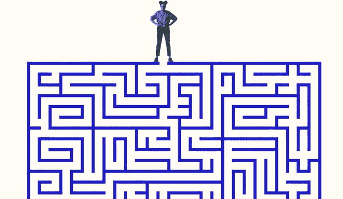

# 问题解决策略和常见模式

> 原文：<https://medium.com/nerd-for-tech/problem-solving-strategy-and-common-patterns-cddb473ae435?source=collection_archive---------4----------------------->

从 Flatiron 软件工程项目毕业后，我感到迫切需要提高自己的算法知识。与我的预期不同，算法学习过程并没有从技术上开始！也就是说，为了解决一个问题而想出一个算法，就要有一个解题策略。

我在这里分享一个被很多开发者使用的常见问题解决策略，在匈牙利数学家 [**【乔治·波利亚】**](https://en.wikipedia.org/wiki/George_P%C3%B3lya) 的 [**如何解决**](https://en.wikipedia.org/wiki/How_to_Solve_It) 中提到过。也就是说，我认为这种模式是一个很好的起点，随着经验的增加，您可以修改步骤。

**问题解决策略由五个主要步骤组成；**
**1。理解问题:**这是我问自己的问题！我能用自己的话重述这个问题吗？
什么是输入和输出？
我应该如何标记属于问题的数据的重要部分。

**2。探索具体的例子:**不管问题有多复杂，从简单的例子开始，然后从更复杂的例子开始。
始终考虑代表边缘情况的示例，如如果输入为空或输入无效怎么办？

**3。分解问题:**无论你是否见过同样的问题，或者你对如何开始解决有一些想法，明确地写下解决问题需要采取的步骤都是有帮助的。这更像是一个组织技巧，帮助你不迷失在混乱的猜测和可能的解决方案中！

**4。简化问题解决:**在你要解决的事情中找到核心难点，暂时忽略！现在想一个简化版问题的解决方案，这通常会使理解问题变得容易得多。
现在把那个难度合并回来。

**5。当解决一个问题时，我们通常不会想到效率，或者至少效率不是首要的。但是有了可行的解决方案后，我们应该回头问自己几个问题；
我的解决方案能一眼看懂吗？有没有更好/更简单的解决方案来提高性能？我能想到其他重构选项吗？其他人会如何解决同样的问题？**

**常见的问题解决模式**
碰巧我们在不同的解决方案中发现相同的模式。换句话说，我们可以应用相同的模式来解决不同的问题，原因是许多问题的核心非常相似，比如在列表中查找元素，或者比较两个元素等。。
因此，我们可以从之前使用的一些常见模式中受益。下面是一些常见问题解决模式的例子；

1.  计数式频率计
2.  多个指针
3.  推拉窗
4.  各个击破

这些只是许多常见模式中的几种。

总之，我认为在面对问题和提出算法之前，有一个解决问题的策略是很重要的。想出一个策略并坚持下去，有助于我们保持工作/解决方案的一致性，同时随着我们更多地使用它而加快速度。