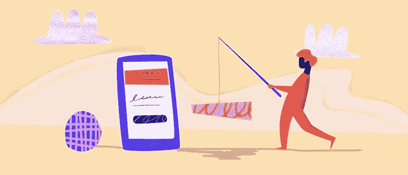
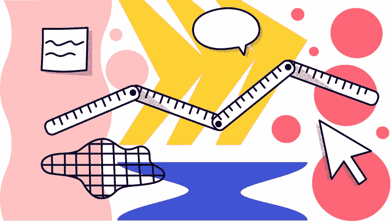
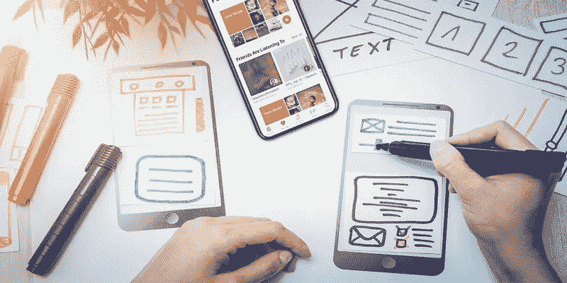

# 成功开发移动应用原型的流程

> 原文：<https://medium.com/nerd-for-tech/processes-to-successfully-prototyping-a-mobile-app-c136a5756374?source=collection_archive---------25----------------------->

T 何[原型流程](https://bit.ly/3cl8Mnt)是想法的演示或可视化，以获得用户的反馈。这些模型是通过使用不同的在线工具创建的。目的是确保我们是否满足业务目标和用户需求的标准。然后，我们在最终开发阶段根据评估对其进行改进。

新手必须理解应用原型的过程，因为它有更清晰、更容易接受、更好的协作和更可预测的好处。

在本文中， [Wondershare Mockitt](https://bit.ly/3ewCXuz) 将研究移动应用原型流程的目的及其优势。它如何帮助我们防范潜在风险？

# 什么是手机 app 原型？

全球约有 50 亿移动用户，因此移动体验在这个时代对品牌身份的创建起着至关重要的作用。因此，不了解流程的公司应该创建移动应用程序原型，以避免潜在的风险。由于开发过程中的一个小错误可以摧毁我们的努力和金钱，因此由于这个过程，我们获得了修改最终设计的机会。

举个例子，如果你花了几个小时和金钱为 android 或 IOS 用户开发了一个移动应用程序，但最终用户不喜欢应用程序图标的风格、颜色、主题和应用程序的其他功能，如 zoom touch，那么你会怎么做？在这里，原型制作过程可以帮助你。

原型是设计思维过程的第四步。移动应用程序原型是我们的团队成员和用户分析的应用程序设计及其功能的可视化。它有助于团队理解用户需求并识别关键的设计问题。原型是过程中不可或缺的一部分，没有它，未来的步骤将一无是处。

它以各种形式出现，比如在纸上，在使用 CASE(计算机辅助软件工程)的高科技操作系统上，或者在第四代语言上。最好从素描开始。这从来都不是一件容易的事情，但现在各种软件可以帮助设计师进行设计。

# 原型制作过程的目的

*   因为你设计的目的必须是满足用户的需求，否则它将是一个无用的应用程序，所以原型的迭代性质可以帮助你设计一个有用的应用程序。用户反馈有助于评估，并可用于修改实际产品。
*   它允许用户分析应用程序的外观和功能，以检查其有用性和可用性。在这个阶段，不要解释任何事情，因为流程的目的是满足用户的期望，而解释会影响反馈。
*   其他原因包括验证设计产品，向投资者或被许可者展示你的产品理念，排除小故障，测试和提炼。

# 原型制作步骤

我们将在这一部分简要讨论原型过程的步骤。它一定会帮助你做一个以用户为中心的应用程序设计。

***识别障碍***

这是原型制作的第一步，你和你的团队一起集思广益，找出可能在未来造成问题的障碍。在开始原型制作之前，确保你已经确定了每个问题和目标。你知道过程的要求和用户的期望。

***选择特性***

在这一步，您将创建一个简单的应用程序设计，这个设计是不完整的。这是一个简单的设计，有 1 或 2 个基本功能，便于用户理解。此外，它有助于获得建设性的回应，并细化目标。否则，复杂的设计会让用户难以理解。

***勾画你的设计***

在这个阶段，您将在前两步的基础上创建一个实际的原型。如果你首先在纸上开始设计草图，这是最好的做法，尽管网上也有其他工具可以用来创建设计。

一些著名的工具有 UI 模型、proto.io、adobe XD、fluid UI、Sketch、JustInmind 和 InVision Studio。还有一些其他的工具。

***分享你的设计***

在这个阶段，与利益相关者、客户分享你的设计以供评估。征求他们的建设性反馈，因为这将有助于你识别你的设计的优缺点。获得所有积极的意见和建议，使下一步更加完美。

***继续发展***

在这一步中，您将使用上一步中的所有意见和建议，并完善您的原型流程。您将多次重复这些步骤，以满足用户的需求。完成原型流程后，您可以完成应用程序设计。

# 移动应用原型的类型

原型制作过程包括两类低保真度原型和高保真度原型。

让我们简要回顾一下这两个过程，以便有一个清晰的理解。

***低仿真原型***

低保真度原型是在早期阶段获得反馈的快速而简单的方法。这个过程中唯一的要求就是纸笔，把你的想法变成 app 设计。这个过程的主要用途是检查和测试应用程序的功能。它只包括一些视觉属性和最终设计的关键元素。

好处:

*   它不贵，一个低保真度的纸原型过程只需要五到十分钟，不需要投入太多精力。
*   这有助于集思广益，因为这个过程不需要任何特殊技能，所以每个人都可以参与其中。
*   它给出了对最终产品的明确预期。
*   它让你有机会根据评估实时完善你的想法。

低保真度原型技术；

在这个过程中，您可以使用多种方法。

*   纸质原型
*   动画片
*   可点击的线框
*   图表

***高保真原型***

这个过程比低保真度的过程更具交互性、真实性和功能性。更贴近实际产品，有开发的元素。这个过程主要是想搞清楚自己是否对目标有清晰的认识。并与真实用户一起测试或与利益相关者分享。

好处:

*   使用动画过渡和微交互等图形元素来给出特征的详细信息是可行的。
*   它使用户更有效地与它互动，更有效地作出反应。
*   它为投资者和客户提供了最终设计的清晰思路和期望。

方法:

*   物理模型
*   交互式用户界面模型

# 结论

原型流程必须是应用程序设计流程不可或缺的一部分，以满足用户的需求和业务目标。这有助于团队针对一个问题提出多种解决方案。这也使得通过遵循所有这些原型制作步骤并有效地使用反馈来获得一个完美的移动应用变得可行。还要根据可用资源和可用性选择合适的流程方法，无论是低保真度流程还是高保真度流程。

感谢您花时间阅读这篇文章。[了解更多关于摩奇特的信息](https://bit.ly/3ewCXuz)

我们为 UX 初学者创建了一个[终极指南](https://bit.ly/2OLPPlW)，它收集了来自多个 UXers 的知识、经验和建议。

订阅我们的[YouTube](https://www.youtube.com/channel/UCESxamaRS8nOGpWYvP1VSqA)脸书 insta gram

*原载于*[*https://mockitt.wondershare.com*](https://mockitt.wondershare.com/ui-ux-design/prototype-process.html)*。*