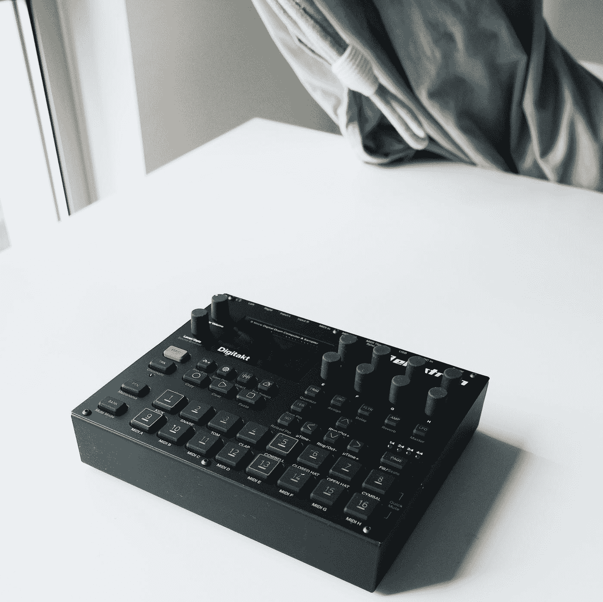
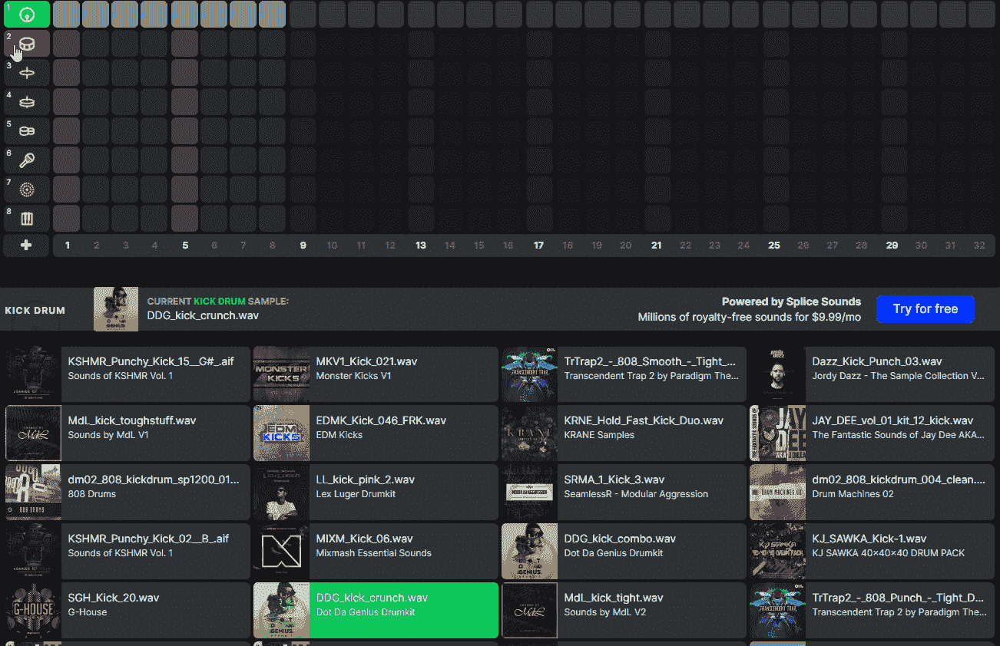
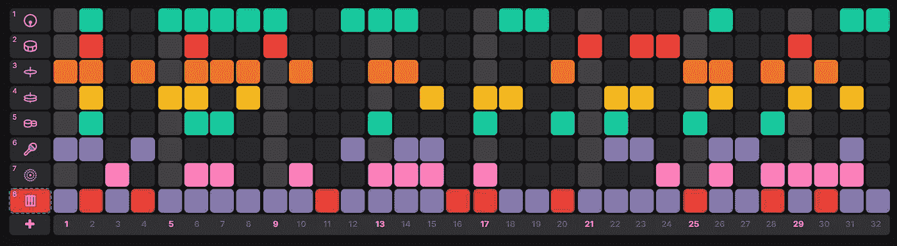
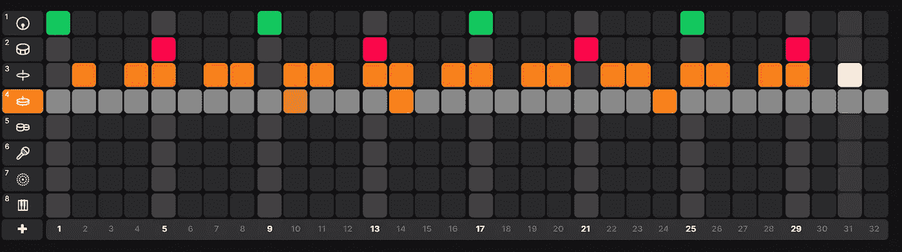
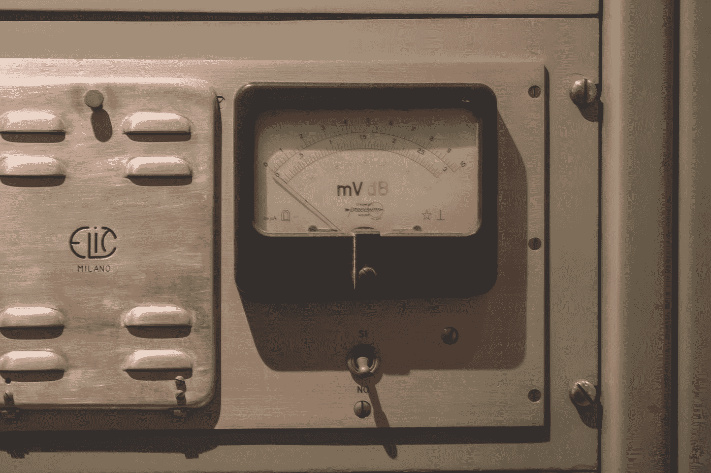
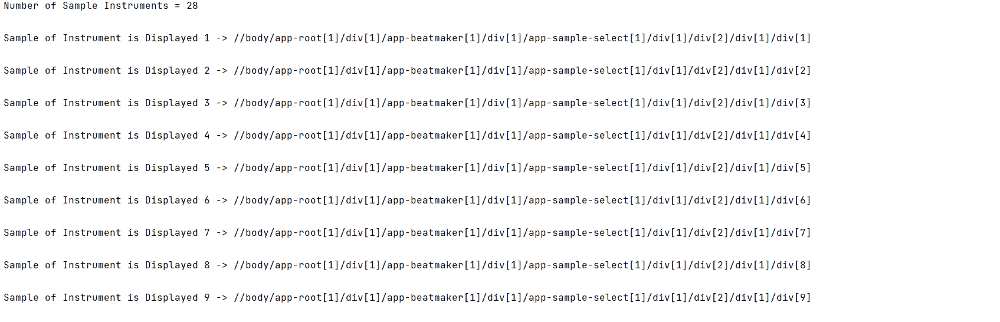

# 由硒产生

> 原文：<https://medium.com/nerd-for-tech/produced-by-selenium-3126f235beab?source=collection_archive---------2----------------------->

## 没有地铁 Boomin 好，但还可以

里卡多·阿布雷乌在 [Unsplash](https://unsplash.com?utm_source=medium&utm_medium=referral) 上的照片

大家好！

在这篇文章中，我将解释我在 [**拼接**](https://splice.com/sounds/beatmaker) 上制作 beatmaker 自动化的旅程。

首先，我必须写一个控制的步骤，因为当不同的仪器被点击时，显示不同数量的样本。

[https://splice.com/sounds/beatmaker](https://splice.com/sounds/beatmaker)

仪器控制步骤->我使用 assert 检查 sample-name 类中有多少元素，以及它们是否可见。

仪器控制步骤

Instrument Selecting Step ->在 for 循环中，我用 xpath 将元素添加到 Instruments 数组中，其数量与 sample-name 类的元素数量一样多。

我用 random 从仪器阵列中选择随机元素并点击它。

仪器控制步骤

随机模式->我在所有乐器的模式部分添加了框来分隔每个乐器的序列，并尝试通过在 for 循环中单击随机框来创建一个模式，次数与数组的元素数一样多。

随机井涌模式

这节拍听不清。

耳朵出血

所以我必须做一些编辑，首先我把节奏整理好。

我为踢腿、军鼓和踩镲创建了如下的直线模式，并随机选择了一个直线模式。

我不是每次都把 for 循环递增 1，而是用 2，4，8 这样的数字来递增，并且我已经熟悉了数组索引越界异常错误。

随机直圈套模式

有一个听起来不错的节奏，在模式中听几遍其余的乐器就足够了。

听起来不错！

创建直线模式脚本

我用规范框架& BDD(行为驱动开发)写了我的脚本。

对于每个乐器，我首先检查乐器是否可见，然后随机选择一个样本并创建模式。

你可以按照自己的方式自由使用任何乐器。

我把 BPM 设为 90。

照片由[黛安·皮凯蒂诺](https://unsplash.com/@diane_soko?utm_source=medium&utm_medium=referral)在 [Unsplash](https://unsplash.com?utm_source=medium&utm_medium=referral) 上拍摄

拼接自动化 Beatmaker 场景

这个场景已经足够好了。

日志看起来会像这样。

让我们听听。

由硒产生

[**代号**](https://github.com/emresharp/Produced-by-Selenium) 到了，感谢阅读！