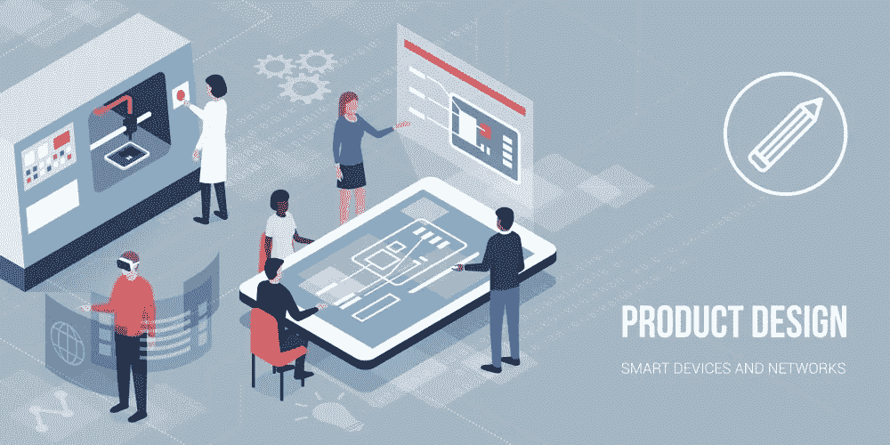
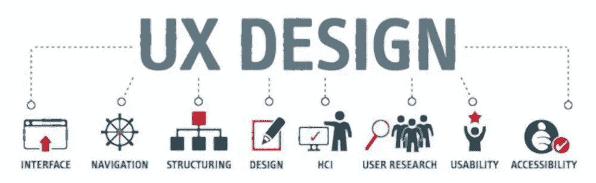
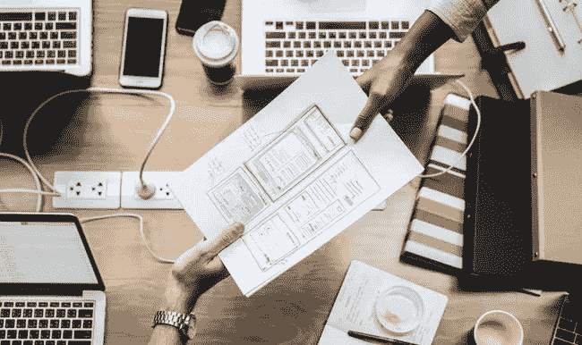

# UX 与产品设计:有何异同？

> 原文：<https://medium.com/nerd-for-tech/product-design-vs-ux-design-similarities-and-differences-1ecf39282d02?source=collection_archive---------22----------------------->

当创造伟大的产品时，设计成为最重要的特征。我们已经进入了一个产品设计被主导和驱动的阶段——产品设计让公司与众不同，是超越竞争对手的真正优势。近年来，设计行业发展很快，现在有许多不同职责的设计师:UX 和产品设计师。然而，“[他们的工作角色有什么区别呢？](https://bit.ly/3qyxgyB)“一直是设计界常见的问题。

这两个标题有一个共同点——它们都设计了用户如何与产品交互。但是他们在做不同的事情来实现这个统一的目标。现在， [Wondershare Mockitt](https://bit.ly/3ewCXuz) 试图分析每个职位头衔的真正含义，然后看看为什么在现代技术时代，从 UX 设计师演变为产品设计师是一种合乎逻辑的发展。

> “设计致力于研究事物如何工作、如何控制以及人与技术之间的互动到底是什么样子。如果事情做得好，就能创造出伟大的、令人愉快的产品。”
> 
> ——唐·诺曼《日常用品的设计》

# 什么是产品设计？

现代世界是由桌面工具、移动应用、网络应用、平台、软件生态系统和在线服务塑造的。它们几乎无处不在，在我们的个人和职业日常生活中支持着我们。无论是在办公室，在家里的笔记本电脑或平板电脑上，在你的口袋里，还是在你的手腕上，这些产品都是我们永恒的伴侣。

毫无疑问，数字产品是我们这个世界不可或缺的一部分。产品设计帮助您准备您的数字产品(无论是现有的还是新的)，重点是业务方面和用户需求。这使您的团队能够更成功地设计和扩展。产品设计师在一个非常多样化的行业工作，他们还必须展示他们在团队中工作的能力。

产品设计师是一个通用术语，用来描述参与创建整个产品的设计师。很多产品设计师认为自己是设计经验的设计师。这意味着，当谈到某些功能应该如何工作或者某些 UI 控件应该如何显示时，产品设计师是给 UX 设计师和 UI 设计师提供洞察力的人。

作为一个产品设计师，你要全身心投入到产品的开发中去。你还得负责起草和设计。作为一个产品设计师，你可以说是人与物之间的接口。你为产品设计功能，也考虑创意和经济方面。你密切关注技术和趋势，但也关注材料、设计和颜色。

# 如何成为一名产品设计师？

产品设计师需要必要的技术知识和艺术技能，以便能够做好他们的工作。你通常会在相应的学位课程中发展这种能力。你可以在各种大学学习产品设计。许多学位课程已经专注于学士或硕士学位的一个专业，或者提供与其他研究领域相结合的学位课程。作为未来的产品设计师，你的学习机会包括一般产品设计和工业设计，以及技术产品开发，设计和创新，材料文化，产品和技术交流，以及可持续性和产品设计。

# 要求:

***1。技术诀窍***

**2*。创意***

***3。分析思维***

***4。沟通技巧***

***5。解题技巧***

***⑥。团队合作***

***7。研究技巧***

# 什么是 UX 设计？

UX 设计公司负责产品的功能、适应性和它在用户中唤起的情感。界面越清晰，用户越容易得到结果并采取有针对性的行动。UX 是与界面打交道的经验。用户体验取决于各种因素:网站架构、图形设计、清晰的文本以及界面对特定用户行为的响应。因为用户体验是抽象的，UX 设计包括了解他们的习惯、原型行为和测试。所有这些工作都是由 UX 设计师完成的。

第一台麦金塔电脑是 UX 设计师作品的光辉典范之一。使用 windows 而不是命令行的想法一直存在到 1984 年，但正是苹果的设计师们让图形界面得以广泛使用。

一些设计师认为 UX 只是关于网站或应用程序如何工作。其实用户体验并不局限于此。例如，如果客户留下了请求，但没有收到确认短信或经理的电话，这些都是糟糕的 UX 的症状。

> “网站上的 UX 并没有以美丽易懂的形式结束。UX 是用户从入口点到出口点，从 A 点到 b 点的旅程。”
> 
> ——谢尔盖·波普科夫(AIC 首席设计师)

# UX 设计师是做什么的？

UX 设计师主要关心产品的感觉，他们的目标是更加高效和简洁。UX 设计师站在用户思维的角度看设计，通过以下几点发现潜在的问题:

***1。梳理各种用户场景，构建交互模式***

***2。进行各种测试，观察用户做了什么(比如实验室可用性研究、眼球追踪、A/B 测试、电子邮件调查等。)***

***3。构建原型界面，通过线框*** 创建产品的逻辑

这位 UX 设计师大部分时间都在做原型。基于获得的知识，他现在试图以一种更好的用户体验的方式来改变产品或计划。UX 的设计者经常不得不使用许多不同的工具来达到预期的效果。

最后，用户反馈开始发挥作用。由 UX 设计师开发的原型被呈现给测试客户、同事和其他 UX 设计师，并由他们进行评估。通常，在 UX 设计师和客户都满意之前，一个设计需要许多开发周期。

如果你喜欢在团队中工作，想要将你的心理兴趣与你自己的创意结合起来，喜欢和那些从产品和商业模式角度思考的人在一起，那么 UX 设计师是一份适合你的工作。

# UX 设计和产品设计有什么相似之处？

产品设计是用户体验设计的进化。很多人认为，UX 设计师更注重用户需求，而产品设计师更注重商业需求和用户需求的结合。但实际上，这种想法是错误的！用户体验设计师也需要关注业务需求，他们也需要将业务需求融入到整体设计中。

以下关键词出现的频率大致相同:

***1。团队合作***

协作、沟通、跨职能、领导力

***2。设计方法***

设计原则、设计流程、用户流程、原型、手机/网络、线框

***3。思维模式***

概念，全新，机遇，创新

***4。研究类别***

用户测试，用户研究，可用性

***5。*商业**

利益相关者，营销

# 产品设计和 UX 设计有什么区别？

在 2000 年以后的五六年里，从事交互设计相关工作的人的头衔通常是信息架构师或者交互设计师，有的被称为可用性分析师。当时间来到 2010 年左右，术语 UX，或用户体验，成为一个流行语，从那时起，UX 设计师/用户体验设计师已经成为交互设计从业者最重要的职位。

另一方面，如果 10 年前你有“产品设计师”的头衔，那么你很可能是负责设计实体产品外观的设计师或工业设计师。然而，在 2015 年左右，由于 SaaS(软件即服务)产品的流行，我们注意到“产品设计师”的头衔仍然适用于这类产品中负责交互的设计师。

因此，从 2015 年开始，“产品设计师”一词的出现频率有所增加。这个职位和“用户体验设计师”很难区分，困惑已经开始出现。许多人试图解释这种差异。

***1。功能方面的区别***

——UX 设计:设计新的东西，或者重新设计现有的东西；

-产品设计:跟随一个已有的产品，随时间迭代开发；

**2*。设计约束方面的差异***

-UX 设计:如何利用优先的时间和开发资源实现最佳用户体验；

-产品设计:如何在后续版本迭代中逐渐接近理想的用户体验；

***3。可用性方面的差异***

-UX 设计:如何让用户更容易上手；

-产品设计:如何让现有用户更容易理解新功能并迁移到新功能；

***4。作为一个工作者你能享受到的成就感和乐趣主要有:***

——UX 设计:多元化，提出以用户为中心的设计新方法，解决一系列问题。

*   产品设计:延续性，随着时间的推移逐渐进化，逐渐发展变化为更理想的体验。

# 结论

正如你所看到的，UX 和产品设计在实际功能和应用上有着高度的相似性，但他们在执行和思维上明显不同。UX 和产品设计师的角色也略有不同。用户体验设计师会在工作中寻求实现成功产品的各种可能性，而产品设计师会随着时间的推移，深入研究产品升级和进化的方式。

但当然，我上面提到的情况肯定有例外，因为它们并不完全符合所有的环境。产品设计师和 UX 设计师之间的合作，他们的不断互动，相互理解是创造一个成功的产品或服务的关键。但我希望这篇文章和我整理的资料最终能解除大多数人的困惑。

感谢您花时间阅读这篇文章。[了解更多关于 Mockitt 的信息](https://bit.ly/3ewCXuz)

我们为 UX 初学者创建了一个[终极指南](https://bit.ly/2OLPPlW)，它收集了来自多个 UXers 的知识、经验和建议。

订阅我们的 [YouTube](https://www.youtube.com/channel/UCESxamaRS8nOGpWYvP1VSqA) [脸书](https://www.facebook.com/mockitt) [Instagram](https://www.instagram.com/wondershare.mockitt/)

*最初发表于*[*https://mockitt.wondershare.com*](https://mockitt.wondershare.com/ui-ux-design/similarities-and-differences.html)*。*