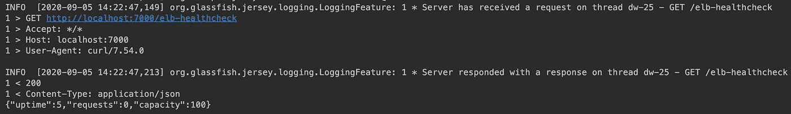
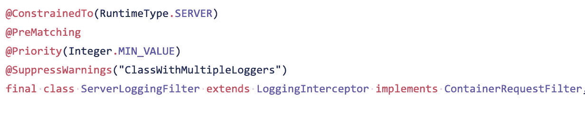
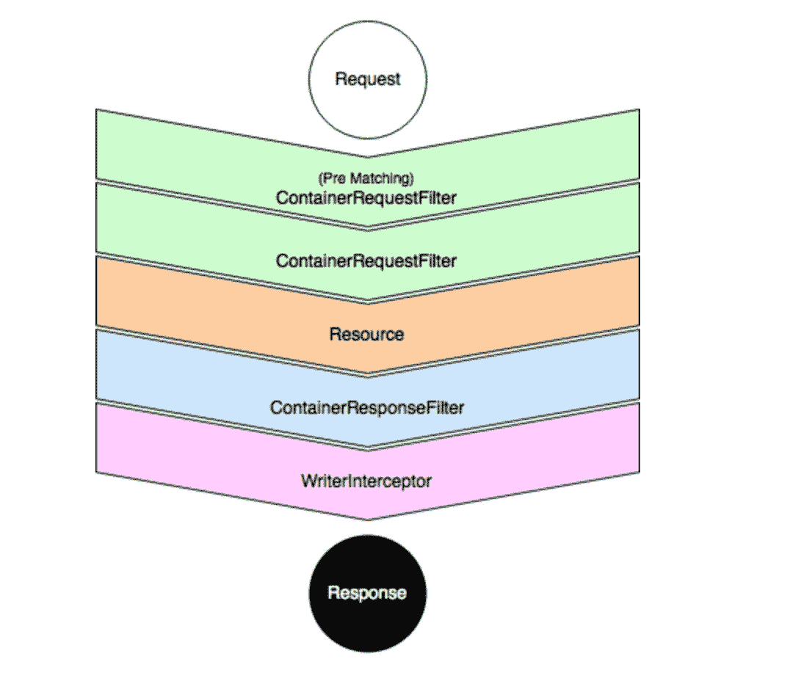
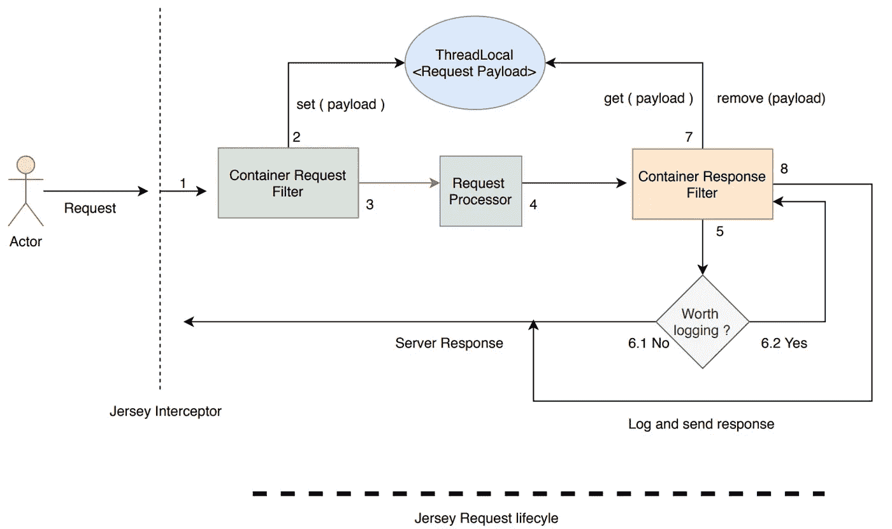

# 新泽西/JAX-RS 顶部的生产测井功能增强

> 原文：<https://medium.com/nerd-for-tech/production-logging-feature-enhancements-atop-jersey-and-jax-rs-991127a36c88?source=collection_archive---------0----------------------->

以及如何在生产中的重要用例中充分利用它们


即将旋转和倾倒的圆木

**日志**是在生产环境中运行的任何重要应用程序的生命线。任何在工作场所随叫随到的人都可以证实，当事情在凌晨 3 点变糟时，正确的应用程序日志记录的重要性。

对于构建在 JAX-RS 框架之上的应用程序来说，解决方案通常是向环境注册。*这在客户端和服务器端都有效。*

```
environment.jersey().register(
  new LoggingFeature(
     Logger.getLogger(LoggingFeature.DEFAULT_LOGGER_NAME),
     Level.INFO,
     LoggingFeature.Verbosity.PAYLOAD_ANY, 
     1000
   )
);
```

通过这个简单的注册，您可以立即在服务器上看到请求`>`和响应`<`日志。中间是应用程序日志(如果有的话)



我承认，这在开始时非常简洁和方便。但是，也有一些问题。

*   **每个请求和响应都会被记录。无论使用何种情况。**
    以监控为目的的请求，比如健康检查或其他清理 API，会得到与其他潜在业务关键请求相同的处理。我们无法控制我们想要实际查看日志的请求。
*   **无法只记录失败的请求，比如用 4xx / 5xx**
    检查`[Logging Filter](https://github.com/jersey/jersey/blob/faa809da43538ce31076b50f969b4bd64caa5ac9/core-common/src/main/java/org/glassfish/jersey/logging/ServerLoggingFilter.java#L112)`的源代码来解释原因。在`[Jersey request lifecycle](https://www.baeldung.com/jersey-filters-interceptors)`中，在服务实际*请求*和处理*响应*之前，执行*过滤器*。因此，不管结果如何，*请求*日志记录肯定会发生。

> 这种影响至少是双重的。

*   **日志文件以更快的速度填充和循环**
    因为所有请求都被记录，所以对于生成的日志量几乎没有什么可做的。是`O(N)`，其中`N`是请求的数量。实际上，我们希望这是`O(K)`，其中`K`是我们感兴趣的请求数量(值得记录)和`K < N`
*   **日志文件包含大多数不可操作的请求**
    通常我们想要调试失败的请求。由于成功的请求(`2xx`)和失败的请求之间没有区别，我们通常以失败的响应告终。这再加上更快的轮换意味着，对于高 QPS 服务，我们有很多事情要做。

我们在生产应用程序中遇到了同样的问题。他们中的一些人一直在击打`600 QPS`，错误率为`0.01%`，原木以相当高的速度旋转。

我们想独立解决这两个问题。*我们的第一个目标是在请求级别过滤日志。*

我们深入研究了这些过滤器的 Jersey 实现。我们在扩展这些类时遇到了一些问题。可能是因为它们是内部的，而不是用来扩展的。但是我们的用例需要它。



为什么你是最后一名？:/ Hmph:

## **列入白名单的服务器日志过滤器**

为了解决第一个问题，我们采用了 Jersey 实现，并创建了一个实现必要过滤器的类。逻辑很简单。

*   维护一套你感兴趣的*资源 URI 路径*。
*   为请求和响应主体重写`filter`方法。检查请求 URI 上下文是否与我们的任何合格请求相匹配。如果是， ***log it*** 否则做 ***nothing*** 。

这个开销是`O(K) * O(1)`在`K` URIs 必须被一个集合匹配支持。对于我们在日志记录上节省的磁盘空间来说，这是一个很好的权衡。

这种记录器的变体现在可以安装在服务中，以排除某些具有重负载的请求。

```
Set<String> excludedPaths = ImmutableSet.of(...);environment.jersey()
  .register(new WhitelistedServerLoggingFilter(excludedPaths));
```

## 延迟请求响应日志过滤器

解决第二个问题(只记录响应失败或满足特定条件的请求)需要一点思考。



服务器请求响应处理生命周期

为了理解这一点，我们需要理解请求在 Jersey 世界中的生命周期。

请求记录在`ContainerRequestFilter`层中，此时响应还不可用。

既然没有办法“ **unlog** ”一个已记录的请求，我们需要找到一个更好的方法。更好的方法是将请求日志延迟到响应可用的最后。

我们可以确定的一件事是，所有主要的框架都遵循每个请求一个线程的模型。这意味着有一个专门的工作线程被分派来处理传入的请求。

我们可以利用这一点。什么是可用于存储线程本地属性的数据结构？

你猜对了。这是一个 [**线程本地**](https://docs.oracle.com/javase/8/docs/api/java/lang/ThreadLocal.html) **。**我们可以在请求线程的本地设置请求日志。一旦我们稍后得到了响应，我们就将一个*用户定义的谓词*与响应代码进行匹配。

如果测试通过，*请求和响应都被记录*。如果不是，*两者都被丢弃*。这可以根据需要进行配置和增强。



延迟记录器的蓝图

**这个简单的变奏以空间换空间**。由于只针对我们想要的响应谓词生成日志，我们节省了大量不必要的磁盘使用。但是我们也通过在每个线程缓存请求日志来占用内存。

在我们的情况下，这种权衡也是值得的。我们的应用程序只记录我们需要的内容。将响应谓词设置为`{4xx, 5xx} — {404}`有助于我们实现可调试性和磁盘使用的目标。

## 逮到你了

*   敏锐的读者可能已经注意到，由于请求日志记录被延迟，应用程序日志在实际日志之前被写入磁盘，因此妨碍了事件的顺序。
*   我们只是延迟了请求日志，应用程序日志`log.info({})`将会以通常的速度继续。这对我们来说根本不是问题。可能是给你的。
*   需要小心地取消线程的本地设置，并使对象符合垃圾收集的条件。对于非常高的 QPS，额外的内存可能是一个问题。但是他们可能不需要这种级别的日志记录。

总而言之，这些增强帮助我们在高 QPS 下维护我们的生产服务，在可调试性和日志轮换之间取得了充分的平衡。对于客户端的增强，我们也跟着做了。

我已经开源了[组件](https://github.com/isopropylcyanide/jersey-log-utils)发布了一个[包](https://mvnrepository.com/artifact/com.github.isopropylcyanide/jersey-log-utils)给 Maven Central。将这些实用程序集成到应用程序中非常简单。


希望你学到了新东西。请随时留下一些可以进一步改进的意见。随时欢迎投稿。