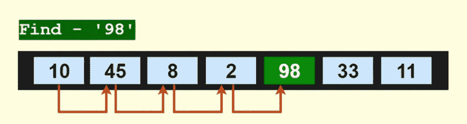
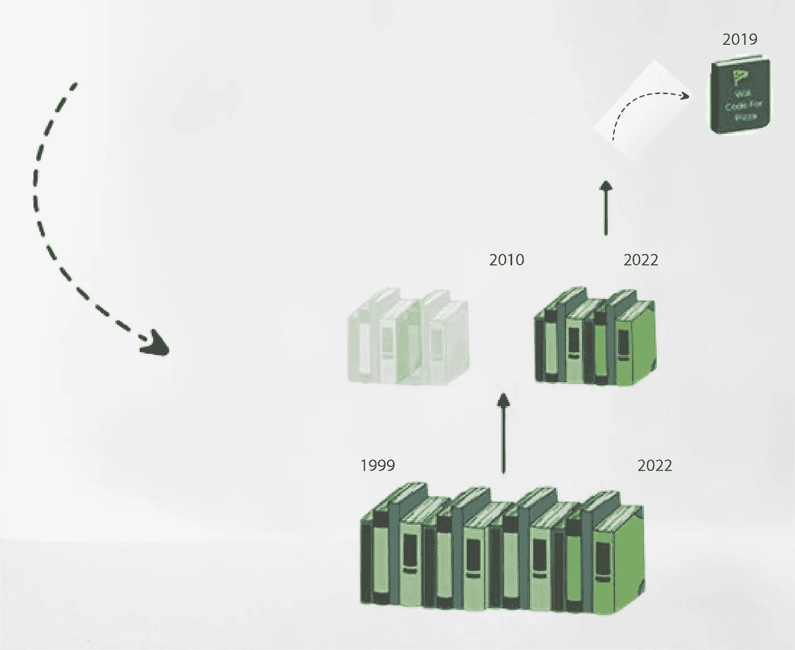

# 编程算法

> 原文：<https://medium.com/nerd-for-tech/programming-algorithms-f8789a8f5f60?source=collection_archive---------3----------------------->

算法是一系列定义明确的指令，用于解决计算机编程中的某个问题。它接受一组输入并输出想要的结果。例如，将两个数相加的算法如下:

1.  *取两个数字输入(输出的第三个变量)*
2.  *使用+运算符添加数字*
3.  *显示结果*

## 真实世界的例子

你在一个图书馆里，你想看的书 ***《计算机编程的艺术》*** 出版时间:2019 年，作者:唐纳德·克努特

*注:书籍按年份排列*

你给自己一套找到这本书的指令:

1.  一本接一本地拿这本书。
2.  如果书名是*计算机编程的艺术，* *挑书，退出。*
3.  如果书名不是*计算机编程的艺术，* *重复步骤 01。*

这套指令就是所谓的**算法。你可能会问，为什么算法很重要？因为最佳选择的算法可以确保计算机以最佳方式完成给定的任务。**

这里我们使用**线性搜索算法**(它依次检查列表中的每个元素，直到找到一个匹配项或整个列表都被搜索完)来找到这本书，

这种方法很有效，但是如果有 100 或 1000 本书呢？效率就不够了。

这就需要一种替代算法来提高效率。

让我们检查一下**二分搜索法算法**(这是一种查找排序数组中目标值位置的搜索算法)，因为书籍是按照可以用作索引的年份顺序排列的，*假设每年只有一本书(为了简化)*

1.  拿这摞书中间的那本
2.  如果图书的年份小于 2019 年，请转到右边的堆栈，重复步骤 1
3.  如果图书的年份大于 2019 年，请转到右边的堆栈，重复步骤 1
4.  如果书的年份等于 2019 退出

二分搜索法算法可能涉及额外的排序过程，但在处理巨大的数据查询时，它检索数据的速度比线性搜索算法快得多。

当效率很重要时，使用一个合适的算法是至关重要的

## 好算法的品质

*   输入和输出必须明确规定。
*   算法的每个阶段都应该简单明了。
*   算法应该是在各种选项中解决问题的最有效的方法。
*   计算机代码不应包含在算法中。相反，算法的设计应该允许它在各种编程语言中使用。

## 程序员应该知道的 07 大算法

1.  排序算法
2.  搜索算法
3.  散列法
4.  动态规划
5.  二元幂运算
6.  字符串解析和匹配
7.  素性测试

*参考:*[*【https://www.programiz.com/dsa】*](https://www.programiz.com/dsa)