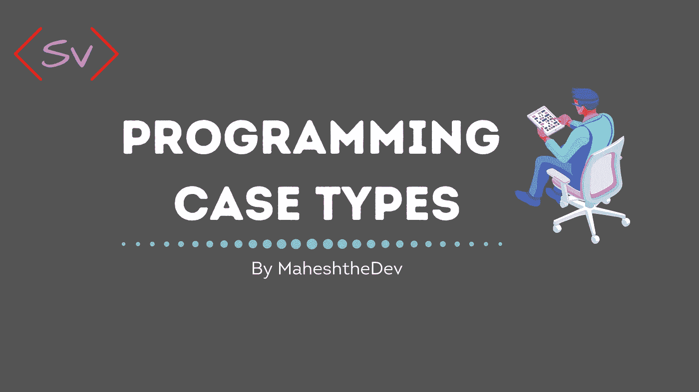

# 编程案例类型！解释

> 原文：<https://medium.com/nerd-for-tech/programming-case-types-explained-143cad3681e3?source=collection_archive---------3----------------------->

不管你编码有多好。命名约定可能是一个**的痛苦。

在编程领域，语言在命名变量、函数

[杰夫·阿特伍德(Stack Overflow 联合创始人)](https://twitter.com/codinghorror/status/506010907021828096?lang=en)说

> “命名约定是计算机科学中两大难题之一”

**为什么案件类型？**

从变量到函数，我们都用命名来定义程序中的东西。在编程中，如果你想用一个以上的单词来命名一个事物，那么你不能直接用空格或加空格来命名，有时这可能会误导代码审查者/代码阅读者，就像治疗师听起来像治疗师或强奸犯。

下面是 Case 类型的一个解决方案，它有不同的方法来命名一个有多个单词的事物。

今天，我们将研究编程世界中不同案例类型

1.**茶包**

骆驼案其实灵感来源于动物“骆驼”。其中第一个单词是小写字母，第二个单词的第一个字符将像驼峰一样大写。

一些大公司也由此受到启发。比如 iPhone，易贝

通常，Camel Case 用于变量命名

2.**蛇 _ 案**

Snake Case 使用由 _(下划线)和所有小写字母分隔的单词进行命名

通常，Snake Case 用于变量命名

例句:- snake_case，new_word

3.**烤肉串盒**

Kebab Case 使用由(连字符)分隔的单词命名，所有单词都是小写字母

通常，烤肉串大小写用于 CSS 命名

例句:新词，烤肉串盒

4.**帕斯卡塞**

帕斯卡格是用每个单词的首字母大写来命名的。

通常，Pascal 大小写用于类命名

例句:新单词，PascalCase

5.**宏 _ 案例**

宏大小写是用大写字母命名的，但单词之间用 _(下划线)连接

通常，宏大小写用于预处理程序和常量

例如:-新单词，宏案例

6.**列车案例**

训练案例是用名称的每个单词的第一个字母大写来命名，单词之间用-(连字符)连接。

例句:生词，火车案例