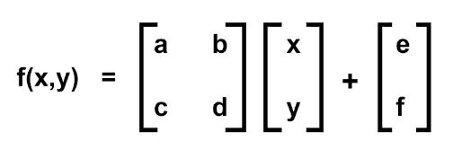
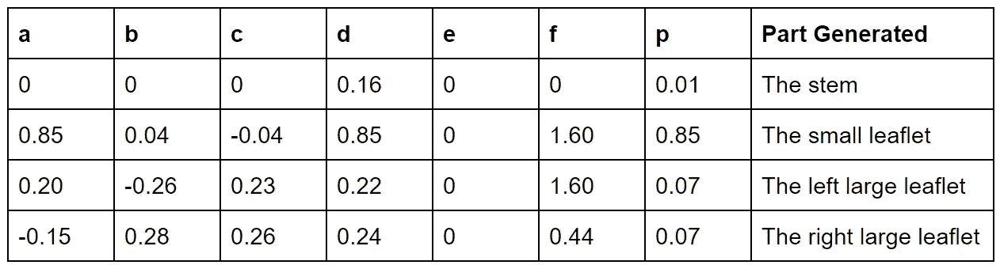
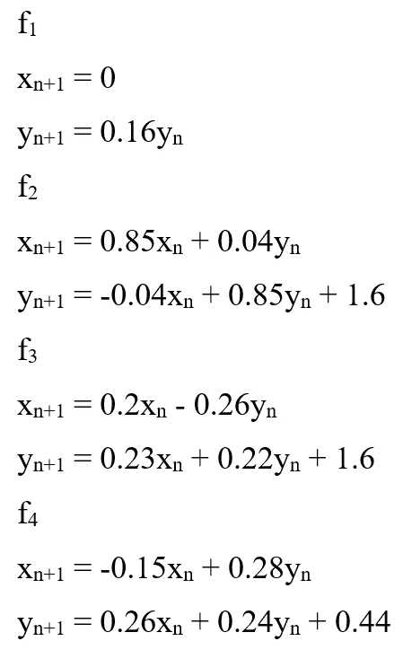
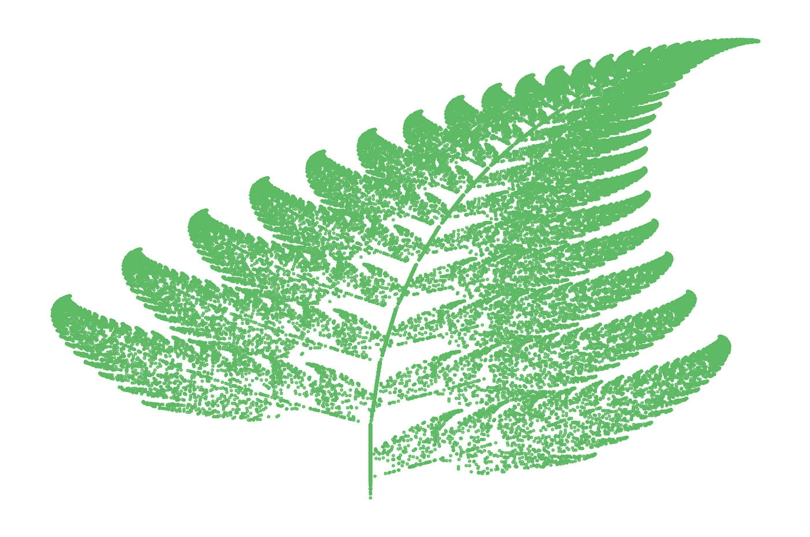
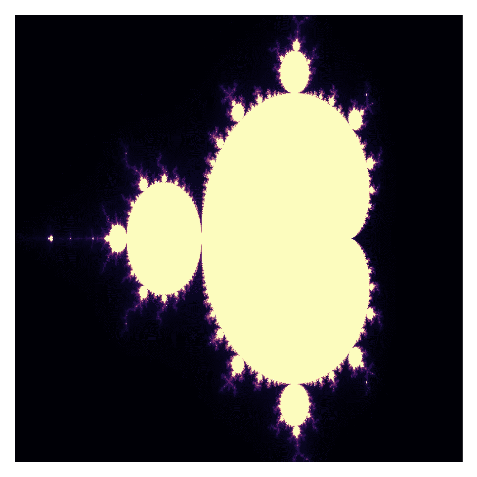

# 用 Python 编程分形

> 原文：<https://medium.com/nerd-for-tech/programming-fractals-in-python-d42db4e2ed33?source=collection_archive---------3----------------------->

## 了解如何通过 Python 创建美丽的分形。


[阿德里安·匡威](https://unsplash.com/@adrienconverse?utm_source=medium&utm_medium=referral)在 [Unsplash](https://unsplash.com?utm_source=medium&utm_medium=referral) 上的照片

# 分形:概述

蕨类植物是什么形状的？一条河甚至一座山呢？我们不能用简单的欧几里得几何将它们定义为正方形或圆柱形。这就是为什么我们有分形几何学:美丽结构的几何学。分形在自然界中随处可见，是由一遍又一遍的步骤重复形成的。

分形可能很难真正定义，并由这些共同的特征联系在一起:缩放对称，从简单到复杂和分数维。另一个有趣的事实是，大多数分形不是一维或二维形状，而是介于两者之间。

无论如何，足够的信息，让我们进入三个分形，我们将编码:科赫雪花，巴恩斯利蕨类植物和曼德尔布罗集！

# 科赫雪花

科赫雪花，也被称为科赫岛，是基于瑞典数学家赫尔格·冯·科赫在 1904 年创造的科赫曲线。

雪花是通过反复重复一系列步骤构建的，从等边三角形开始，然后:

1.  将线段分成 3 等长
2.  在中间线段上画一个向上的等边三角形
3.  移除中间线段(三角形的底边)

对于这个分形，我们将使用一个名为“Turtle”的 Python 库来绘制它，并且需要导入它:

```
**import** turtle
```

现在，让我们通过为科赫曲线创建一个函数来开始科赫雪花的创建。我们将使用递归，即函数直接或间接调用自身。该函数的参数是:

*   **乌龟**，它将是绘制分形的乌龟
*   **divis** ，这是我们要“做”上述步骤的次数
*   **尺寸**，定义等边三角形的每条边的长度

然后，在这个函数中，我们有一个基本情况，当除法的次数达到 0 时，我们将海龟向前移动一个边的长度。然而，如果 divisions 大于 1，我们将有一个 for 循环，它使用 Lindenmayer 系统来绘制分形。

Lindenmayer 系统是一种以字符串形式表示递归分形的方法。用科赫雪花，初始字符串为“F-F-F”和字符串重写规则，“F”→“F+F-F+F”和 60°角。“F”表示向前移动，“+”表示按角度向右转，“-”表示按角度向左转。这样，我们得到以下函数:

```
**def** koch_fract(turtle, divis, size):
   **if**(divis == 0):
      turtle.forward(size)
   **else**:
      **for** angle **in** [60, -120, 60, 0]:
         koch_fract(turtle, divis - 1, size / 3)               
         turtle.left(angle)
```

创建函数后，我们可以为要输入函数的参数设置一些变量:

```
divis = 10 # any number of divisions, the larger the number, the more detailed the diagram
size = 2000 # any length
```

然后，我们必须设置海龟和屏幕来绘制分形:

```
wn = turtle.Screen()
wn.setup(width=1000, height=500)
turtle.speed(100)
turtle.pendown()
```

之后，我们将使用 for 循环来使用 Koch 曲线函数创建 Koch 雪花。我们将调用这个科赫曲线函数 3 次，每次都将海龟逆时针旋转 120°。

```
for i in range(0, 3):
   koch_fract(turtle, divis, size)
   turtle.left(-120)
```

它应该是这样的:

# 巴恩斯利蕨

让我们继续巴恩斯利蕨类植物！这是一种分形，由英国数学家迈克尔·巴恩斯利在他的著作《分形无处不在》中首次提出。它被称为“迭代函数系统”(IFS)分形。这种分形的构建利用了矩阵，要了解更多关于矩阵的知识，我推荐[这个网站](https://www.khanacademy.org/math/precalculus/x9e81a4f98389efdf:matrices#x9e81a4f98389efdf:mat-intro)。

巴恩斯利蕨就是利用这种矩阵变换创建的:



使用了四种不同的转换，如下表所示。变量 **a 到 f** 是系数， **p** 是概率因子。



从这个表中，我们可以为我们的程序创建 4 个函数:



现在我们对巴恩斯利蕨是如何产生的有了基本的了解，我们可以开始编码了！

首先，导入以下库:

```
**import** matplotlib.pyplot **as** plt 
**from** random **import** randint
```

因为我们将在散点图上绘制蕨类植物，所以我们需要为 x 和 y 数组创建一个列表

```
x = [0]
y = [0]
```

创造分形！我们将使用一个 **for 循环**迭代 **n** 次，程序运行次数越多，分形越精细。为了创建概率因子，我们将使用来自 **random** Python 库中的 **randint** 函数来随机选择 1 到 100 之间的一个整数。基于概率因子， **p** ，我们将执行上述函数，并将结果添加到 **x** 和 **y** 列表中。

```
for i in range(0, 50000): 

    p = randint(1, 100) 

    if p == 1: 
        x.append(0) 
        y.append(0.16*(y[i])) 

    if p >= 2 and p <= 86: 
        x.append(0.85*(x[i]) + 0.04*(y[i])) 
        y.append(-0.04*(x[i]) + 0.85*(y[i])+1.6) 

    if p >= 87 and p <= 93: 
        x.append(0.2*(x[i]) - 0.26*(y[i])) 
        y.append(0.23*(x[i]) + 0.22*(y[i])+1.6) 

    if p >= 94 and p <= 100: 
        x.append(-0.15*(x[i]) + 0.28*(y[i])) 
        y.append(0.26*(x[i]) + 0.24*(y[i])+0.44)
```

一旦我们有了所有的点，我们可以使用 plt.scatter 绘制它。参数 **c** 是图上点的颜色，我使用十六进制设置为绿色。如果你想隐藏轴，使用函数 plt.axis("off ")！

```
plt.scatter(x, y, s = 0.2, c ='#5dbb63') 
plt.axis("off")
plt.show()
```

这就是你如何创造巴恩斯利蕨类植物！



# 曼德勃罗集合

最后是 Mandelbrot 集，在我看来，它是有史以来最美丽的分形之一！Mandelbrot 集是函数迭代时不发散的复数集。你可以在这个网站上找到更多关于曼德尔布罗集合背后的数学知识。为了对此进行编程，我们将使用迭代！

像巴恩斯利蕨类植物一样，我们将使用 matplotlib 和 numpy 在图上绘制 Mandelbrot 集合！因此，我们需要导入这些库:

```
**import** numpy **as** np
**import** matplotlib.pyplot **as** plt
```

然后，我们需要决定需要多少行和列，这决定了集合的详细程度，以及我们将使用的迭代次数。

之后，我们需要编写两个不同的函数:

1.  第一个函数将计算 Mandelbrot 集合中的一个特定数字
2.  第二个函数将计算 Mandelbrot 集合中的数字

下面是第一个函数:

```
def mandelbrot(c, z):
   global iterations
   count = 0
   for a in range(iterations):
      z = z**2 + c
      count += 1        
      if(abs(z) > 4):
         break
   return count
```

参数 c 和 z 分别表示复平面和坐标中的点。

第二个功能是:

```
def mandelbrot_set(x, y):
   m = np.zeros((len(x), len(y)))
   for i in range(len(x)):
      for j in range(len(y)):
         c = complex(x[i], y[j])
         z = complex(0, 0)
         count = mandelbrot(c, z)
         m[i, j] = count    
   return m
```

参数 **x** 和 **y** 是 x 和 y 坐标的 **numpy** 数组。我们将首先创建一个形状为 x 和 y 坐标的数组，名为 **m** ，并将是复平面坐标。然后，我们将使用 for 循环遍历 **x** 数组和 **y** 数组。我们将创建 **x** 和 **y** 值的复数，并调用之前的 **mandelbrot(c，z)** 函数。然后，该计数将被添加到 **m** 数组中。之后，我们将返回 **m** 数组。

现在，我们需要从这些函数中创建 Mandelbrot 集合，并使用 matplotlib 绘制它！

```
**# creating our x and y arrays**
x = np.linspace(-2, 1, rows)
y = np.linspace(-1, 1, cols)**# create our mandelbrot set**
m = mandelbrot_set(x, y) **# plot the set (best colors: binary, hot, bone, magma)**
plt.imshow(m.T, cmap = "magma")
plt.axis("off")
plt.show()
```

这是它应该有的样子！是不是很美？



这就是你如何编码科赫雪花，巴恩斯利蕨类植物和曼德尔布罗集！我希望你学到了很多，并喜欢编码它们。请随意从我的 GitHub 下载我的代码。

科赫雪花:[https://github.com/itsliterallymonique/Koch-Fractal-o_O](https://github.com/itsliterallymonique/Koch-Fractal-o_O)巴恩斯利蕨:[https://github.com/itsliterallymonique/Barnsley-Fern](https://github.com/itsliterallymonique/Barnsley-Fern)曼德勃罗集:[https://github.com/itsliterallymonique/Mandelbrot-Set](https://github.com/itsliterallymonique/Mandelbrot-Set)