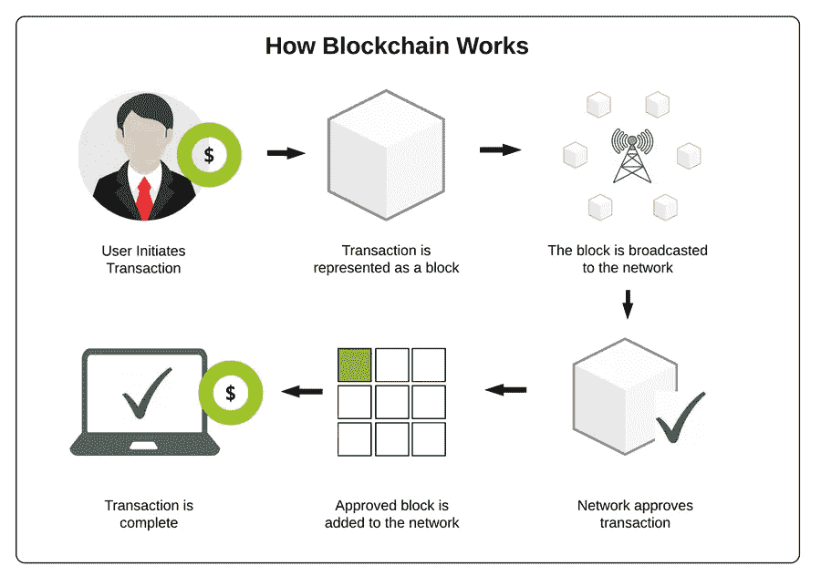
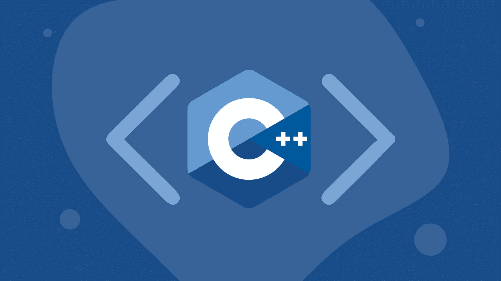
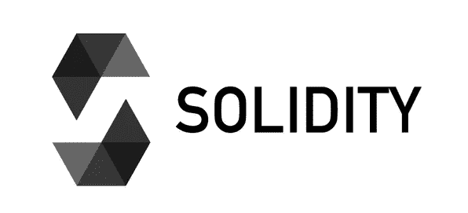
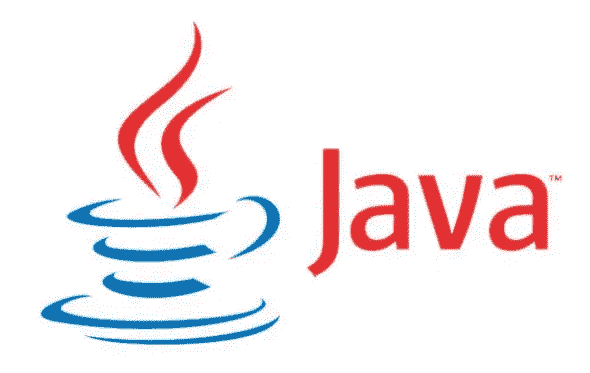
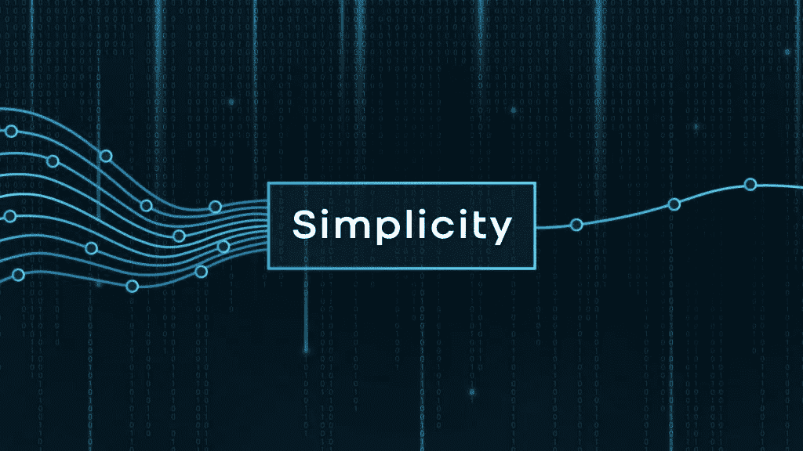
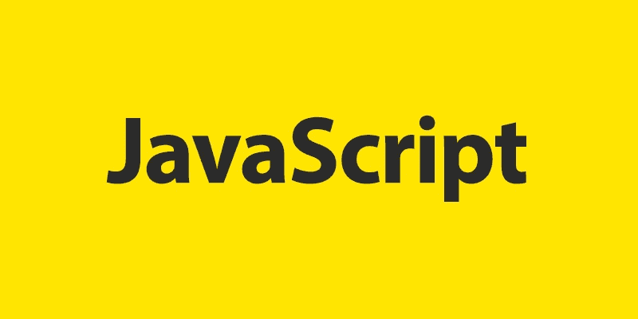

# 用于区块链开发的编程语言

> 原文：<https://medium.com/nerd-for-tech/programming-languages-used-for-blockchain-development-d212afa1f23b?source=collection_archive---------1----------------------->

## 随着我作为一名开发人员不断磨练我的技能，我对将我对编码的热爱与我对交易和投资加密货币的爱好结合起来的兴趣越来越大。如果你们有相似的兴趣，学习更多关于区块链开发使用的语言是一个很好的起点。

区块链是席卷全球的加密货币革命的基础。它已经成为一个十亿美元的产业，允许用户以安全、可靠和分散的方式进行匿名的点对点交易。

# 区块链简介

区块链是存储在公共数据库上的数字信息的集合。数据被称为块，而数据库是链。

这些块存储关键信息，如交易日期、交易时间和当时转移的金额。然后，在将数字签名存储到块中之前，添加数字签名。这个数字签名是你的，以你的用户名的形式，确保块中的数据属于你。

每个块都有一个唯一的密码，称为哈希码。这使您和其他用户能够区分不同的块。成功的区块链交易通常包括 6 个步骤:

现在你知道了区块链是如何工作的，让我们来谈谈一些用于区块链开发的编程语言。

# C++

C++是全球最流行的编程语言之一，它已经成为区块链行业的主要语言。除了在区块链发展中作为一种语言的有用性之外，它还具有与区块链教相同的原则。这些原则包括多态、数据隐藏、抽象和封装，以防止数据被篡改。

区块链的第一个实现，比特币，最初是用 C++编写的。对于区块链来说，它是一种很好的编程语言，因为它具有先进的多线程功能和对内存的原始控制。这种语言面向对象的特性为开发人员提供了将数据和处理它们的方法绑定在一起的机会。这类似于区块链如何使用加密链将块绑定在一起。

**优点**

*   高速的
*   独立且有多个平台
*   静态类型化

**缺点**

*   复杂且难以调试
*   代码冗余
*   不支持垃圾收集

**使用 C++的主要加密货币**

*   比特币
*   以太坊
*   莱特币
*   Dogecoin
*   主要的
*   涟漪

# 固态

Solidity 是为区块链开发而创建的，被认为是最快的区块链编程语言之一。它主要被以太坊开发者用来创建智能合约。它类似于 JavaScript，让用户能够创建高质量的分散式应用程序。

区块链开发者更喜欢为以太坊区块链网络使用 Solidity，因为它允许开发者通过在企业之间创建智能合同来利用以太坊数字交易账本。

为了简化开发过程，Solidity 使用了前置条件、后置条件和不变量。这也使得用户生成合同的过程更加简单。

**优点**

*   简单易学
*   以太坊非常受欢迎
*   静态类型化

**缺点**

*   还是一门新的语言
*   它的社区很小，得到的支持也较少
*   不通用，主要用于以太坊生态系统

**使用可靠性的主要加密货币**

*   以太坊
*   以太坊经典
*   创

# Java 语言(一种计算机语言，尤用于创建网站)

Java 是面向对象的，基于类的，并发的。它一直是开发人员的最爱，因为它可以在任何安装了 Java 运行时环境(JRE)的计算机上轻松运行。

在区块链编程中，Java 对于构建交互式网页很有用。您可以使用它来创建简单且不可变的区块链。有了这种不变性，任何人都不可能改变块中的内容或信息。

区块链开发者更喜欢使用 Java 是因为它的高可移植性。用 Java 编写的程序可以移植到几乎所有的计算设备上，因为它们不依赖于特定于系统的架构。相反，他们使用通用 Java 虚拟机来执行。

**优点**

*   面向对象编程
*   比 C++和 C 之类的语言更容易开发
*   大型图书馆和社区收藏
*   内存分配没有问题

**缺点**

*   需要 Java 虚拟机才能运行
*   比 C++之类的语言慢

**Java 在区块链中的使用**

*   NEM(点对点加密货币平台)
*   IBM 区块链公司
*   以太坊
*   尼奥的合同
*   BitcoinJ(Java 中的比特币实现)
*   超分类帐合同

# 简单

Simplicity 是一种为区块链设计的编程语言。它对开发人员隐藏了几个逻辑组件，以提高他们的工作效率，这也是它在开发人员社区中获得动力的原因。

这是编写智能合同的最佳编程语言之一。它能够在激活后更改智能合同代码。这是使用简单性胜过使用可靠性的优势之一。Simplicity 具有面向对象的特性，它使用类似于区块链的原理来防止数据被修改。它能够将程序组织成树，减少块空间需求并允许小事务大小。

**优点**

*   专为区块链打造
*   能够创建高效、安全的智能合同

**缺点**

*   还是一门较新的语言
*   与其他语言相比，社区较小，支持较少

**在区块链中使用简单性**

Simplicity 旨在改进现有的加密货币语言:

*   比特币脚本
*   以太坊的 EVM

# Java Script 语言

最初，开发人员发现很难使用 JavaScript 进行区块链开发。然而，有了 creation Node.js，开发人员现在可以使用 JavaScript 构建有创意的高质量区块链应用程序。

使用 JavaScript 的一个很大的优点是，在使用它进行区块链开发时，您不需要担心集成问题。这允许您作为开发人员将精力完全集中在应用程序逻辑上。

JavasScript 在区块链开发中也越来越受欢迎，因为它可以处理异步代码。这种能力对区块链至关重要，因为可能会有数百万笔交易同时运行。JavaScripts 的异步特性允许程序同时执行多个动作，从而提高应用程序性能和软件响应能力。

**优点**

*   异步编程语言
*   面向对象
*   支持函数式编程
*   基于原型。

**缺点**

*   处理繁重的计算任务时会降低性能
*   异步编程模型使得代码难以维护

**JavaScript 在区块链中的使用**

*   以太坊. js
*   Web3.js

Ethereum.js 和 Web3.js 都有助于将应用程序的前端连接到智能合约和以太网。

*   新的
*   雷电网络(建立在以太坊之上的高速基础设施)

# 计算机编程语言

Python 以简单著称。它有一个活跃的大型社区，并发布了像 NumPy、Pandas 和 SciPy 这样的库，用于科学、数学和工程领域的不同技术应用。

Python 在处理数字方面非常出色，尤其是在数据处理、清理、分析和可视化方面。对于区块链来说，它是一种优秀的编程语言，因为它可以用于编写智能合同以及许多其他功能。

**优点**

*   简单易学的编程语言
*   它又快又大
*   它有几个库和框架
*   有一个庞大的社区

**缺点**

*   主要用作服务器语言
*   库不像其他语言那样有文档记录

**Python 在区块链中的使用**

*   以太坊(pyethereum)的实现
*   hyperledger 的智能合同
*   为 NEO 创建合同

随着区块链越来越受欢迎，用于构建区块链的编程语言也将随之改进和发展！这些只是这个领域中使用的众多语言中的几种。在创建你自己的区块链之前，根据你所知道的和你希望区块链做的明智地选择你的语言，测试你的想法并继续练习。很有可能在这个领域会出现新的语言，所以继续研究，最重要的是从中获得乐趣！