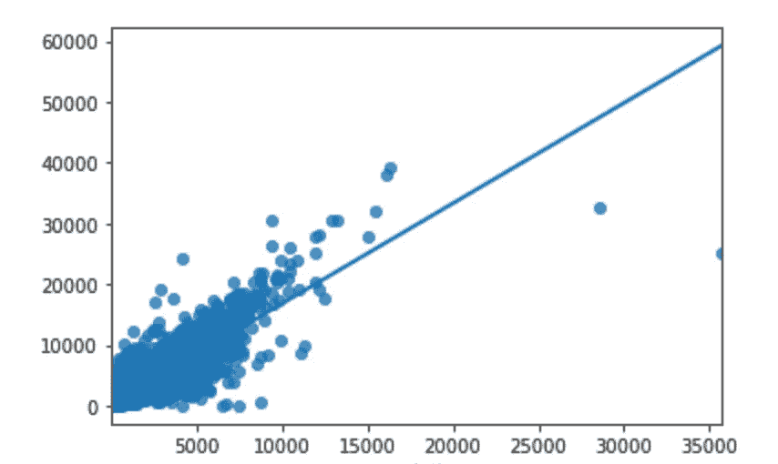
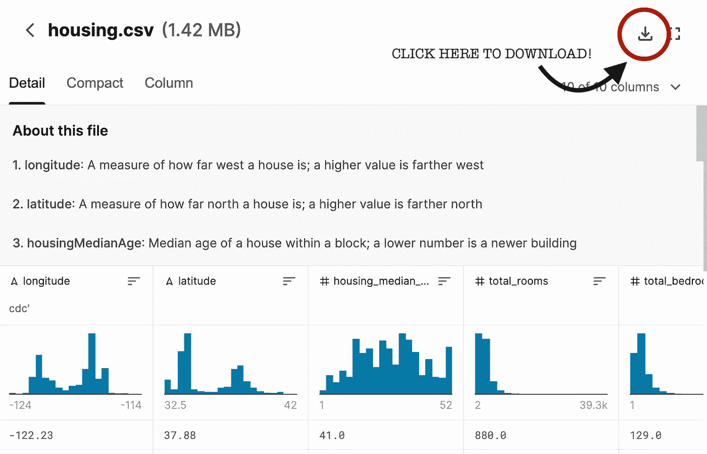
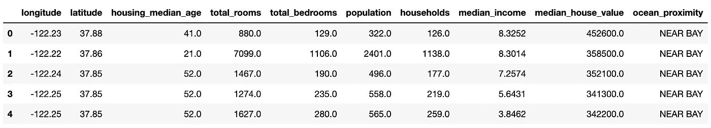
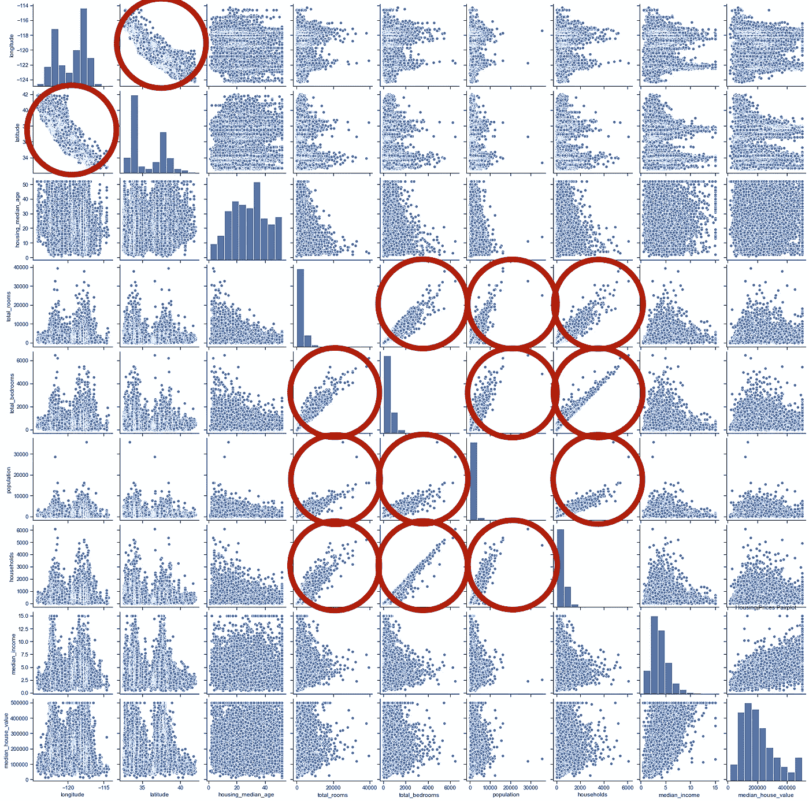

# AccessibleML:用 Python 实现线性回归

> 原文：<https://medium.com/nerd-for-tech/programming-machine-learning-linear-regression-with-python-1871609ee3c5?source=collection_archive---------3----------------------->

## 如何使用 Scikit Learn 编写线性回归模型！


安娜·涅克拉舍维奇在[的照片](https://www.pexels.com/)

这是我的“易访问性”系列的第一篇文章，我很高兴能写这篇文章！在参加了一些在线课程和阅读了一些书籍后，我最近学会了如何用 Scikit-Learn(一个 Python 库)用 Python 编写这些算法，并希望与他人分享我的知识！如果你刚刚开始接触人工智能，我建议你先阅读我的[入门文章](https://itsliterallymonique.medium.com/?p=207e31388de1)，以了解人工智能算法的类型。

我要讨论的第一个算法是线性回归。这是一种监督学习算法，可用于预测两个不同变量之间的关系。然后，我将向您展示如何使用 Scikit-Learn 创建一个模型！

# 线性回归:概述

线性回归是最简单的机器学习算法之一——然而，它可能非常强大！本质上，它是通过将一个线性方程拟合到数据上并绘制一条最佳拟合线来模拟两个变量之间的关系。从这个方程，如果你知道输入值，你可以很容易地找到输出。

例如，如果我收集了城市中不同房屋的房龄和市场价格的数据，我可以将它们绘制在图表上，然后画出最佳拟合线。这条最佳拟合线可以让我根据房龄预测房屋的市场价格。我也可以根据一条线的方程来做一个方程: *y = mx + c*

线性回归图可能是这样的:



# 下载数据集

让我们来看看我们将要使用的数据集——来自 Kaggle 的[加州房价](https://www.kaggle.com/camnugent/california-housing-prices)数据集！在我们开始编程之前，您需要下载它。为此，请转到 [Kaggle 数据集](https://www.kaggle.com/camnugent/california-housing-prices)，然后在页面底部您会看到数据表。看到后，**点击**下载**按钮上的**！



完成了吗？太棒了，现在下一步是通过绘制不同的列来做一些数据分析。通过这种方式，我们可以观察趋势，并决定将哪些列用于线性回归模型。

# 可视化数据集

我们首先需要导入我们将使用的所有库:

*   scikit 学习
*   熊猫
*   numpy
*   海生的

```
**import** pandas **as** pd**import** seaborn **as** sns**import** sklearn **as** sk**from** sklearn.model_selection **import** train_test_split
```

然后，我们将需要使用**熊猫**打开数据集的 **csv** 文件！

```
house_data = pd.read_csv("housing.csv")house_data.head()
```

**head()** 函数将给出数据集的前 5 行。



既然我们的数据都是干净漂亮的，我将使用另一个 Python 库 **seaborn** 来创建一个非常特殊和有用的绘图——一个 **pairplot** ！这将创建每一个可能的数据对，并一次性绘制出来。

```
# making the pairplot
sns.pairplot(house_data, palette=pal)# giving a title to our plots
plt.title("Housing Prices Pairplot")
```

现在，我们可以看到哪些图具有相关性—这是我们可以用来创建线性回归模型的两列！我想我们将在模型中使用**“total _ rooms”**和**“population”**列。我在下图中用相关性圈出了图，以便于查看！请注意，**经纬度**图与**经纬度**图基本相同。因此，这些技术上是重复的。



# 线性回归模型编程

因此，我们现在将开始创建我们的线性回归模型。然而，第一步是总是**将我们的数据集分割**成**训练**和**测试**数据，因为我们想要用以前没有遇到过的数据来检查我们的模型的准确性。首先，我们将把我们的 **X** 变量分配给**“人口”**，把我们的 **y** 变量分配给**“总房间数”**。因此，线性回归模型将使用人口来**预测**总房间数。使用**两个**方括号告诉 Python 该变量仍然是一个**pandas**data frame，这确保了线性回归模型的工作。

```
X = house_data[['population']]
y = house_data[['total_rooms']]
```

现在，我们可以使用 **train_test_split()** 函数将 **X** 和 **y** 分割成训练和测试数据。 **test_size** 参数是如何分割的，将其设置为 **0.3** 意味着 train 变量将拥有 **70%** 的数据，测试将拥有 **30%** 。

```
X_train, X_test, y_train, y_test = train_test_split(X, y, test_size = 0.3, random_state = 0)
```

是时候真正制作我们的模型了！！！我们需要首先创建我们的模型，并将其设置为一个变量。在 Scikit Learn 中，我们是这样创建模型的:

1.  **从 **sklearn** 导入**线性回归模型。

```
**from** sklearn.linear_model **import** LinearRegression
```

2.创建我们的模型，并将其设置为一个变量。我们没有参数，因为默认值很好。

```
lreg = LinearRegression()
```

3.**使用 **fit()** 函数训练**模型，将我们的训练变量放在括号内。

```
lr = lreg.fit(X_train, y_train)
```

干得好，你已经创建了自己的线性回归模型！

# 分析结果

仅仅制作模型是不够的。我们需要检查我们的模型在根据人口预测总房间数时是否真的有用。为此，我们需要检查准确性。这可以使用一个简单的函数来完成，这个函数叫做 **score()** :

```
# using the function **score()** to see the accuracy of our model based on our test variables**print**("Accuracy Score:", lr.score(X_test, y_test)*100)
```

准确率为 **74.9%** ，一点都不差！

# 扩展:多变量线性回归

该数据集是一个房价数据集，所以如果我们不创建一个线性回归模型来预测房价，这将是不公平的。然而，正如你在数据可视化中看到的，房价和任何其他栏目之间实际上没有相关性。

但是，如果所有其他列组合在一起会创建一个相关性呢？我们来试试吧！这个想法非常相似，但是，我们将使用除“median_house_value”列之外的所有列，而不是 X 变量只有一列。让我们试一试。

首先，我们将再次分离 X 和 y 变量，这次使用。drop()获取我们的 X 列！我们还想从 X 变量中删除“ocean_proximity”列，因为它不包含数字数据。然后还将其分成训练和测试数据。

```
# includes all columns except the "median_house_value" and "ocean_proximity" columns
X_multi = house_data.drop(["median_house_value", "ocean_proximity"], axis = 1)
y_multi = house_data[["median_house_value"]]
X_multi_train, X_multi_test, y_multi_train, y_multi_test = train_test_split(X_multi, y_multi, test_size = 0.3, random_state = 0)
```

在运行模型之前，您还需要将其从 NaN 值中清除。在训练线性回归模型时，我得到了一个错误，通知我有 NaN 值。你可能想知道，“NaN 值到底是什么？”嗯，它们本质上是不包含数据的单元格——它们是空的！以下是去除它们的简单技巧:

```
house_data.dropna()
```

只要确保在拆分数据之前放入这些代码就行了！

我们的模型已经设置好了，所以我们要做的就是将它训练(或拟合)到我们的 X_multi 和 y_multi 变量，然后检查我们的准确性

```
# train model
lr_multi = lreg.fit(X_multi_train, y_multi_train)# get the accuracy
**print**("Accuracy Score:", lr_multi.score(X_multi_test, y_multi_test)*100)
```

所以…我得到的准确率在 **64.0%** 左右，并不是最好的准确率分数。但是，您可以通过删除列来试验一下，看看是否有所改进！很好地完成了本教程。机器学习并不总是容易学会的——但请继续努力吧！

# 下次见！

我希望你喜欢阅读本教程，并学会如何使用 Scikit Learn 编写线性回归模型！欢迎留下评论，提出任何问题，我很乐意帮忙。下一个模型将是逻辑回归…敬请期待！

下面是我的代码的 github 文件:[点击这里！](https://github.com/itsliterallymonique/Linear-Regression-using-California-Housing-Prices-dataset)