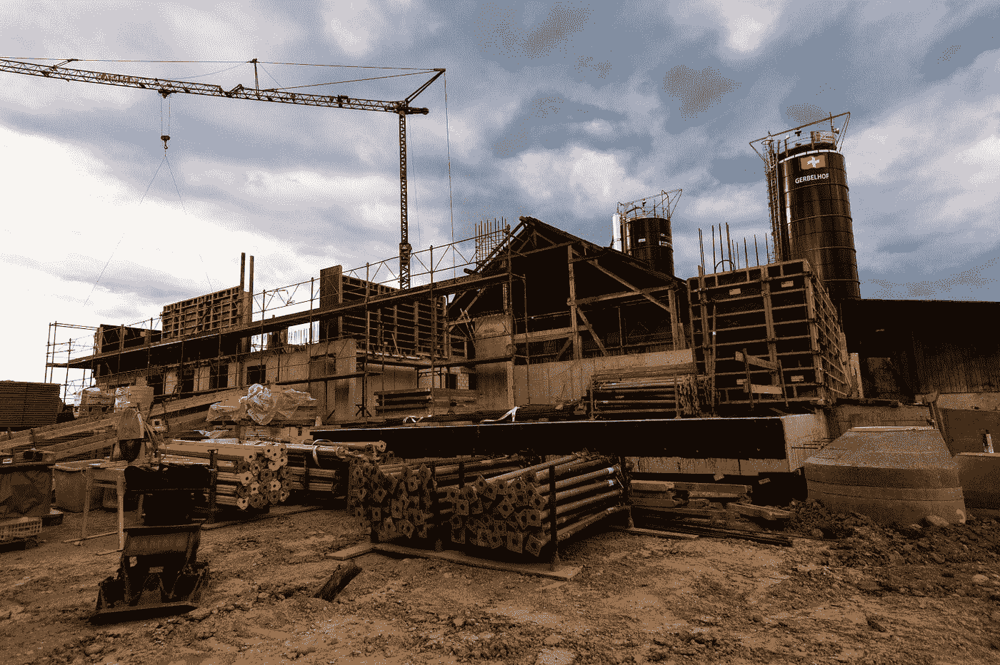

# 编程辅助项目:不要让它们成为负担

> 原文：<https://medium.com/nerd-for-tech/programming-side-projects-dont-let-them-become-a-liability-5f5aca410b87?source=collection_archive---------2----------------------->

## 小的可交付成果可以防止你的附带项目成为负担

[简·侯伯](https://unsplash.com/@jan_huber?utm_source=medium&utm_medium=referral)在 [Unsplash](https://unsplash.com?utm_source=medium&utm_medium=referral) 上拍照

> 我们都经历过。

我们怀着最美好的愿望开始了一个编程方面的项目，但不知何故它被搁置了，并以未完成而告终。这可能是一个巨大的责任，当谈到寻找一个…