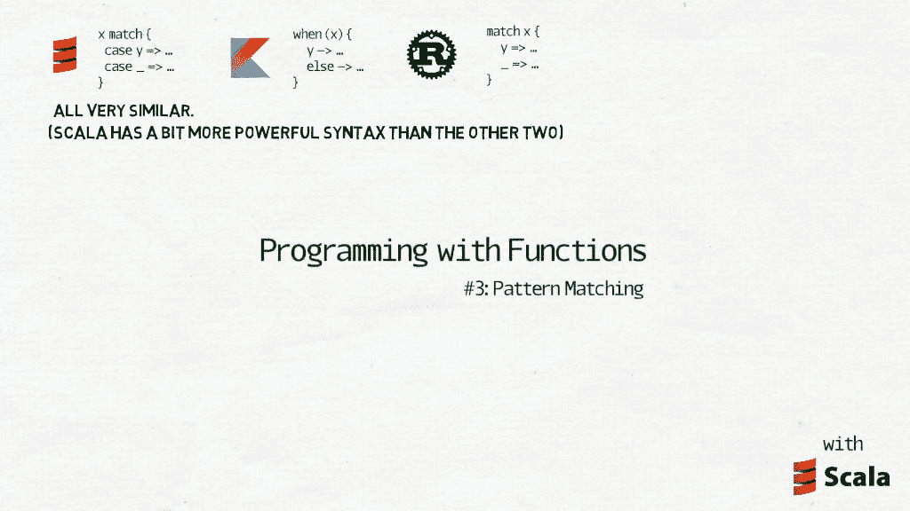
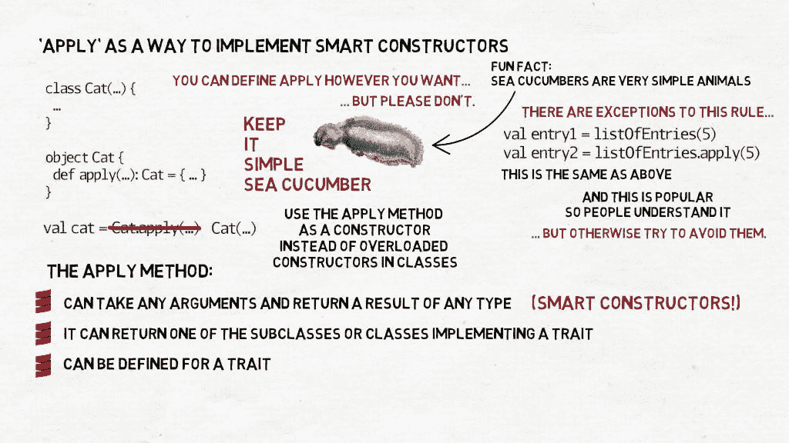
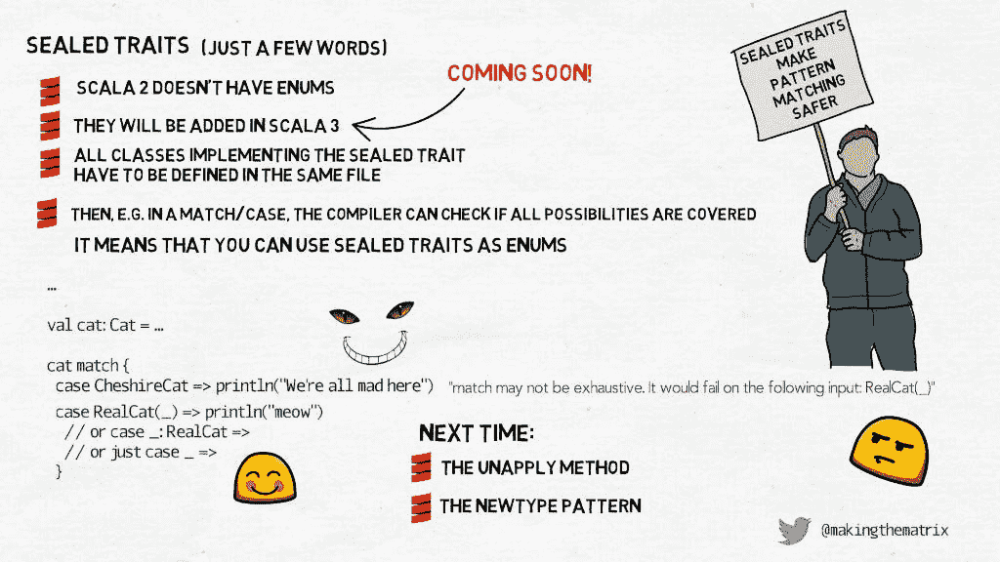

# 函数编程#3 —模式匹配

> 原文：<https://medium.com/nerd-for-tech/programming-with-functions-3-pattern-matching-64d3fba6929f?source=collection_archive---------4----------------------->

模式匹配是 Scala 最重要的特性之一。它如此重要，以至于我可以冒险说它不是 Scala 的“a”特性，而是特性。它影响了编程语言的每一个部分，以至于在讨论 Scala 时，很难不在代码示例中提及或使用它。您已经看到了——match/case 语句、部分函数和 case 类实例的析构。正是因为这个原因，我在这里要讲的很多东西你们都已经知道了，所以请不要介意。我想谈谈它们，以确保在我专注于我觉得最有趣的细节之前，我不会错过任何东西。



## 案例类别

早期 C++中的一个关键概念是用更强大的类来代替简单、粗糙的 C 结构。一个结构就是一个数据结构。一个在其上扩展了方法、虚拟性、从其他类继承和实现接口的能力等等的类。我们很快就有了 UI 小部件、管理器、构建器、工厂和许多其他类型的对象的深层结构，这些对象不再是真正的数据，而是应用程序的半自治部分。我们开始开发面向对象的设计模式，并讨论[正方形是矩形](https://en.wikipedia.org/wiki/Circle%E2%80%93ellipse_problem)的子类还是相反。在所有这一切中，有一段时间我们忘记了有时数据只是数据。但是程序是用来处理数据的。没有它，所有那些花哨的经理和工人、工厂和门面就没有存在的理由。

通过在 Scala 中将一个类标记为 case 类，我们声明它被设计为一个数据结构。Scala 编译器会对它进行一些限制，但是它也会自动增加一些特性，否则我们就必须自己编码。默认情况下，case 类的所有字段都是不可变的和公共的。我们可以使用 copy 方法，将新值作为某些或所有字段的参数，而不是更改其中的某些内容——这将创建一个新实体，其中给定字段和所有其他字段的新值都是从原始实体中复制的。case 类不能是另一个类的超类，但是它可以从其他类和特征继承。(我做完视频之后才知道，其实是可以扩展一个案例类的。但是 a)我找到的所有资料都说这是一种不好的做法，b)在这么做的时候，你会经常遇到错误，这暗示着 Scala 的创造者并没有真正考虑到它是这门语言的一个特性。你可以在这个主题上找到一点 moe[这里](https://www.quora.com/Why-was-case-to-case-inheritance-removed-from-Scala)。case 类有一个等式操作符，用于检查底层字段的相等性，最重要的是，case 类有默认的 apply 和 unapply 方法，这意味着它可以用于模式匹配。

## `apply`方法和智能构造函数

apply 唯一真正的超能力是，它可以不使用实际名称就被调用。不用写`X.apply(...)`，你可以写`X(...)`，编译器会知道你想调用 apply，但是懒得写下来。除此之外，您可以根据需要定义应用...

…但是请不要。



我相信保持事情简单是有价值的，所以我要告诉你:使用`apply`方法作为构造函数，并且只作为构造函数。不要在类中使用重载的构造函数，使用`apply`。是的，您可以出于任何目的使用这个名称定义一个方法，并将其放在类或伴随对象中，但是如果您关心代码的可读性，请只将它放在伴随对象中，而不要放在类中，并且只将其用作构造函数。还有一些其他方式可以使用 apply，例如，collections 库经常使用它从一个集合中检索数据，这个集合表面上看起来好像 Scala 将更多传统语言的方括号换成了圆括号:

```
val entry1 = listOfEntries(5) // listOfEntries: List[Entry]
val entry2 = listOfEntries.apply(5) // this is the same as above
```

这种用法非常受欢迎，以至于人们看到它时就能理解它，但是如果你试图用它来做一些非常不同的事情，你只会让其他程序员感到困惑。还有你自己，几个月后。

但是，即使您坚持使用`apply`作为构造函数，您仍然可以利用它可以接受任何参数并返回任何类型的结果这一事实——您可以创建一个智能构造函数。它仍然是一个构造函数，但是它可以做更多的事情:根据参数，它可以返回一个实现 trait 的子类或类(也可以为 trait 定义`apply`方法)，外界只知道它是超类的一个实体。隐藏了底层逻辑。

```
sealed trait CatColour
sealed trait PrimaryCatColour extends CatColour
object CatColour {
  case object Black  extends PrimaryCatColour
  case object White  extends PrimaryCatColour
  case object Grey   extends PrimaryCatColour
  case object Ginger extends PrimaryCatColour
  case object Tabby  extends CatColour
  case object Calico extends CatColour case class Mixed(first:  PrimaryCatColour, 
                   second: PrimaryCatColour) extends CatColour 
}
```

然后创建一个 case 类，它将其中一个作为参数:

```
case class Cat(colour: CatColour)import CatColour._val blackCat = Cat(Black)
val tabbyCat = Cat(Tabby)
val cowCat   = Cat(Mixed(White, Black))
```

到目前为止一切顺利。但是有一天，你的经理有了一个绝妙的主意:让我们介绍`CheshireCat`，它是隐形的(所以没有颜色)并且有超能力。显然，需要对设计进行一些修改。智能构造函数在这里很有用:

```
sealed trait Cat
case class RealCat(colour: CatColour) extends Cat
case object CheshireCat extends Catobject Cat {
  def apply(colour: CatColour): Cat = RealCat(colour)
  def apply(): Cat = CheshireCat
}val blackCat    = Cat(Black)
val tabbyCat    = Cat(Tabby)
val cowCat      = Cat(Mixed(White, Black))
val cheshireCat = Cat()
```

从代码用户的角度来看，几乎没有什么变化。这就好像`Cat`仍然是一个案例类。唯一的区别是，现在，不知何故，你可以调用`Cat.apply`方法，而没有参数，它将产生`CheshireCat`——出于所有实际原因，它仍然可以被视为一只普通的猫，除非我们真的需要看下面。

顺便说一下，如果您对 Haskell 中如何使用智能构造函数感兴趣，请看看 Mark Karpov 的这篇文章:[ [link](https://markkarpov.com/post/smart-constructors-that-cannot-fail.html) ]

## 作为枚举的密封特征

好吧。封闭的特征。这个问题我们已经谈了一点，现在让我们再谈一点。Scala 2 没有枚举(它们将在 Scala 3 中添加)，但密封特征可以用于基本相同的目的，甚至更多。sealed 关键字意味着实现所讨论的 sealed 特征的所有类和对象都必须在同一个文件中定义。这反过来允许编译器检查密封特征实例的匹配/大小写是否覆盖了所有可能性。

让我们扩展一下上一段的例子:

```
val cat: Cat = ...cat match {
  case CheshireCat => println("We're all mad here")
}
```

如果猫是柴郡猫，它会工作并显示“`We’re all mad here`”，这是它应该做的，但是在编译过程中你会看到一个警告:`match may not be exhaustive. It would fail on the following input: RealCat(_)`。它不仅告诉你你错过了一些亚型，甚至试图给你一个你错过了什么的提示——`RealCat`是封闭性状`Cat`的另一个可能的亚型。您可能真的想编写一个不包含所有可能的子类型的匹配/案例，但这是极不可能的。更有可能的是，这是一个错误，使用密封的特征是防止它发生的一种方式。只需添加一行

```
case RealCat(_) => println(“meow”)
// or case _: RealCat => …
// or just case _ => …
```

它会达到目的。

科特林中密封特征的对应物是密封类。它的工作原理几乎完全相同，只是语法有点不同。您可以在[官方文件](https://kotlinlang.org/docs/reference/sealed-classes.html)中了解更多。此外, [Kotlin 有适当的枚举](https://kotlinlang.org/docs/reference/enum-classes.html),如果您不需要您的枚举做任何非标准的事情(在这种情况下，密封类会处理它),这使得语法更加简洁。



在下一个视频中，我们将继续所谓的`unapply`方法，与`apply`相反，以及新型模式。谢谢你阅读这一切。如果您有任何问题或想出于其他原因与我联系，您可以在下面留言。或者你也可以在推特上找到我。

# 更多阅读材料

*[Haskell 中的智能构造函数由 Mark Karpov
*](https://markkarpov.com/post/smart-constructors-that-cannot-fail.html) [编写更多关于模式匹配的信息由 Elvin Alexander
*](https://alvinalexander.com/scala/how-to-use-pattern-matching-scala-match-case-expressions/)[编写关于密封特性](https://underscore.io/blog/posts/2015/06/02/everything-about-sealed.html)的详细信息由 Noel Welsh 编写

先前:[用函数#2 编程-函数为数据](https://makingthematrix.medium.com/programming-with-functions-2-functions-as-data-efe2dd227a9f?source=friends_link&sk=d0b2d1d4e6954a9c7ae105c228d0ef84)

接下来:[用函数#4 —](https://makingthematrix.medium.com/programming-with-functions-4-unapply-and-the-newtype-pattern-7584cceb3e9?source=friends_link&sk=76a17a4f1ba7b7e895c0de0027286eef) `[unapply](https://makingthematrix.medium.com/programming-with-functions-4-unapply-and-the-newtype-pattern-7584cceb3e9?source=friends_link&sk=76a17a4f1ba7b7e895c0de0027286eef)` [和新类型模式](https://makingthematrix.medium.com/programming-with-functions-4-unapply-and-the-newtype-pattern-7584cceb3e9?source=friends_link&sk=76a17a4f1ba7b7e895c0de0027286eef)编程