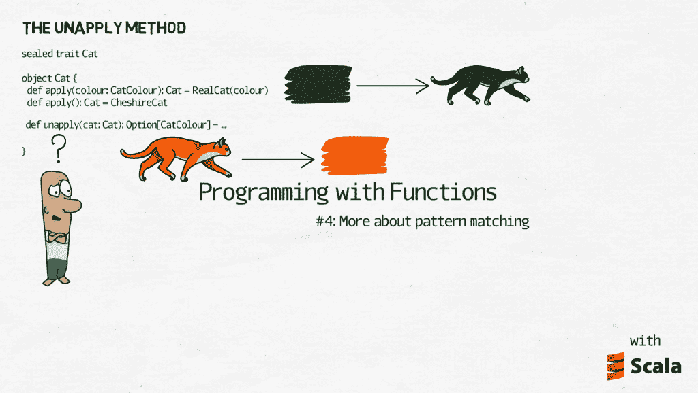
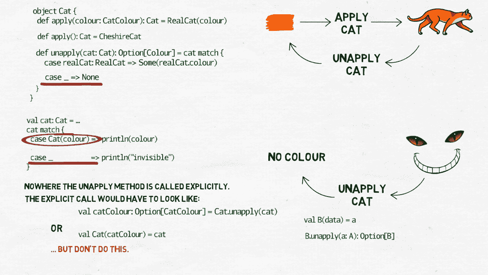
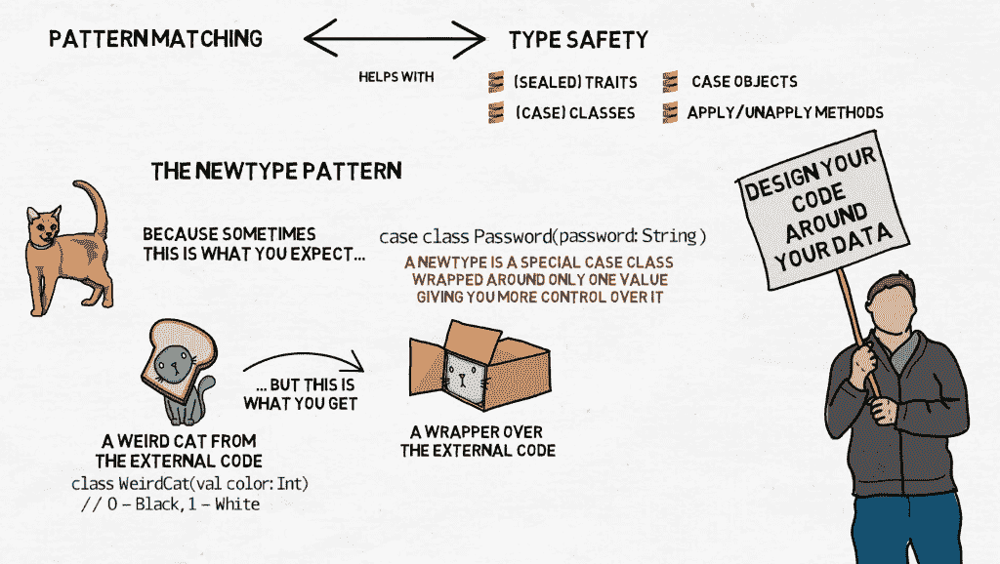

# 使用函数编程#4:“取消应用”和新类型模式

> 原文：<https://medium.com/nerd-for-tech/programming-with-functions-4-unapply-and-the-newtype-pattern-7584cceb3e9?source=collection_archive---------12----------------------->

## `unapply`法

你可以把`unapply`方法看作是`apply`的反义词...哦。比方说，你有那个密封的特征`Cat`和它的伴随对象。定义了两个应用方法:它们获取猫的颜色(或者说它缺少颜色)并创建给定颜色(或者没有颜色)的猫。既然现在颜色是猫的唯一属性，那么稍微发挥一下想象力，你可能会认为它是把猫包在颜色周围……好吧，让我们换个例子来讨论正方形。

正方形是由它的边长来定义的，只有边长:

```
case class Square(a: Int)
```

case 类自动实现 apply 方法，因此您可以通过编写以下代码来创建一个新的正方形:

```
val aSquare = Square(1)
```

由于对正方形没有什么了解，你可能会认为`Square.apply`方法将关于边长的数据包装在一个类型为`Square`的容器中。这个容器是用来给数据赋予意义的。如果有人只告诉你*“边的长度是 1”*你会有数据，但你还是要问*“什么的边？”*。有了我们谈到的正方形的附加信息，这幅图就完整了。



unapply 方法以另一种方式工作。它是在伴随对象中定义的，通常将相关类的实例作为其唯一的参数，并返回实例内部内容的选项。在最简单的情况下，这将只是类的字段:如果类中只有一个字段，则为 1，否则为一对、三对、四对等等。`Square` case 类为我们实现了 unapply 方法，但是如果我们想要编写自己的方法，它应该是这样的:

```
class Square(a: Int)object Square {
  def unapply(square: Square): Option[Int] = Some(square.a)
  def apply(a: Int): Square = new Square(a)
}
```

我还添加了`apply`方法，这样你可以更好地看到它们基本上是如何对立的。唯一突出的是 unapply 方法返回一个`Option`。为什么？因为就像`apply`一样，`unapply`在返回“解包”的结果之前，可以用来执行更复杂的运算，有时甚至可以证明预期的结果与我们得到的结果不符。不幸的是，为了提供一个例子，我不得不回到猫:我们可以`unapply`一个`RealCat`的实例，并获得它的颜色，但我们不能为虚幻的猫这样做，比如 Cheshire 猫:

```
object Cat {
  def apply(colour: CatColour): Cat = RealCat(colour)
  def apply(): Cat = CheshireCat

  def unapply(cat: Cat): Option[Colour] = cat match {
    case realCat: RealCat => Some(realCat.colour)
    case _ => None
  }
}val cat: Cat = ...
cat match {
  case Cat(colour) => println(colour)
  case _: Cat      => println("invisible")
}
```

现在，如果我们的猫是一只姜黄色的猫(`RealCat(Ginger)`)，我们将能够用我们崭新的`unapply`方法提取它的颜色并打印出来。但是对于没有颜色的猫，我们不能这样做——`unapply`方法必须为它们返回`None`,当我们对猫使用`match/case`时，我们将被迫使用默认情况。



还有一件有趣的事情你可能已经注意到了:在这些例子中没有一个地方明确地调用了`unapply`方法。但是这比我们简单地使用`X(...)`而不是`X.apply(...)`的 apply 方法要复杂一些。在`unapply`的情况下，显式调用应该是这样的:

```
val catColour: Option[CatColour] = Cat.unapply(cat)
```

如果我们绝对肯定猫有一种颜色，那么我们可以把它简化为:

```
val Cat(catColour) = cat
```

您有时可以看到像这样的语句被用作数据转换的一种形式。在声明中:

```
val B(data) = a
```

右边的实体`a`是类型`A`，对象`B`有一个`unapply`方法声明为:

```
B.unapply(a: A): Option[B]
```

它必须总是返回`Some(data)`。(顺便说一下，返回的`Option[B]`中的类型`B`不一定必须与我们定义`unapply`的对象`B`中的类型相同，但是同样，为了可读性，最好是相同的类型)。

请注意，代码中从未强制要求`unapply`方法返回`Some`。有可能在将来的某个时候，某个不知道这个假设的人会通过在某些情况下使它返回 None 来“改进”`unapply`，然后下一次我们运行这个应用程序时，我们会有一个 bug。

更常见的是`unapply`被留给其他构造隐式使用。在 Scala 中随处可见:在`match/case`，在`map`，`flatMap`，`collect`，等等。您也可以在`for/yield`中看到它，它用于声明只有当我们在此时成功展开数据时，执行才会继续:

```
for {
  …
  cat <- ...
  Cat(colour) <- cat
  … // will be executed only if the cat has colour
} yield colour
```

这是一种无处不在的东西，但你只有学会发现它，才会发现它。

## 新型模式

所以，现在你可以看到模式匹配和类型安全是如何携手并进的:通过仔细设计(`sealed`)特征、(`case`)类和 case 对象的层次结构，以及`apply`和`unapply`方法，你可以使你的代码更具可读性，并让编译器告诉你那些你只能通过运行应用程序才能发现的错误。调试和重构也变得更加容易。如果除此之外，你还会使用这一系列关于函数式编程的文章中的其他技巧，那么过一段时间后，你甚至会意识到你喜欢你的工作。

有一件事可能会毁了你的一天，那就是另一个程序员，他没有你那么细心，你不得不使用他的代码。你有那些漂亮的猫的等级和颜色，你从他那里得到了什么？数字。弦乐。数组。元组。呃。就好像他们是用 Python 写的一样。

或者也许没那么糟糕，但是通常不同的程序员使用稍微不同的方法，你从同事那里得到的可能不完全符合你的思维方式。或者，您可能只是希望对数据类型有更多的控制。例如，一个密码是`String`，但它是一个满足特定要求的字符串:它包含大写和小写字母、数字、特殊字符、一定长度等。拥有一个特殊的`Password`类是有意义的，而不是以字符串的形式传递密码并记住它们是特殊的。



有一个简单的技巧可以解决这个问题:将那些丑陋的实例包装成你自己的漂亮的类。比方说，你从某个地方收到了这个类`WeirdCat`。`WeirdCat`并没有扩展你的`sealed trait Cat`，它使用了单词`color`的美国化版本，而不是猫颜色的字段`colour`。然而，除了这些细节，它几乎符合。你想使用那些丑陋的猫，如果你不必因为那些小的差异而重复你的代码，那就太好了。下面是 newtype 模式的用处:

```
// from another module
class WeirdCat(val color: Int) // 0 - Black, 1 - White// the wrapper over WeirdCat
case class CatInBox(private val weirdCat: WeirdCat) extends Cat {
  val colour: CatColour = weirdCat.color match {
    case 0 => Black
    case 1 => White
  }  
}// and some changes to the companion object
object Cat {
  …
  def apply(weirdCat: WeirdCat): Cat = CatInBox(weirdCat) def unapply(cat: Cat): Option[Colour] = cat match {
    case realCat: RealCat   => Some(realCat.colour)
    case catInBox: CatInBox => Some(catInBox.colour)
    case CheshireCat        => None
  }
}// and we’re good to go:
val weirdCat: WeirdCat = … // taken from another module
val cat = Cat(weirdCat)
cat match {
  case Cat(colour) => println(colour)
  case _: Cat      => println("invisible")
}
```

这只怪异的猫将被包装在实现了`sealed trait Cat`的类`CatInBox`的一个实例中，而`Cat.unapply`方法将被用来提取这只猫的颜色作为`sealed trait CatColour`的一个子类型——就像它是一只普通的猫一样。

newtype 模式已经存在了很长时间，但最近因为生锈而变得更加流行。Rust 试图将函数式编程和类型安全与非常低级的攻击结合起来，程序员经常发现自己在处理原始类型，但仍然希望对它们使用模式匹配。Newtype 是一种方法。它变得如此普遍，以至于 Rust 引入了一个优化:当一个`struct`只有一个字段时，编译器将去掉包装器，这样就不会浪费额外的内存。在科特林，同样的事情可以通过实验性的`inline class`来实现。在 Scala 中这也是可能的，但不是在所有情况下。你可以通过让你的包装类扩展一个特殊的超类`AnyVal`来做到这一点:

```
case class CatInBox(private val weirdCat: WeirdCat) extends AnyVal
```

不幸的是，这意味着你不再被允许加入`Cat`特征:

```
case class CatInBox(private val weirdCat: WeirdCat) 
  extends AnyVal with Cat
// illegal inheritance; superclass AnyVal is not a subclass 
// of the superclass Object of the mixin trait Cat
```

它仍然有用，只是没那么有用了:例如，你仍然可以直接使用`match/case`而不是`CatInBox`。

然而，有一个替代方案:[Cary Robbins](https://github.com/estatico/scala-newtype)的一个 `[scala-newtype](https://github.com/estatico/scala-newtype)` [库，它试图在宏的帮助下绕过这个限制。](https://github.com/estatico/scala-newtype)

好吧。让我们暂时停在这里。下一次我们将讨论不变性，所以 var 与 val，可变与不可变集合。我们也会学到一些关于懒惰的知识。

先前:[使用功能#3 编程—模式匹配](https://makingthematrix.medium.com/programming-with-functions-3-pattern-matching-64d3fba6929f?source=friends_link&sk=484b7abb953d3b61c35ad23fb5c0bba3)

接下来:[用函数#5 编程—不变性](https://makingthematrix.medium.com/programming-with-functions-5-immutability-41611bb7a044?source=friends_link&sk=b662ae767c939b52697f26c6e5f780da)